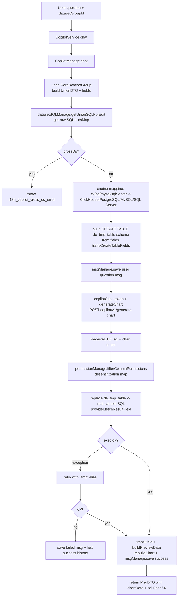
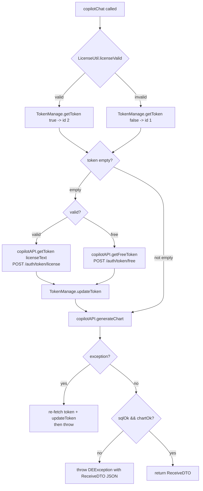

# AI 与 Copilot 后端分析（v2.10.7）

> 分析范围：`core/core-backend/.../io/dataease/ai` 与 `io/dataease/copilot` 两个包。
> 所有结论均基于源码；推断以 `[Inference]` 标注，不确定以 `[Need Verification]` 标注。
> 依赖的 DTO / API 接口位于 `sdk/api/api-base`（`io.dataease.api.copilot.dto.*`、`io.dataease.api.copilot.CopilotApi`、`io.dataease.api.ai.AiComponentApi`），不在本包范围内，仅作为被引用契约说明。

## 1. 职责与架构位置

`ai` 与 `copilot` 是 v2.10 引入的 **AI 辅助分析 / 智能问数** 能力：用户针对某个数据集（datasetGroup）用自然语言提问，后端把"数据集结构 + 数据库类型 + 问题"发给 DataEase 外部的 Copilot 服务（拟合云 / Fit2Cloud 提供的 SaaS，非本地大模型），由 Copilot 返回 **SQL + 图表结构（ChartDTO）**，后端再对 SQL 做 `de_tmp_table` 占位符替换（指向真实数据集 SQL）、用数据源 Provider 取数、脱敏、构造预览数据，并把结果回写消息表。

架构分层：

- `ai.service.AiBaseService`：`@RestController`（`aiBase`），实现 `AiComponentApi`，向**前端**暴露 AI 基础配置（主要是 `ai.baseUrl`），用于前端跳转/对接 Copilot。它**不直接调用**外部 LLM。
- `copilot.service.CopilotService`：`@RestController`（`copilot`），实现 `CopilotApi`，是问答入口（`chat` / `getList` / `clearAll`）。
- `copilot.manage.CopilotManage`：核心编排逻辑（构建 schema、调用 Copilot、取数、脱敏、重建图表、落库）。
- `copilot.manage.TokenManage` / `MsgManage`：令牌缓存、消息持久化。
- `copilot.api.CopilotAPI`：与外部 Copilot 服务 HTTP 交互（获取 token、生成图表、限流检查）的底层封装。
- `copilot.dao.auto.*`：3 张表（`core_copilot_config` / `core_copilot_msg` / `core_copilot_token`）的 MyBatis-Plus 实体与 Mapper。

数据流上，Copilot 处于 **dataset（数据集）→ chart（图表取数）** 之间：依赖 `dataset.manage`（SQL 拼装、字段、取数、权限）与 `chart.utils.ChartDataBuild`（脱敏），自身不实现任何大模型推理。

## 2. 包结构与关键类清单

### 2.1 `io.dataease.ai`

| 类 / 接口 | 职责 | 关键方法 | 备注 |
|---|---|---|---|
| `AiBaseService` (RestController, `aiBase`) | 实现 `AiComponentApi`；向**前端**返回 AI 配置（Copilot 基础 URL） | `findTargetUrl()` → 读取 `sysParameterManage.groupVal("ai.")`，取 `ai.baseUrl` | 不直接调用 LLM；配置来自系统参数表 `ai.` 分组 |

### 2.2 `io.dataease.copilot`

| 类 / 接口 | 职责 | 关键方法 | 备注 |
|---|---|---|---|
| `CopilotService` (RestController, `copilot`) | 问答 REST 入口，实现 `CopilotApi` | `chat(MsgDTO)`、`getList()`、`clearAll()` | 仅做异常包装后转交 `CopilotManage`；`getList`/`clearAll` 按 `AuthUtils.getUser().getUserId()` 隔离 |
| `CopilotManage` (@Component) | 核心编排：schema 构建、调用 Copilot、取数、脱敏、图表重建、落库 | `chat()`、`copilotChat()`、`rebuildChart()`、`transField()`、`buildPreviewData()`、`transCreateTableFields()`、`engine()`、`transSql()`、`errorMsg()` | 最大、最关键类（约 487 行） |
| `TokenManage` (@Component) | Copilot 访问令牌的本地缓存（DB 表） | `getToken(boolean valid)`、`updateToken(token, valid)` | 令牌按 `valid` 存 id=2（license）/1（free） |
| `MsgManage` (@Component) | 问答消息持久化与查询 | `save()`、`getMsg()`、`getLastMsg()`、`getLastSuccessMsg()`、`deleteMsg()`、`clearAllUserMsg()` | DTO↔Entity 序列化（history/chart/chartData 为 JSON 字符串） |
| `CopilotAPI` (@Component) | 外部 Copilot 服务 HTTP 客户端封装 | `getToken(license)`、`getFreeToken()`、`generateChart(token, sendDTO)`、`checkRateLimit(token)`、`getConfig()`、`basicAuth()`、`bearerAuth()` | `checkRateLimit` 全仓无调用（疑似死代码，见 §6） |
| `CoreCopilotConfig` (Entity) | 配置表 `core_copilot_config` 实体 | `getCopilotUrl()`、`getUsername()`、`getPwd()` | 单条配置（id 固定=1）；`pwd` 在 DB 中为 Base64 |
| `CoreCopilotMsg` (Entity) | 消息表 `core_copilot_msg` 实体 | 字段：question、schemaSql、copilotSql、apiMsg、sqlOk、chartOk、chart、chartData、execSql、msgStatus、errMsg 等 | 存储每次问答与 API 返回 |
| `CoreCopilotToken` (Entity) | 令牌表 `core_copilot_token` 实体 | `getType()`、`getToken()`、`getUpdateTime()` | type=free/license；无过期时间字段 |
| `CoreCopilotConfigMapper` | `BaseMapper<CoreCopilotConfig>` | — | 无自定义方法 |
| `CoreCopilotMsgMapper` | `BaseMapper<CoreCopilotMsg>` | — | 无自定义方法 |
| `CoreCopilotTokenMapper` | `BaseMapper<CoreCopilotToken>` | — | 无自定义方法 |

> 被引用但**不在本范围**的契约类（api 模块，仅说明用途）：`MsgDTO`、`SendDTO`/`DESendDTO`（出参：engine/schema/question/history）、`ReceiveDTO`（入参：sql/history/apiMessage/sqlOk/chartOk/chart）、`ChartDTO`（type/title/axis/column/columns）、`HistoryDTO`、`AxisDTO`/`AxisFieldDTO`、`TokenDTO`。

## 3. 核心流程

### 3.1 智能问数 → 生成图表 / SQL（主流程，`CopilotManage.chat`）

### 3.2 令牌获取流程（`CopilotManage.copilotChat` + `CopilotAPI`）

## 4. 依赖与调用关系

**对外部 Copilot 服务的依赖（硬编码端点，`CopilotAPI` 常量）：**
- `TOKEN = /auth/token/license`、`FREE_TOKEN = /auth/token/free`
- `API = /copilot/v1`、`CHART = /generate-chart`、`RATE_LIMIT = /rate-limit`
- 基础地址来自 `CoreCopilotConfig.copilotUrl`（DB 单条 id=1）。
- `generateChart`：POST `copilotUrl + /copilot/v1/generate-chart`，Header `Authorization: Bearer <token>`，Body `SendDTO`（engine/schema/question/history）。
- `getToken`：`licenseText` 以 JSON POST；`getFreeToken`：空 body POST。
- `checkRateLimit`：POST `.../rate-limit`，读取响应头 `x-rate-limit-remaining` / `x-rate-limit-retry-after-seconds`。[Need Verification] 该端点是否真实存在、以及未调用是否为遗漏。

**对 chart 的依赖：**
- `io.dataease.chart.utils.ChartDataBuild.desensitizationValue(...)`：`buildPreviewData` 中对命中被脱敏字段的值做脱敏。
- Copilot 返回的 `ChartDTO` 经 `rebuildChart` 补全 axis/columns（pie / table / bar|line|pie）。

**对 dataset 的依赖（`CopilotManage` 注入）：**
- `DatasetSQLManage.getUnionSQLForEdit` → 取得数据集原始 SQL 与 `dsMap`。
- `DatasetTableFieldManage.selectByDatasetGroupId` → 字段元数据（`extField==0` 的物理字段）。
- `DatasetDataManage.buildFieldName` → 字段名映射。
- `PermissionManage.filterColumnPermissions` → 列权限 + 脱敏清单。
- `CoreDatasetGroupMapper` / `ProviderFactory` / `Provider.fetchResultField` → 真实取数。
- `Utils.isCrossDs` / `Utils.replaceSchemaAlias` → 跨源校验与别名替换。

**对 license 的依赖：**
- `LicenseUtil.licenseValid()` 决定走 license token 还是 free token；`F2CLicManage.read().getLicense()` 提供 `licenseText`。

**对系统的依赖：**
- `SysParameterManage.groupVal("ai.")`（`AiBaseService` 读取 `ai.baseUrl`）。
- `AuthUtils.getUser()`（用户隔离、错误回滚历史）。

## 5. 事务 / 缓存 / 异常 / 安全考量

### 5.1 事务
- `chat` 全程**无 `@Transactional`**。`msgManage.save` 多次插入（提问消息、结果消息、失败消息）是独立 MyBatis `insert`，无统一事务边界。若中途异常，`errorMsg` / 失败分支会各自 `save` 一条记录（幂等性靠雪花 id）。
- [Inference] 多条消息落库之间无事务保证，异常场景下可能出现"提问消息已存、结果消息未存"的中间态，但业务上靠 `getLastSuccessMsg` 补偿，影响有限。

### 5.2 缓存
- **令牌缓存**：`TokenManage` 将 token 存于 `core_copilot_token` 表（id=1 free / id=2 license），避免每次问答都申请。但**无过期时间、无 TTL 校验**：`getToken` 不检查 `updateTime`，仅当 `generateChart` 抛异常时才 `updateToken` 重新获取。
- [Inference] 若外部令牌有过期时间，过期后首次请求会失败、由 catch 块刷新再抛；即"懒刷新 + 失败重试一次"。

### 5.3 异常
- `CopilotService.chat` 用 try/catch 包裹 `copilotManage.chat`，异常转成 `errorMsg`（保留最近成功历史），不会向上抛 500。
- `CopilotManage.chat` 中数据执行有 **双重 try/catch**：先尝试 `de_tmp_table` 直接替换，失败再尝试加 ` tmp` 别名，仍失败则存失败消息返回（不抛）。
- `copilotChat` 中 Copilot 返回 `!sqlOk || !chartOk` 时 `DEException.throwException`（把整个 `ReceiveDTO` JSON 抛给用户，含原始 SQL/图表，可能泄露内部结构）。

### 5.4 安全考量（重点）

1. **HTTPS 证书校验被全局关闭（高危）**：所有经过 `io.dataease.utils.HttpClientUtil` 的 HTTPS 请求（含 Copilot 全部调用）在 `buildHttpClient(true)` 中使用
   `SSLContextBuilder.loadTrustMaterial(null, (certs, s) -> true)` + `NoopHostnameVerifier.INSTANCE`，即 **信任任意证书、不校验主机名**。中间人可劫持 Copilot 信道，窃取 token / 数据集 schema / 用户问题。
   - 位置：`sdk/common/.../utils/HttpClientUtil.java:76-78`（非本包，但 Copilot 直接复用）。

2. **配置密码仅 Base64（非加密）**：`CopilotAPI.getConfig()` 从 `core_copilot_config` 读取 `pwd` 后仅 `Base64.getDecoder().decode(...)` 还原。DB 中 `pwd` 是 Base64 明文等价物，无哈希/加密存储。若数据库泄露，凭证可直接还原。

3. **令牌持久化明文**：`core_copilot_token.token` 以明文存 DB；`getToken` 直接取出即用。外部访问令牌长期留存，泄露风险。

4. **越权 / 行权限未生效**：`CopilotManage.chat` 中行权限相关代码被**注释掉**（约 167-181 行），最终 `querySQL = sql` 直接使用数据集原始 SQL，**未套用行权限过滤**。`allFields` 仍做了列权限 `filterColumnPermissions`，但行级权限缺失。
   - [Inference] 这意味着有权访问某数据集的用户，可能通过 Copilot 绕过该数据集的行权限约束取到全量数据。需重点确认是否为安全缺陷（见 §6）。

5. **SQL 注入 / 占位符替换风险**：Copilot 返回的 `copilotSQL` 通过正则 `replaceAll` 把 `de_tmp_table` / `DE_TMP_TABLE`（带关键字前后缀）替换为真实数据集 SQL 子查询，再交给 `provider.fetchResultField` 执行。LLM 返回的 SQL 内容不可信，但替换键为固定占位符且真实 SQL 由后端构造，注入面主要在"LLM 是否会输出意料外的语句"。[Inference] 真实 SQL 由系统生成，直接风险可控；但 LLM 输出 SQL 的健壮性依赖外部服务。

6. **内容安全**：用户问题、数据集 schema（字段名 + 类型 + 建表语句）**完整发送给外部 Copilot 服务**。敏感业务字段名/注释（`COMMENT '...'`）会外传。[Need Verification] 是否有敏感字段过滤/脱敏策略。

7. **限流未真正启用**：`checkRateLimit` 全仓未被调用，限流仅依赖外部服务自身；本地无频控。[Need Verification]

## 6. 风险与待确认 ([Need Verification])

1. **行权限绕过**：`CopilotManage.chat` 行权限代码被注释，Copilot 取数未套行权限 → 疑似安全缺陷，需确认是否预期（如仅允许管理员使用 Copilot）。[Need Verification]
2. **`checkRateLimit` 死代码**：定义但无调用方，限流依赖外部；是否为未接完的功能或遗漏调用。[Need Verification]
3. **令牌过期与并发**：无 TTL、无并发刷新保护；高并发下可能多请求同时发现 token 失效并各自刷新，存在轻微抖动/竞态。[Need Verification]
4. **`ai.baseUrl` 与外部 `copilotUrl` 关系**：前端用 `ai.baseUrl`（`ai.` 系统参数），后端用 `core_copilot_config.copilotUrl`（DB）。二者是否为同一地址、如何同步，[Need Verification]。
5. **跨源不支持**：`isCrossDs` 直接抛错，Copilot 仅支持单数据源数据集。[Need Verification] 是否为产品限制。
6. **脱敏范围**：`buildPreviewData` 仅对 `desensitizationList`（来自列权限）做脱敏；Copilot 原始 SQL 执行的结果若命中脱敏字段才脱敏，未命中字段返回原值——是否覆盖全部敏感列，[Need Verification]。
7. **外部服务可用性**：Copilot 为外部 SaaS 依赖，无降级/熔断（仅 `HttpClientConfig` 超时 30s/60s），超时即失败。[Need Verification] 是否有开关整体禁用 Copilot。

## 7. 相关文档

- [可视化 / 图表](../visualization.md) — Copilot 返回的 `ChartDTO` 经 `rebuildChart` 补全后用于图表渲染；`ChartDataBuild.desensitizationValue` 脱敏。
- [数据集](../dataset.md) — `DatasetSQLManage` / `DatasetTableFieldManage` / `DatasetDataManage` / `PermissionManage` 为 Copilot 提供 SQL、字段、取数与权限。
- [技术栈与架构](../architecture/tech-stack.md) — MyBatis-Plus、`HttpClientUtil`、`AuthUtils`、`SysParameterManage` 等基础设施说明。

---

### 覆盖范围小结
- 本包共 **12 个 `.java` 文件**，全部已覆盖：`ai/service/AiBaseService.java`、`copilot/api/CopilotAPI.java`、`copilot/service/CopilotService.java`、`copilot/manage/{CopilotManage,MsgManage,TokenManage}.java`、`copilot/dao/auto/entity/{CoreCopilotConfig,CoreCopilotMsg,CoreCopilotToken}.java`、`copilot/dao/auto/mapper/{CoreCopilotConfigMapper,CoreCopilotMsgMapper,CoreCopilotTokenMapper}.java`。
- 无法在包内独立分析的：DOT/接口契约（`io.dataease.api.copilot.dto.*`、`CopilotApi`、`AiComponentApi`）位于 `sdk/api/api-base`，仅作为引用契约说明，未展开逐文件分析（超出本任务指定目录）。
