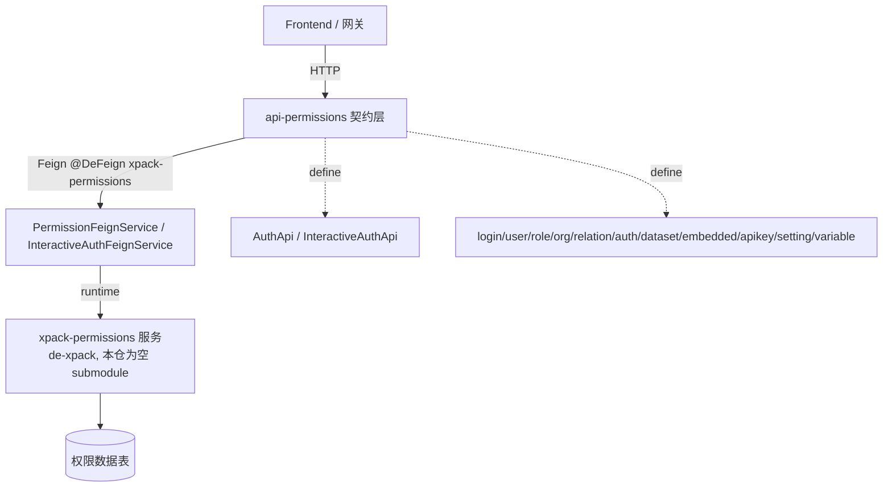
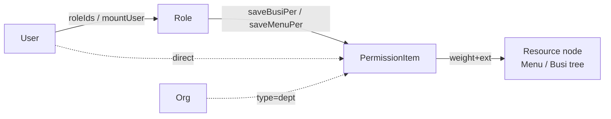
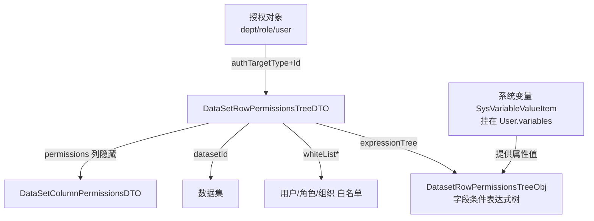
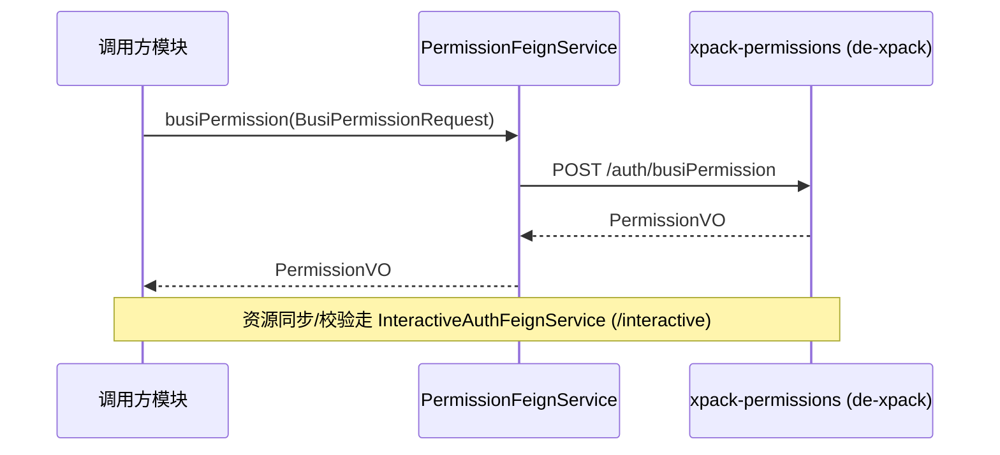

# 权限领域 API（sdk/api/api-permissions）分析（v2.10.7）

> 本文档为 **DataEase 权限领域**的源码分析结果。结论均基于源码（`file_path` / `类名` / `方法名`），并以"源码是唯一真理"为准。
> 模块路径：`sdk/api/api-permissions/src/main/java/io/dataease/api/permissions/**`
> 本模块共 **96 个 .java 文件**，全部已覆盖（详见第 2 节清单与第 4 节 DTO/VO 说明）。
> 推断内容标注 `[Inference]`；无法从本模块确认的内容标注 `[Need Verification]`。

---

## 1. 职责与架构位置

`api-permissions` 是权限领域的**契约层（API Contract / DTO 层）**，仅定义：

- 各权限子域的 REST 接口（`*Api`）
- 入参 DTO（构造器 `Creator` / 编辑器 `Editor` / 查询 `Request`）与出参 VO
- 内部服务接口（`RelationApi`、`InteractiveAuthApi`）

**不包含实现**——正式逻辑位于 `de-xpack` 的 `xpack-permissions` 服务（本仓 `de-xpack` 为空 submodule）。
从 `core/core-backend` 的 Feign 客户端可确认这一点：

- `core/.../defeign/permissions/auth/PermissionFeignService.java`：`@DeFeign(value = "xpack-permissions", path = "/auth")`，`extends AuthApi`
- `core/.../defeign/permissions/auth/InteractiveAuthFeignService.java`：`@DeFeign(value = "xpack-permissions", path = "/interactive")`，`extends InteractiveAuthApi`

即：所有 `AuthApi` 与 `InteractiveAuthApi` 的调用，最终经 Feign 路由到 `xpack-permissions` 微服务。

**接口的权限元数据注解（声明在契约层，由框架在网关/拦截器执行）**：

- `@DeApiPath(value = "/xxx", rt = AuthResourceEnum.X)`：绑定资源类型（`USER`/`ROLE`/`ORG`/`DATASET`/`SYSTEM`，见 `io.dataease.constant.AuthResourceEnum`）。
- `@DePermit("m:read")` / `@DePermit({"m:read", "#p0.id + ':manage'"})`：方法级权限，支持 SpEL 行级表达式（如 `#p0 + ':manage'` 表示对目标 id 需 `manage` 权限）。
- `@XpackResource`：标注该接口为 X-Pack 商业版能力（如 `EmbeddedApi`、`PerSettingApi`），需 License 授权。
- `@Hidden` / `@ApiOperationSupport(hidden = true)`：对前端文档隐藏（内部接口）。

---

## 2. 子域与关键接口清单

下表列出每个子域的 `*Api` 接口、关键方法及其含义（类名与方法名均取自源码）。

| 子域 | 接口类（file） | 关键方法 | 含义 |
|---|---|---|---|
| login | `login/api/LoginApi` | `localLogin(PwdLoginDTO)` → `TokenVO`；`refresh()`；`platformLogin(origin)`；`logout()`；`mfaQr(id)`；`mfaLogin(MfaLoginDTO)`；`modifyInvalidPwd(...)` | 登录获取 token；MFA；OIDC/第三方登录（回调中由 `X-Userinfo` 解析用户）；登出；token 续命 |
| user | `user/api/UserApi` | `pager(...)`；`queryById(id)`；`personInfo()`；`create(UserCreator)`；`edit(UserEditor)`；`delete(id)`/`batchDel`；`switchOrg(oId)` → `TokenVO`；`info()` → `CurUserVO`；`batchImport(file)`；`mfaBind(MfaLoginDTO)`；`mfaUnbind(code)`；`resetPwd(id)`；`enable(EnableSwitchRequest)`；`modifyPwd(...)` | 用户 CRUD、个人信息、组织切换、批量导入、MFA 绑定/解绑、状态/密码管理 |
| role | `role/api/RoleApi` | `query(...)`；`create(RoleCreator)`；`edit(RoleEditor)`；`mountUser(MountUserRequest)`；`mountExternalUser(MountExternalUserRequest)`；`unMountUser(UnmountUserRequest)`；`detail(rid)`；`delete(rid)`；`copy(RoleCopyRequest)` | 角色 CRUD、用户绑定/解绑（含组织外用户）、角色复制 |
| org | `org/api/OrgApi` | `pageTree(OrgRequest)`；`lazyPageTree(OrgLazyRequest)`；`create(OrgCreator)`；`edit(OrgEditor)`；`delete(id)`；`mounted(...)`；`lazyMounted(...)` | 组织树（含懒加载）、权限内组织树查询 |
| relation | `relation/api/RelationApi` | `getDsResource(id)`；`getDatasetResource(id)`；`checkAuth()`（throws `DEException`） | **非 HTTP 服务接口**（无 `@RequestMapping`），内部用于数据源/数据集/看板间关系解析与授权校验 `[Inference]` |
| auth | `auth/api/AuthApi` | `busiResource(flag)`；`busiPermission(BusiPermissionRequest)`；`busiTargetPermission(...)`；`menuResource()`；`menuPermission(...)`；`menuTargetPermission(...)`；`saveBusiPer(BusiPerEditor)`；`saveBusiTargetPer(BusiTargetPerCreator)`；`saveMenuPer(MenuPerEditor)`；`saveMenuTargetPer(MenuTargetPerCreator)` | 业务资源(Menu/Busi)的全量树查询、双向授权查询、双向保存权限（见第 3 节 ACL/RBAC） |
| auth(内部) | `auth/api/InteractiveAuthApi`（`@Hidden`） | `menuIds()`；`resource(BusiNodeRequest)` → `BusiNodeVO`；`saveResource(BusiResourceCreator)`；`editResource(BusiResourceEditor)`；`delResource(id)`；`checkDel(id)`；`moveResource(BusiResourceMover)`；`checkAuth(BusiPerCheckDTO)`；`queryAuth(id)` → `PermissionValVO`；`query2Root(id,flag)`；`checkEmpty()`；`batchAuthorize(BusiBatchAuthorizeRequest)` | 资源树内部 CRUD、删除前检测、移动、权限校验/查询、批量授权（供其他模块同步调用） |
| dataset | `dataset/api/RowPermissionsApi`（`@Hidden`, rt=`DATASET`） | `rowPermissions(datasetId,...)`；`save(DataSetRowPermissionsTreeDTO)`；`delete(...)`；`authObjs(datasetId,type)` → `List<Item>`；`dataSetRowPermissionInfo(...)`；`whiteListUsers(...)` | 数据集**行权限**列表/保存/授权对象/白名单（ABAC 雏形，见第 3、4 节） |
| dataset | `dataset/api/ColumnPermissionsApi`（`@Hidden`, rt=`DATASET`） | `columnPermissions(datasetId,...)`；`save(DataSetColumnPermissionsDTO)`；`delete(...)`；`DataSetColumnPermissionInfo(...)` | 数据集**列权限**列表/保存（隐藏列等） |
| embedded | `embedded/api/EmbeddedApi`（`@XpackResource`） | `queryGrid(...)`；`create(EmbeddedCreator)`；`edit(EmbeddedEditor)`；`delete(id)`/`batchDelete`；`reset(EmbeddedResetRequest)`；`domainList()`；`initIframe(EmbeddedOrigin)`；`getTokenArgs()`；`limitCount()` | 嵌入式(iframe)应用管理：appId/appSecret/domain、密钥重置、Token 参数获取 |
| apikey | `apikey/api/ApiKeyApi` | `generate()`；`query()` → `List<ApiKeyVO>`；`switchEnable(ApikeyEnableEditor)`；`delete(id)` | API Key（accessKey/accessSecret）生成、查询、启停、删除 |
| setting | `setting/api/PerSettingApi`（`@XpackResource`） | `basicSetting()`；`saveBasic(List)`；`singleValue(key)`；`mfaSetting()`；`saveMfa(List<PerSettingItemVO>)`；`mfaStatus()` | 认证基础设置与 MFA 设置（key-value 形式） |
| variable | `variable/api/SysVariablesApi`（`@Hidden`, rt=`SYSTEM`） | `create/edit/delete/detail/query(SysVariableDto)`；`createValue/editValue/deleteValue/selectVariableValue/selectPage(SysVariableValueDto)`；`batchDel` | 系统变量（含变量值）CRUD，供行权限 ABAC 提供"用户属性" |

> 覆盖说明：上述表格覆盖全部 13 个 `*Api` 接口（含 `RelationApi`）。所有相关 DTO/VO 在**第 4 节**逐文件列出，故 96 个 .java 文件均被分析，无遗漏、无无法分析文件。

---

## 3. 权限模型揭示

DataEase 权限模型是 **RBAC + ACL + ABAC 雏形** 的混合体，全部定义于 `auth` 与 `dataset` 子域。

### 3.1 RBAC：用户—角色—资源

- **主体（Subject）**：`UserApi` 管理 `UserCreator`（`roleIds` 绑定角色集合）。
- **角色（Role）**：`RoleApi` 管理 `RoleVO`（`id`/`name`/`readonly`/`root`）。`mountUser(MountUserRequest)` 的 `rid`+`uids` 将用户挂到角色（多对多）。
- **资源（Resource）**：分两类——
  - 菜单资源：`AuthApi.menuResource()` → `ResourceVO`（树，`id`/`name`/`children`/`leaf`/`extraFlag`）
  - 业务资源：`AuthApi.busiResource(flag)` → `ResourceVO`，`flag` 区分资源类型（数据源/数据集/看板/仪表板等 `[Need Verification]` 具体枚举值）
- **授权（Assignment）**：`saveMenuPer(MenuPerEditor)` / `saveBusiPer(BusiPerEditor)` 将权限项 `PermissionItem` 赋予某个"目标"。`BusiPermissionRequest` 的三元组 `(id, type, flag)` 中：
  - `id` + `type` = **授权目标**（被赋权的主体，如某角色/某用户/某组织）
  - `flag` = **资源类型**
  - `permissions: List<PermissionItem>` = 该目标在各资源节点上的权限项

### 3.2 ACL：业务资源双向授权（对象↔资源）

`AuthApi` 提供**双向查询**，典型 ACL 特征：

- 对象 → 资源：`busiPermission(BusiPermissionRequest)` → `PermissionVO`（某目标已授权的资源）
- 资源 → 对象：`busiTargetPermission(BusiPermissionRequest)` → `PermissionVO`（某资源已授权的目标）
- 菜单同理：`menuPermission` / `menuTargetPermission`
- 保存亦可双向：`saveBusiPer`（对象维度赋权） vs `saveBusiTargetPer(BusiTargetPerCreator)`（资源维度赋权，含 `type`+`flag`）

`PermissionVO` 结构：`root`（是否根）/ `readonly`（是否只读）/ `permissions`（直接权限项 `PermissionItem`）/ `permissionOrigins`（`PermissionOrigin`：通过父级/继承获得的关联权限，体现权限继承）。

**权限强度编码** `[Need Verification]`：`PermissionItem.weight`（权重）与 `PermissionItem.ext`（独立权重），以及 `PermissionValVO.weight`+`ext`（由 `InteractiveAuthApi.queryAuth(id)` 返回）。推测 `weight` 为权限级别位掩码（如 read < manage），`ext` 为不随继承变化的独立权限位；具体编码常量在 `io.dataease.constant.AuthEnum` 中 `[Need Verification]`。

### 3.3 ABAC 雏形：数据集行/列权限（属性级数据过滤）

行/列权限定义在 `dataset` 子域，是 **行级/列级数据访问控制的 ABAC 雏形**：

- **行权限** `DataSetRowPermissionsTreeDTO`（核心 ABAC 结构）：
  - `authTargetType`：授权对象类型，取值 `dept` / `role` / `user`
  - `authTargetId` / `authTargetIds`：授权对象 ID
  - `datasetId`：作用的数据集
  - `expressionTree`：**行过滤条件表达式（字符串）**——即"当满足该属性条件时可见该行" `[Inference]`
  - `tree`：`DatasetRowPermissionsTreeObj`（来自 `io.dataease.extensions.view.dto`，**条件表达式树的实际结构，不在本模块** `[Need Verification]`）
  - `whiteListUser` / `whiteListRole` / `whiteListDept`：白名单（绕过表达式直接放行）
  - `exportData`：是否允许导出
- **列权限** `DataSetColumnPermissionsDTO`：
  - `permissions`（字符串）：被隐藏/脱敏的列集合 `[Inference]`
  - `whiteListUser`：列白名单用户
- **属性来源**：`SysVariablesApi` 的系统变量（`SysVariableDto`/`SysVariableValueDto`）为行权限条件提供"用户属性"值（如机构、部门、时间段），与 `UserCreator.variables` / `UserFormVO.variables`（`List<SysVariableValueItem>`）打通——即"主体属性 → 行过滤条件"，正是 ABAC 思想 `[Inference]`。

---

## 4. 关键 DTO/VO 说明

逐文件要点（类名 → 字段/含义）。带 `*` 者为模型关键类。

### 4.1 auth 子域（权限模型核心）

- `auth/dto/BusiPerCheckDTO` *：`id` + `authEnum`（`io.dataease.constant.AuthEnum`）。`InteractiveAuthApi.checkAuth` 入参——校验某资源 `id` 对某 `AuthEnum` 动作是否有权。
- `auth/dto/PermissionBO`：继承 `PermissionItem`，额外 `resourceId`。
- `auth/dto/BusiPermissionRequest` *：`id` / `type`（目标类型）/ `flag`（资源类型）。所有授权查询的统一入参。
- `auth/dto/BusiPerEditor`：继承 `BusiPermissionRequest`，加 `permissions: List<PermissionItem>`。
- `auth/dto/MenuPerEditor`：继承 `MenuPermissionRequest`（`id`），加 `permissions: List<PermissionItem>`。
- `auth/dto/BusiTargetPerCreator`：继承 `MenuTargetPerCreator`，加 `type` + `flag`（资源维度赋权）。
- `auth/dto/MenuTargetPerCreator`：继承 `TargetPerCreator`，加 `permissions: List<PermissionItem>`。
- `auth/dto/TargetPerCreator`：`ids: List<Long>`（资源/目标 ID 集合）。
- `auth/dto/MenuPermissionRequest`：`id`（查询目标 ID）。
- `auth/dto/BusiResourceCreator`：资源同步构造器 `id`/`name`/`flag`/`pid`(默认0)/`leaf`/`extraFlag`/`extraFlag1`。
- `auth/dto/BusiResourceEditor`：`id`/`name`/`flag`/`extraFlag`/`extraFlag1`。
- `auth/dto/BusiResourceMover`：`id` + `pid`（资源移动）。
- `auth/dto/BusiBatchAuthorizeNode`：`idList` + `flag`。
- `auth/dto/BusiBatchAuthorizeRequest`：`nodeList: List<BusiBatchAuthorizeNode>` + `oid`（按组织批量授权）。
- `auth/vo/PermissionVO` *：`root`/`readonly`/`permissions`/`permissionOrigins`（权限继承来源）。
- `auth/vo/PermissionItem` *：`id`/`weight`/`ext`/`columnPermissions`(`DataSetColumnPermissionsDTO`)/`rowPermissions`(`DataSetRowPermissionsTreeDTO`)——**权限项同时内嵌行/列权限**，说明行/列权限是业务权限的细化维度。
- `auth/vo/PermissionOrigin`：`id`/`name`/`permissions`（继承来源的目标及其权限项）。
- `auth/vo/PermissionValVO` *：`weight` + `ext`（权限强度值，由 `queryAuth` 返回）。
- `auth/vo/ResourceVO` *：实现 `io.dataease.model.TreeResultModel<ResourceVO>`，`id`/`name`/`children`/`leaf`/`extraFlag`（资源树节点）。
- `auth/vo/ResourceNodeVO`：`id` + `name`（资源路径节点，供 `query2Root`）。

### 4.2 login 子域

- `login/dto/PwdLoginDTO`：`name`(加密) / `pwd`(加密) / `origin`(默认0)。
- `login/dto/MfaLoginDTO`：`id` / `code` / `key`。
- `login/dto/AccountLockStatus`：`locked`/`account`/`unlockTime`/`relieveTimes`/`remainderTimes`（账号锁定/重试）。
- `login/vo/MfaQrVO`：`img` + `key`（MFA 二维码）。
- 返回 `TokenVO`：`io.dataease.auth.vo.TokenVO`（本模块外）。

### 4.3 user 子域

- `user/dto/UserCreator` *：`name`/`account`/`email`/`phonePrefix`/`phone`/`roleIds`/`enable`/`mfaEnable`/`variables: List<SysVariableValueItem>`（系统变量属性）。
- `user/dto/UserEditor`：继承 `UserCreator` + `id`。
- `user/dto/PlatformUserCreator`：继承 `UserCreator` + `origin`（第三方来源）。
- `user/dto/UserGridRequest`：继承 `KeywordRequest`，加 `statusList`/`originList`/`roleIdList`/`timeDesc`。
- `user/dto/UserReciRequest`：`uidList` + `ridList`（消息接收人查询）。
- `user/dto/UserBindRequest`：`origin` + `sub`（第三方绑定）。
- `user/dto/EnableSwitchRequest`：`id` + `enable`。
- `user/dto/ModifyPwdRequest`：`uid`/`pwd`/`newPwd`。
- `user/dto/LangSwitchRequest`：`lang`（与 `dataset/dto/LangSwitchRequest` 同名字段，两处独立定义）。
- `user/bo/PlatformUser`：`account`/`name`/`email`/`phone`/`type`（第三方用户 BO）。
- `user/vo/CurUserVO`：`id`/`name`/`oid`/`language`（当前登录人）。
- `user/vo/UserFormVO`：`id`/`account`/`name`/`roleIds`/`email`/`enable`/`phone*`/`ip`/`model`/`mfaEnable`/`variables`。
- `user/vo/UserGridVO`：`id`/`account`/`name`/`roleItems: List<UserGridRoleItem>`/`email`/`phone*`/`enable`/`createTime`/`sysVariable`/`origin`。
- `user/vo/UserGridRoleItem`：`id` + `name`。
- `user/vo/UserItem`：`id` + `name`（概要）。
- `user/vo/UserItemVO`：`id`/`account`/`name`/`email`。
- `user/vo/UserImportVO`：`dataKey`/`successCount`/`errorCount`（导入结果）。
- `user/vo/CurIpVO`：`account`/`name`/`ip`。

### 4.4 role 子域

- `role/dto/RoleCreator`：`name`/`typeCode`/`desc`(hidden)/`rid`(hidden)。
- `role/dto/RoleEditor`：`id`/`name`/`desc`。
- `role/dto/RoleRequest`：继承 `KeywordRequest` + `uid`（用户维度筛角色）。
- `role/dto/UserRequest`：继承 `KeywordRequest` + `rid`/`order`（角色维度筛用户）。
- `role/dto/MountUserRequest`：`rid` + `uids`（组织内用户绑定）。
- `role/dto/MountExternalUserRequest`：`rid` + `uid`（组织外用户绑定）。
- `role/dto/UnmountUserRequest`：`rid` + `uid`。
- `role/dto/RoleCopyRequest`：`copyId`/`name`/`desc`。
- `role/vo/RoleVO`：`id`/`name`/`readonly`/`root`。
- `role/vo/RoleDetailVO`：继承 `RoleCreator` + `id`。
- `role/vo/ExternalUserVO`：`uid`/`account`/`name`/`email`/`phone`。

### 4.5 org 子域

- `org/dto/OrgCreator`：`id`/`name`/`pid`（组织树父 ID）。
- `org/dto/OrgEditor`：`id`/`name`。
- `org/dto/OrgRequest`：继承 `KeywordRequest` + `desc`(默认true)。
- `org/dto/OrgLazyRequest`：继承 `KeywordRequest` + `pid`/`desc`。
- `org/vo/OrgPageVO`：`id`/`name`/`createTime`/`readOnly`/`children`。
- `org/vo/OrgDetailVO`：`id`/`name`/`pid`/`rootPath`（组织路径，用于权限范围判定）。
- `org/vo/MountedVO`：`id`/`name`/`readOnly`/`children`/`leaf`（权限内组织树）。
- `org/vo/LazyOrgTreeNode`：`id`/`pid`/`name`/`createTime`/`readOnly`/`hasChildren`/`children`。
- `org/vo/LazyTreeVO`：`nodes: List<LazyOrgTreeNode>` + `expandKeyList`。
- `org/vo/LazyMountedVO`：`nodes: List<MountedVO>` + `name` + `expandKeyList`。

### 4.6 relation 子域（非 HTTP）

- `relation/api/RelationApi`：普通接口（无 `@RequestMapping`），`getDsResource(id)` / `getDatasetResource(id)` / `checkAuth()`。
- `relation/dto/RelationDTO`：`id`/`name`/`auths`/`type`/`creator`/`updateTime`/`subRelation: List<RelationDTO>`（资源关系树，含授权串 `auths`）。
- `relation/dto/RelationListDTO`：`ds*`/`dataset*`/`dashboard*`/`dv*` 各含 id/name/creator/updateTime，加 `type`——描述 数据源→数据集→看板/仪表板 的层级关系 `[Inference]`。

### 4.7 dataset 子域（ABAC）

- `dataset/dto/DataSetRowPermissionsTreeDTO` *：见第 3.3 节（`enable`/`authTargetType`/`authTargetId`/`datasetId`/`expressionTree`/`whiteList*`/`tree`/`whiteListUsers`/`whiteListRoles`/`authTargetIds`/`exportData`）。
- `dataset/dto/DataSetColumnPermissionsDTO` *：见第 3.3 节（`enable`/`authTargetType`/`authTargetId`/`datasetId`/`permissions`/`whiteListUser`/`whiteListUsers`/`authTargetIds`）。
- `dataset/dto/DatasetRowPermissionsTreeRequest`：继承 `DataSetRowPermissionsTreeDTO` + `orderBy`。
- `dataset/dto/Item`：`id` + `name`（`authObjs` 返回的简单项）。
- `dataset/dto/WhiteListUsersRequest`：`authTargetId`/`authTargetType`/`datasetId`。
- `dataset/dto/BaseTreeNode`：实现 `io.dataease.model.ITreeBase`，`id`/`pid`/`text`/`nodeType`/`children`（通用树）。
- `dataset/dto/LangSwitchRequest`：`lang`。

### 4.8 embedded / apikey / setting / variable 子域

- `embedded/dto/EmbeddedCreator` / `EmbeddedEditor`：`name`/`domain`/`secretLength`(默认16)。
- `embedded/dto/EmbeddedOrigin`：`token` + `origin`（iframe 初始化）。
- `embedded/dto/EmbeddedResetRequest`：`id` + `appSecret`。
- `embedded/vo/EmbeddedGridVO`：`id`/`name`/`appId`/`appSecret`/`domain`/`secretLength`。
- `apikey/dto/ApikeyEnableEditor`：`id` + `enable`(默认false)。
- `apikey/vo/ApiKeyVO`：`id`/`accessKey`/`accessSecret`/`enable`/`createTime`。
- `setting/vo/PerSettingItemVO`：`pkey`/`pval`/`type`/`sort`（key-value 设置项）。
- `variable/dto/SysVariableDto`：`id`/`type`/`name`/`min`/`max`/`startTime`/`endTime`/`root`/`disabled`。
- `variable/dto/SysVariableValueDto`：`id`/`sysVariableId`/`value`/`begin`/`end`。
- `variable/dto/SysVariableValueItem`：`variableValue`/`variableValue2`/`variableType`/`variableId`/`variableValueIds`/`variableValueId`/`variableName`/`valid`/`valueList`/`sysVariableDto`（行权限属性载体）。

---

## 5. 与后端的交互（Feign 客户端）

权限契约在运行时通过 Feign 转发到 `xpack-permissions` 微服务（实现在 `de-xpack`，本仓为空）：

- `PermissionFeignService`（`core/core-backend/.../defeign/permissions/auth/PermissionFeignService.java`）
  - `@DeFeign(value = "xpack-permissions", path = "/auth")`
  - `extends AuthApi` → 承载 `AuthApi` 全部 HTTP 端点（`busiResource`/`busiPermission`/`menuResource`/`saveBusiPer` 等）。
- `InteractiveAuthFeignService`（`core/core-backend/.../defeign/permissions/auth/InteractiveAuthFeignService.java`）
  - `@DeFeign(value = "xpack-permissions", path = "/interactive")`
  - `extends InteractiveAuthApi` → 承载内部资源同步与权限校验端点（`resource`/`saveResource`/`checkAuth`/`queryAuth`/`batchAuthorize` 等）。

调用方（如其他业务模块需要校验资源权限）注入这两个 Feign 接口即可，无需感知 `de-xpack` 实现。`RelationApi` 为普通 Java 接口（非 Feign、非 HTTP），其实现亦应在 `de-xpack` 或 core 中 `[Need Verification]`。

---

## 6. 风险与待确认（[Need Verification]）

1. **实现缺失**：`de-xpack` 为本仓空 submodule，所有 `AuthApi`/`InteractiveAuthApi`/`RowPermissionsApi`/`ColumnPermissionsApi` 等的具体逻辑（权限计算、表达式引擎）不可见，本文仅基于契约推断。
2. **`DatasetRowPermissionsTreeObj` 结构**：行权限表达式树 `tree` 字段类型来自 `io.dataease.extensions.view.dto.DatasetRowPermissionsTreeObj`，不在本模块，其条件节点结构（字段名/操作符/逻辑关系）待确认。
3. **`AuthEnum` 取值与 `weight`/`ext` 编码**：`BusiPerCheckDTO.authEnum` 与 `PermissionItem.weight`/`ext`、`PermissionValVO` 的权限级别数值含义（如 read/manage 对应的位/值）需在 `io.dataease.constant.AuthEnum` 及实现中确认。
4. **`flag` 资源类型枚举**：`busiResource(flag)` / `BusiTargetPerCreator.flag` 的业务资源类型取值（数据源/数据集/看板/仪表板等具体字符串）待确认。
5. **目标 `type` 编码**：`BusiPermissionRequest.type`、`RowPermissionsApi.authObjs(type)`、`DataSetRowPermissionsTreeDTO.authTargetType`（dept/role/user）的具体数值/字符串枚举待确认。
6. **`expressionTree` 格式**：行权限 `expressionTree` 是 JSON 还是自定义 DSL、与 `DatasetRowPermissionsTreeObj` 如何对应，待实现确认。
7. **`RelationApi` 形态**：无 HTTP 注解，是否为 core 内部服务接口、其实现位置（`de-xpack` 或 core）待确认。
8. **`@DePermit` SpEL 语义**：如 `#p0 + ':manage'` 中 `#p0` 取参规则与 `:manage`/`:read` 后缀的解析逻辑，由框架层（`io.dataease.auth`）实现，本模块未给出。
9. **X-Pack License 约束**：`EmbeddedApi`、`PerSettingApi` 标注 `@XpackResource`，其可用性与 License 校验逻辑在实现层，需结合 License 模块确认。

---

## 7. 相关文档

- [../architecture/security-model.md](../architecture/security-model.md) — 整体安全模型（认证/授权/RBAC 总览）
- [auth-core.md](auth-core.md) — 认证核心（token、MFA、DePermit/DeApiPath 机制）[Note: 本文档位于 backend/，相对路径应为 ./auth-core.md；按任务指定以 auth-core.md 引用]
- [../architecture/integration-sdk.md](../architecture/integration-sdk.md) — SDK/Feign 集成与 de-xpack 契约层说明
