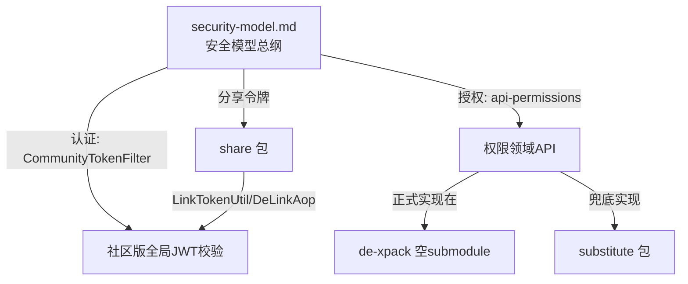
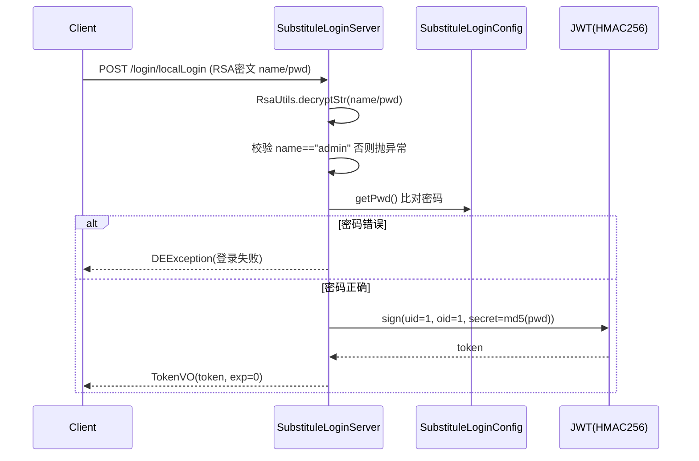
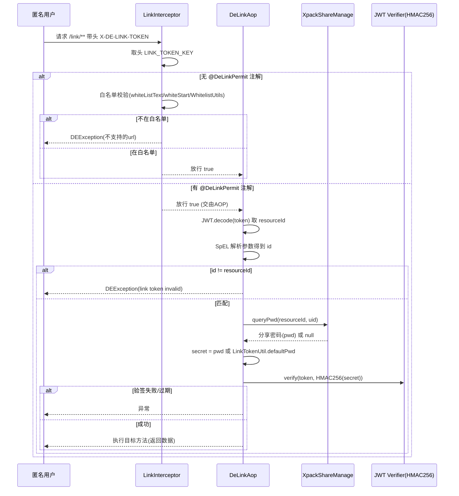

# 鉴权与分享（核心后端）分析（v2.10.7）

> 源码根目录：`/Users/white/workspace/code/references/dataease`
> 分析范围：`core/core-backend/.../io/dataease/substitute` 与 `io/dataease/share`
> 配套文档：`docs/architecture/security-model.md`（安全模型总纲）、`docs/api/api-permissions.md`（权限领域 API，规划中）

## 1. 职责与架构位置

本包覆盖两类职责，分属架构的**不同层次**：

1. **`substitute` 包**——权限服务的**兜底 / 离线实现**（fallback）。
   - DataEase 的权限领域 API（`sdk/api/api-permissions`）存在正式实现，但正式实现在 `de-xpack`（企业版 git submodule，本仓为空指针，见 `docs/architecture/security-model.md` 第 5 节）。
   - 当 Spring 容器中**不存在**正式 Bean（`loginServer` / `orgServer` / `userServer`）时，本包以 `@ConditionalOnMissingBean` 条件注册，充当**社区版 / 离线桌面版**的"替补"。
   - `SubstituleAuthServer` 整段被 `/* ... */` 注释，**完全未生效**，仅留占位框架。
2. **`share` 包**——分享 / 嵌入链接的**正式实现**（核心后端自研）。
   - 负责公共链接（`xpack_share`）、访问票据（`core_share_ticket`）、JWT 链接令牌（`LinkTokenUtil`）的签发与校验（`LinkInterceptor` / `DeLinkAop`）。
   - 与 `security-model.md` 第 2.2 节直接对应，是社区版匿名分享访问链路的核心。

关系图（与 `security-model.md`）：

## 2. 包结构与关键类清单

### 2.1 `substitute`（兜底 / 离线）

| 类 | 职责 | 关键方法 | 正式/兜底 |
|----|------|----------|-----------|
| `SubstituleAuthServer` (`substitute/permissions/auth/SubstituleAuthServer.java`) | 权限服务离线兜底占位（实现 `AuthApi`） | `query`、`queryByUserId`（均被注释） | 兜底（**整段注释，未生效**） |
| `SubstituleLoginServer` (`substitute/permissions/login/SubstituleLoginServer.java`) | 本地登录（仅 `admin`）；RSA 解密凭据；签发 HMAC256 JWT | `localLogin` (`/login/localLogin`)、`logout` (`/logout`)、`generate` | 兜底（条件生效：`@ConditionalOnMissingBean("loginServer")`） |
| `SubstituleOrgServer` (`substitute/permissions/org/SubstituleOrgServer.java`) | 组织挂载兜底，返回硬编码"超级管理员" | `mounted` (`/org/mounted`) | 兜底（条件生效：`@ConditionalOnMissingBean("orgServer")`） |
| `SubstituteUserServer` (`substitute/permissions/user/SubstituteUserServer.java`) | 当前用户 / 个人信息兜底；语言切换缓存 | `info`、`personInfo`、`ipInfo`、`switchLanguage` (`/user/*`) | 兜底（条件生效：`@ConditionalOnMissingBean("userServer")`） |

### 2.2 `share`（正式实现）

| 类/接口 | 职责 | 关键方法 | 正式/兜底 |
|---------|------|----------|-----------|
| `CoreShareTicket` (`share/dao/auto/entity/CoreShareTicket.java`) | 实体：`core_share_ticket` 表（访问票据） | getter/setter；字段 `uuid/ticket/exp/args/accessTime` | 正式（MyBatis-Plus 实体） |
| `XpackShare` (`share/dao/auto/entity/XpackShare.java`) | 实体：`xpack_share` 表（公共链接配置） | getter/setter；字段 `creator/time/exp/uuid/pwd/resourceId/oid/type/autoPwd/ticketRequire` | 正式 |
| `CoreShareTicketMapper` (`share/dao/auto/mapper/CoreShareTicketMapper.java`) | Mapper 接口，继承 `BaseMapper<CoreShareTicket>` | — | 正式 |
| `XpackShareMapper` (`share/dao/auto/mapper/XpackShareMapper.java`) | Mapper 接口，继承 `BaseMapper<XpackShare>` | — | 正式 |
| `XpackShareExtMapper` (`share/dao/ext/mapper/XpackShareExtMapper.java`) | 自定义 SQL：`xpack_share` 关联 `data_visualization_info`、`updateTicketUuid`、`pager` 票据分页 | `query`、`visualizationType`、`updateTicketUuid`、`pager` | 正式 |
| `XpackSharePO` (`share/dao/ext/po/XpackSharePO.java`) | 投影 PO（分享列表展示用） | Lombok `@Data` | 正式 |
| `LinkTokenUtil` (`share/util/LinkTokenUtil.java`) | 链接令牌 JWT 签发工具（HMAC256，声明 `uid`/`resourceId`/`oid`，可选 `exp`） | `generate(uid, resourceId, exp, pwd, oid)`；常量 `defaultPwd="link-pwd-fit2cloud"` | 正式 |
| `ShareTicketManage` (`share/manage/ShareTicketManage.java`) | 票据 CRUD、有效期与访问次数校验 | `saveTicket`、`deleteTicket`、`switchRequire`、`query`、`validateTicket`、`ticketCount`、`updateByUuidChange`、`deleteByShare` | 正式 |
| `XpackShareManage` (`share/manage/XpackShareManage.java`，Bean 名 `xpackShareManage`) | 公共链接核心管理：开关、密码、UUID、代理信息生成、密码校验 | `queryByResource`、`queryPwd`、`switcher`、`editUuid`、`editExp`、`editPwd`、`proxyInfo`、`pwdValid`、`validatePwd`、`queryRelationByUserId`、`query`(`@XpackInteract`) | 正式 |
| `ShareTicketServer` (`share/server/ShareTicketServer.java`，`@RequestMapping("/ticket")`) | 票据 REST 端点，实现 `ShareTicketApi` | `saveTicket`、`deleteTicket`、`switchRequire`、`pager`、`tempTicket`、`limit` | 正式 |
| `XpackShareServer` (`share/server/XpackShareServer.java`，`@RequestMapping("/share")`) | 公共链接 REST 端点，实现 `XpackShareApi` | `status`、`switcher`、`editExp`、`editPwd`、`detail`、`query`、`proxyInfo`、`validatePwd`、`queryRelationByUserId`、`editUuid` | 正式 |
| `LinkInterceptor` (`share/interceptor/LinkInterceptor.java`) | `HandlerInterceptor`，全局注册（`/**`），校验链接令牌白名单 | `preHandle` | 正式 |
| `DeLinkAop` (`share/interceptor/DeLinkAop.java`) | `@Aspect` 环绕 `@DeLinkPermit`，解码并验签链接 JWT、校验 `resourceId` 匹配 | `logAround`、`getExpression`(SpEL) | 正式 |

## 3. 核心流程

### 3.1 登录签发令牌（社区兜底链路）

> 说明：正式登录逻辑（LDAP/CAS/OIDC 等）疑似在 `de-xpack` 的 `loginServer` Bean 中；本社区链路仅在容器无 `loginServer` 时生效（见 `SubstituleLoginServer.java:21`）。

### 3.2 分享链接访问校验

> 服务端令牌签发发生在 `XpackShareManage.proxyInfo`：加载分享页时为响应头 `X-DE-LINK-TOKEN` 写入 `LinkTokenUtil.generate(creator, resourceId, exp, pwd, oid)`，并附 `validateTicket` 结果。`LinkInterceptor` 由 `DeMvcConfig.java:48` 以 `addPathPatterns("/**")` 全局注册。

## 4. 依赖与调用关系

- **与 `sdk/api/api-permissions` 的关系**：`substitute` 各 `*Server` 正是 `api-permissions` 中领域接口（`LoginApi`/`UserApi`/`OrgApi`/`AuthApi`）的**兜底实现**；当 `de-xpack` 提供正式 Bean 时，这些兜底 Bean 因 `@ConditionalOnMissingBean` 不注册。
- **与 `CommunityTokenFilter` 的关系**：`security-model.md` 第 2.1 节指出 `CommunityTokenFilter` 用 `loginServer.userCacheBO().getPwd()` 或 `SubstituleLoginConfig.getPwd()` 作为 HMAC256 密钥校验 `DE-TOKEN`。即：**登录时 `SubstituleLoginServer` 用 `getPwd()` 签名，校验时 `CommunityTokenFilter` 用同一 `getPwd()` 验签**，两者共享同一密钥源。
- **`XpackShareManage.query` 与许可证**：带 `@XpackInteract(value="perFilterShareManage", recursion=true, invalid=true)`，含义为**许可证无效（社区版）时仍执行**该查询（见 `XpackShareManage.java:187`）——印证分享列表在社区版可用。
- **`ProxyInfo` 与 `LicenseUtil`**：`proxyInfo` 中 `request.isInIframe() && !LicenseUtil.licenseValid()` 会返回空（iframe 嵌入仅企业版可用），见 `XpackShareManage.java:231`。
- **`ShareTicketServer`/`XpackShareServer`** 实现 `sdk/api/.../xpack/share` 的 `ShareTicketApi` / `XpackShareApi`（跨模块 API 接口，由 `de-xpack` 或本包提供实现）。
- **`DeLinkPermit`**（`sdk/common/.../auth/DeLinkPermit.java`，`@Target(METHOD)`）为链接令牌校验的切点注解；`LinkInterceptor` 借助方法上的该注解决定走白名单还是交由 `DeLinkAop`。
- **令牌头常量**：`AuthConstant.LINK_TOKEN_KEY = "X-DE-LINK-TOKEN"`（`sdk/common/.../constant/AuthConstant.java:22`）。

## 5. 事务 / 缓存 / 异常 / 安全考量

### 5.1 事务
- `ShareTicketManage.saveTicket` / `updateByUuidChange` / `deleteByShare`：`@Transactional`（L50 / L131 / L136）。
- `XpackShareManage.switcher` / `editUuid` / `editExp` / `editPwd`：`@Transactional` 或内部调用事务方法。
- 注意：`saveTicket` 中对"已存在 ticket"分支先 `deleteById` 再 `insert`，依赖事务保证原子性（`ShareTicketManage.java:51-69`）。

### 5.2 缓存
- `SubstituteUserServer.switchLanguage` 用 `CacheUtils.put/get(USER_COMMUNITY_LANGUAGE, "de", lang)` 缓存社区语言偏好（L35、L73）。
- `CommunityTokenFilter` 侧的令牌缓存（`userCacheBO()`）不在本包，见 `security-model.md`。

### 5.3 异常
- 通用：`DEException.throwException(...)`（`io.dataease.exception.DEException`）。
- 链接令牌：无 `@DeLinkPermit` 且非白名单 → `DEException("分享链接Token不支持访问当前url[...]")`（`LinkInterceptor.java:52`）；`resourceId` 不匹配 → `DEException("link token invalid")`（`DeLinkAop.java:60`）。
- 登录：非 admin / 密码错误 → `DEException`（`SubstituleLoginServer.java:38,41`）。

### 5.4 安全考量（重点）
1. **JWT 签名算法**：全部为 **HMAC256**（对称密钥）。
   - 登录令牌密钥 = `md5(明文密码)`，取自 `SubstituleLoginConfig.getPwd()`（`SubstituleLoginServer.java:46-57`）。
   - 链接令牌密钥 = 分享记录的 `pwd`；若 `pwd` 为空则回退到**硬编码常量** `defaultPwd="link-pwd-fit2cloud"`（`LinkTokenUtil.java:12`，`DeLinkAop.java:67`）。
2. **令牌声明**：登录令牌 `uid`/`oid`；链接令牌 `uid`/`resourceId`/`oid`，可选 `exp`（绝对过期时间）。
3. **过期校验**：`DeLinkAop` 使用 `JWT.require(algorithm).build().verify(token)`，auth0 验证器**默认校验 `exp`**，故链接令牌过期会被拒绝（`DeLinkAop.java:70-74`）。但 `XpackShareManage.linkExp` 另对分享本身设过期判断（`XpackShareManage.java:255`）。
4. **越权风险**：
   - **[Need Verification] 空密码分享可被伪造令牌**：当 `xpack_share.pwd` 为空，`proxyInfo` 与 `DeLinkAop` 均回退到公开常量 `link-pwd-fit2cloud` 作为 HMAC256 密钥。攻击方若已知 `uid`(创建者)、`resourceId`(URL 可见)、`oid`，即可本地构造**任意**有效链接令牌，访问无密码保护的分享资源。`LinkTokenUtil.defaultPwd` 为硬编码值，构成潜在越权面。
   - **[Inference] 校验强依赖 `@DeLinkPermit` 标注正确性**：`LinkInterceptor` 对带注解的方法直接放行、交给 `DeLinkAop`；若某匿名分享端点**遗漏** `@DeLinkPermit` 且不在白名单，会被 `LinkInterceptor` 拦截；反之若**错误**标注，则越权校验可能落到不该放的端点。正确性取决于注解的逐方法覆盖。
   - `XpackShareManage.queryByResource/queryPwd/switchRequire` 均以 `creator = AuthUtils.getUser().getUserId()` 限定，避免用户篡改他人分享（`XpackShareManage.java:61-65`、L103、L112）。
5. **密码比较逻辑**：`pwdValid`/`validatePwd` 对 RSA 解密后的密文按 `,` 拆分 `uuid,pwd`，无逗号时 `splitIndex=8` 直接取子串（`XpackShareManage.java:263-273`），逻辑较特殊，建议复核格式约定。

## 6. 风险与待确认

- [Need Verification] `substitute` 各 `*Server` 为 `@ConditionalOnMissingBean` 兜底；**正式 `loginServer`/`orgServer`/`userServer` Bean 的真实实现位置**（疑似 `de-xpack`，本仓为空 submodule）需在该仓补全后确认。
- [Need Verification] 链接令牌**空密码回退硬编码密钥** `link-pwd-fit2cloud` 的越权风险（见 5.4.4）是否在生产网关（APISIX）层有额外防护，需结合部署文档确认。
- [Need Verification] `ShareTicketManage.getLimit()` 恒返回 `0`，经 `ShareTicketServer.limit()` 暴露；`0` 表示"无限制"还是"社区禁用票据"语义不明，需确认。
- [Need Verification] `SubstituleLoginServer` 仅允许 `admin` 登录、且用户固定 `userId=1, oid=1`，社区版多用户场景是否由 `de-xpack` 正式实现补齐。
- [Inference] `SubstituleAuthServer` 整段注释、未注册，说明"桌面版离线权限"能力当前**实际不可用**，相关 `AuthApi.query` 在离线场景无兜底（社区走 `CommunityTokenFilter` 放行后由正常权限 API 处理）。
- [Need Verification] `security-model.md` 第 2.1 节称令牌头为 `DE-TOKEN`，而本包引用常量 `AuthConstant.TOKEN_KEY="X-DE-TOKEN"`、`LINK_TOKEN_KEY="X-DE-LINK-TOKEN"`；前者命名不一致，需与 `CommunityTokenFilter` 实际取头逻辑核对。

## 7. 相关文档

- `../architecture/security-model.md` —— 安全模型总纲（认证 `CommunityTokenFilter`、授权领域 API、`de-xpack` 边界）。
- `../api/api-permissions.md` —— 权限领域 API 详解（规划中；`substitute` 即其兜底实现来源）。
- `backend/foundation.md` —— 同层后端基础分析。
- `../architecture/overview.md`、`../architecture/directory-structure.md` —— 总体架构与目录结构。
- 源码交叉引用（非文档）：`sdk/common/.../auth/DeLinkPermit.java`、`sdk/common/.../constant/AuthConstant.java`、`core/core-backend/.../config/DeMvcConfig.java`。
