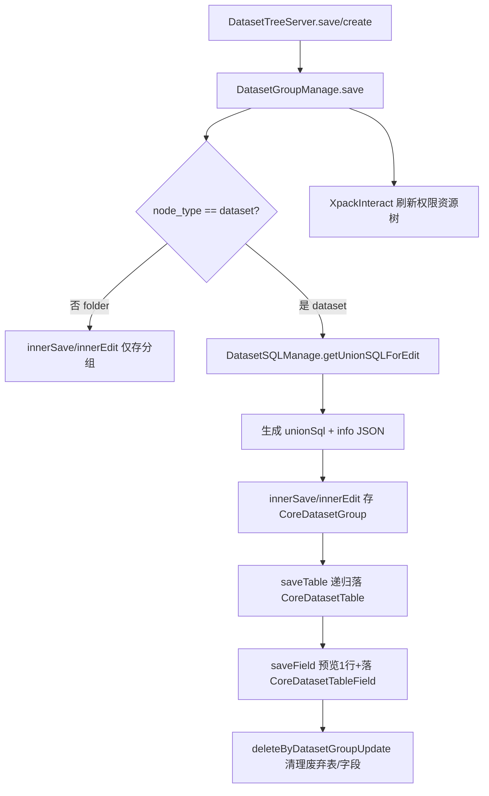
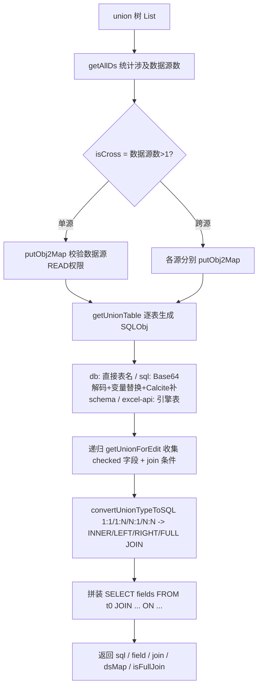
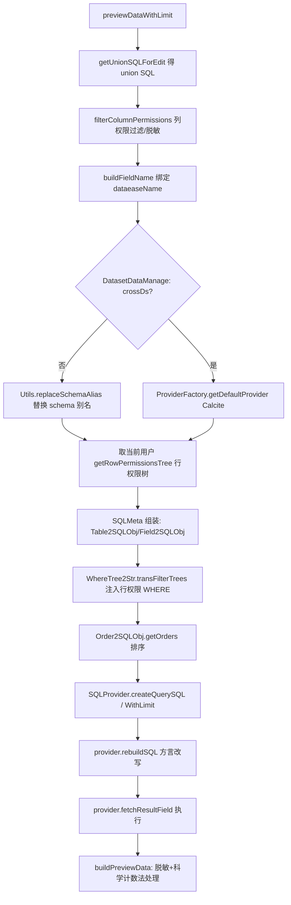
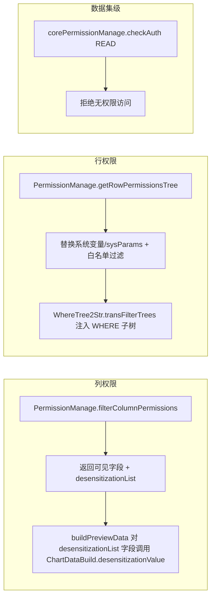

# 数据集（Dataset）后端分析（v2.10.7）

> 分析范围：`core/core-backend/src/main/java/io/dataease/dataset/**`
> 源码版本：DataEase v2.10.7
> 覆盖文件：28 个 `.java`（已全部阅读，无遗漏）

## 1. 职责与架构位置

`dataset` 包是 DataEase 的**核心领域层**，负责数据集（Dataset）这一分析对象的全生命周期管理，其上接前端 `api/dataset` 模块（Feign API 定义），下接 `datasource`（数据源/引擎连接）与 `engine`（SQL 生成引擎），横向与 `api-permissions/dataset`（行/列权限，企业版 xpack）协作。

主要职责：

1. **建模（Modeling）**：把前端下发的「union 树」（`List<UnionDTO>`）转成可执行的关联 SQL（`unionSql`），并落库为 `core_dataset_group` / `core_dataset_table` / `core_dataset_table_field` 三张表。
2. **字段管理（Field）**：维护原始字段、复制字段、计算字段（`ext_field`：0=原始、1=复制、2=计算、[Need Verification] 其它取值含义）、维度/指标（`group_type`：d/q）。
3. **数据预览（Preview）**：在查询阶段把 union SQL + 字段投影 + 行权限 WHERE + 排序，组装成最终 SQL，交由 `Provider` 执行（直连或 Calcite 跨源）。
4. **权限应用（Permission）**：在查询阶段注入**行权限（WHERE 子树）**与**列权限（脱敏/隐藏字段）**；通过 `corePermissionManage.checkAuth` 做数据集级 READ 校验。
5. **SQL 日志**：预览 SQL 的执行日志落库 `core_dataset_table_sql_log`。

架构位置（依赖方向）：

```
api/dataset (Feign API 接口)
      │
      ▼
dataset.server.*  ──►  dataset.manage.*  ──►  engine (SQLProvider/trans/*)
      │                                      dataset.utils.* (SqlUtils/TableUtils/FieldUtils)
      ├──► datasource (DataSourceManage / EngineManage / DatasourceUtils)
      └──► api-permissions/dataset (RowPermissionsApi / ColumnPermissionsApi, xpack)
```

> [Inference] `RowPermissionsApi` / `ColumnPermissionsApi` 以 `@Autowired(required = false)` 注入（见 `PermissionManage`、`DatasetSQLManage`、`DatasetDataManage`），说明行/列权限是企业版（xpack）能力；社区版缺少该 bean 时，相关方法直接返回空集合，即**不施加行/列权限**。

## 2. 包结构与关键类清单

### 2.1 包布局

| 子包 | 角色 |
|------|------|
| `constant` | 数据集表类型常量 |
| `utils` | SQL/Calcite 改写、表命名、字段类型映射、编解码工具 |
| `dao/auto/entity` | MyBatis-Plus 自动生成实体（3 张核心表） |
| `dao/auto/mapper` | MyBatis-Plus 自动生成 Mapper（4 个） |
| `dao/ext/mapper` `dao/ext/po` | 自定义查询（树、概览） |
| `dto` | 树节点 BO |
| `manage` | 业务逻辑核心（建模/字段/数据/权限/SQL 组装） |
| `server` | REST 控制器（实现 `api/dataset` 的 Feign 接口） |

### 2.2 关键类清单

| 类/接口 | 职责 | 关键方法 | 备注 |
|---------|------|----------|------|
| `constant.DatasetTableType` | 数据集表类型常量 | `DB="db"`, `SQL="sql"`, `Es="es"` | 与 `DatasetTableTypeConstants` 重复，且未含 excel/api |
| `utils.DatasetTableTypeConstants` | 数据集表类型常量（仅 db/sql） | `DATASET_TABLE_DB`, `DATASET_TABLE_SQL` | 与 `DatasetTableType` 语义重叠 [Need Verification] 为何两套常量并存 |
| `utils.DatasetUtils` | 树合并、计算字段表达式 Base64 编解码 | `mergeDuplicateTree`, `dsEncode/dsDecode`, `listEncode/listDecode`, `getEncode/getDecode` | 计算字段表达式以 Base64 存储/传输，防止注入与转义问题 |
| `utils.FieldUtils` | 原始 DB 类型 → DE 类型映射 | `transType2DeType`, `transDeType2DQ` | DE 类型：0文本/1时间/2整型/3浮点/4布尔/5地理/6二进制；d/q 分组由 `transDeType2DQ` 决定 |
| `utils.SqlUtils` | 基于 Calcite 给 SQL 中表名补 schema | `addSchema` | 跨源场景下改写 FROM/JOIN 表的 schema 前缀 |
| `utils.TableUtils` | 表/字段命名与占位符 | `tableName2Sql`, `fieldName`, `columnName`, `getTableAndAlias`, `tmpName/deleteName/addName` | 字段名用 `f_`+MD5，列名 `C_`+MD5 |
| `dao.auto.entity.CoreDatasetGroup` | 数据集分组/叶子节点实体（`core_dataset_group`） | getter/setter | `node_type`: folder/dataset；`type`: sql/union；`mode`: 0直连/1同步；`info` 存 union 树 JSON；`unionSql` 存生成 SQL |
| `dao.auto.entity.CoreDatasetTable` | 数据集表实体（`core_dataset_table`） | — | `type`: db/sql/union/excel/api；`info` 存表名或 Base64 SQL；`sqlVariableDetails` 存 SQL 参数 |
| `dao.auto.entity.CoreDatasetTableField` | 数据集字段实体（`core_dataset_table_field`） | — | `ext_field` 区分原始/复制/计算；`deType`/`groupType`/`dataeaseName` 等 |
| `dao.auto.entity.CoreDatasetTableSqlLog` | SQL 日志实体（`core_dataset_table_sql_log`） | — | UUID 主键，记录耗时/状态/SQL |
| `dao.auto.mapper.*` | 4 个 MyBatis-Plus Mapper | `selectById/insert/updateById/selectList` | 自动生成，无自定义逻辑 |
| `dao.ext.mapper.CoreDataSetExtMapper` | 自定义查询 | `query`（树，原生 SQL+QueryWrapper）、`queryBarInfo` | |
| `dao.ext.po.DataSetNodePO` | 树节点 PO | — | id/name/nodeType/pid |
| `dto.DataSetNodeBO` | 树节点 BO（实现 `TreeBaseModel`） | — | weight/leaf/extraFlag |
| `manage.DatasetGroupManage` | 数据集分组/数据集 CRUD、树、建模编排 | `save`, `innerSave/innerEdit`, `move`, `delete/recursionDel`, `tree`, `saveTable`, `saveField`, `getDatasetGroupInfoDTO`, `getForCount`, `getSqlParams`, `detailWithPerm` | `@Transactional`；`save` 用 `ReentrantLock` 串行化；`@XpackInteract` 钩子刷新权限资源树 |
| `manage.DatasetTableManage` | `core_dataset_table` CRUD | `save`, `selectByDatasetGroupId`, `deleteByDatasetGroupUpdate/Delete` | 名字长度 ≤100 校验 |
| `manage.DatasetTableFieldManage` | `core_dataset_table_field` CRUD + 字段权限过滤 | `save`, `chartFieldSave`, `selectByDatasetGroupId`, `listByDQ`, `listFieldsWithPermissions`, `listFieldsWithPermissionsRemoveAgg`, `copilotFields`, `transObj/transDTO` | `@Transactional`；调用 `PermissionManage.filterColumnPermissions` |
| `manage.DatasetSQLManage` | **union SQL 生成引擎**（建模核心） | `getUnionSQLForEdit`, `getUnionTable`, `getUnionForEdit`, `putObj2Map`, `convertUnionTypeToSQL`, `filterParameters` | 把 union 树 → `SELECT ... FROM ... JOIN ...`；校验数据源权限 `corePermissionManage.checkAuth` |
| `manage.DatasetDataManage` | **数据预览/枚举/计数**（查询核心） | `previewDataWithLimit`, `getTableFields`, `previewSql/previewSqlWithLog`, `getDatasetTotal/getDatasetCountWithWhere`, `getFieldEnum(s)/getFieldEnumObj`, `getFieldValueTree`, `buildPreviewData`, `buildFieldName` | 调用 engine 的 `Table2SQLObj/Field2SQLObj/WhereTree2Str/Order2SQLObj/ExtWhere2Str` + `SQLProvider` |
| `manage.PermissionManage` | **行/列权限解析**（企业版） | `filterColumnPermissions`, `columnPermissions`, `getRowPermissionsTree`, `rowPermissionsTree`, `getField`, `handleSysVariable` | 依赖 `RowPermissionsApi`/`ColumnPermissionsApi`（required=false） |
| `manage.DatasetTableSqlLogManage` | SQL 日志 CRUD | `save`, `listByTableId`, `deleteByTableId` | `@Transactional` |
| `server.DatasetTreeServer` | 数据集树/CRUD REST（`datasetTree`） | `save/create/rename/move/delete`, `tree`, `get/details`, `detailWithPerm`, `exportDataset` | 实现 `DatasetTreeApi`；`@DeLog` 审计注解 |
| `server.DatasetDataServer` | 数据预览 REST（`datasetData`） | `previewData`, `tableField`, `previewSql`, `getFieldEnum*`, `getDatasetCount/Total`, `getFieldValueTree` | 实现 `DatasetDataApi` |
| `server.DatasetFieldServer` | 字段/函数 REST（`datasetField`） | `save`, `listByDQ`, `copilotFields`, `listFieldsWithPermissions`, `getFunction` | 实现 `DatasetTableApi` |
| `server.DatasetTableSqlLogServer` | SQL 日志 REST（`datasetTableSqlLog`） | `save`, `listByTableId`, `deleteByTableId` | 实现 `DatasetTableSqlLogApi` |

## 3. 核心流程

### 3.1 数据集建模（保存）流程



> [Inference] `DatasetGroupManage.save` 在 `node_type=dataset` 时先用 `ReentrantLock` 加锁，避免并发建模冲突；`saveField` 会先调 `previewDataWithLimit(...,false,false)` 预览 1 行以校验字段，再落库。

### 3.2 union SQL 生成（`getUnionSQLForEdit`）



### 3.3 数据预览与权限注入（`previewDataWithLimit`）



### 3.4 行/列权限应用点



## 4. 依赖与调用关系

### 4.1 与 `engine` 包（SQL 生成引擎）

`dataset` 不自己拼最终查询 SQL，而是构造 `SQLMeta` 并委托 `engine` 完成：

- `io.dataease.engine.sql.SQLProvider`：`createQuerySQL` / `createQuerySQLWithLimit` 生成最终 SELECT。
- `io.dataease.engine.trans.*`：
  - `Table2SQLObj.table2sqlobj` —— 把 union SQL 包成子查询 `(sql)`。
  - `Field2SQLObj.field2sqlObj` —— 字段投影（含计算字段表达式生成）。
  - `WhereTree2Str.transFilterTrees` —— **行权限树 → WHERE 条件**（核心权限注入点）。
  - `Order2SQLObj.getOrders` —— 排序。
  - `ExtWhere2Str.extWhere2sqlOjb` —— 组件过滤条件（如枚举搜索）。
- `io.dataease.engine.utils.Utils`：`isCrossDs`（跨源判定）、`isNeedOrder`、`replaceSchemaAlias`、`getParams`、`calcFieldRegex`、`mergeParam`。
- `io.dataease.engine.constant.ExtFieldConstant`：`EXT_NORMAL/EXT_CALC/EXT_GROUP` 字段类型。
- `io.dataease.engine.func.FunctionConstant`：`AGG_FUNC` 聚合函数集合（用于 `listFieldsWithPermissionsRemoveAgg` 过滤计算字段中的聚合）。
- `io.dataease.engine.utils.SQLUtils`：`buildOriginPreviewSql` / `buildOriginPreviewSqlWithOrderBy`（SQL 数据集预览占位 SQL）。

> 计算字段表达式由 `Utils.calcFieldRegex` 在 engine 中生成，再以 Base64（`DatasetUtils.dsEncode/dsDecode`）在 dataset 内部存储，避免特殊字符破坏 JSON/SQL。

### 4.2 与 `datasource` 包

- `DataSourceManage.getCoreDatasource(id)`：取数据源配置；Excel/API 类型会被替换为 `EngineManage.getDeEngine()`（即内置 Doris/引擎库）。
- `EngineManage.getDeEngine()`：返回内置引擎数据源（Excel/API/跨源统一存储）。
- `io.dataease.datasource.utils.DatasourceUtils.checkDsStatus(dsMap)`：预览前校验数据源连接状态。
- `io.dataease.extensions.datasource.*`：`Provider` / `ProviderFactory`（按类型取 provider）、`DatasourceRequest`、`SQLObj`、`DatasetTableFieldDTO`、`DatasourceSchemaDTO`、`PluginManageApi`（xpack 插件数据源）。

### 4.3 与 `api-permissions/dataset`（行/列权限，企业版）

- `io.dataease.api.permissions.dataset.api.RowPermissionsApi`（Feign，required=false）：
  - `list(DatasetRowPermissionsTreeRequest)` —— 取用户/角色/sysParams 行权限树。
  - `getUserById` —— 取用户角色、系统变量。
  - `authObjs` —— 取可授权角色。
- `io.dataease.api.permissions.dataset.api.ColumnPermissionsApi`（Feign，required=false）：
  - `list(DataSetColumnPermissionsDTO)` —— 取列权限（脱敏/隐藏）。
- `io.dataease.api.permissions.auth.dto.BusiPerCheckDTO` + `system.manage.CorePermissionManage.checkAuth`：数据集级 READ 业务权限（在 `getFieldEnum`、`getFieldEnumObj` 等枚举接口中显式校验）。
- `io.dataease.api.permissions.relation.api.RelationApi`（xpack）：删除前 `perDelete` 检查数据集被引用情况。
- `io.dataease.constant.ColumnPermissionConstants.Desensitization`：列权限操作类型常量。

> [Inference] 因为行/列权限 API 是 `required=false`，**社区版不会注入行/列权限**（方法提前返回空集合）；权限实际生效依赖企业版 xpack 模块提供这些 Feign 实现。[Need Verification] 社区版是否通过其它机制（如 `CorePermissionManage`）提供有限的行/列权限。

## 5. 事务 / 缓存 / 异常 / 安全考量

### 5.1 事务

- `DatasetGroupManage`、`DatasetTableFieldManage`、`DatasetTableSqlLogManage` 标注 `@Transactional`（后者 `rollbackFor=Exception.class`）。
- `DatasetGroupManage.save` 用 `ReentrantLock` 显式加锁，`finally` 释放；因为建模涉及多表写 + union SQL 计算，避免并发写同一分组造成不一致。
- `DatasetSQLManage` / `DatasetDataManage` **未标注** `@Transactional` —— 它们是只读查询编排，最终 SQL 执行在 `Provider`（外部数据源/Doris），不在本地事务内。

### 5.2 缓存

- 本包**未使用** Spring Cache / Redis。每次预览都重新 `getUnionSQLForEdit` + 构建 `SQLMeta` + 查引擎。
- 唯一“复用”是 `dsMap`（`LinkedHashMap<Long,DatasourceSchemaDTO>`）在单次请求内贯穿 union 生成→字段→权限→执行。`[Inference]` 跨请求无缓存，大规模仪表板下可能存在重复计算开销 [Need Verification]。

### 5.3 异常

- 统一经 `io.dataease.exception.DEException.throwException(msg)` 抛出（业务校验失败、无效数据源、无字段、无列权限、跨源 FULL JOIN 不支持等）。
- `SqlUtils.addSchema` 中 Calcite 解析失败也转 `DEException`。
- `DatasetDataServer` 的 `getFieldEnum*` / `getFieldValueTree` 用 `try/catch` 吞异常并返回 `null`（仅打日志），与 `getDatasetCountWithWhere` 返回 `null` 风格一致——**对调用方不透明**，前端需容忍 null。

### 5.4 安全：行列权限如何在查询阶段注入

1. **行权限（WHERE 注入）**：`PermissionManage.getRowPermissionsTree` 取出当前用户/角色/sysParams 的行权限表达式树，做白名单（用户/角色/部门）排除与系统变量（`${sysParams.userId}` 等）替换；得到的 `List<DataSetRowPermissionsTreeDTO>` 传入 `WhereTree2Str.transFilterTrees`，在 `SQLMeta` 上拼出 AND 条件的 WHERE 子树，最终进入 `SQLProvider` 生成的 SQL。`AuthUtils.isSysAdmin` 直接跳过行权限。
2. **列权限（字段脱敏/隐藏）**：`PermissionManage.filterColumnPermissions` 根据 `ColumnPermissions` 配置过滤字段——含 `Desensitization` 操作的字段保留并登记到 `desensitizationList`，其它操作（隐藏）的字段**直接从结果集中剔除**；脱敏在 `DatasetDataManage.buildPreviewData` 里对命名字段调用 `ChartDataBuild.desensitizationValue` 执行（如掩码）。白名单用户同样被排除。
3. **数据集级权限**：枚举/值接口显式 `corePermissionManage.checkAuth(BusiPerCheckDTO{READ})`，无权限抛 `i18n_no_dataset_permission`。

### 5.5 注入面与风险

- SQL 数据集的 `info` 中存 Base64 编码的原始 SQL，预览/建模时 `Base64.getDecoder().decode` 后交给 `SqlparserUtils.handleVariableDefaultValue` 与 `provider.replaceComment` 处理，再作为子查询嵌入。**自定义 SQL 数据集**存在潜在 SQL 注入面——其安全性依赖 `provider` 的改写/校验与 Calcite 解析，而非参数化。`[Need Verification]` 是否有对自定义 SQL 的治理（白名单函数/禁用语句）校验。
- `previewSql` / `previewSqlCheck` 直接执行前端下发的 Base64 SQL（仅做变量替换与方言改写），属高权限操作，依赖数据源级权限（`corePermissionManage` 未在 `previewSql` 内显式校验，仅 `DatasourceUtils` 状态校验）。`[Need Verification]` 任意用户能否对无权限数据源执行 `previewSql`。

## 6. 风险与待确认（[Need Verification]）

1. **两套类型常量并存**：`DatasetTableType`（db/sql/es）与 `DatasetTableTypeConstants`（db/sql）语义重叠，且均未覆盖 `CoreDatasetTable.type` 注释中的 `union/excel/api`。[Need Verification] 实际类型枚举的完整定义来源（是否在 `api` 模块或 engine）。
2. **`ext_field` 取值全集**：`CoreDatasetTableField.extField` 注释含 0原始/1复制/2计算，但代码仅明确用到 `EXT_NORMAL/EXT_CALC/EXT_GROUP`。[Need Verification] `EXT_GROUP` 具体数值与 1/2 是否冲突。
3. **社区版行列权限**：行/列权限依赖 `required=false` 的 Feign API，社区版缺 bean 时不注入。[Need Verification] 社区版是否存在替代实现。
4. **`previewData` 不校验权限**：`DatasetDataServer.previewData` 调 `previewDataWithLimit(...,checkPermission=false,...)`，而 `getDatasetGroupInfoDTO("preview")` 用 `true`。[Need Verification] 编辑器预览与详情预览的权限差异是否为预期行为。
5. **无跨请求缓存**：每次预览全量重算 union SQL / SQLMeta。[Need Verification] 高并发仪表板下的性能与是否计划引入缓存。
6. **自定义 SQL 注入面**：见 5.5。
7. **异常吞没**：多个枚举/树接口 `catch` 后返回 `null`，不利于问题定位。[Need Verification] 是否统一异常处理。
8. **`notFullDs` 列表硬编码**：`DatasetDataManage.notFullDs = mysql,mariadb,Excel,API,H2,h2`，用于禁止非全量数据源做 FULL JOIN。[Need Verification] 是否覆盖所有不支持 FULL JOIN 的引擎类型。

## 7. 相关文档

- [engine.md](engine.md) — SQL 生成引擎（SQLProvider / trans.* / Utils）
- [datasource.md](datasource.md) — 数据源管理与 Provider/EngineManage
- [api-permissions.md](api-permissions.md) — 行/列权限 API 与 ColumnPermissionConstants
- [../architecture/security-model.md](../architecture/security-model.md) — 整体安全模型（数据集级 READ、行/列权限、sysParams）
