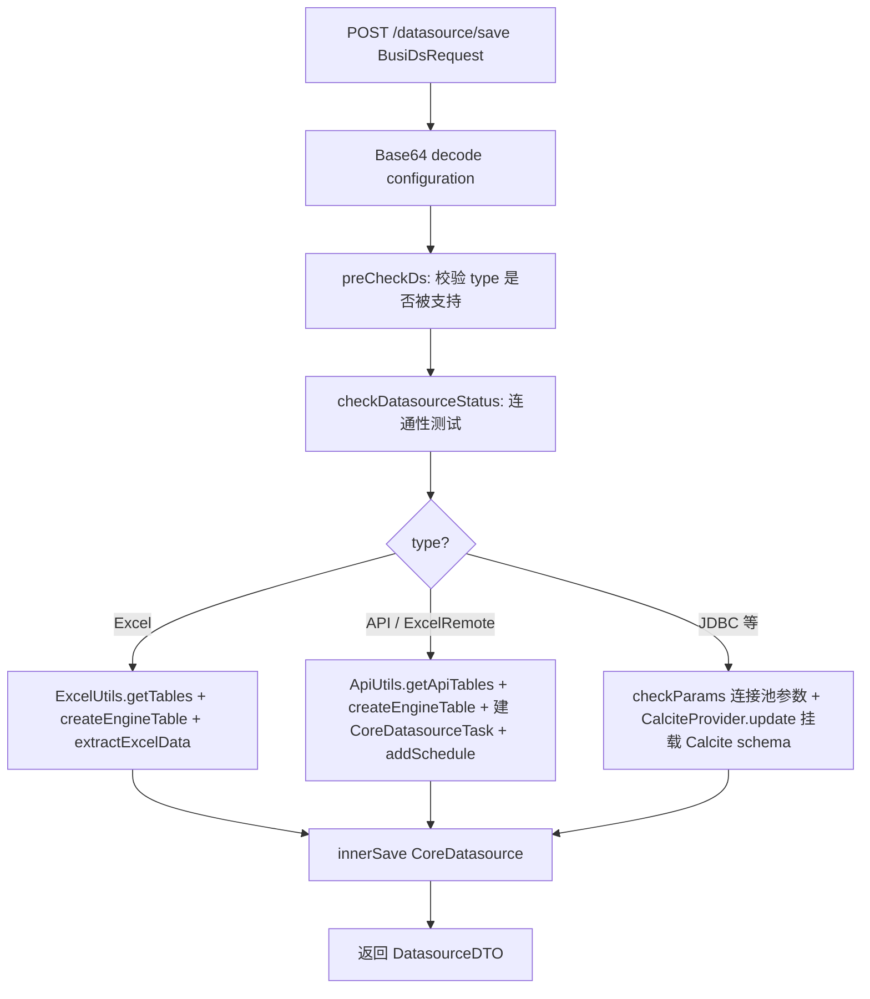
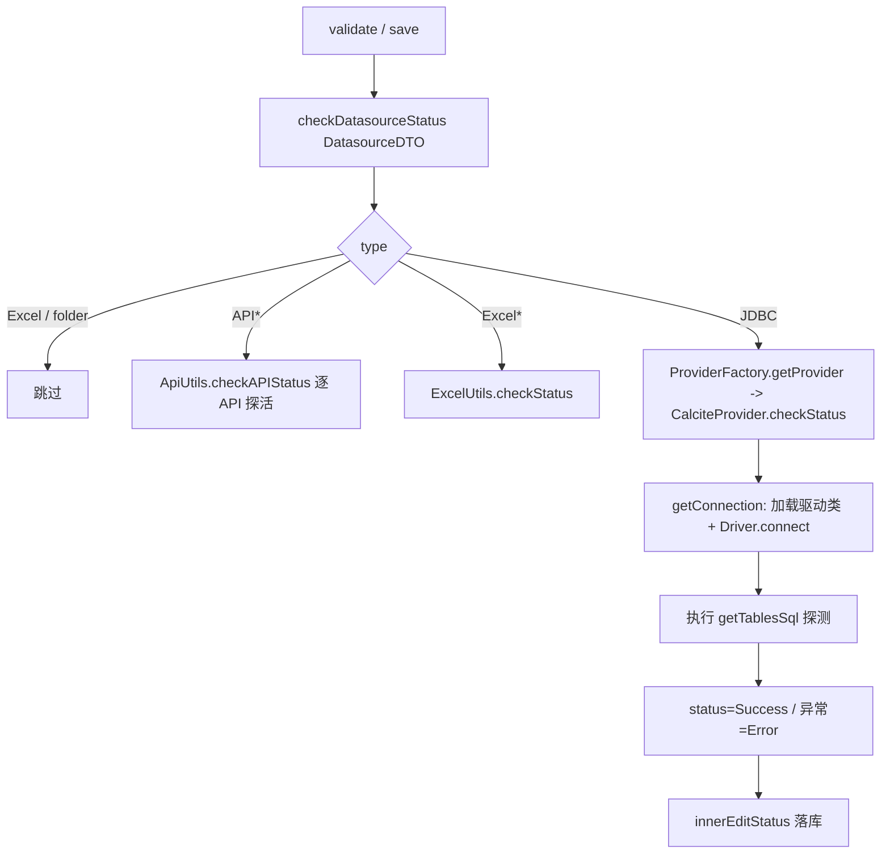
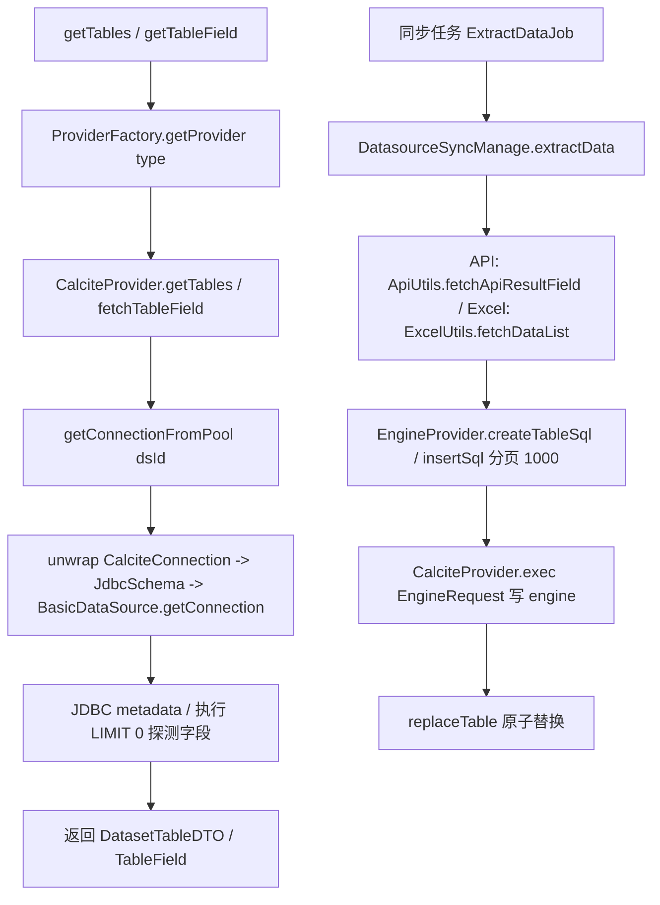

# 数据源（Datasource）后端分析（v2.10.7）

> 分析范围：
> - `core/core-backend/src/main/java/io/dataease/datasource/**`（58 个 .java）
> - `sdk/extensions/extensions-datasource/src/main/java/**`（29 个 .java）
>
> 结论均给出 文件路径 / 类名 / 方法名；推断以 `[Inference]` 标注，待确认以 `[Need Verification]` 标注。
> 源码为唯一真理；本文档未修改任何源码文件，未执行 git 提交。

---

## 1. 职责与架构位置

`datasource` 模块负责 **数据源连接管理**：数据源类型定义、连接配置、JDBC 驱动加载、连通性测试、元数据（库/表/字段）抓取、以及将外部数据同步（抽取）到 **数据引擎（engine）**。

在整体架构中，它位于：

- **上游**：前端 / `api/ds` 接口（`DatasourceApi`、`EngineApi`、`DatasourceDriverApi`）。
- **下游**：
  - `dataset` 模块（数据集）：通过 `DatasetDataManage.previewSql`、`TableUtils` 做数据预览与建表名换算；抽取后的数据落库到 engine，数据集再读 engine 表。
  - `engine` 模块：引擎本身被当作一个特殊的“数据源”注册进 Calcite（`CoreDeEngine` → `DatasourceDTO`）。
  - `job/schedule`（Quartz）：数据同步任务调度（`ExtractDataJob`、`CheckDsStatusJob`）。
- **横向扩展**：`sdk/extensions/extensions-datasource` 定义 `Provider` 抽象与 `ProviderFactory`，是 **SPI/插件式数据源类型** 的扩展点（企业版插件数据源）。

核心设计模式：
- **策略/工厂**：`ProviderFactory.getProvider(type)` 按 type 返回 `Provider` 实现（内置 → `calciteProvider`；ES → `esProvider`；插件 → 注册在 `templateMap`）。
- **Calcite 联邦查询**：所有 JDBC 数据源 + engine 都被挂载到同一个 `CalciteConnection` 的 root schema 下，每个数据源对应一个 `JdbcSchema`（内部持有一个 commons-dbcp2 `BasicDataSource` 连接池）。跨数据源查询由 Calcite 完成。

---

## 2. 包结构与关键类清单

### 2.1 `core/.../datasource` —— 自动生成 DAO 层（MyBatis-Plus）

这些类由代码生成器产出（`@TableName` 注解），属于持久层，无业务逻辑。

| 类 / 接口 | 表（推断） | 职责 | 关键字段 / 方法 | 备注 |
|---|---|---|---|---|
| `dao/auto/entity/CoreDatasource` | `core_datasource` | 数据源主表实体 | `id, name, description, type, pid, editType, configuration, status, taskStatus, createBy, updateBy, qrtzInstance` | `configuration` 存 **JSON 连接配置**（含凭据，见 §5） |
| `dao/auto/entity/CoreDatasourceTask` | `core_datasource_task` | 同步任务实体 | `id, dsId, name, cron, syncRate, startTime, endTime, updateType, taskStatus` | `syncRate` 含 `RIGHTNOW`/`CRON`/`MANUAL` |
| `dao/auto/entity/CoreDatasourceTaskLog` | `core_datasource_task_log` | 同步日志 | `dsId, taskId, tableName, taskStatus, startTime, endTime, info` | 单表级同步记录 |
| `dao/auto/entity/CoreDeEngine` | `core_de_engine` | 数据引擎配置 | `type(h2/mysql), configuration` | 引擎本身即一个数据源 |
| `dao/auto/entity/CoreDriver` | `core_driver` | 自定义驱动定义 | `id, type, driverClass, name` | 与 `CoreDriverJar` 一对多 |
| `dao/auto/entity/CoreDriverJar` | `core_driver_jar` | 自定义驱动 jar | `deDriverId, fileName, transName, driverClass, isTransName` | jar 物理文件路径 = `${custom-drivers}/<deDriverId>/<transName>` |
| `dao/auto/entity/CoreDsFinishPage` | `core_ds_finish_page` | 引导完成页标记 | `id(=userId)` | 仅记录用户是否看过 |
| `dao/auto/entity/QrtzSchedulerState` | `QRTZ_SCHEDULER_STATE` | Quartz 调度实例心跳 | `instanceName, lastCheckinTime, checkinInterval` | 用于任务宕机恢复（见 §5） |
| `dao/auto/mapper/*`（9 个） | — | Mapper 接口 | `selectById/insert/updateById/selectList` 等 | `CoreDatasourceMapper`、`CoreDatasourceTaskMapper`、`CoreDatasourceTaskLogMapper`、`CoreDeEngineMapper`、`CoreDriverMapper`、`CoreDriverJarMapper`、`CoreDsFinishPageMapper`、`QrtzSchedulerStateMapper` + `CoreDatasourceMapper`（已列） |
| `dao/ext/mapper/CoreDatasourceExtMapper` | — | 扩展查询 | `queryItem(id)` 返回 `DsItem` | 用于 `getPidList` 向上回溯父链 |
| `dao/ext/mapper/DataSourceExtMapper` | — | 树/时间戳查询 | `selectList(QueryWrapper)`, `selectTimestamp()` | `getTables`/树/心跳时间戳 |
| `dao/ext/mapper/ExtDatasourceTaskMapper` | — | 任务+触发器 | `taskWithTriggers(id)` | 供 `checkTaskIsStopped` 判断下次执行时间 |
| `dao/ext/mapper/TaskLogExtMapper` | — | 同步日志分页 | `pager(Page, wrapper)` | `listSyncRecord` 使用 |
| `dao/ext/po/Ctimestamp` | — | POJO | `getCurrentTimestamp()` | 取 DB 当前时间（用于心跳判定） |
| `dao/ext/po/DataSourceNodePO` | — | 树节点 PO | `id, name, type, pid, status` | `DataSourceManage.tree` 映射 |
| `dao/ext/po/DsItem` | — | POJO | `id, pid` | 父链回溯 |

### 2.2 `core/.../datasource/dto` —— 业务 DTO

| 类 | 职责 | 关键方法/字段 | 备注 |
|---|---|---|---|
| `dto/CoreDatasourceTaskDTO` | 任务+触发器视图对象 | 继承任务字段 + `nextExecTime` | |
| `dto/DatasourceNodeBO` | 树节点 BO | `id, name, leaf, level, pid, flag, type` | `flag` 取自 `DatasourceType.getFlag()`；错误状态为负 flag |
| `dto/DatasourceNodePO` | 树节点 PO（同名重复包） | 同上（轻量） | 与 `dao/ext/po/DataSourceNodePO` 近似，前端树用 |
| `dto/es/EsResponse` | ES SQL 响应 | `columns[], rows[][], error` | `EsProvider` 解析用 |
| `dto/es/Request` | ES SQL 请求 | `query, fetch_size` | |
| `dto/es/RequestWithCursor` | ES 游标请求 | 继承 `Request` + `cursor` | |

### 2.3 `core/.../datasource/manage`

| 类 | 职责 | 关键方法 | 备注 |
|---|---|---|---|
| `manage/DataSourceManage` | 数据源树/保存/编辑（不含连通性） | `tree()`, `innerSave()`, `innerEdit()`, `innerEditName()`, `innerEditStatus()`, `move()`, `checkName()`, `getCoreDatasource(id)`（id=-1 返回 engine）, `getFlag(type)`, `encryptDsConfig()` | 大量方法被 `@XpackInteract` 注解（企业版可替换/拦截）；`getFlag` 在枚举找不到时回退到 `pluginManage.queryPluginDs()`，再回退 27 |
| `manage/DatasourceSyncManage` | 数据抽取编排 | `extractData()`, `extractedData()`(API), `extractedExcelData()`, `extractApiData()`, `extractExcelData()`, `createEngineTable()`, `dropEngineTable()`, `replaceTable()`, `addSchedule()`, `deleteSchedule()`, `fireNow()` | 真正把数据写入 engine 的编排层；通过 `EngineProvider` 生成 SQL + `CalciteProvider.exec` 执行 |
| `manage/EngineManage` | 引擎配置管理 | `info()`, `getDeEngine()`, `deEngine()`, `validate()`, `save()`, `initSimpleEngine()`, `initLocalDataSource()` | `engineType` 枚举仅 `mysql/h2`；`initLocalDataSource` 注入 Demo 数据源（固定 id `985188400292302848L`） |

### 2.4 `core/.../datasource/provider`（JDBC/引擎/Excel/API 提供方）

| 类 | 职责 | 关键方法 | 备注 |
|---|---|---|---|
| `provider/CalciteProvider` (`@Component("calciteProvider")`) | **核心 JDBC Provider + 连接池 + Calcite 联邦** | `init()`（加载内置驱动 jar）, `getConnection()`, `getConnectionFromPool()`, `take()`, `buildSchema()`, `initConnectionPool()`, `registerDriver()`, `getCalciteConnection()`, `checkStatus()`, `getTables()`, `fetchTableField()`, `fetchResultField()`, `transSqlDialect()`, `update()/delete()/updateDsPoolAfterCheckStatus()`, `getCustomJdbcClassLoader()/addCustomJdbcClassLoader()` | 内置 18 种 JDBC 类型均走它；用 commons-dbcp2 `BasicDataSource` 作为 `JdbcSchema` 后端；单例 `CalciteConnection` 持有全部 schema |
| `provider/EsProvider` (`@Service("esProvider")`) | Elasticsearch Provider | `checkStatus()`（调 `_sql`/`_xpack/sql`）, `getTables()`, `fetchResultField()`, `fetchTableField()`, `execQuery()/execGetQuery()` | 不走 JDBC，走 HTTP（`HttpClientUtil`）；`getConnection()` 返回 null |
| `provider/EngineProvider`（抽象） | 引擎 DDL/DML 抽象 | `createTableSql()`, `dropTable()`, `createView()`, `dropView()`, `replaceTable()`, `insertSql()` | 由 `mysqlEngine`/`h2Engine` 实现 |
| `provider/MysqlEngineProvider` (`@Service("mysqlEngine")`) | MySQL 引擎建表/插入 SQL | 同上 | `insertSql` 对 API 类型 `add_scope` 生成 `ON DUPLICATE KEY UPDATE` |
| `provider/H2EngineProvider` (`@Service("h2Engine")`) | H2 引擎 SQL | 同上 | `deExtractType` → 列类型映射（0/1/2/3/4） |
| `provider/ProviderUtil` | 引擎 Provider 路由 | `getEngineProvider(type)` → `CommonBeanFactory.getBean(type+"Engine")` | 回退 `MysqlEngineProvider` |
| `provider/ApiUtils` | API 数据源实现（静态方法，反射调用） | `getApiTables()`, `getTableFields()`, `fetchApiResultField()`, `checkAPIStatus()`, `checkApiDefinition()`, `execHttpRequest()`, `fetchResult()` | 被 `DatasourceServer.invokeMethod` 以反射方式调用（无 Provider bean） |
| `provider/ExcelUtils` | Excel/CSV 数据源 | `getTables()`, `getTableFields()`, `checkStatus()`, `fetchDataList()`, `excelSaveAndParse()`, `parseRemoteExcel()`, `mergeSheets()`, `getFileName()`, `getSize()` | 用 EasyExcel；远程 Excel 经 `RemoteExcelRequest`（含 SSH/账号） |
| `provider/CalciteProvider` 见上 | | | |

### 2.5 `core/.../datasource/type`（数据源类型定义）

每个类 `extends DatasourceConfiguration`（`@Component("<type>")`），实现 `getJdbc()` 拼装 JDBC URL，并声明 `driver`、`illegalParameters`（安全黑名单）、`showTableSqls`。

| 类 | type | driver（典型） | 备注 |
|---|---|---|---|
| `type/Mysql` | mysql | `com.mysql.cj.jdbc.Driver` | `illegalParameters` 含 `autoDeserialize`/`allowLoadLocalInfile` 等（防 SSRF/反序列化） |
| `type/Oracle` | oracle | `oracle.jdbc.OracleDriver` | |
| `type/Pg` | pg | `org.postgresql.Driver` | `getJdbc()` 含 schema |
| `type/Sqlserver` | sqlServer | `com.microsoft.sqlserver.jdbc.SQLServerDriver` | |
| `type/Db2` | db2 | `com.ibm.db2.jcc.DB2Driver` | |
| `type/Redshift` | redshift | `com.amazon.redshift.jdbc.Driver` | |
| `type/CK` | ck | `com.clickhouse.jdbc.ClickHouseDriver` | |
| `type/Impala` | impala | `com.cloudera.impala.jdbc41.Driver` | |
| `type/Mongo` | mongo | MongoDB JDBC | `getJdbc()` 自定义 |
| `type/H2` | h2 | `org.h2.Driver` | |
| `type/Es` | es | 无（HTTP） | `url/username/password/uri` |
| `type/__`（其余枚举成员：`mariadb/StarRocks/doris/TiDB` 复用 `Mysql` 配置；`folder/API/Excel/ExcelRemote` 无 type 类） | | | `DatasourceConfiguration.DatasourceType` 枚举集中定义 |

**`DatasourceConfiguration.DatasourceType` 枚举成员（18 个）**：`folder, API, Excel, ExcelRemote, mysql, impala, mariadb, StarRocks, es, doris, TiDB, oracle, pg, redshift, db2, ck, h2, sqlServer, mongo`，每个带 `type/name/catalog/prefix/suffix/flag`（flag 用于树图标位）。

### 2.6 `core/.../datasource/server`（REST 入口）

| 类 | 接口 | 职责 | 关键方法 | 备注 |
|---|---|---|---|---|
| `server/DatasourceServer` (`@RestController`) | `DatasourceApi` | 数据源 CRUD/连通性/元数据/预览 | `save()`, `update()`, `validate()`, `getSchema()`, `getTables()`, `getTableField()`, `checkDatasourceStatus()`, `delete()/recursionDel()`, `encryptDsConfig()`(实际上在 Manage), `invokeMethod()/getMethod()`, `convertCoreDatasource()`(Rsa 加密返回), `updateDatasourceStatus()`, `doUpdate()` | 大量逻辑在此；`invokeMethod` 反射调用 API/插件方法；`@XpackInteract` 多处 |
| `server/DatasourceDriverServer` (`@RestController`) | `DatasourceDriverApi` | 自定义驱动管理 | `list()`, `listByDsType()`, `save()`, `update()`, `delete()`, `uploadJar()`, `deleteDriverJar()`, `listDriverJar()` | jar 存 `${dataease.path.custom-drivers}/<id>/<md5>.jar`；`uploadJar` 有 `//TODO 并更新classloader` |
| `server/DatasourceTaskServer` | （内部 `@Component`） | 同步任务管理 | `insert()`, `update()`, `delete()`, `selectByDSId()`, `deleteByDSId()`, `lastSyncLogForTable()`, `initTaskLog()`, `saveLog()`, `updateTaskStatus()`, `checkTaskIsStopped()`, `existUnderExecutionTask()`, `updateByDsIds()` | 与 Quartz 触发器联动 |
| `server/EngineServer` (`@RestController`) | `EngineApi` | 引擎配置入口 | `getEngine()`, `save()`, `validate()`, `validateById()`, `supportSetKey()` | 仅管理员（userId=1）可操作 |

### 2.7 `core/.../datasource/request` & `utils`

| 类 | 职责 | 关键方法/字段 |
|---|---|---|
| `request/EngineRequest` | 引擎执行请求载体 | `engine, query` |
| `utils/DatasourceUtils` | 工具 | `checkDsStatus(Map<Long,DatasourceSchemaDTO>)` |

### 2.8 `sdk/extensions/extensions-datasource`（扩展 SDK）

| 类 / 接口 | 职责 | 关键方法 | 备注 |
|---|---|---|---|
| `provider/Provider`（抽象） | **数据源扩展抽象基类** | 抽象：`getSchema/getTables/getConnection/checkStatus/fetchResultField/fetchTableField/hidePW`；非抽象：`rebuildSQL/transSqlDialect/replaceTablePlaceHolder/replaceCalcFieldPlaceHolder/getDialect/startSshSession/initSession/getLport` | 所有内置与插件 Provider 的契约；含 SSH 隧道（JSch）、SQL 方言（Calcite `SqlDialect`）转换 |
| `provider/DriverShim` | `java.sql.Driver` 包装 | `connect/acceptsURL` | 用 `DriverManager.registerDriver(new DriverShim(driver))` 注册内置驱动，避免类加载器冲突 |
| `provider/ExtendedJdbcClassLoader` | 自定义 JDBC 类加载器 | `loadClass()`（先 findLoaded→findClass→parent→system）, `addFile()` | 优先自身 URL，再委托父加载器；用于隔离不同版本 JDBC 驱动 |
| `factory/ProviderFactory` | Provider 工厂 + 插件注册表 | `getProvider(type)`, `getDefaultProvider()`, `loadPlugin(type,plugin)`, `getDsConfigList()`, `getInstance(type)` | 内置→`calciteProvider`；es→`esProvider`；插件→`templateMap`（需 License）；`loadPlugin` 调 `DataEasePluginFactory.loadTemplate` |
| `plugin/DataEaseDatasourcePlugin`（抽象） | **插件数据源基类** | `loadPlugin()`（注册 + `loadDriver()`）, `loadDriver()`（从插件 jar 抽取 `.jar` 到 `/opt/dataease2.0/drivers/plugin`）, `unloadPlugin()`, `getConfig()` | `extends Provider implements DataEasePlugin`；`getConfig()` 把插件 JSON 解析为 `XpackPluginsDatasourceVO` |
| `api/PluginManageApi` | 插件查询接口 | `queryPluginDs()` → `List<XpackPluginsDatasourceVO>` | 企业版实现（`@Autowired(required=false)` 注入，社区版为 null） |
| `utils/SpringContextUtil` | Spring 上下文工具 | `getBean()`, `getBeanFactory()` | 供 `ProviderFactory`/`ApiUtils` 取 bean |
| `constant/SqlPlaceholderConstants` | SQL 占位符常量 | `TABLE_PLACEHOLDER`, `CALC_FIELD_PLACEHOLDER`, 相关正则 | Calcite SQL 占位符替换 |
| `model/SQLMeta` | SQL 元数据 | `tableDialect, xFieldsDialect, yFieldsDialect, customWheresDialect, extWheresDialect, whereTreesDialect` | `Provider.rebuildSQL` 用 |
| `model/SQLObj` | SQL 对象 | 表/字段 SQL 片段载体 | |
| `vo/Configuration` | 连接配置基类 | `host/port/username/password/jdbc/.../initialPoolSize/minPoolSize/maxPoolSize/queryTimeout/useSSH/ssh*`；`getLHost()/getLPort()`（SSH 时返回 127.0.0.1/lPort） | 连接池参数 + SSH 参数在此 |
| `vo/DatasourceConfiguration` | 连接配置（含类型枚举） | `DatasourceType` 枚举（见 §2.5）, `illegalParameters, showTableSqls` | 所有 type 类继承它 |
| `vo/XpackPluginsDatasourceVO` | 插件数据源元信息 | `type, flag, prefix, suffix, driverPath, icon, ...` | `DataSourceManage.getFlag`、插件树用 |
| `dto/*`（16 个） | 跨层数据载体 | `DatasourceDTO, DatasourceRequest, DatasourceSchemaDTO, DatasetTableDTO, DatasetTableFieldDTO, TableField, TableFieldWithValue, ApiDefinition, ApiDefinitionRequest, CalParam, ConnectionObj, DsTypeDTO, FieldGroupDTO, SimpleDatasourceDTO, TaskDTO, DatasetTableFieldDTO` | 均为 POJO；`ConnectionObj` 实现 `AutoCloseable`（关闭连接+SSH+释放 lPort）；`DatasourceRequest` 内含 `rebuildSqlWithFragment`（CTE 语法归一） |

> 全部 88 个 .java 文件均已覆盖（含自动生成 DAO 与 POJO）。无无法分析的文件。

---

## 3. 核心流程（Mermaid）

### 3.1 新建数据源（save）



### 3.2 连通性测试（validate / checkStatus）



### 3.3 元数据抓取 + 抽取到引擎



---

## 4. 依赖与调用关系

### 4.1 驱动（drivers）加载机制

三类驱动来源，统一通过 `ExtendedJdbcClassLoader` 隔离：

1. **内置驱动**（打包在 `${dataease.path.driver}` = `/opt/dataease2.0/drivers`）
   - `CalciteProvider.init()`（`@PostConstruct`）：把该目录所有 `.jar` 加入一个共享 `extendedJdbcClassLoader`。
   - `registerDriver()`：遍历 `getDriver()`（收集所有 `DatasourceConfiguration` bean 的 `getDriver()`）实例化 `Driver` 并用 `DriverShim` 包装后 `DriverManager.registerDriver`。
   - `getConnection()`：用 `jdbcClassLoader.loadClass(driverClassName).newInstance()` + `driver.connect(jdbc, props)`。

2. **自定义驱动**（`CoreDriver`/`CoreDriverJar`，存 `${dataease.path.custom-drivers}/<driverId>/<md5>.jar`）
   - `DatasourceDriverServer.uploadJar/deleteDriverJar/listDriverJar` 管理 jar 文件与元数据。
   - `CalciteProvider.getCustomJdbcClassLoader/addCustomJdbcClassLoader`：为每个 `driverId` 构建独立 `ExtendedJdbcClassLoader`（父加载器回溯到 `ExtClassLoader`），缓存于 `customJdbcClassLoaders: Map<Long, ExtendedJdbcClassLoader>`。
   - ⚠️ `DatasourceDriverServer.uploadJar`/`deleteDriverJar` 注释 `//TODO 并更新classloader`：`customJdbcClassLoaders` 缓存 **不会** 因上传/删除 jar 而热更新 `[Need Verification]`。

3. **插件驱动**（企业版 `DataEaseDatasourcePlugin`）
   - `loadPlugin()` → `loadDriver()`：从插件 jar 内抽取所有 `.jar` 到 `/opt/dataease2.0/drivers/plugin`，再 `ProviderFactory.loadPlugin` 注册到 `templateMap` 并 `DataEasePluginFactory.loadTemplate`。
   - `[Inference]` 插件 Provider 的 `getConnection` 自行使用插件类加载器加载其驱动；与 Calcite 联邦的衔接方式需结合插件 SDK 进一步确认 `[Need Verification]`。

### 4.2 与 dataset / engine 的协作

- **engine 即数据源**：`EngineManage.getDeEngine()` 把 `CoreDeEngine` 转成 `CoreDatasource`/`DatasourceDTO`，`initConnectionPool()` 把引擎也挂载进 Calcite root schema（schema alias = `de_<engineId>`）。
- **抽取写入**：`DatasourceSyncManage` 借 `ProviderUtil.getEngineProvider(engine.getType())` 生成 DDL/DML（`createTableSql`/`insertSql` 每页 1000 行/`replaceTable`），再 `CalciteProvider.exec(EngineRequest)` 在引擎连接上执行。这把“数据同步 = 在引擎里建表并 INSERT”统一为 SQL 执行。
- **数据集读取**：`DatasourceServer.previewDataWithLimit` → `DatasetDataManage.previewSql(PreviewSqlDTO)`；`getTableField` 等也通过 `TableUtils.tableName2Sql` 在引擎 schema 上 `LIMIT 0 OFFSET 0` 探测。
- **跨数据源联邦**：`CalciteProvider.fetchResultField`（多 ds）走 Calcite 的 `prepareStatement(query)`，`Provider.transSqlDialect` 按 `getDialect()` 把 SQL 翻译为目标库方言。

### 4.3 扩展点设计（SPI/插件式）

```
type -> ProviderFactory.getProvider(type)
            ├── "es"          -> esProvider (EsProvider)
            ├── 内置 JDBC 类型 -> calciteProvider (CalciteProvider)
            └── 插件类型       -> templateMap.get(type)  (DataEaseDatasourcePlugin 子类)
                                      └── loadPlugin(): 注册 config + 抽取 driver jar
```

- `Provider` 是统一契约（含 SSH、方言、占位符替换），内置与插件实现同一接口，`dataset`/`engine` 调用方无需感知差异。
- `PluginManageApi.queryPluginDs()` 由企业版 Bean 提供（`@Autowired(required=false)`，社区版为 null）；`DataSourceManage.getFlag` 在枚举找不到类型时回退到插件 VO。
- `@XpackInteract` 注解在 `DataSourceManage`/`DatasourceServer` 多处，用于企业版以插件方法“替换/拦截/前置”社区逻辑。

---

## 5. 事务 / 缓存 / 异常 / 安全考量

### 5.1 事务
- `DatasourceServer.save/update/delete`、`EngineServer`、`DatasourceDriverServer` 均标注 `@Transactional`（驱动 server 为 `rollbackFor=Exception.class`）。
- `DataSourceManage.innerSave/innerEdit/...` 为 `@Component` 方法，事务由调用方（`DatasourceServer`）的传播控制。

### 5.2 缓存 / 连接池
- **连接池 = commons-dbcp2 `BasicDataSource`**：在 `CalciteProvider.buildSchema` 中按数据源创建，`setInitialSize/getInitialPoolSize`、`setMaxTotal/getMaxPoolSize`、`setMinIdle/getMinPoolSize`、`setDefaultQueryTimeout/getQueryTimeout`。
- 全应用共享 **单个** `CalciteConnection`（`take()` 双重检查锁懒加载），其 root schema 下挂多个 `JdbcSchema`，每个 `JdbcSchema` 持有一个 `BasicDataSource`。`getConnectionFromPool(dsId)` 从对应 `BasicDataSource` 取连接。
- 启动期 `initConnectionPool()` 并发为所有数据源 + 引擎建 schema（线程池 `commonThreadPool`）。
- 池参数合法性在 `DatasourceServer.checkParams` 校验（`initial ≥ min`、`initial ≤ max`、`max ≥ min`、`queryTimeout ≥ 0`）；否则抛 `DEException`。
- SSH 会话缓存于 `Provider.sessions`（`Map<Long, Session>`），本地转发端口缓存于 `Provider.lPorts`。

### 5.3 异常
- 统一异常 `io.dataease.exception.DEException`（继承 `RuntimeException`），业务校验/连通性失败均 `DEException.throwException(msg)`。
- `DatasourceServer.msg()` 递归解包 `InvocationTargetException`/`DEException` 取根因。
- `CalciteProvider.init()` 的 `catch` 块为空（`e.printStackTrace()` 被吞），驱动目录缺失/损坏不会启动失败但会导致后续连接失败 `[Need Verification]`。
- `DatasourceServer.save` 中 `checkDatasourceStatus` 异常被 `catch` 后仅把 status 置为 `Error`，不阻断保存。

### 5.4 安全考量
- **凭据存储**：`CoreDatasource.configuration` 为 JSON（含 `password`、`sshPassword`、`sshKey`、`sshKeyPassword`）。保存时仅 `Base64.decode` 客户端传值后原样入库；读取（`convertCoreDatasource`）对 `configuration` 调 `RsaUtils.symmetricEncrypt` **仅用于返回前端传输**，并不代表落库已加密。
  - `[Need Verification]` 落库明文凭据：库内 `configuration` 是否对 password 字段做对称加密存储，需核对 `RsaUtils`/写入路径（当前代码未见写入前加密）。建议视为 **明文存储风险点**。
- **凭据返回脱敏**：`get(hidePw=true)`/`hidePw` 调 `Provider.hidePW` 隐藏密码；API 类型参数经 `RsaUtils.symmetricEncrypt` 后再返。
- **驱动参数黑名单**：`Mysql` 等 type 类声明 `illegalParameters`（`autoDeserialize`、`allowLoadLocalInfile`、`queryInterceptors`、`detectCustomCollations` 等），`getJdbc()` 在 URL 模式或 extraParams 命中时抛 `DEException`（防 JDBC 反序列化/本地文件读取利用）。
- **API 凭据**：Basic Auth 的 username/password 在 `ApiUtils`/`DatasourceServer.checkApiDatasource` 中 `Base64` 编码后存配置（仍可逆）。
- **SSH 隧道**：`Provider.initSession` 支持 password / publickey，连接超时 5s，`StrictHostKeyChecking=no`（不校验主机指纹，存在中间人风险 `[Inference]`）。
- **权限**：`EngineServer` 全部方法校验 `userId==1`（仅管理员）；`DatasourceServer.perDelete` 经 `RelationApi` 校验是否被数据集引用。
- **SQL 注入面**：抽取/预览最终以字符串拼接到 `EngineProvider.insertSql`（`VALUES` 拼接、单引号转义），对 API/Excel 数据做 `replace("'","''")`；但 `MysqlEngineProvider.insertSql` 用 `replaceAll("'null'","null")` 处理空值，组合逻辑复杂，属潜在注入面 `[Need Verification]`。

---

## 6. 风险与待确认（[Need Verification]）

1. **自定义驱动热更新缺失**：`DatasourceDriverServer.uploadJar/deleteDriverJar` 标注 `//TODO 并更新classloader`，`CalciteProvider.customJdbcClassLoaders` 不会因 jar 增删而刷新，疑似需重启生效。
2. **插件驱动类加载衔接**：`DataEaseDatasourcePlugin.loadDriver` 把 jar 抽到 `/opt/dataease2.0/drivers/plugin`，但插件 Provider 实际加载驱动的类加载器路径与 Calcite 联邦 schema 的衔接未在本范围内完全确认。
3. **凭据落库加密**：`configuration` 是否对 password 字段在写入 `core_datasource` 前加密存库，需核查 `RsaUtils` 加解密调用点；当前分析倾向“库内明文 JSON”。
4. **`CalciteProvider.init()` 吞异常**：驱动目录问题被静默，不利于排障。
5. **单例 `CalciteConnection` 的并发与生命周期**：`connection` 为 `CalciteProvider` 字段，被 `initConnectionPool` 的线程池任务并发 `initConnection` 写入，需确认 Calcite 连接线程安全与重启重建时机。
6. **SSH `StrictHostKeyChecking=no`**：不校验主机指纹，存在中间人风险。
7. **`MysqlEngineProvider.insertSql` 的拼接与 `replaceAll("'null'","null")`**：API 抽取批量插入的注入/转义边界。
8. **`encryptDsConfig()` 实为更新触发**：`DataSourceManage.encryptDsConfig` 仅 `selectList + updateById`，无实际加密逻辑（方法名与行为不符）`[Inference]`。

---

## 7. 相关文档

- [dataset.md](dataset.md) —— 数据集模块（抽取后读取引擎表、预览 SQL、字段类型映射）
- [engine.md](engine.md) —— 数据引擎模块（引擎 Provider、建表/替换、与 Calcite 联邦）
- [integration-sdk.md](integration-sdk.md) —— 扩展 SDK / 插件机制总览
- [../architecture/security-model.md](../architecture/security-model.md) —— 凭据加密、权限、SSH 安全模型
