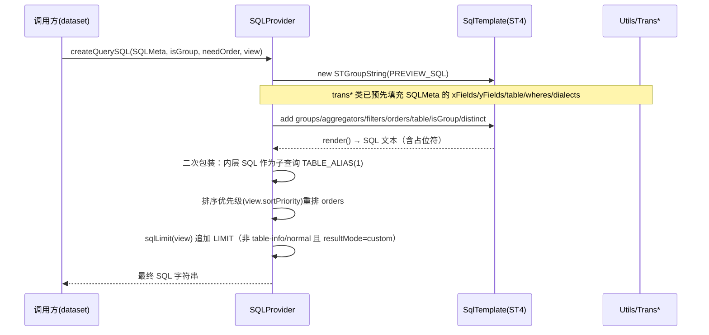

# SQL 引擎（Engine/Calcite）后端分析（v2.10.7）

> 分析范围：`core/core-backend/src/main/java/io/dataease/engine/**`（16 个 .java 文件）
> 源码版本：DataEase v2.10.7
> 结论均给出 文件路径 / 类名 / 方法名；推断以 `[Inference]` 标注，未确认以 `[Need Verification]` 标注。

## 1. 职责与架构位置

`io.dataease.engine` 是 DataEase 的 **SQL 翻译 / 构建层（SQL translation & building）**，负责把 dataset 数据集模型与 chart 图表查询描述（DTO）翻译成 **方言相关（dialect-aware）的 SQL 字符串**。

**重要澄清（与任务背景的差异）：** 本包内 **不含 Apache Calcite 代码**，也 **不负责 SQL 执行**。

- 本包仅使用 `org.stringtemplate.v4`（StringTemplate / ST4）做 SQL 模板渲染（`SQLProvider` + `SqlTemplate`），通过大量字符串拼接构建目标 SQL。
- 真正的 Calcite 集成位于本包之外：
  - 执行引擎：`io.dataease.datasource.provider.CalciteProvider`（通过 `org.apache.calcite` 进行联邦查询/解析）。
  - 占位符回填（计算字段、表占位符）：`io.dataease.dataset.manage.DatasetDataManage`（用方言 + Calcite 替换 `CALC_FIELD_PLACEHOLDER` / `TABLE_PLACEHOLDER`）。
- `[Inference]` 本包输出的 SQL 在 `isCross=true`（跨数据源联邦）时采用 "Calcite 中立" 写法（统一用 Unix 时间戳比较、占位符代替方言函数），交由下游 Calcite 层统一改写执行；在 `isCross=false`（单库直查）时直接生成目标库原生 SQL。

架构位置（自顶向下）：

```
chart / dataset 查询请求
        │  (DTO: ChartViewFieldDTO / DatasetTableFieldDTO / FilterTreeObj / ...)
        ▼
io.dataease.engine  ── SQL 翻译/构建（本包，StringTemplate）
        │  SQLMeta → 渲染 SQL（含占位符）
        ▼
io.dataease.dataset.manage.DatasetDataManage  ── 占位符回填 + 方言转换
        │  最终 SQL
        ▼
io.dataease.datasource.provider.CalciteProvider  ── Calcite 解析/联邦/执行
        │  JDBC
        ▼
各数据源（MySQL / Oracle / ES / ...）+ commons-dbcp2 连接池
```

## 2. 包结构与关键类清单

包路径：`io.dataease.engine`，含 5 个子包：`constant`、`func`、`sql`、`trans`、`utils`。共 **16 个类**。

| 类 / 接口 | 职责 | 关键方法 | 备注 |
|---|---|---|---|
| `constant.ExtFieldConstant` | 扩展字段类型常量 | `EXT_NORMAL=0`/`EXT_COPY=1`/`EXT_CALC=2`/`EXT_GROUP=3` | 仅常量；决定字段如何翻译（普通/复制/计算/分组） |
| `func.FunctionConstant` | 聚合函数名常量 | `AGG_FUNC`（SUM/AVG/MAX/MIN/COUNT/STDDEV…） | 供 `Field2SQLObj` 判断计算字段是否含聚合（置空 originField） |
| `sql.SQLProvider` | 将 `SQLMeta` 渲染为最终 SQL（核心装配器） | `createQuerySQL(...)`、`createQuerySQLAsTmp(...)`、`createQuerySQLWithLimit(...)`、`createQuerySQLNoSort(...)`、`sqlLimit(...)` | 用 ST4 实例化 `previewSql`/`querySql` 模板，组装 groups/aggregators/filters/orders/table |
| `sql.SqlTemplate` | ST4 模板字符串定义 | `PREVIEW_SQL`、`QUERY_SQL` | 定义 SELECT/FROM/WHERE/GROUP BY/ORDER BY 渲染规则，支持 `distinct`、`notUseAs`、`useAliasForGroup` 等开关 |
| `trans.Table2SQLObj` | 构建 FROM 子句（表名/子查询/别名） | `table2sqlobj(...)` | 若 `table` 以 `(` `)` 包裹且非跨库 → 提取内部 SQL 并用 `TABLE_PLACEHOLDER`；否则用 `TABLE_NAME` 模板 |
| `trans.Dimension2SQLObj` | 图表 X 轴（维度）翻译为 SELECT 字段 + 排序 | `dimension2sqlObj(...)`、`getXFields(...)` | 处理 `ExtFieldConstant` 分支、日期格式化（DE_CAST_DATE_FORMAT 等）、`xOrders` |
| `trans.Quota2SQLObj` | 图表 Y 轴（度量）翻译为聚合 SELECT + HAVING + 排序 | `quota2sqlObj(...)`、`getYFields(...)`、`getYWheres(...)` | 含 `AVG`/方差等 CAST+ROUND；`count_distinct`；`bar-range` 特殊处理；`yWheres` 作为外层过滤 |
| `trans.Field2SQLObj` | 数据集字段（预览/枚举值）翻译为 SELECT 字段 | `field2sqlObj(...)`、`getXFields(...)` | 与 Dimension 类似，但计算字段含聚合时 `originField=null`（返回 `'-'`） |
| `trans.Order2SQLObj` | 排序字段（DeSortField）翻译为 ORDER BY | `getOrders(...)`、`buildSortField(...)` | 在 `originFields.size()` 之后追加别名索引，支持计算/分组字段 |
| `trans.CustomWhere2Str` | 图表过滤树（`FilterTreeObj`）翻译为 WHERE | `customWhere2sqlObj(...)`、`transTreeToWhere(...)`、`transTreeItem(...)`、`fixValue(...)` | 支持动态时间（`DynamicTimeSetting`）、递归子树、日期 =/<> 转 BETWEEN |
| `trans.ExtWhere2Str` | 仪表板外部过滤（`ChartExtFilterDTO`）翻译为 WHERE | `extWhere2sqlOjb(...)`、`getValue(...)` | 支持 tree（CONCAT）、SQL Server NVARCHAR/NCHAR 的 `N'...'` 前缀 |
| `trans.WhereTree2Str` | 数据集行级权限树翻译为 WHERE | `transFilterTrees(...)`、`transTreeToWhere(...)`、`transTreeItem(...)` | 多权限树间 `OR`；`exportData` 标记单独 `AND` 拼接；与 CustomWhere 高度相似 |
| `utils.DateUtils` | 推断日期字符串格式 | `get_date_format(...)` | 依次尝试 yyyy-MM-dd HH:mm:ss… 返回匹配 format |
| `utils.SQLUtils` | SQL 关键字转义 + 原始预览 SQL | `transKeyword(...)`、`buildOriginPreviewSql(...)`/`...WithOrderBy(...)` | `transKeyword` 转义 `'` 与 `\`；预览包 `SELECT * FROM (sql) tmp` |
| `utils.Utils` | 计算字段递归解析、分组字段→CASE、过滤词映射、方言、环引用检测 | `calcFieldRegex`/`buildCalcField`/`getCalcField`、`transGroupFieldToSql`、`transFilterTerm`、`transDateFormat`、`isCrossDs`、`replaceSchemaAlias`、`parseDateTimeValue`、`checkCircularReference`/`checkField`、`mergeParam`/`getParams`、`matchFunction`、`isNeedOrder` | 引擎最核心工具类；计算字段 `[id]` 占位递归展开，深度 >100 报环引用 |

> 覆盖核对：16/16 文件均已分析，无遗漏、无无法解析文件。

## 3. 核心流程

### 3.1 查询翻译 / 执行链路（Mermaid）

```mermaid
flowchart TD
    A[Chart/Dataset Query DTO] --> B[Engine: build SQLMeta]
    B --> C[Table2SQLObj.table2sqlobj<br/>构建 FROM / 子查询 + TABLE_PLACEHOLDER]
    B --> D[Dimension2SQLObj / Field2SQLObj<br/>翻译 SELECT 维度/字段]
    B --> E[Quota2SQLObj<br/>翻译聚合度量 + yWheres]
    B --> F[Order2SQLObj<br/>翻译 ORDER BY]
    B --> G[CustomWhere2Str / ExtWhere2Str / WhereTree2Str<br/>翻译 WHERE（图表/仪表板/行权限）]
    C --> H[SQLProvider.createQuerySQL<br/>ST4 渲染 previewSql]
    D --> H
    E --> H
    F --> H
    G --> H
    H --> I[含占位符的 SQL 字符串<br/>CALC_FIELD_PLACEHOLDER / TABLE_PLACEHOLDER]
    I --> J[DatasetDataManage: 方言回填 + Calcite 改写<br/>[Inference: 本包外]]
    J --> K[CalciteProvider 执行<br/>[Inference: 本包外]]
    K --> L[(各数据源 JDBC / commons-dbcp2)]
    L --> M[ResultSet 返回]
```

### 3.2 SQL 渲染内部流程（ST4）



### 3.3 计算字段（Calc Field）解析流程

```mermaid
flowchart TD
    A[字段 ExtField=CALC] --> B[Utils.calcFieldRegex]
    B --> C[buildCalcField 递归]
    C --> D[正则提取 [fieldId]]
    D --> E{引用普通字段?}
    E -->|是| F[替换为 别名.字段名（方言前缀/后缀）]
    E -->|否 计算字段| G[替换为 (originName) 并递归 buildCalcField]
    C --> H[参数 paramMap 替换 [paramId]]
    H --> I[返回 SQL 表达式]
    I --> J[放入 fieldsDialect 以 CALC_FIELD_PLACEHOLDER(id) 占位]
    J --> K[isCross? 直接内联表达式 : 保留占位符待 Calcite 回填]
```

## 4. 依赖与调用关系

### 4.1 与 dataset 的协作
- **输入模型（DTO）**：`io.dataease.extensions.datasource.dto.DatasetTableFieldDTO`（数据集字段）、`io.dataease.api.permissions.dataset.dto.DataSetRowPermissionsTreeDTO`（行权限树）、`io.dataease.api.chart.dto.DeSortField`（排序）。
- **图表模型**：`io.dataease.extensions.view.dto.ChartViewFieldDTO`、`ChartViewDTO`、`ChartExtFilterDTO`、`SortAxis`。
- **协作点**：`dataset/manage/DatasetDataManage` 调用本包 trans 类装配 `SQLMeta`，并在渲染后做占位符回填与方言翻译（见 §1）。`dataset/utils/SqlUtils`、`TableUtils` 也使用 Calcite（`org.apache.calcite`）。

### 4.2 与 datasource 的协作
- **模型/常量**：`io.dataease.extensions.datasource.model.{SQLMeta,SQLObj}`（本包渲染的核心载体）、`io.dataease.constant.SQLConstants`（字段名/表名/日期函数等模板常量）、`io.dataease.extensions.datasource.vo.DatasourceConfiguration`（含 `DatasourceType` 枚举，如 `sqlServer`/`oracle`/`es`）。
- **插件 API**：`io.dataease.extensions.datasource.api.PluginManageApi`（经 `Utils.getDs` 查询数据源方言前缀/后缀/目录，含 xpack 扩展数据源）。
- **执行**：实际 JDBC 执行由 `io.dataease.datasource.provider.CalciteProvider` 完成（本包外）。

### 4.3 与 Calcite 的关系
- 本包 **不直接依赖 Calcite**（已 grep 确认：无 `import org.apache.calcite`）。
- `[Inference]` Calcite 在链路的下游：本包产出的 "中立 SQL + 占位符" 由 Calcite 解析、做跨库联邦（跨数据源 JOIN/UNION）并生成可执行计划。`isCross` 标志即对应 "是否走 Calcite 联邦路径"。

### 4.4 commons-dbcp2
- 本包内 **未直接使用** commons-dbcp2（无相关 import）。
- `[Inference]` 连接池由 `CalciteProvider`/datasource 模块在 JDBC 执行阶段使用，不属于本 engine 包职责，但属于 "engine 系统" 的执行侧依赖。

### 4.5 其他依赖
- `org.stringtemplate.v4`（ST4）：唯一 SQL 渲染引擎。
- `org.apache.commons.lang3`、`org.apache.commons.collections4`、`org.springframework.util.CollectionUtils`：工具。
- `io.dataease.exception.DEException` / `io.dataease.i18n.Translator`：异常与国际化。

## 5. 事务 / 缓存 / 异常 / 安全考量

### 5.1 SQL 注入防护
- 本包 **全部采用字符串拼接**（非 PreparedStatement 参数化）。过滤值经 `SQLConstants.WHERE_VALUE_VALUE`（`"%s"`）等直接 format 进 SQL（见 `CustomWhere2Str.transTreeItem`、`Quota2SQLObj.getYWheres`、`ExtWhere2Str`）。
- 唯一的转义入口是 `SQLUtils.transKeyword`（转义 `'`→`''`、`\`→`\\`、`\n`→`\n`），但 **在 trans 包中未见调用** `[Need Verification：该转义是否在 dataset 上游或 Calcite 解析阶段统一应用]`。
- 计算字段参数替换（`Utils.buildCalcField` 中 `paramMap` 的 `[key]→value`）同样 **无转义**，计算字段表达式由数据集设计者录入。
- Elasticsearch（`es`）作为特殊分支：`originName` 直接用 `field.getOriginName()` 而非 `dataeaseName`，避免别名化。
- `[Inference]` 由于过滤值多来自前端图表/仪表板组件且经上游 dataset 层校验，直查路径的注入风险依赖上游校验完整性；联邦（Calcite）路径经解析器，可拦截语法非法输入。

### 5.2 联邦查询（跨数据源）安全
- `isCross` 由 `Utils.isCrossDs(dsMap)` 判定（`dsMap.size() != 1`）。
- 跨库时统一用 Unix 时间戳做日期比较、计算/分组字段直接内联表达式（不保留占位符），以保证 Calcite 可解析。
- `Utils.replaceSchemaAlias` 在 schema 未配置时剥离 `schemaAlias.` 前缀（`KEYWORD_PREFIX_REGEX`），避免联邦时 schema 名错误解析。
- `[Need Verification]` 联邦查询下不同数据源权限模型的统一与数据越权风险，需结合 `CalciteProvider`/行权限（`WhereTree2Str`）进一步确认。

### 5.3 异常
- `DEException.throwException(...)` 抛出业务异常：
  - 计算字段循环引用：`i18n_field_circular_ref` / `i18n_field_circular_error`（`Utils.buildCalcField` 深度 >100、`checkCircularReference`/`checkField`）。
  - 字段/数据源不存在：`Utils.transGroupFieldToSql` 中 `Field not exists` / `Datasource not exists`。
- 无 try/catch 包裹渲染过程，异常向上抛至 dataset 调用方处理。

### 5.4 事务
- 本包 **无事务语义**（纯 SQL 构建，无 `@Transactional`、无 Connection 管理）。事务由下游执行层（CalciteProvider/dataset 服务）控制。

### 5.5 缓存
- 本包 **无缓存**。`SQLMeta`/`SQLObj` 为每次请求新建的临时对象；查询结果与数据集元数据缓存位于 dataset/datasource 层（本包外）。

### 5.6 性能考量
- 计算字段解析为 **递归字符串替换**，深度上限 100（`Utils.buildCalcField`），复杂计算字段有重复扫描 `originFields`（`O(n²)` 级）`[Inference：大规模计算字段可能带来构建开销]`。
- `DateUtils.get_date_format` / `Utils.parseDateTimeValue` 用多次 `SimpleDateFormat.parse` 试错，存在重复异常开销（典型 date-parse 模式）。
- `dsMap.entrySet().iterator().next()` 在多处被用于取 "首个数据源类型"，**假设单数据源或所有字段同库**；联邦（多库）时该取值方式在语义上存疑 `[Need Verification]`。

## 6. 风险与待确认（[Need Verification]）

1. **Calcite 实际集成位置**：本包不含 Calcite；联邦改写/执行细节需读 `io.dataease.datasource.provider.CalciteProvider`（本包外）。
2. **`transKeyword` 未在本包调用**：过滤值转义是否在上游 dataset 层或 Calcite 解析阶段统一完成，需确认。
3. **`dsMap` 多数据源取值**：trans 类普遍用 `dsMap.entrySet().iterator().next()` 取数据源类型，联邦（多库异构）场景下对混合类型字段的处理正确性待验证（如 Oracle + MySQL 混用日期函数）。
4. **占位符回填时机**：`CALC_FIELD_PLACEHOLDER`/`TABLE_PLACEHOLDER` 在 `DatasetDataManage` 的替换逻辑与方言表需核对，确认 `isCross=false` 路径下占位符一定被替换（否则生成非法 SQL）。
5. **Elasticsearch 分支覆盖**：仅 `es` 走 `originName` 分支，其他非关系型数据源（如 API/Excel 抽取）在 engine 层如何处理需结合 datasource 扩展确认。
6. **SQL 注入面**：直查（非联邦）路径下过滤值未参数化，需确认上游 `dataset` 对所有用户可控 value（尤其 `DynamicTimeSetting.arbitraryTime`、自定义参数 `CalParam`）做了严格白名单/转义。
7. **`createQuerySQL(SQLMeta, isGroup, needOrder, view)` 中的疑似冗余**：第 106-107 行 `ST st = stg.getInstanceOf("previewSql"); st_sql.add("isGroup", isGroup);` 复用 `st_sql` 而非 `st`，但随后对 `st` 操作 —— 属潜在代码异味，建议结合运行验证渲染结果是否符合预期。

## 7. 相关文档

- `dataset.md`（数据集模型、行权限树、SQL 回填协作）
- `datasource.md`（数据源方言、PluginManageApi、CalciteProvider 执行）
- `../architecture/tech-stack.md`（Calcite 1.35.18、commons-dbcp2、ST4 技术栈定位）
