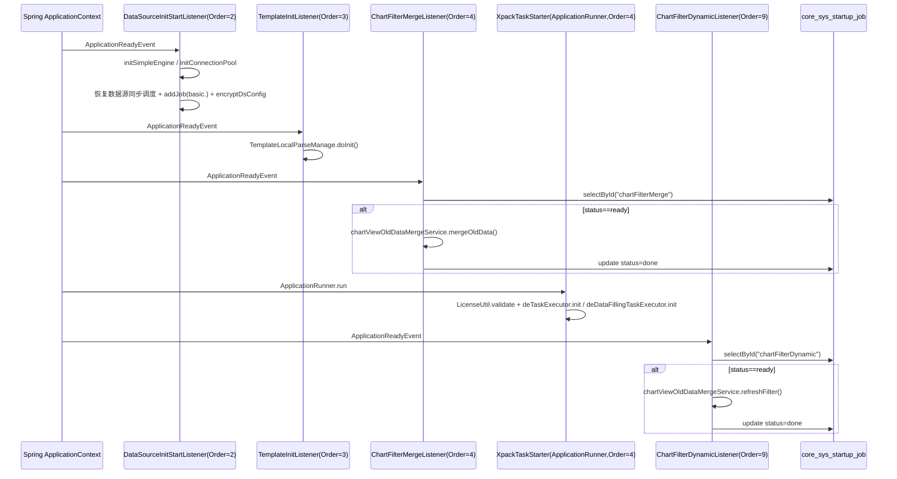
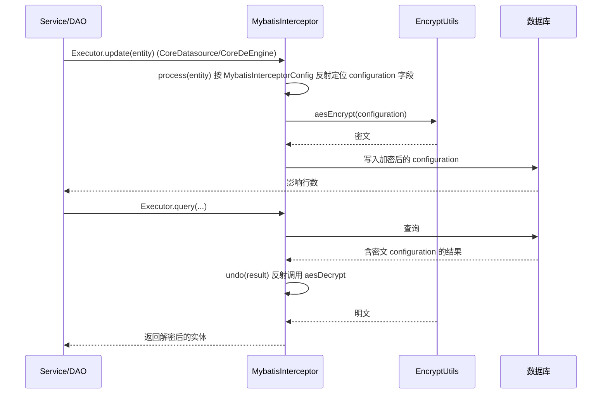

# 基础架构与配置 后端分析（v2.10.7）

> 适用范围：仅覆盖以下 7 个目录下的全部 `.java`（共 **38** 个文件）：
> `io.dataease.commons`、`io.dataease.config`、`io.dataease.startup`、
> `io.dataease.listener`、`io.dataease.interceptor`、`io.dataease.system`、`io.dataease.menu`。
> 所有结论均可回溯到源码（已标注 文件路径 / 类名 / 方法名）。跨包调用到的外部类（如 `io.dataease.datasource.*`、`io.dataease.visualization.*`、`io.dataease.api.*`）不在本篇范围，仅作为依赖点提及。

## 1. 职责与架构位置

本篇涵盖的是 DataEase 后端（`core/core-backend`）的**基础设施层（Foundation）**，处于整个应用的最底层，为上层业务模块（数据源、图表、可视化、权限、模板等）提供：

- **通用工具与常量**（`commons`）：加密、SQL 变量解析、定时任务 cron、树排序、Excel 水印、URL 探测等。
- **框架级配置**（`config`）：事务管理、MyBatis 拦截器装配、静态资源映射、线程池 Bean、MVC 拦截器注册。
- **启动编排**（`startup` + `listener`）：以 `ApplicationReadyEvent` / `ApplicationRunner` / `ApplicationContextInitializer` 三种生命周期钩子，在应用启动就绪后执行一次性初始化（数据源同步任务恢复、模板解析、图表历史数据合并、xpack 任务注册、Ehcache 路径注入）。
- **MyBatis 拦截器**（`interceptor`）：在 DAO 层对敏感字段做**落库前加密 / 读取后解密**（AES），透明地保护数据源与引擎配置。
- **系统参数与菜单**（`system` + `menu`）：系统设置（含在线地图、分享开关）与前端菜单树的读写为代表的小型领域服务，并大量通过 `@XpackInteract` 暴露**社区版/商业版（xpack）扩展点**。

架构位置（自底向上）：

```
[业务模块: datasource / chart / visualization / permissions ...]
            │ 调用
[system / menu 领域服务]  ←──  [commons 工具]  ←──  [config 配置 / listener 启动]
            │                              │
            └── MyBatis Mapper ───────────┘
                        │
                [MybatisInterceptor] (落库加密/读取解密)
                        │
                   [core_sys_setting / core_menu / core_sys_startup_job ...]
```

> 备注：社区版中大量 `@XpackInteract` 方法提供了“默认（开放）实现”，商业 `xpack` 模块通过 `replace=true` 覆盖。这与权限模型直接相关（见 `../architecture/security-model.md`）。

## 2. 包结构与关键类清单

### 2.1 `io.dataease.commons.constants`（常量 / 枚举，3 文件）

| 类 / 接口 | 职责 | 关键方法 / 成员 | 备注 |
|---|---|---|---|
| `DataVisualizationConstants` | 数据可视化相关字符串常量容器 | 内部类 `QUERY_SOURCE`、`NEW_PANEL_FROM`、`DELETE_FLAG`、`NODE_TYPE`、`RESOURCE_OPT_TYPE`、`TEMPLATE_SOURCE` | 纯常量，无逻辑；被 visualization 模块引用 |
| `OptConstants` | 操作审计 / 资源类型枚举常量 | `OPT_TYPE`（NEW=1/UPDATE=2/DELETE=3）、`OPT_RESOURCE_TYPE`（VISUALIZATION/DASHBOARD/.../TEMPLATE） | int 型编码，供操作日志使用 |
| `TaskStatus` | 任务状态枚举 | `WaitingForExecution/Stopped/Suspend/UnderExecution/Completed/Error/Warning` | `enum`，被调度/任务模块引用 |

### 2.2 `io.dataease.commons.utils`（工具类，8 文件）

| 类 / 接口 | 职责 | 关键方法 | 备注 |
|---|---|---|---|
| `CodingUtil` | 基础编解码与加密：MD5 / Base64 / AES(CBC+PKCS5Padding) / UUID | `md5`、`base64Encoding/Decoding`、`aesEncrypt/aesDecrypt`、`secretKey`、`shortUuid`、`string2Integer`、`isNumeric` | AES 密钥/IV 由调用方传入；`aesDecrypt` 解密失败时回退返回原文（便于兼容非加密值） |
| `EncryptUtils` ⚠️ | `CodingUtil` 子类，**硬编码密钥的 AES 工具**，专用于数据源/引擎配置加解密 | `aesEncrypt(Object)`、`aesDecrypt(Object)`、`aesDecrypt(List<T>, attrName)`、`md5Encrypt(Object)` | **硬编码 `secretKey="www.fit2cloud.co"`、 `iv="1234567890123456"`**（AES-128）；被 `MybatisInterceptorConfig` 默认引用 → 见 §5/§6 |
| `CoreTreeUtils` | 可视化节点树排序（中文 `Collator`） | `customSortBO(List<VisualizationNodeBO>, sortType)` | 依赖外部 `io.dataease.visualization.dto.VisualizationNodeBO` 与 `io.dataease.constant.SortConstants` |
| `CronUtils` | Quartz cron 表达式工具 | `getCronTrigger`、`getNextTriggerTime`、`tempCron`、`cron(rateType,rateVal)`、`taskExpire(endTime)` | 生成/校验 cron；`getDayOfWeek` 做 1-7 转换 |
| `ExcelWatermarkUtils` | 基于 POI 的 Excel 水印（文字转 PNG，平铺到 Sheet） | `transContent`、`addWatermarkImage`、`addWatermarkToSheet`、`addWater`、`createTextImage` | 依赖 `UserFormVO`、`WatermarkContentDTO`、`IPUtils`；水印含用户名/IP/时间，属数据防泄漏手段 |
| `MybatisInterceptorConfig` | MyBatis 字段加解密拦截的**配置 POJO** | 字段 `modelName/attrName/attrNameForList/interceptorClass/interceptorMethod/undoClass/undoMethod`；构造器默认指向 `EncryptUtils.aesEncrypt`/`aesDecrypt` | 被 `config/MybatisConfig` 使用 |
| `SqlparserUtils` | 复杂 SQL 解析与**变量/系统参数替换**（`${var}` 与 `$f2cde[id]`），供数据集 SQL 拼装 | `handleVariableDefaultValue(...)`、`removeVariables`、`handlePlainSelect`、`handleWhere/handleJoins/handleHaving`、`transFilter`、`handleSubstitutedSql` | 仅含 `public` 方法约 780 行；内部 `getDependencies`/`getSqlShuttle`（Calcite 路径）**未被本类调用**，疑似遗留死代码 → 见 §6 |
| `UrlTestUtils` | URL 连通性探测 | `testUrlWithTimeOut(url,ms)`、`isURLAvailable(url)`（HTTP HEAD） | 简单工具，无状态 |

### 2.3 `io.dataease.config`（框架配置，3 文件）

| 类 / 接口 | 职责 | 关键方法 / 注解 | 备注 |
|---|---|---|---|
| `CommonConfig` | 声明通用线程池 Bean | `@Bean resourcePoolThreadPool()` → `CommonThreadPool`（core=50, queue=100, keepAlive=3600s）；`@AutoConfigureBefore(QuartzAutoConfiguration.class)` | 保证 Quartz 自动配置前线程池就绪 |
| `DeMvcConfig` (`implements WebMvcConfigurer`) | 静态资源映射 + 注册 `LinkInterceptor` | `addResourceHandlers`（upload/map/geo/i18n 目录映射）、`addInterceptors(linkInterceptor)` 拦截 `/**` | 依赖外部 `io.dataease.share.interceptor.LinkInterceptor`、`StaticResourceConstants` |
| `MybatisConfig` | 装配 `MybatisInterceptor` 并声明加密目标字段；开启注解事务 | `@EnableTransactionManagement`；`@Bean dbInterceptor()` 注册 `CoreDeEngine.configuration`、`CoreDatasource.configuration` 两个 `MybatisInterceptorConfig` | **数据源与引擎的 `configuration` 字段在落库时 AES 加密、读取时解密** |

### 2.4 `io.dataease.startup`（启动任务记录，2 文件）

| 类 / 接口 | 职责 | 关键方法 | 备注 |
|---|---|---|---|
| `CoreSysStartupJob` | 实体，映射表 `core_sys_startup_job` | 字段 `id/name/status`（`status` 取 `ready`/`done`） | 用于“一次性启动任务”幂等控制 |
| `CoreSysStartupJobMapper` (`extends BaseMapper`) | Mapper 接口 | — | 由 `listener` 包查询/更新启动任务状态 |

### 2.5 `io.dataease.listener`（启动监听器，6 文件）

| 类 / 接口 | 职责 | 关键方法 / 事件 | 备注 |
|---|---|---|---|
| `DataSourceInitStartListener` (`@Component @Order(2)`) | 应用就绪后初始化数据源体系 | `onApplicationEvent(ApplicationReadyEvent)`：`engineManage.initSimpleEngine()`、`calciteProvider.initConnectionPool()`、恢复 `CoreDatasourceTask` 同步调度、`sysParameterManage.groupList("basic.")`→`datasourceServer.addJob`、`dataSourceManage.encryptDsConfig()` | 依赖大量外部 manage/server；**对各步 try-catch 仅 printStackTrace，不阻断启动** |
| `TemplateInitListener` (`@Component @Order(3)`) | 启动时从代码初始化模板 | `onApplicationEvent` → `templateLocalParseManage.doInit()` | 异常仅记录日志 |
| `ChartFilterMergeListener` (`@Component @Order(4)`) | 一次性合并旧图表过滤数据 | `JOB_ID="chartFilterMerge"`；查 `CoreSysStartupJob`，`status=="ready"` 时 `chartViewOldDataMergeService.mergeOldData()` 并置 `done` | 幂等：依赖 `CoreSysStartupJob` 状态 |
| `XpackTaskStarter` (`@Component @Order(4)`, `ApplicationRunner`) | 注册 xpack 定时/填报任务 | `run(ApplicationArguments)`：`LicenseUtil.validate()` 后 `deTaskExecutor.init()`、`deDataFillingTaskExecutor.init()` | 与上面 `Order(4)` 是不同事件类型（ApplicationRunner vs ApplicationReadyEvent） |
| `ChartFilterDynamicListener` (`@Component @Order(9)`) | 一次性刷新动态图表过滤 | `JOB_ID="chartFilterDynamic"`；`status=="ready"` 时 `chartViewOldDataMergeService.refreshFilter()` 并置 `done` | 同 `ChartFilterMergeListener` 模式 |
| `EhCacheStartListener` (`implements ApplicationContextInitializer`) | 容器初始化早期注入 Ehcache 相关系统属性 | `initialize`：读 `application.yml` 的 `dataease.login_timeout`（默认 480）与 `ConfigUtils.getConfig("dataease.path.ehcache","/opt/dataease2.0/cache")`，写入 `System.setProperty` | 早于 Spring Bean 初始化；决定登录超时与缓存目录 |

### 2.6 `io.dataease.interceptor`（MyBatis 拦截器，1 文件）

| 类 / 接口 | 职责 | 关键方法 | 备注 |
|---|---|---|---|
| `MybatisInterceptor` (`implements Interceptor`) | 拦截 `Executor.update` / `query`，对配置字段**透明加/解密** | `@Intercepts` 拦截 update+两类 query；`intercept` → `process`(加密)/`undo`(解密)；`getConfig`、`plugin` | 通过反射调用 `EncryptUtils`（或配置类）的 encrypt/decrypt；结果缓存于 `ConcurrentHashMap` |

### 2.7 `io.dataease.system`（系统参数领域，10 文件）

| 类 / 接口 | 职责 | 关键方法 | 备注 |
|---|---|---|---|
| `SysParameterBO` | 系统参数 BO（`key/val/type/sort`） | — | 简单 DTO |
| `CoreSysSetting` | 实体，表 `core_sys_setting`（`id/pkey/pval/type/sort`） | getter/setter | 系统设置主表 |
| `CoreTypeface` | 实体，表 `core_typeface`（`id/name/fileName/fileTransName/isDefault`） | getter/setter | 字体管理表 |
| `CoreSysSettingMapper` (`extends BaseMapper`) | Mapper | — | |
| `CoreTypefaceMapper` (`extends BaseMapper`) | Mapper | — | |
| `ExtCoreSysSettingMapper` (`@Component("extCoreSysSettingMapper") extends ServiceImpl`) | 基于 `ServiceImpl` 的扩展 Mapper（批量 `saveBatch`） | 继承 `saveBatch` | 以 `@Component` 暴露为 Spring Bean（非 `@Mapper`） |
| `CorePermissionManage` (`@Component`) | **权限校验扩展点** | `@XpackInteract("corePermissionManage", replace=true) checkAuth(BusiPerCheckDTO)→true` | **社区版默认放行（return true）** → 见 §6、`security-model.md` |
| `CoreUserManage` (`@Component`) | **用户名解析扩展点** | `@XpackInteract("coreUserManage", replace=true) getUserName(uid)→"管理员"` | 社区版默认返回“管理员” |
| `SysParameterManage` (`@Component`) | 系统设置读写、在线地图编辑、分享开关、xpack UI 列表 | `singleVal`、`groupVal/groupList`、`saveOnlineMap/queryOnlineMap`、`saveGroup @Transactional`、`saveBasic @Transactional`、`convert/getUiList/defaultLogin`（均 `@XpackInteract("perSetting")`）、`shareBase` | 注入 `CoreSysSettingMapper`、`ExtCoreSysSettingMapper`、`DatasourceServer`；`saveGroup` 先删后插（`delete`+`saveBatch`）并触发 `datasourceServer.addJob` |
| `SysParameterServer` (`@RestController @RequestMapping("/sysParameter")`) | 系统参数 REST 入口，实现 `SysParameterApi` | `singleVal/saveOnlineMap/queryBasicSetting/saveBasicSetting/RequestTimeOut/defaultSettings/ui/defaultLogin/shareBase/i18nOptions` | `@Override` 委托 `SysParameterManage`；`i18nOptions` 扫描 `I18N_DIR` 下 `custom_*` 文件 |

### 2.8 `io.dataease.menu`（菜单领域，5 文件）

| 类 / 接口 | 职责 | 关键方法 | 备注 |
|---|---|---|---|
| `MenuTreeNode` (`extends CoreMenu`) | 菜单树节点 BO，含 `List<MenuTreeNode> children` | — | 树构建用 |
| `CoreMenu` | 实体，表 `core_menu`（`id/pid/type/name/component/menuSort/icon/path/hidden/inLayout/auth`） | getter/setter | `id` 为 `AUTO` 自增 |
| `CoreMenuMapper` (`extends BaseMapper`) | Mapper | — | |
| `MenuManage` (`@Component`) | 菜单查询与树构建、xpack 菜单判定 | `query(List<CoreMenu>)`（构建 PO 树并转 `MenuVO`）、`coreMenus()`、`buildPOTree`、`convertTree`、`convert`、`isXpackMenu(CoreMenu)`（**硬编码菜单 id 集合**） | `isXpackMenu` 依赖种子数据 id（7/14/17/18/21/25/26/27/28/35/40/50/60/61/65/80/90/70 子树等）→ 见 §6 |
| `MenuServer` (`@RestController @RequestMapping("/menu")`) | 菜单 REST 入口，实现 `MenuApi` | `@I18n @Override query()` → `menuManage.coreMenus()` + `menuManage.query(...)` | 经 `@I18n` 做国际化 |

## 3. 核心流程

### 3.1 应用启动就绪后的初始化编排（listener，按 @Order）



> 注：`EhCacheStartListener` 是 `ApplicationContextInitializer`，在 Bean 初始化之前执行（不属于上述事件序列）。

### 3.2 MyBatis 字段加解密流程（落库加密 / 读取解密）



> 拦截目标由 `MybatisConfig.dbInterceptor()` 注册：`CoreDeEngine.configuration`、`CoreDatasource.configuration`（见 §2.3）。`MybatisInterceptorConfig` 默认构造器将 `interceptorClass/Method` 指向 `EncryptUtils.aesEncrypt`、undo 指向 `EncryptUtils.aesDecrypt`。

## 4. 依赖与调用关系

- **向上依赖（本篇被谁用）**
  - `commons.utils`：`CodingUtil/EncryptUtils` 被 `MybatisInterceptor` 与大量业务模块引用；`SqlparserUtils` 被数据集/图表 SQL 拼装使用；`CronUtils` 被定时任务模块使用；`ExcelWatermarkUtils` 被导出模块使用。
  - `system` / `menu`：`SysParameterServer`、`MenuServer` 是 REST 端点，被前端调用；`SysParameterManage`、`MenuManage` 被各自 Server 及部分业务模块（如 `DataSourceInitStartListener`→`sysParameterManage.groupList("basic.")`）调用。
  - `listener`：由 Spring 容器在启动生命周期自动触发，反向调用 `datasource`、`chart`、`template`、`job` 等外部模块的服务。
- **向下依赖（本篇依赖谁）**
  - `config/MybatisConfig` → `commons.utils.MybatisInterceptorConfig` + `interceptor.MybatisInterceptor` + 外部实体 `CoreDeEngine`/`CoreDatasource`。
  - `system`/`menu` 依赖 `io.dataease.api.*`（API 接口与 VO）、`io.dataease.license.config.XpackInteract`（扩展点注解）、`io.dataease.utils.*`。
  - `listener` 依赖多个外部 `manage`/`server`（datasource、chart、template、job）。
- **扩展点（@XpackInteract）**：`CorePermissionManage.checkAuth`、`CoreUserManage.getUserName`、`SysParameterManage.convert/getUiList/defaultLogin`、`MenuManage.query` 均带 `@XpackInteract` 注解，商业 `xpack` 模块可按 `value` 名 `replace=true` 覆盖默认实现——这是社区版“开放/默认”行为的关键来源。

## 5. 事务 / 缓存 / 异常 / 安全考量

### 5.1 事务
- `MybatisConfig` 类级 `@EnableTransactionManagement`，开启 Spring 注解事务。
- `SysParameterManage.saveGroup` 与 `saveBasic` 标注 `@Transactional`；`saveBasic` 通过 `proxy()`（`CommonBeanFactory.getBean(SysParameterManage.class)`）自注入代理，确保 `@Transactional` 在同类内部调用生效。`saveGroup` 采用“先 `delete` 再 `saveBatch`”的整组替换策略（围绕 `groupKey` like-right 匹配）。

### 5.2 缓存
- 本范围内**未直接定义 Ehcache 配置文件**（Ehcache XML 通常位于 `resources`，超出 `.java` 范围）。`EhCacheStartListener.initialize` 在 `ApplicationContextInitializer` 阶段把 `dataease.login_timeout`（默认 480 分钟）与 `dataease.path.ehcache`（默认 `/opt/dataease2.0/cache`）写入 `System.setProperty`，供 Ehcache 解析缓存目录与登录会话超时。[Inference] 缓存的实际生命周期/淘汰策略由资源目录下的 `ehcache.xml` 决定，需结合非 Java 资源配置确认。
- `MybatisInterceptor` 内部用 `ConcurrentHashMap`（classMap / interceptorConfigMap）缓存“类名→拦截配置”映射，避免每次执行反射查找，属进程内缓存（非分布式）。

### 5.3 异常
- `SqlparserUtils.handleVariableDefaultValue`：SQL 为空时 `DEException.throwException(...)`；解析异常包装为 `DEException`。
- `listener` 各 `onApplicationEvent`/`run`：对外步调用多包 `try{...}catch(Exception e){ e.printStackTrace(); }`，**异常被吞掉不向上抛出**，保证启动尽量不被单步失败阻断（代价是静默失败、仅打印栈）。
- `CodingUtil`：`md5`/`base64`/`aes` 失败时抛 `RuntimeException`；`aesDecrypt` 对 `BadPaddingException/IllegalBlockSizeException` 回退返回原文（兼容明文值）。
- 全局异常处理不在本范围内（应位于其他 backend 模块/公共异常包）。

### 5.4 安全
- **敏感字段落库加密（重点）**：`MybatisInterceptor` + `EncryptUtils` 对 `CoreDatasource.configuration`、`CoreDeEngine.configuration` 做 AES-128(CBC/PKCS5Padding) 加解密，密钥 `secretKey="www.fit2cloud.co"`、`iv="1234567890123456"` 在 `EncryptUtils` 中**硬编码**。属“静态密钥”实现，仅提供存储层混淆，密钥随源码公开 → 见 §6 风险。
- **权限校验扩展点默认放行**：`CorePermissionManage.checkAuth(...)` 社区版默认 `return true`，`CoreUserManage.getUserName` 默认返回“管理员”。这意味着未接入 `xpack` 时权限检查与用户名为占位实现；真实鉴权/用户体系由权限模块与 `xpack` 覆盖（详见 `../architecture/security-model.md`）。
- **Excel 水印（DLP）**：`ExcelWatermarkUtils` 将用户名/IP/时间写入导出文件水印，是数据防泄漏手段。
- **分享开关**：`SysParameterManage.shareBase()` 读取 `basic.shareDisable` / `basic.sharePeRequire`，控制分享是否禁用/是否需密码，属前端分享安全开关。
- **SQL 注入面**：`SqlparserUtils` 对 `${var}` 与 `$f2cde[id]` 做变量替换并生成 `SubstitutedSql` 占位（`'DE-BI' = 'DE-BI'`）以剥离不可信片段，但最终 SQL 仍由解析/拼装产生，其安全性依赖调用方对变量值（`SqlVariableDetails`）的校验——具体防护强度需结合数据集执行链路确认。

## 6. 风险与待确认 ([Need Verification])

1. **[Need Verification] 加密目标是否仅 2 个**：`MybatisConfig` 仅注册 `CoreDeEngine.configuration` 与 `CoreDatasource.configuration`。`MybatisInterceptor.setInterceptorConfigList` 为 `public`，其它模块（尤其 `xpack`）是否另行追加拦截配置未在本范围内可见，需确认完整加密字段集合。
2. **[Need Verification] 硬编码 AES 密钥**：`EncryptUtils` 的 `secretKey`/`iv` 写死在源码中（AES-128）。需确认是否在生产通过外部配置/环境变量覆盖；若无，属存储加密强度风险（密钥可随源码获取）。建议核查部署配置与密钥轮换机制。
3. **[Need Verification] 菜单 id 硬编码映射**：`MenuManage.isXpackMenu` 直接硬编码菜单 `id` 集合（7/14/17/18/21/25/26/27/28/35/40/50/60/61/65/80/90/70 子树等），强依赖种子数据。版本升级若调整 `core_menu` 种子 id，会导致 xpack 菜单判定错乱。
4. **[Inference] 疑似死代码**：`SqlparserUtils.getDependencies` / `getSqlShuttle`（基于 Calcite `SqlShuttle`）在本类内未被任何方法调用，疑为历史遗留；建议确认是否仍有外部用途，否则可清理。
5. **[Need Verification] Ehcache 配置细节**：`EhCacheStartListener` 仅注入路径与登录超时系统属性；实际 `ehcache.xml`（容量、TTL、集群）未在 `.java` 范围，需结合 `resources` 下配置文件确认缓存策略与安全（如会话缓存是否含敏感信息）。
6. **[Need Verification] `@XpackInteract` 覆盖完整性**：社区版默认实现语义（如 `defaultLogin()→0`、`getUiList` 仅含 community/demoTips）在接入 `xpack` 后行为变化；需结合 `security-model.md` 确认二者切换边界与兼容性。
7. **[Inference] 启动监听器异常吞没**：多个 `listener` 用 `printStackTrace` 静默吞异常，可能掩盖初始化失败（如数据源 Engine 初始化失败仅打印栈），运维可观测性较弱。

## 7. 相关文档

- 整体架构：`../architecture/overview.md`
- 安全与权限模型：`../architecture/security-model.md`（与本篇 `CorePermissionManage`/`CoreUserManage`/`@XpackInteract` 强相关）
- 技术栈：`../architecture/tech-stack.md`
- 部署与构建：`../architecture/build-deploy.md`
- 目录结构：`../architecture/directory-structure.md`
- 同层（backend）其它分析文档：本目录（`docs/backend/`）下后续将补充的各业务模块分析（datasource / chart / visualization / permissions / job 等），本文档作为基础/通用层与之通过包依赖关联。
