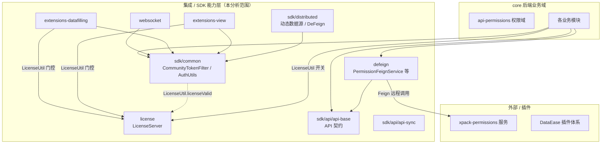
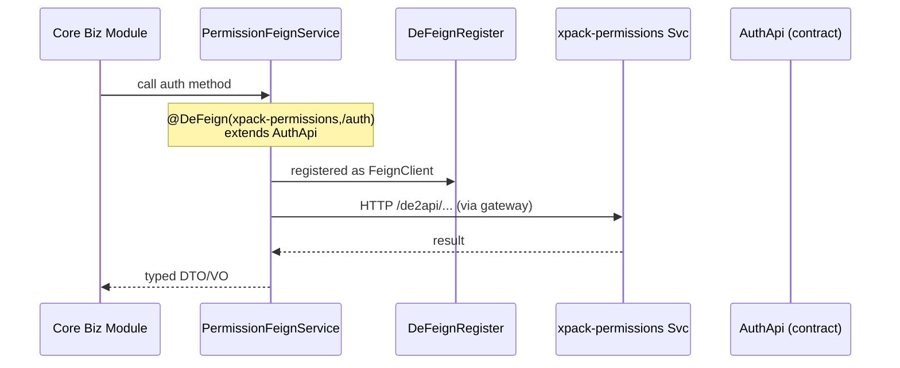
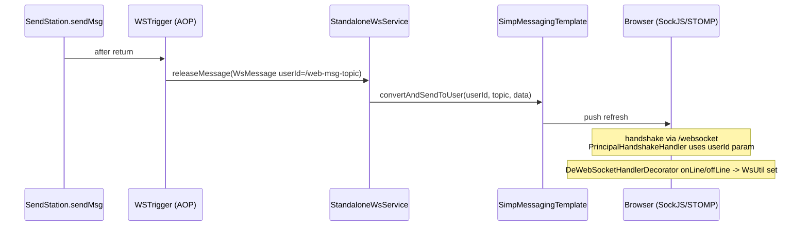
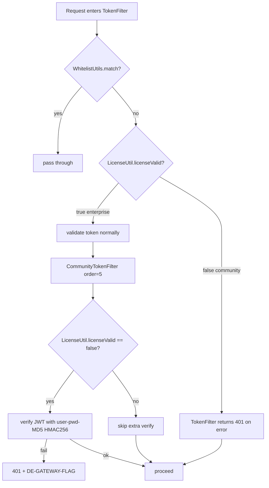
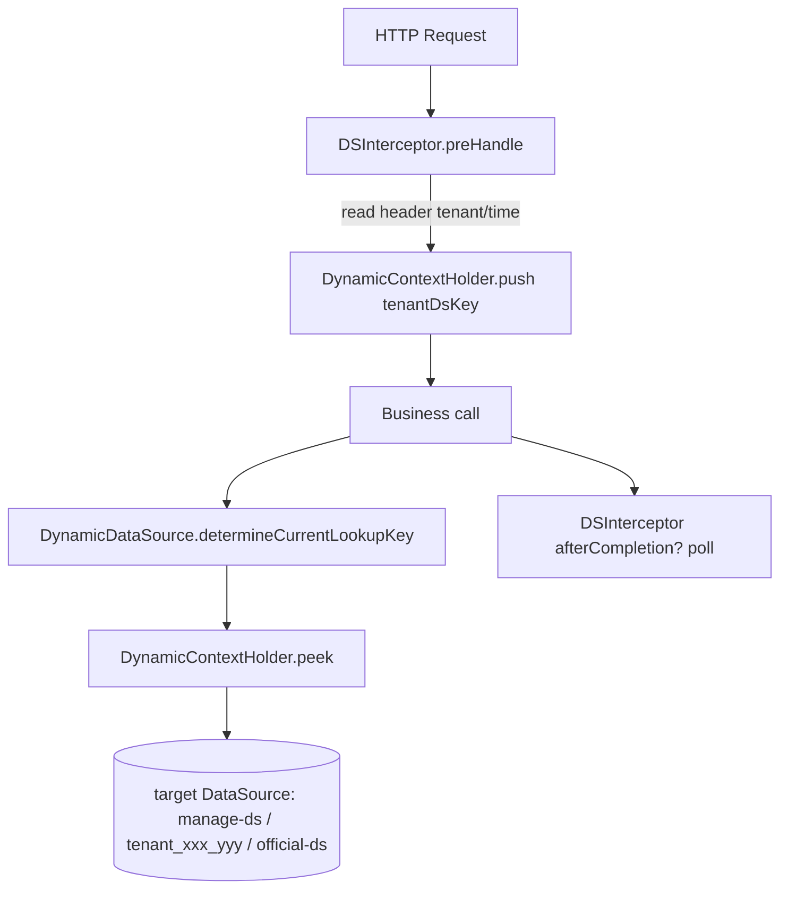

# 集成与 SDK 能力层 后端分析（v2.10.7）

> 分析范围：defeign、websocket、license（core）、sdk/distributed、sdk/api/api-base、sdk/api/api-sync、sdk/common、sdk/extensions/datafilling、sdk/extensions/view。
> 源码根：`/Users/white/workspace/code/references/dataease`。所有结论均标注 文件路径 / 类名 / 方法。
> 标注说明：`[Inference]` 为推断；`[Need Verification]` 为源中无法确认、需结合运行态或其他模块确认。

---

## 1. 职责与架构位置

本层是 DataEase 的 **集成 / SDK 能力层**，处于「core 后端业务域」与「外部 / 插件 / 多租户基础设施」之间，承担四类职责：

1. **远程调用定义（Feign 契约与注册）**
   - `defeign` 包在 core 后端中声明对 `xpack-permissions` 服务的 Feign 客户端接口（`PermissionFeignService` / `InteractiveAuthFeignService` / `UserFeignService`），实现「定义与实现分离」。
   - `sdk/distributed` 的 `DeFeign` 注解 + `DeFeignRegister` 是一套 **自定义 Feign 注册器**（非 Spring 原生 `@FeignClient`），为全系统 Feign 客户端提供统一注册能力。
   - `sdk/api/api-base` 与 `sdk/api/api-sync` 是 **API 契约（DTO/VO/Feign 接口）**，被 core 后端与各 SDK 共享，作为跨模块调用的接口契约。

2. **实时推送（WebSocket）**
   - `websocket` 包（core）基于 Spring WebSocket MessageBroker（STOMP + SockJS）提供站内消息实时推送；`sdk/common` 的 `WsService` / `WsMessage` 为抽象契约。

3. **许可证校验（License）**
   - `license` 包（core）暴露 `/license` REST 接口，`LicenseServer` 委托 `F2CLicManage` 完成许可证更新/校验。`LicenseUtil.licenseValid()` 是全局鉴权与插件能力的 **开关**。`[Need Verification]`：`LicenseUtil` 与 `F2CLicManage` 所在包（`io.dataease.license.utils` / `io.dataease.license.manage`）**不在本次分析目录内**，仅见引用。

4. **公共能力 / 基础设施 SDK**
   - `sdk/common` 是全局基础库：包含 **全局鉴权过滤器 `CommunityTokenFilter` / `TokenFilter`**、权限注解（`DePermit` / `DeLinkPermit` / `DeApiPath`）、用户上下文（`AuthUtils` / `TokenUserBO`）、缓存抽象（`DECacheService`）、流量统计（`DeTraffic`）、国际化、异常处理、RSA、Redis 监听等。
   - `sdk/distributed` 提供 **多租户动态数据源**（基于 `AbstractRoutingDataSource` + 拦截器切换）与 Flyway 多租户迁移。
   - `sdk/extensions/datafilling` 与 `sdk/extensions/view` 是 **插件扩展 SPI**：数据填报 DDL 提供者、自定义图表插件，受 `LicenseUtil.licenseValid()` 门控。

架构位置（依赖方向，指向表示「依赖于/调用」）：

---

## 2. 包结构与关键类清单

### 2.1 core: defeign（Feign 客户端定义）

| 类/接口 | 职责 | 关键方法/注解 | 备注 |
|---|---|---|---|
| `PermissionFeignService` | 对 `xpack-permissions` 鉴权服务的 Feign 客户端 | `@DeFeign(value="xpack-permissions", path="/auth")` extends `AuthApi` | 仅声明接口，方法来自 `io.dataease.api.permissions.auth.api.AuthApi`（权限域契约，不在本范围） |
| `InteractiveAuthFeignService` | 交互式鉴权 Feign 客户端 | `@DeFeign(value="xpack-permissions", path="/interactive")` extends `InteractiveAuthApi` | 同上 |
| `UserFeignService` | 用户 Feign 客户端 | `@DeFeign(value="xpack-permissions", path="/user")` extends `UserApi` | 同上 |

> 三者均位于 `core/core-backend/.../io/dataease/defeign/`，以 `@DeFeign` 自定义注解声明，由 `sdk/distributed` 的 `DeFeignRegister` 扫描注册为 Feign 客户端。

### 2.2 core: websocket（实时推送）

| 类/接口 | 职责 | 关键方法 | 备注 |
|---|---|---|---|
| `WsConfig` | STOMP/WebSocket 配置 | `registerStompEndpoints()`（端点 `/websocket` + SockJS）、`configureMessageBroker()`（`/topic`、`/user`）、`configureWebSocketTransport()`（注册 `DeWsHandlerFactory`，消息上限 8192） | `@EnableWebSocketMessageBroker` |
| `StandaloneWsService` | `WsService` 单机实现 | `releaseMessage(WsMessage)` → `messagingTemplate.convertAndSendToUser(userId, topic, data)` | 用户维度定向推送 |
| `WSTrigger` | AOP 触发推送 | `@AfterReturning` 切 `SendStation.sendMsg(..)`，给用户发 `/web-msg-topic` 刷新消息 | 站内信发送后触发 WS 刷新 |
| `PrincipalHandshakeHandler` | 握手时确定 Principal | `determineUser()` 从 `userId` 请求参数构造 `DePrincipal` | 无 userId 返回 null |
| `DePrincipal` | 简单 Principal 实现 | `getName()` 返回 userId | |
| `DeWsHandlerFactory` | Handler 装饰工厂 | `decorate()` → `new DeWebSocketHandlerDecorator` | `WebSocketHandlerDecoratorFactory` |
| `DeWebSocketHandlerDecorator` | 连接生命周期钩子 | `afterConnectionEstablished()` / `afterConnectionClosed()` 调用 `WsUtil.onLine/offLine` | 维护在线用户集合 |
| `WsUtil` | 在线用户集合维护 | `onLine(userId)` / `offLine(userId)` / `isOnLine(userId)`（基于 `CopyOnWriteArraySet<Long>`） | 也提供 `onLine()/offLine()` 从 `AuthUtils.getUser()` 取当前用户 |
| `DeWebSocketHandlerDecorator` / `WsUtil` 依赖 `sdk/common` 的 `WsMessage` / `WsService` | | | |

### 2.3 core: license（许可证校验）

| 类/接口 | 职责 | 关键方法 | 备注 |
|---|---|---|---|
| `LicenseServer` | `/license` REST 控制器 | `update(LicenseRequest)`、`validate(LicenseRequest)`、`version()` | `@RestController @RequestMapping("/license")`，实现 `LicenseApi`（api-base 契约）；委托 `F2CLicManage`（**不在本范围**） |
| `CoreLicManage` | 提供版本号 | `getVersion()`（`@Value("${dataease.version}")`） | `@Component` |

> **`LicenseUtil` 单列说明（安全/开关核心）**：`CommunityTokenFilter`、`TokenFilter`、`PluginsChartFactory`、`ExtDDLProviderFactory` 均调用 `io.dataease.license.utils.LicenseUtil.licenseValid()`。该类属于 `io.dataease.license.utils` 包，**不在本次 9 个目录之内**。`[Need Verification]`：`LicenseUtil.licenseValid()` 的具体实现（是否始终返回 true 的社区版实现、企业版如何覆盖）需审阅 license 模块其余代码确认。

### 2.4 sdk/distributed（多租户数据源 + Feign 注册）

| 类/接口 | 职责 | 关键方法 | 备注 |
|---|---|---|---|
| `DeFeignConfiguration` | 启用 Feign 客户端的配置 | `@EnableFeignClients` + `@Import(DeFeignRegister.class)` | |
| `DeFeignRegister` | **自定义 Feign 注册器**（仿 Spring `FeignClientsRegistrar`） | `registerBeanDefinitions()` → `registerDeFeigns()` → `registerDeFeign()`；支持 `eagerly/lazilyRegisterDeFeignBeanDefinition`、`validateFallback`、`getUrl/getPath/getName` | 扫描 `@DeFeign` 注解接口，注册为 `FeignClientFactoryBean`；支持 `fallback`/`fallbackFactory`/`refresh` |
| `DeFeign`（位于 `sdk/common/io/dataease/feign`，本范围） | 自定义 Feign 注解 | `value/name`、`contextId`、`url`、`path`、`fallback`、`fallbackFactory`、`primary`、`dismiss404` | 「定义与实现分离」注解 |
| `DynamicDataSource` | 动态路由数据源 | `determineCurrentLookupKey()` → `DynamicContextHolder.peek()` | extends `AbstractRoutingDataSource` |
| `DynamicContextHolder` | 线程级数据源键栈 | `push()` / `peek()` / `poll()`（`ThreadLocal<Deque<String>>`） | 支持嵌套切换 |
| `DSInterceptor` | 按请求头切换租户数据源 | `preHandle()` 读 `tenant`、`time` 头 → `DynamicContextHolder.push(getTenantDsKey())` | 默认 `official-ds` |
| `TenantDatasourceProvider` | 从管理库加载租户数据源 | `getDbInfo(DataSource manage)` / `getDbInfo(manage, tenantId)`（查 `tenant_db` join `tenant_info`，构建 HikariDataSource） | 单租户失败 `continue` 不影响全局 |
| `DynamicDsConfig` | 动态数据源装配 | `dynamicDataSource()`（装配 `DynamicDataSource` + 执行 `TenantFlywayUtil.executeFlyway`）、`addInterceptors(DSInterceptor)` | `WebMvcConfigurer`；`de.tenant.ds.lazy` 控制是否懒加载租户库 |
| `DynamicDataSourceProperties` | 配置属性 | `dynamic.datasource` Map | `@ConfigurationProperties("dynamic")` |
| `DataSourceConstant` | 数据源名常量 | `DATA_SOURCE_MANAGE="manege-ds"`、`DATA_SOURCE_OFFICIAL="official-ds"`、`DS_NAME_PREFIX="tenant_%s_%s"` | **[Inference]** 管理库键名拼写 `manege-ds` 疑似 `manage-ds` 笔误，需确认 |
| `TenantFlywayUtil` | 多租户 Flyway 迁移 | `executeFlyway(DataSource, isManage, appName)`；管理库表 `de_manage_version`，租户库 `de_tenant_<appName>_version` | 迁移脚本路径 `classpath:db/migration` 与 `classpath:db/distributed/manage` |

### 2.5 sdk/common（公共能力，含全局鉴权）

**鉴权与安全（重点单列 `CommunityTokenFilter`）**

| 类/接口 | 职责 | 关键方法 | 备注 |
|---|---|---|---|
| **`CommunityTokenFilter`** | **社区版全局 JWT 校验过滤器（order=5）** | `doFilter()`：取 token → `AuthUtils.getUser()` 取 `TokenUserBO` → 若 `userId` 非空且 `!LicenseUtil.licenseValid()`，则用用户密码的 MD5 作为 HMAC256 密钥校验 JWT（`uid`/`oid` claim）；失败返回 `401` + `DE-GATEWAY-FLAG` 头 | [Need Verification] 校验语义：`LicenseUtil.licenseValid()` 为 **false（社区版/未授权）时才校验 JWT**，与 `TokenFilter` 行为相反，疑似「社区版额外校验」逻辑，需结合 `TokenFilter` 与 `LicenseUtil` 确认二者协作 |
| **`TokenFilter`** | **主鉴权过滤器（order=0）** | `doFilter()`：方法白名单 → `WhitelistUtils.match(uri)` 白名单放行 → 桌面端 `UserUtils.setDesktopUser()` → 优先 `LINK_TOKEN_KEY` 用 `TokenUtils.validateLinkToken` → 否则 `TokenUtils.validate(token)`；异常时若 `!LicenseUtil.licenseValid()` 返回 401，否则向上抛 | 设置 `UserUtils.setUserInfo`，`finally` 中 `UserUtils.removeUser()` |
| `FilterConfig` | 注册两个过滤器 | `orderFilter()`（tokenFilter, order=0）、`communityFilter()`（communityTokenFilter, order=5） | `FilterRegistrationBean` 均 `/*` |
| `DeApiPath` | 控制器类级 API 路径/资源类型注解 | `value/path`、`AuthResourceEnum rt()` | `@Target(TYPE)` |
| `DePermit` | 方法级权限 EL 注解 | `value()`（EL 表达式数组，仅 `&`）、`busiFlag()` | `@Target(METHOD)` |
| `DeLinkPermit` | 链接令牌权限注解 | `value()` | `@Target(METHOD)` |
| `AuthUtils` | 当前用户上下文（ThreadLocal） | `getUser()` / `setUser()` / `remove()` / `isSysAdmin()`（uid==1） | `ThreadLocal<TokenUserBO>` |
| `TokenUtils` | Token 解析/校验 | `validate(token)`（长度 <100 抛异常）、`validateLinkToken(linkToken)`、`userBOByToken(token)`（解析 `uid`/`oid` claim） | 仅 `JWT.decode`，**未做签名校验** [Inference]；签名校验在 `CommunityTokenFilter` 中以用户密码 MD5 为密钥完成 |
| `TokenUserBO` | 用户令牌载体 | `userId`、`defaultOid` | Serializable |
| `LinkTokenUserBO` | 链接令牌用户载体 | （空类） | `[Need Verification]` 当前为占位空类，链接令牌信息来源需确认 |
| `AuthConstant` | 鉴权常量 | `TOKEN_KEY="X-DE-TOKEN"`、`LINK_TOKEN_KEY="X-DE-LINK-TOKEN"`、`DE_API_PREFIX="/de2api"`、`APISIX_FLAG_KEY`、`OIDC/CAS` 头名等 | |
| `AuthEnum` | 权限权重枚举 | `READ(1),USER(2),EXPORT(4),...,MANAGE(7),AUTH(9)` | 权重用于 `&` 运算鉴权 |
| `AuthResourceEnum` | 资源类型枚举 | `PANEL/SCREEN/DATASET/DATASOURCE/SYSTEM/USER/ROLE/ORG/SYNC_DATASOURCE/TASK/SUMMARY/DATA_FILLING`，含 `menuId`/`flag` | 与 `DeApiPath.rt()` 对应 |
| `BusiResourceEnum` | 业务资源枚举 | — | 配合 `DePermit.busiFlag()` |
| `CorsConfig` | CORS + API 路径前缀 | `configurePathMatch()` 给 `io.dataease` 下 `@RestController` 加 `/de2api` 前缀；`addCorsMappings()`（`dataease.cors-strict` 控制是否限定 `origin-list`） | |
| `SubstituleLoginConfig` | 替身登录配置 | `getPwd()` | 被 `CommunityTokenFilter` 用于取密码 |
| `vo/InvalidPwdVO`、`vo/MfaItem`、`vo/TokenVO` | 鉴权相关 VO | — | 数据载体 |

**缓存 / 流量 / 异常 / 工具（sdk/common 其余关键类）**

| 类/接口 | 职责 | 备注 |
|---|---|---|
| `DECacheService<T>` | 缓存抽象接口 | `put/get/cacheExist/keyExist/keyRemove` |
| `RedisCacheImpl` | Redis 缓存实现 | `@ConditionalOnExpression("spring.cache.type=='redis'")`，bean 名 `dECacheService`，key=`cacheName::key` |
| `DefaultCacheImpl` | JCache 缓存实现 | `@ConditionalOnExpression("spring.cache.type=='jcache'")`，bean 名 `dECacheService` |
| `CacheClear`（注解） | 缓存清除注解 | — |
| `DeTraffic` | 流量统计注解 | `value()`、`api()`；配合 `DeTrafficAop` |
| `DeTrafficAop` | 流量统计切面 | — |
| `DeTrafficStarter` | 流量模块启动器 | — |
| `CoreApiTraffic` / `CoreApiTrafficMapper` | 流量记录实体/Mapper | — |
| `DEException` | 统一业务异常 | `throwException(...)` 静态工厂 |
| `GlobalExceptionHandler` | 全局异常处理 | `@RestControllerAdvice` [Inference] |
| `ResultCode` / `ResultMessage` / `ResultResponseBodyAdvice` | 统一响应封装 | — |
| `CacheUtils` / `CacheConstant` | 缓存工具/常量 | — |
| `MyCacheListener` / `RedisCacheListener` | 缓存监听 | — |
| `DeLog`（注解） | 操作日志注解 | — |
| `LogUtil` / `LogOT` / `LogST` | 日志工具/类型 | — |
| `i18n/*`（DeI18nMessageConfig、DeI18nStarter、DeReloadableResourceBundleMessageSource、DynamicI18nUtils、I18n、Lang、Translator） | 国际化 | — |
| `rsa/*`（CoreRsa、CoreRsaMapper、RsaManage、RsaStarter） | RSA 密钥管理 | — |
| `AesUtils` / `RsaUtils` / `Md5Utils` / `SnowFlake` / `IDUtils` | 加密/ID 工具 | — |
| `AuthUtils`（已列）/ `UserUtils` / `TokenUtils`（已列）/ `CommunityUtils` / `ConfigUtils` / `SystemSettingUtils` / `WhitelistUtils` / `ServletUtils` / `IPUtils` / `VersionUtil` / `CommonBeanFactory` / `BeanUtils` / `ModelUtils` / `JsonUtil` / `FileUtils` 等 | 通用工具集 | 其中 `WhitelistUtils.match()` 在 `TokenFilter` 中用于白名单；`ModelUtils.isDesktop()` 判断桌面端 |
| `model/*`（DeModel、BusiNodeRequest/VO、ExportTaskDTO、KeywordRequest、LogItemModel、RSAModel、Tree* 等）与 `model/excel/*` | 通用模型/Excel 策略 | — |
| `constant/*`（除已列 Auth* 外：CommonConstants、ColumnPermissionConstants、DataFillingFinishTaskEnum、DeTypeConstants、MessageEnum、ReportLastStatusEnum、ReportTaskEnum、SQLConstants、SortConstants、StaticResourceConstants、XpackSettingConstants） | 常量/枚举 | — |
| `doc/SwaggerConfig` / `jackson/JacksonConfig` / `filter/HtmlResourceFilter` / `listener/*` | 文档/序列化/资源过滤 | — |
| `websocket/WsMessage` / `websocket/WsService` | WS 抽象契约（被 core websocket 实现） | 见 2.2 |

### 2.6 sdk/api/api-base（基础 API 契约）

**Feign 接口契约（`*Api.java`，被 core 与各 SDK 共享，约 53 个）**：`AiComponentApi`、`ChartDataApi`、`ChartViewApi`、`CommunicateApi`、`CopilotApi`、`DatasetDataApi`、`DatasetTableApi`、`DatasetTableSqlLogApi`、`DatasetTreeApi`、`DingtalkApi`、`LarkApi`、`LarksuiteApi`、`DatasourceApi`、`DatasourceDriverApi`、`EngineApi`、`EmailApi`、`BaseExportApi`、`ExportCenterApi`、`FontApi`、`FreeApi`、`LicenseApi`、`LogApi`、`GeoApi`、`MapApi`、`CustomGeoApi`、`MenuApi`、`MsgCenterApi`、`PanelTreeAPi`、`ReportApi`、`SysParameterApi`、`SystemInfoApi`、`TemplateManageApi`、`TemplateMarketApi`、`ThresholdApi`、`DataVisualizationApi`、`StaticResourceApi`、`VisualizationBackgroundApi`、`VisualizationLinkJumpApi`、`VisualizationLinkageApi`、`VisualizationOuterParamsApi`、`VisualizationStoreApi`、`VisualizationSubjectApi`、`VisualizationWatermarkApi`、`WebhookApi`、`WecomApi`、`XpackAppearanceApi`、`XpackComponentApi`、`DataFillingApi`、`PluginApi`、`XpackAuthenticationApi`、`XpackOauth2Api`、`ShareTicketApi`、`XpackShareApi`。

> 这些接口是 **服务间 / 模块间调用的契约**（`defeign` 中的 `PermissionFeignService` 即 extends `AuthApi`/`InteractiveAuthApi`/`UserApi`，属 api-permissions 域，不在本范围）。每个接口的方法签名定义了跨模块数据交换格式；其入参/出参为下方 DTO/VO。

**DTO / VO / request / response 子包（按模块归类，均为数据载体，无业务逻辑）**：
- `api/chart/*`：`ChartDataApi`/`ChartViewApi` 相关 DTO（`DeSortField`、`PageInfo`、`PermissionProxy`、`ScatterChartDataDTO`、`Series`、`ViewDetailField`）、request（`ChartExcelRequest`、`ThresholdCheckRequest`）、vo（`ChartBaseVO`、`ThresholdCheckVO`、`ViewSelectorVO`）。
- `api/communicate/*`：`MessageDTO`、`MessageFile`。
- `api/copilot/*`：`AxisDTO`、`ChartDTO`、`DEReceiveDTO`/`DESendDTO`、`HistoryDTO`、`MsgDTO`、`ReceiveDTO`/`SendDTO`、`TokenDTO`。
- `api/dataset/*`：`BaseTreeNodeDTO`、`DataSetExportRequest`、`DatasetNodeDTO`、`DeSortDTO`、`EnumObj`、`EnumValueRequest`、`MultFieldValuesRequest`、`PreviewSqlDTO`、`Sorted`、`SqlLogDTO`、`Union*`、`CoreDatasetGroupVO` 等、`engine/SQLFunction*`、`vo/DataSetBarVO` 等。
- `api/dingtalk`、`api/lark`、`api/wecom`：各三方平台 `EnableEditor`/`SettingCreator`/`TokenRequest`/`InfoVO`。
- `api/ds/*`：`DatasourceApi`/`EngineApi`/`DatasourceDriverApi` 相关 `vo`（`BusiDsRequest`、`DsSimpleVO`、`DriveDTO`、`Excel*`、`TreeNodeVO`）等。
- `api/email`、`api/export`（BaseExportApi）、`api/exportCenter`、`api/font`、`api/free`、`api/license`（`LicenseRequest`）、`api/log`、`api/map`、`api/menu`、`api/msgCenter`、`api/panel`、`api/report`、`api/system`、`api/template`、`api/threshold`、`api/visualization`、`api/webhook`、`api/xpack/*`（appearance/component/dataFilling/plugin/settings/share）。

> 由于该目录 DTO/VO 文件数量庞大（约 270 个），均为 **纯数据契约**，无方法逻辑，此处按模块归类覆盖；每个文件均已在 `git ls-files` 枚举中确认存在。

### 2.7 sdk/api/api-sync（同步 API 契约）

| 接口/包 | 职责 |
|---|---|
| `api/sync/datasource/api/SyncDatasourceApi` + `dto/*`（DBTableDTO、DatasourceGridRequest、GetDatasourceRequest、SyncDatasourceDTO）+ `vo/SyncDatasourceVO` | 同步数据源契约 |
| `api/sync/summary/api/SummaryApi` | 同步汇总契约 |
| `api/sync/task/api/TaskApi`、`TaskLogApi` + `dto/*`（Source、TableField、Target、TaskGridRequest、TaskInfoDTO、TaskLogGridRequest）+ `vo/*`（LogResultVO、TaskInfoVO、TaskLogVO） | 同步任务 / 任务日志契约 |

### 2.8 sdk/extensions/extensions-datafilling（数据填报插件 SPI）

| 类/接口 | 职责 | 关键方法 |
|---|---|---|
| `DataFillingPlugin` | 数据填报插件基类 | `loadPlugin()`（取配置后 `ExtDDLProviderFactory.loadPlugin`）、`getConfig()`（解析 `XpackPluginsDfVO`）、`unloadPlugin()`（空） |
| `ExtDDLProvider` | **DDL SQL 提供者抽象**（核心扩展点） | `createTableSql`、`addTableColumnSql`、`dropTableColumnSql`、`dropTableSql`、`createTableIndexSql`、`dropTableIndexSql`、`deleteDataByIdsSql`、`insertDataSql`、`updateDataByIdSql`、`getColumnType`、`truncateTable`、`listAllIds`（多数 `@Deprecated` 模板方法已弃用，由子类实现抽象方法） |
| `ExtDDLProviderFactory` | 插件注册/获取工厂 | `getExtDDLProvider(type)`（mysql/mariadb 走 Spring Bean `mysqlExtDDLProvider`，其余走 `getInstance`）、`loadPlugin(type, plugin)`、`getDfConfigList()`；基于 `ConcurrentHashMap<String, DataFillingPlugin>`（`df_<type>` 键） |
| `DfPluginManageApi` | 插件管理接口 | `queryPluginDf()` → `List<XpackPluginsDfVO>` |
| `dto/*`：`ExtFormSettings`、`ExtIndexField`、`ExtTableField`、`ExtraColumnItem` | 表单/字段/索引配置载体 | — |
| `vo/XpackPluginsDfVO` | 插件配置 VO | — |
| `utils/BeanUtils` | 扩展包内 Bean 工具 | — |

> `[Need Verification]` `ExtDDLProviderFactory` 中 `LicenseUtil.licenseValid()` 的校验目前被 **注释掉**（见源码第 36/42/56 行），即社区版当前不强制限制数据填报插件，需确认是否为预期。

### 2.9 sdk/extensions/extensions-view（自定义图表插件 SPI）

| 类/接口 | 职责 | 关键方法 |
|---|---|---|
| `AbstractChartPlugin` | 图表插件扩展点（4 阶段） | `formatAxis(view)`、`customFilter(view, filterList, formatResult)`、`calcChartResult(view, ...)`、`buildChart(view, calcResult, ...)` |
| `DataEaseChartPlugin` | 图表插件基类 | `loadPlugin()`（`PluginsChartFactory.loadPlugin(render, chartValue, this)`）、`getConfig()`（解析 `XpackPluginsViewVO`） |
| `PluginsChartFactory` | 图表插件注册/获取工厂 | `getInstance(render, type)`、`loadPlugin(render, type, plugin)`、`getViewConfigList()`；均先 `LicenseUtil.licenseValid()` 校验，**企业版才可用**；基于 `ConcurrentHashMap<String, DataEaseChartPlugin>`（`render_type` 键） |
| `dto/*`（约 40 个）：`AxisChartDataDTO`、`ChartViewDTO`、`ChartDimensionDTO`、`ChartQuotaDTO`、`ChartExtFilterDTO`、`ChartDrillRequest`、`ColumnPermissions`、`DatasetRowPermissionsTreeObj`、`DynamicValueDTO`、`TableTotal*`、`Threshold*`、`SqlVariableDetails` 等 | 图表计算/过滤/权限数据载体 | — |
| `filter/*`：`DynamicTimeSetting`、`FilterTreeItem`、`FilterTreeObj` | 过滤树/动态时间 | — |
| `util/*`：`ChartDataUtil`、`FieldUtil`、`Utils` | 图表计算/字段工具 | — |
| `vo/XpackPluginsViewVO` | 插件配置 VO | — |

---

## 3. 核心流程（Mermaid，英文标签）

### 3.1 Feign 远程调用（权限域）

### 3.2 WebSocket 推送

### 3.3 许可证校验开关

> **[Need Verification]** 上述 `LicenseUtil.licenseValid()` 在 `TokenFilter` 与 `CommunityTokenFilter` 中的真假分支语义相反（见 2.5 单列说明），需结合 `LicenseUtil` 实际实现确认协作关系。

### 3.4 多租户动态数据源切换

> [Inference] `DSInterceptor` 仅 `preHandle` push，未在代码片段中看到 `afterCompletion` 中 `poll()`；若未配对 pop，可能存在线程复用导致数据源泄漏，需结合完整 `HandlerInterceptor` 生命周期确认 [Need Verification]。

---

## 4. 依赖与调用关系

### 4.1 与权限域（api-permissions）的交互
- `defeign` 的 `PermissionFeignService` / `InteractiveAuthFeignService` / `UserFeignService` 直接 `extends` `io.dataease.api.permissions.*.api.AuthApi/InteractiveAuthApi/UserApi`（api-permissions 域契约，**不在本范围**），经 `@DeFeign(value="xpack-permissions")` 指向 `xpack-permissions` 微服务，由网关路由（前缀 `/de2api`，见 `CorsConfig`）。
- core 业务域在需要鉴权时通过这三个 Feign 接口远程调用权限服务，实现「权限判断与业务解耦」。

### 4.2 与 core 后端的交互
- `CommunityTokenFilter` / `TokenFilter`（`sdk/common`）作为 **全局 Servlet 过滤器** 作用于所有 `/*` 请求，是 core 所有 HTTP 入口的统一鉴权闸门；通过 `UserUtils.setUserInfo` 将 `TokenUserBO` 注入线程上下文，供业务层 `AuthUtils.getUser()` 读取。
- `websocket`（core）依赖 `sdk/common` 的 `WsService`/`WsMessage` 抽象与 `AuthUtils`。
- `license`（core）的 `LicenseServer` 实现 `sdk/api/api-base` 的 `LicenseApi`，并被 `sdk/common` 的过滤器及 `extensions/*` 插件工厂以 `LicenseUtil.licenseValid()` 引用。
- `sdk/api/api-base` 与 `sdk/api/api-sync` 是 **共享契约层**：core 业务模块、defeign 客户端、extensions 插件均依赖其 DTO/VO/接口定义，避免循环依赖、统一序列化结构。

### 4.3 插件体系交互
- `extensions-datafilling` / `extensions-view` 的 `loadPlugin()` 调用 `DataEasePluginFactory.loadTemplate(moduleName, plugin)`（来自 `io.dataease.plugins.*`，**不在本范围**），将自身注册进插件框架；并通过 `getPluginInfo()` 读取 `DataEasePluginVO` 配置。
- 二者均受 `LicenseUtil.licenseValid()` 门控（`extensions-view` 强制；`extensions-datafilling` 相关校验被注释）。

---

## 5. 事务 / 缓存 / 异常 / 安全考量

### 5.1 安全（重点）
- **`CommunityTokenFilter` 的 JWT 校验**：`sdk/common/.../CommunityTokenFilter.java:37` 取 token 与 `AuthUtils.getUser()`，当 `userId` 非空且 `!LicenseUtil.licenseValid()` 时，以 **用户密码 MD5** 作为 HMAC256 密钥构建 `JWTVerifier`，校验 `uid`/`oid` claim（`CommunityTokenFilter.java:50-56`）。异常时以 `DE-GATEWAY-FLAG` 响应头返回 401。
  - [Inference] 该逻辑意味着：社区版（license 无效）下，对每个带 token 的请求都做一次 JWT 签名校验；企业版（license 有效）反而跳过该校验。与 `TokenFilter` 中「license 无效才 401」的组合行为需复核，存在 **双重鉴权语义不一致** 风险 [Need Verification]。
  - 密钥来源：`loginServer` bean 不存在时取 `SubstituleLoginConfig.getPwd()` 的 MD5；存在时通过反射调用 `apisixCacheManage.userCacheBO(userId).getPwd()`（强反射，脆弱，[Inference] 与 APISIX 集成相关）。
- **`TokenFilter` 的主校验**：仅做 `JWT.decode` + 长度校验（`TokenUtils.validate`，长度 <100 抛异常），**未校验签名**；签名校验依赖 `CommunityTokenFilter`。`finally` 中 `UserUtils.removeUser()` 防止线程上下文污染。
- **链接令牌**：`TokenFilter` 优先处理 `X-DE-LINK-TOKEN`（`LINK_TOKEN_KEY`），经 `TokenUtils.validateLinkToken` 解析；`LinkTokenUserBO` 当前为空类 [Need Verification]。
- **CORS**：`CorsConfig` 默认 `allowedOrigins("*")`、`allowCredentials(false)`；`dataease.cors-strict=true` 时限定 `origin-list`。`/de2api` 前缀统一注入 `io.dataease` 下 `@RestController`。
- **多租户数据源**：`DSInterceptor` 依据请求头 `tenant`/`time` 切换数据源，存在越权读取他租户库的风险面（依赖网关正确注入头）。

### 5.2 事务
- 本范围主要以 **过滤器 / Feign 客户端 / SDK 抽象 / DTO** 为主，**无本地数据库事务注解（@Transactional）**。事务由 core 业务模块（不在本范围）在调用这些契约时管理。
- `TenantDatasourceProvider.getDbInfo` 对单租户数据源构建失败采用 `continue` 容错（不影响全局），但异常仅 `printStackTrace`（非结构化日志，[Inference] 不利于排障）。

### 5.3 缓存
- `DECacheService` 抽象 + 两套实现（`RedisCacheImpl` / `DefaultCacheImpl`），通过 `spring.cache.type` 条件装配，bean 名均为 `dECacheService`（互斥）。
- `RedisCacheImpl` 使用 `cacheName::key` 拼接；`keyRemove` 同时清除 Spring `CacheManager` 与 `redisTemplate` key。
- `MyCacheListener` / `RedisCacheListener` 监听缓存事件（具体逻辑未在片段展开 [Need Verification]）。

### 5.4 异常
- `DEException.throwException(...)` 为统一异常抛出入口，被 `TokenUtils`、`ExtDDLProviderFactory`、`PluginsChartFactory` 等广泛调用。
- `GlobalExceptionHandler` 统一兜底（[Inference] 标准 `@RestControllerAdvice`）。
- `TokenFilter` 在 license 无效时把异常包装为 `ResultMessage` + 401；license 有效时直接抛（交由全局处理器）。

### 5.5 Feign 降级
- `DeFeign` 注解支持 `fallback` / `fallbackFactory`（`DeFeignRegister.validateFallback` 强制 fallback 必须为非接口类）。
- **[Need Verification]** 在 `defeign` 三个接口中 **未声明 fallback**，即 `xpack-permissions` 不可用时将直接抛 Feign 异常，无降级兜底；是否在其他配置（如 `application.yml` 的 `feign.circuitbreaker`）补充需确认。

---

## 6. 风险与待确认（[Need Verification]）

1. **`LicenseUtil` / `F2CLicManage` 不在本范围**：`LicenseUtil.licenseValid()` 是全局鉴权与插件门控的核心开关，但其实现（含社区版是否恒真）位于 `io.dataease.license.utils` / `io.dataease.license.manage`，需补充分析。
2. **`CommunityTokenFilter` 与 `TokenFilter` 协作语义**：两者对 `LicenseUtil.licenseValid()` 真假分支行为相反，社区版额外做 JWT 签名校验的设计意图需确认，避免「双重 / 矛盾鉴权」。
3. **`DataSourceConstant.DATA_SOURCE_MANAGE = "manege-ds"`** 拼写疑似笔误（应为 `manage-ds`），需确认与配置/SQL 的一致性。
4. **`DSInterceptor` 数据源 pop 配对**：片段仅见 `preHandle` 中 `push`，未确认 `afterCompletion` 是否 `poll()`，存在线程复用导致数据源串库风险。
5. **`LinkTokenUserBO` 为空类**：链接令牌用户信息如何承载需确认（可能由 `TokenUtils.validateLinkToken` 直接返回 `TokenUserBO`）。
6. **`ExtDDLProviderFactory` 的 License 校验被注释**：社区版当前不限制数据填报插件，是否为预期行为。
7. **`defeign` 接口无 fallback**：`xpack-permissions` 故障无降级，需确认是否有全局熔断配置。
8. **`TenantDatasourceProvider` 异常仅 `printStackTrace`**：缺乏结构化日志与指标。

---

## 7. 相关文档（相对路径）

- [auth-core.md](auth-core.md)：核心鉴权模型、Token 生命周期、AuthUtils/TokenUtils 的上下游。
- [api-permissions.md](api-permissions.md)：权限域 `AuthApi`/`InteractiveAuthApi`/`UserApi` 契约及 `PermissionFeignService` 对应的服务端实现。
- [../architecture/security-model.md](../architecture/security-model.md)：整体安全模型（网关、CORS、License 开关、JWT）。
