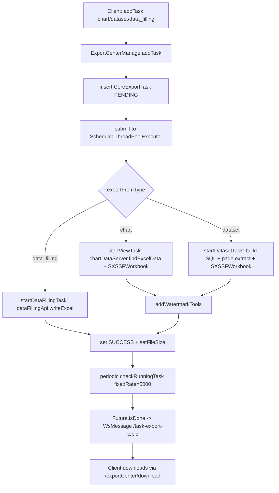

# 任务/导出/消息/资源 后端分析（v2.10.7）

> 本文档覆盖以下 7 个包的全部 `.java` 文件（共 39 个），结论均以源码为准。
> 范围：`io.dataease.job`、`io.dataease.exportCenter`、`io.dataease.msgCenter`、`io.dataease.operation`、`io.dataease.resource`、`io.dataease.map`、`io.dataease.font`
> 源码根：`core/core-backend/src/main/java/io/dataease/`

## 1. 职责与架构位置

这些包属于 DataEase 后端的**支撑能力层**，不直接承载业务编排，而是为可视化/数据集/权限等核心域提供横切能力：

| 包 | 职责 | 架构位置 |
|----|------|----------|
| `job.schedule` | 定时调度基础设施（Quartz 封装 + Spring `@Scheduled`） | 后台任务引擎，被数据集同步、报表、数据填报等模块驱动 |
| `exportCenter` | 导出任务中心（Excel 数据集/图表/数据填报导出、队列、清理、水印） | 异步导出服务，对接 `chart`/`dataset`/`xpack` |
| `msgCenter` | 消息中心（桩实现，逻辑在 xpack） | 占位/扩展点 |
| `operation` | 操作/最近使用记录（模板最近使用时间） | 轻量记录，非完整审计日志 |
| `resource` | 静态资源权限校验入口 | 权限子系统薄封装 |
| `map` | 地图/行政区划/自定义地理区域管理 | 地图可视化支撑 |
| `font` | 字体库（字库上传/默认字体/下载） | 前端/导出字体支撑 |

**调度机制总览**（关键事实，来自 `CoreApplication.java:10-12`）：
- `@SpringBootApplication(exclude = {QuartzAutoConfiguration.class})` —— **禁用 Spring Boot 的 Quartz 自动配置**。
- `@EnableScheduling` —— 启用 Spring 自带的调度（`@Scheduled`、`@QuartzScheduled`）。
- `ScheduleManager`（`job/schedule/ScheduleManager.java`）注入 `org.quartz.Scheduler` bean（由包外 Quartz 配置类提供，[Inference] 基于 `DataSource` 的集群化 Scheduler）。
- 因此存在**两套调度**：① Spring `@Scheduled`/`@QuartzScheduled`（固定周期任务）；② 通过 `ScheduleManager` 编程式注册/管理的 Quartz `CronJob`（动态任务，如报表、数据填报）。

## 2. 包结构与关键类清单

### 2.1 `job.schedule`（10 个文件）

| 类/接口 | 职责 | 关键方法 | 备注 |
|---------|------|----------|------|
| `ScheduleManager` | Quartz 调度器统一封装（基础设施） | `addCronJob` / `addSimpleJob` / `addSingleJob` / `modifyCronJobTime` / `removeJob` / `fireNow` / `exist` / `clearByGroup` / `getNTimeByCron` / `addOrUpdateCronJob` | 注入 `org.quartz.Scheduler`；异常统一抛 `DEException`。无事务注解 |
| `DeTaskExecutor` | 报表(REPORT_TASK)类 Quartz 任务执行器 | `addOrUpdateTask` / `addRetryTask` / `addTempTask` / `fireNow` / `removeTask` / `addThresholdTask` / `removeThresholdTask` / `clearRetryTask` | `execute()` 与 `init()` 标 `@XpackInteract(value="xpackTaskExecutor", replace=true)` —— 社区版 `execute` 直接 `return false`，真实逻辑由 xpack 替换 |
| `DeDataFillingTaskExecutor` | 数据填报(DATA_FILLING_TASK)类任务执行器 | `addOrUpdateTask` / `addRetryTask` / `addTempTask` / `fireNow` / `removeTask` / `clearRetryTask` | 同上，`@XpackInteract(value="dataFillingTaskExecutor", replace=true)` |
| `DeScheduleJob` | Quartz `Job` 抽象基类（抽取 JobDataMap） | `execute()` 读取 `datasetTableId/expression/taskId/updateType`，模板方法 `businessExecute()` | 被 `ExtractDataJob` 继承 |
| `ExtractDataJob` | 数据集抽取 Job（继承 `DeScheduleJob`） | `businessExecute()` → `datasourceSyncManage.extractData(datasetTableId, taskId, context)` | 数据集同步/抽取调度入口 |
| `DeXpackScheduleJob` | 报表类 Quartz Job 实现 | `execute()` → `LicenseUtil.validate()` → `DeTaskExecutor.execute(jobDataMap)`；返回 false 则 `removeJob` | 委托模式，异常被吞掉仅记日志 |
| `DeXpackDataFillingScheduleJob` | 数据填报表 Quartz Job 实现 | `execute()` → `DeDataFillingTaskExecutor.execute(jobDataMap)` | 同上 |
| `CheckDsStatusJob` | 数据源状态检查 Job | `execute()` → `datasourceServer.updateDatasourceStatus()` | `@Component` 同时 `implements Job`；构造函数从 `CommonBeanFactory` 取 bean（[Inference] 由包外代码经 `ScheduleManager` 注册） |
| `Schedular` | 固定周期任务（fit2cloud 注解） | `@QuartzScheduled(cron="0 0/3 * * * ?") updateStopJobStatus()` → `datasourceServer.updateStopJobStatus()` | 使用 `com.fit2cloud.quartz.anno.QuartzScheduled` |
| `CleanScheduler` | 每日清理任务 | `@Scheduled(cron="0 0 0 * * ?") clean()` → `exportCenterManage.cleanLog()`；`cleanSyncLog()` → `datasourceTaskServer.cleanLog()` | 每日零点执行 |

### 2.2 `exportCenter`（6 个文件）

| 类/接口 | 职责 | 关键方法 | 备注 |
|---------|------|----------|------|
| `CoreExportTask` | 导出任务实体，表 `core_export_task` | 字段：`id,userId,fileName,fileSize,fileSizeUnit,exportFrom,exportStatus,exportFromType,exportTime,exportProgress,exportMachineName,params(JSON),msg` | 状态枚举 `SUCCESS/FAILED/PENDING/IN_PROGRESS/ALL` |
| `CoreExportTaskMapper` | MyBatis-Plus Mapper | 继承 `BaseMapper<CoreExportTask>` | 无自定义 SQL |
| `ExportCenterLimitManage` | 导出行数限制配置 | `getExportLimit(type)`；`@Value` `dataease.export.dataset.limit`(默认100000)、`dataease.export.views.limit`(默认100000) | 通过 `ExportCenterUtils` 静态访问 |
| `ExportCenterUtils` | 静态工具，暴露 limit | `getExportLimit(type)` | setter 注入 `exportCenterLimitManage` 到静态字段 |
| `ExportCenterManage` | 导出核心逻辑（实现 `BaseExportApi`） | `addTask`(×3: chart/dataset/data_filling)、`startViewTask`/`startDatasetTask`/`startDataFillingTask`、`download`、`delete`/`deleteAll`、`retry`、`exportTasks`、`cleanLog`、`addWatermarkTools`、`checkRunningTask` | `@Component @Transactional`；内置 `ScheduledThreadPoolExecutor`（`dataease.export.core.size`=10 核心，`dataease.export.max.size`=10 最大）；`@Scheduled(fixedRate=5000) checkRunningTask` 轮询完成并推 WS 消息 |
| `ExportCenterServer` | REST 控制器 `POST /exportCenter` | `exportTasks`、`delete`、`download`、`retry`、`exportLimit` | 实现 `ExportCenterApi`；`@Transactional` |

### 2.3 `msgCenter`（1 个文件）

| 类/接口 | 职责 | 关键方法 | 备注 |
|---------|------|----------|------|
| `MsgCenterServer` | 消息中心 REST 桩 `POST /msg-center` | `count()` 直接 `return 0` | `@XpackInteract(value="msgCenterServer", replace=true)` —— 社区版仅占位，[Inference] 真实消息计数逻辑由 xpack 模块替换实现 |

### 2.4 `operation`（3 个文件）

| 类/接口 | 职责 | 关键方法 | 备注 |
|---------|------|----------|------|
| `CoreOptRecent` | 最近操作记录实体，表 `core_opt_recent` | 字段：`id,resourceId,resourceName,uid,resourceType,optType,time` | `optType`：1=新建 2=修改 |
| `CoreOptRecentMapper` | Mapper | 继承 `BaseMapper<CoreOptRecent>` | — |
| `CoreOptRecentManage` | 最近使用记录管理 | `saveOpt(...)`（按 `resourceId/name + resourceType + uid` upsert）、`findTemplateRecentUseTime()` | [Inference] 主要用于“模板最近使用时间”排序，并非全量操作审计日志 |

### 2.5 `resource`（2 个文件）

| 类/接口 | 职责 | 关键方法 | 备注 |
|---------|------|----------|------|
| `ResourceApi` | REST 控制器 `POST /resource` | `checkPermission/{id}` | 薄封装 |
| `ResourceService` | 资源读权限校验 | `checkPermission(Long id)` → 构造 `BusiPerCheckDTO`(READ) → `CorePermissionManage.checkAuth()`；异常返回 `false` | 委托权限子系统 |

### 2.6 `map`（13 个文件）

| 类/接口 | 职责 | 关键方法 | 备注 |
|---------|------|----------|------|
| `Area` | 行政区划 POJO | `id,level,name,pid` | [Inference] 映射表 `area`（无 `@TableName`，由 MyBatis-Plus 推导） |
| `AreaBO` | `Area` 扩展 | 增加 `custom` 布尔标识 | 用于区分内置/自定义区域 |
| `CoreCustomGeoArea` | 自定义地理区域实体，表 `core_custom_geo_area` | `id,name` | — |
| `CoreCustomGeoSubArea` | 自定义地理分区实体，表 `core_custom_geo_sub_area` | `id,name,scope,geoAreaId`（`scope` 为区域范围 GeoJSON） | — |
| `AreaMapper` / `CoreCustomGeoAreaMapper` / `CoreCustomGeoSubAreaMapper` | 三个 Mapper | 继承 `BaseMapper` | — |
| `CoreAreaCustom` | 自定义地图区域（DB 存储）POJO | `id,pid,name` | [Inference] 映射表 `core_area_custom`；id 以 `geo_` 前缀 |
| `CoreAreaCustomMapper` | Mapper | 继承 `BaseMapper<CoreAreaCustom>` | — |
| `MapManage` | 地图核心逻辑 | `getWorldTree()`(@Cacheable)、`saveMapGeo`(上传 geojson)、`deleteGeo`、`listCustomGeoArea`(@Cacheable)、`getCustomGeoArea`、`save/deleteCustomGeoArea`、`save/deleteCustomGeoSubArea`、`validateCode`、`buildGeoFile` | 缓存键 `WORLD_MAP_CACHE`/`CUSTOM_GEO_CACHE`；文件落地 `StaticResourceConstants.CUSTOM_MAP_DIR` |
| `MapServer` | REST `GET /map` | `getWorldTree()` | 实现 `MapApi` |
| `GeoServer` | REST `POST /geometry` | `saveMapGeo`、`deleteGeo` | 实现 `GeoApi` |
| `CustomGeoServer` | REST `POST /customGeo` | 自定义区域增删查 | 实现 `CustomGeoApi` |

### 2.7 `font`（4 个文件）

| 类/接口 | 职责 | 关键方法 | 备注 |
|---------|------|----------|------|
| `CoreFont` | 字体实体，表 `core_font` | `id,name,fileName,fileTransName,isDefault,updateTime,isBuiltin,size,sizeType` | — |
| `CoreFontMapper` | Mapper | 继承 `BaseMapper<CoreFont>` | — |
| `FontManage` | 字体管理 | `list`/`create`(重名校验)/`edit`/`delete`(删文件)/`changeDefault`/`upload`(仅 .ttf)/`download`/`defaultFont`/`saveFile` | 落地目录 `dataease.path.font`(默认 `/opt/dataease2.0/data/font/`) |
| `FontServer` | REST `POST /typeface` | 字体 CRUD/上传/下载 | 实现 `FontApi` |

## 3. 核心流程

### 3.1 导出任务执行流程（Excel）



### 3.2 定时调度机制（双轨）

```mermaid
flowchart LR
    subgraph SpringSched
        S1[@Scheduled CleanScheduler.clean 0 0 0 * * ?]
        S2[@QuartzScheduled Schedular.updateStopJobStatus 0 0/3 * * * ?]
    end
    subgraph QuartzAPI
        Q1[DeTaskExecutor / DeDataFillingTaskExecutor] --> Q2[ScheduleManager.addOrUpdateCronJob]
        Q2 --> Q3[org.quartz.Scheduler]
        Q3 --> Q4[DeXpackScheduleJob / DeXpackDataFillingScheduleJob]
        Q4 --> Q5[DeTaskExecutor.execute jobDataMap]
        Q5 --> Q6[LicenseUtil.validate]
    end
    subgraph JobDirect
        J1[CheckDsStatusJob implements Job] --> J2[datasourceServer.updateDatasourceStatus]
    end
```

## 4. 依赖与调用关系

- **调度驱动关系**：`DeTaskExecutor`/`DeDataFillingTaskExecutor` 持有 `ScheduleManager`；`ScheduleManager` 持有 `org.quartz.Scheduler`（包外配置）。具体任务执行委托给 `DatasourceSyncManage`、`DatasourceTaskServer`（数据集同步）、xpack 的 `xpackTaskExecutor`/`dataFillingTaskExecutor`（因 `@XpackInteract replace=true`，社区版为空实现）。
- **导出依赖**：`ExportCenterManage` 依赖 `ChartDataServer`（图表数据）、`DatasetGroupManage`/`DatasetSQLManage`/`DatasetDataManage`/`DatasetTableFieldManage`（数据集 SQL 与抽取）、`PermissionManage`（行列权限过滤）、`WsService`（完成通知）、`VisualizationWatermarkMapper`+`ExcelWatermarkUtils`（水印）、`DataFillingApi`（`@Autowired(required=false)`，[Inference] 仅 xpack 存在时注入）、`ExportCenterLimitManage`。
- **地图/字体/资源/操作**：均为对各自 Mapper 的 CRUD + 少量跨域调用（`MapManage` 用 `StaticResourceConstants` 写文件；`ResourceService` 调 `CorePermissionManage`；`CoreOptRecentManage` 调 `AuthUtils`）。
- **消息中心**：`MsgCenterServer` 仅 stub，`count()` 返回 0，全部逻辑由 xpack 替换。

## 5. 事务 / 缓存 / 异常 / 安全考量

**事务**
- `ExportCenterManage`、`ExportCenterServer` 标 `@Transactional(rollbackFor=Exception.class)`；`MapManage` 的写方法标 `@Transactional`；`FontManage` 未标事务（单表操作，[Inference] 可接受）。
- 注意：导出耗时的 Excel 生成在 `ScheduledThreadPoolExecutor` 异步线程中执行，`@Transactional` 对异步线程内 DB 操作**不生效**——任务状态更新通过 `exportTaskMapper.updateById` 独立提交，符合预期。

**缓存**
- `MapManage.getWorldTree()` → `@Cacheable(WORLD_MAP_CACHE, key='world_map')`；`saveMapGeo`/`deleteGeo` → `@CacheEvict` 同键。
- `MapManage.listCustomGeoArea()` → `@Cacheable(CUSTOM_GEO_CACHE, key='custom_geo_area')`；写方法 `@CacheEvict` 同键。
- [Inference] 缓存实现依赖包外 `CacheConstant.CommonCacheConstant` 定义的缓存管理器（如 Redis/Caffeine）。

**导出大文件**
- 数据集导出按 `sheetLimit=1000000` 行分页建 sheet，按 `extractPageSize`(默认 50000) 分页查询 DB；使用 `SXSSFWorkbook`（流式写盘，避免 OOM）。
- 行数上限由 `ExportCenterLimitManage` 控制（默认 100000），`startDatasetTask` 中 `totalCount = min(totalCount, curLimit)`。
- 导出文件落地 `dataease.path.exportData`（默认 `/opt/dataease2.0/data/exportData/<id>/<id>.xlsx`）。`cleanLog` 按 `basic.exportFileLiveTime`（天）清理过期任务及目录。

**路径穿越 / 资源权限（安全）**
- `ExportCenterManage.download(id, response)`：仅按 `id` 查任务并读文件，**未校验当前用户是否为任务 owner**（对比 `exportTasks`/`deleteAll` 均有 `user_id` 过滤）。[Need Verification] 存在越权下载他人导出文件（IDOR）风险——需确认上层是否有拦截器/权限注解补齐。
- `FontManage.download(file, response)`：先按 `file_trans_name` 查库确认存在才读取 `path + fileTransName`，文件名由 UUID 生成，路径穿越风险低。
- `MapManage.buildGeoFile`：`code` 经 `validateCode` 强制纯数字，再 `countryCode=substring(0,3)` 拼路径，无用户可控 `../`，路径穿越风险低。
- 上传类：`FontManage.upload` 仅允许 `.ttf`；`MapManage.saveMapGeo` 仅允许 `.json`。均有扩展名校验。
- `ResourceService.checkPermission` 对异常统一返回 `false`（fail-closed），设计合理。

**异常**
- `ScheduleManager` 各类异常统一 `DEException.throwException(e)`。
- `DeXpackScheduleJob`/`DeXpackDataFillingScheduleJob` 的 `execute` 仅 `LogUtil.error` 吞掉异常，不向上抛（避免 Quartz 反复重试），但任务失败不会被标记——[Inference] 任务状态由被委托方（xpack）自行维护。
- `ExportCenterManage` 导出线程内 try/catch 将任务置 `FAILED` 并写 `msg`。

## 6. 风险与待确认 ([Need Verification])

1. **导出下载越权**：`ExportCenterManage.download(String id, ...)` 未做 owner 校验，疑似 IDOR，需确认是否被安全框架拦截（见 §5）。
2. **PDF/截图导出不在本范围**：背景所述 Selenium 截图、iTextPDF、EasyExcel **均未出现在本包**——`exportCenter` 仅实现 Excel 导出（Apache POI `SXSSFWorkbook`）。PDF/截图导出逻辑应在 `xpack` 或 `visualization` 等包外模块。[Need Verification] 需补充分析对应模块。
3. **消息中心为空实现**：`MsgCenterServer` 仅占位，`count()` 恒返回 0，真实消息能力全部依赖 xpack。[Need Verification] 需确认 xpack 模块实现与消息存储位置。
4. **`operation` 非完整审计日志**：`CoreOptRecent` 仅记录“最近使用（模板）”，完整操作审计/日志应在其他包。[Need Verification]
5. **`Scheduler` bean 来源**：`ScheduleManager` 注入的 `org.quartz.Scheduler` 由包外配置类提供（因 `QuartzAutoConfiguration` 被排除）。[Need Verification] 需确认其集群/存储配置（`JobStore` 类型、是否 `DataSource` 持久化）。
6. **`Area`/`CoreAreaCustom` 表名推导**：二者无 `@TableName`，MyBatis-Plus 按类名推导（`area`/`core_area_custom`），需与实际建表脚本核对一致。
7. **`core`/`max` 线程池**：`ScheduledThreadPoolExecutor` 核心=最大（默认均 10），`setMaximumPoolSize` 对已创建的固定核心池实际扩容有限，导出高并发下可能排队——[Inference] 需评估默认值是否足够。

## 7. 相关文档

- [可视化模块分析](visualization.md)
- [构建与部署架构](../architecture/build-deploy.md)
