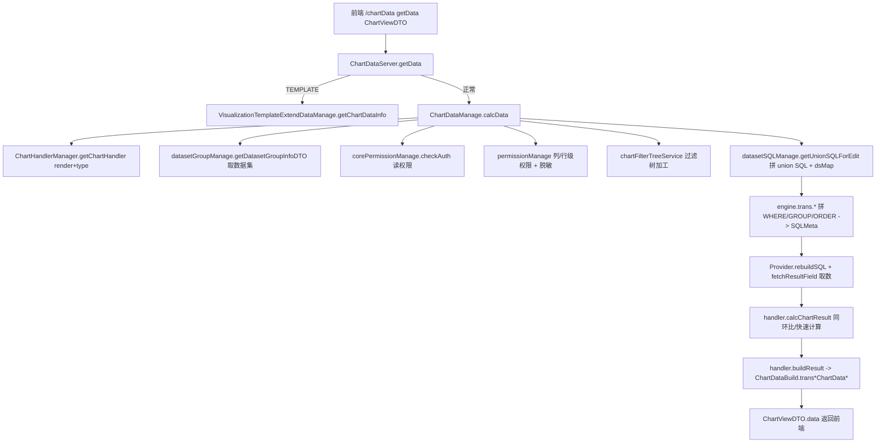
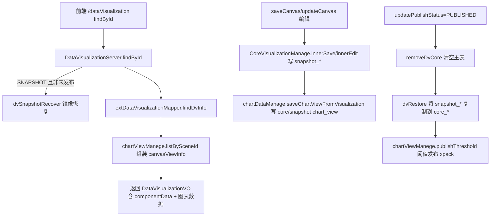
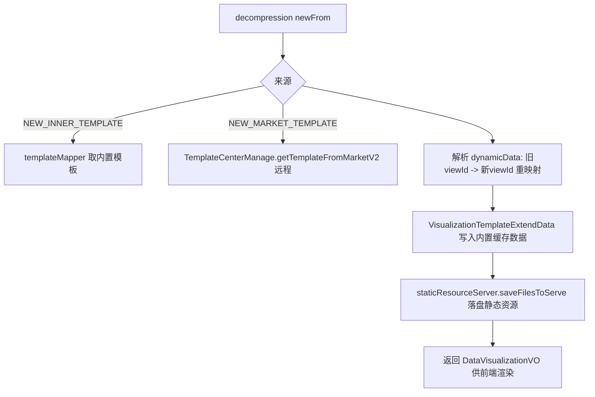

# 可视化与图表（Chart/Visualization/Home/Template）后端分析（v2.10.7）

> 源码根目录：`core/core-backend/src/main/java/io/dataease/`
> 分析范围：`chart`、`visualization`、`home`、`template` 四个包
> 结论均给出 文件路径 / 类名 / 方法名；推断标注 [Inference]，不确定标注 [Need Verification]。

---

## 1. 职责与架构位置

这四个包共同承载 DataEase 的「图表计算 + 仪表板/大屏 + 工作台首页 + 模板市场」能力，处于 API 层（`io.dataease.api.*`）与底层 `dataset` / `engine` / `datasource` 之间：

- **chart**：图表取数与渲染数据生产。核心入口 `ChartDataManage.calcData()` 接收前端传来的 `ChartViewDTO`（含轴字段、过滤、下钻、联动/外部参数），经过「字段权限 → SQL 拼装（engine） → 数据源执行（datasource/calcite） → handler 结果重组（ChartDataBuild）」链路，产出前端渲染所需的 `data` Map。
- **visualization**：仪表板（dashboard）与数据大屏（dataV）的资源树、画布（`componentData`/`canvasStyleData`）、发布/镜像（snapshot）机制、联动/跳转/外部参数、背景/主题/水印、收藏、Excel 导出。
- **home**：仅 `DeIndexManage`，是首页索引的扩展点（`@XpackInteract` 占位），社区版无实现。
- **template**：模板市场（远程 Halo 市场 + 本地内置模板）的查询、分类、导入导出（`appData`/静态资源），以及内置模板的本地初始化。

前端对应关系（`core-frontend/src/views/*`，见 §4 接口契约）：`views/chart`（取数）、`views/dv-manage`（仪表板/大屏资源树与编辑）、`views/panel`/`views/screen`（画布）、`views/template`（模板市场）、`views/index`（首页）。

---

## 2. 包结构与关键类清单

### 2.1 chart — 图表核心

| 类/接口 | 职责 | 关键方法 | 备注 |
|---|---|---|---|
| `chart.manage.ChartDataManage` | 图表取数主流程编排 | `calcData(ChartViewDTO)`、`sqlData(...)`、`getFieldData`、`getDrillFieldData`、`saveChartViewFromVisualization`、`getAllChartFields`、`resultCustomSort`/`customSort` | 权限校验、字段级/行级权限、过滤树、下钻、跨数据源 SQL、调用 Provider 取数 |
| `chart.manage.ChartViewManege` | 图表（视图）CRUD 与 DTO↔Record 转换 | `save`、`getChart`、`getDetails`、`listBySceneId`、`listByDQ`、`chartBaseInfo`、`transRecord2DTO`/`transDTO2Record`、`createCountField`、`viewOption` | 同时写 `core_chart_view` 与 `snapshot_core_chart_view`；阈值相关方法为 `@XpackInteract` 占位 |
| `chart.manage.ChartFilterTreeService` | 自定义过滤树加工 | `searchFieldAndSet(FilterTreeObj)`、`charReplace(FilterTreeObj)` | 把过滤树中的 fieldId 还原为字段对象并转义关键字 |
| `chart.manage.ChartViewOldDataMergeService` | 老数据兼容迁移 | `mergeOldData()`、`refreshFilter()`、`transArr2Obj`、`fixFilter` | 将旧版 list 型 customFilter 转成 tree；一次性数据迁移 |
| `chart.manage.ChartViewThresholdManage` | 阈值规则与告警校验 | `convertThresholdRules`、`checkThreshold`、`filterRows`、`matchesConditionTree` | 把阈值 FilterTree 转成可读文本/执行行级匹配；用于 xpack 阈值告警 |
| `chart.server.ChartDataServer` | `/chartData` 接口实现（取数 + Excel 导出） | `getData(ChartViewDTO)`、`findExcelData`、`innerExportDetails`、`innerExportDataSetDetails`、`getFieldData`、`getDrillFieldData`、`setExcelData`、`valueFormatter` | 支持模板缓存数据（`VIEW_DATA_FROM.TEMPLATE`）、`DeLinkPermit` 鉴权、POI 流式导出 |
| `chart.server.ChartViewServer` | `/chart` 接口实现（视图管理） | `getData(id)`、`save`、`listByDQ`、`getDetail`、`chartBaseInfo`、`copyField`、`deleteField`、`checkSameDataSet`、`viewOption` | 薄封装，转发到 `ChartViewManege` |
| `chart.charts.ChartHandlerManager` | 图表处理器注册表 | `registerChartHandler(render,type,handler)`、`getChartHandler(render,type)` | 基于 `ConcurrentHashMap<"render-type", AbstractChartPlugin>`；未命中返回 `DefaultChartHandler` |
| `chart.charts.impl.DefaultChartHandler` | 默认处理器（antv / 通配 `*`） | `formatAxis`、`customFilter`、`calcChartResult`、`buildChart`、`buildResult`、`quickCalc`、`groupStackDrill` | 实现同比/环比、累计、占比等快速计算；同环比时间回拨 |
| `chart.charts.impl.YoyChartHandler` | 带同环比处理器 | `calcChartResult`、`buildResult`、`customFilter`、`sortData` | 在默认基础上增加「回拨一年查原始数据再裁剪」逻辑 |
| `chart.charts.impl.GroupChartHandler` | 分组类（xAxis+xAxisExt） | `formatAxis` | 继承 Yoy，把 xAxisExt 并入维度 |
| `chart.charts.impl.ExtQuotaChartHandler` | 扩展指标（extLabel/extTooltip） | `formatAxis` | 把 extLabel/extTooltip 并入 yAxis |
| `chart.charts.impl.bar|line|map|mix|numeric|others|pie|scatter|table/*Handler` | 各图表类型处理器（共 42 个，见 §2.2） | 各自 `init()` 注册 + 按需覆写 `formatAxis`/`calcChartResult`/`buildResult` | 大多继承 `YoyChartHandler`/`DefaultChartHandler` |
| `chart.constant.ChartConstants` | 常量 | `YEAR_MOM`/`MONTH_MOM`/`YEAR_YOY`/`DAY_MOM`/`MONTH_YOY`、`VIEW_RESULT_MODE{ALL,CUSTOM}` | 同环比类型与结果模式 |
| `chart.utils.ChartDataBuild` | 结果→前端结构转换（工具类，~1800 行） | `transChartData`、`transChartDataAntV`、`transTableNormal[WithDetail]`、`transBaseGroupDataAntV`、`transStackChartDataAntV`、`transScatterDataAntV`、`transMixChartDataAntV`、`transHeatMapChartDataAntV`、`transRadarChartDataAntV`、`transSymbolicMapNormalWithDetail`、`desensitizationValue` | 按图表类型把 `List<String[]>` 转成 AntV/ECharts 所需的 `data`/`fields`/`tableRow` 等 |
| `chart.dao.ext.entity.ChartBasePO` | 图表基础信息 PO | — | `queryChart` 查询结果封装（xAxis/yAxis/extStack… 等 JSON 字符串） |
| `chart.dao.ext.mapper.ExtChartViewMapper` | 图表扩展查询 | `queryViewOption`、`queryChart`、`selectListCustom`、`deleteViewsBySceneId`、`findChartViewAround` | MyBatis `@Select` |
| `chart.dao.auto.entity.CoreChartView` | 图表主表实体 | — | 表 `core_chart_view`，字段经 `transRecord2DTO` 在 JSON 与 DTO 间互转 |
| `chart.dao.auto.mapper.CoreChartViewMapper` | 图表主表 Mapper | MyBatis-Plus 标准 | — |

### 2.2 chart — 图表 Handler 全量清单（42 个）

所有 Handler 均通过 `@PostConstruct init()` 调用 `ChartHandlerManager.registerChartHandler(render, type, this)` 完成注册；未命中具体 type 时由 `DefaultChartHandler`（render=`antv`, type=`*`）兜底 [Inference，基于 `ChartHandlerManager.getChartHandler` 行为与已读 `BarHandler.init()`]。

| 目录 | 类 | 注册 type（示例） | 基类 |
|---|---|---|---|
| `impl/bar/` | `BarHandler`(bar,bar-horizontal)、`BidirectionalBarHandler`、`BulletGraphHandler`、`GroupBarHandler`、`ProgressBarHandler`、`RangeBarHandler`、`StackBarHandler`、`StackGroupBarHandler` | bar-* | Yoy/Default |
| `impl/line/` | `LineHandler`、`AreaHandler`、`StackAreaHandler` | line/area/stack-area | Yoy |
| `impl/map/` | `MapHandler`、`BubbleMapHandler`、`FlowMapHandler`、`HeatMapHandler`、`SymbolicMapHandler` | map-* | Yoy |
| `impl/mix/` | `MixHandler`、`GroupMixHandler`、`StackMixHandler`、`DualLineMixHandler` | chart-mix-* | Yoy |
| `impl/numeric/` | `GaugeHandler`、`IndicatorHandler`、`LiquidHandler`、`NumericalChartHandler` | gauge/indicator/liquid | Yoy |
| `impl/others/` | `FunnelHandler`、`RadarHandler`、`RichTextHandler`、`SankeyHandler`、`TreemapHandler`、`WaterfallHandler`、`WordCloudHandler` | funnel/radar/… | Yoy/Default |
| `impl/pie/` | `PieHandler` | pie | Yoy |
| `impl/scatter/` | `ScatterHandler`、`QuadrantHandler` | scatter/quadrant | Yoy |
| `impl/table/` | `TableNormalHandler`、`TableInfoHandler`、`TableHeatmapHandler`、`TablePivotHandler` | table-normal/table-info/t-heatmap/table-pivot | Yoy/Default |

各类型差异集中在 `formatAxis`（维度/指标组合）与 `buildResult`（调用 `ChartDataBuild` 对应 `trans*ChartData*` 方法）[Inference]。

### 2.3 visualization — 仪表板/大屏

| 类/接口 | 职责 | 关键方法 | 备注 |
|---|---|---|---|
| `visualization.manage.CoreVisualizationManage` | 资源树/发布/镜像核心 | `tree`、`delete`、`move`、`innerSave`/`innerEdit`/`preInnerSave`、`query`、`removeSnapshot`/`removeDvCore`、`dvSnapshotRecover`、`dvRestore` | 事务型；所有变更先写 `snapshot_*`，发布时 `removeDvCore`+`dvRestore` 把 snapshot 复制到 core；阈值方法 `@XpackInteract` 占位 |
| `visualization.manage.CoreVisualizationExportManage` | 仪表板 Excel 导出 | `exportExcel`、`exportViewData`、`exportSingleData`、`buildViewRequest` | 遍历 `componentData` 中的图表 → `ChartDataManage.calcData` → `VisualizationExcelUtils.exportExcel` |
| `visualization.manage.CoreBusiManage` | 交互树聚合（数据源/数据集/仪表板） | `interactiveTree(Map)` | 按 key 分发到 `dataSourceManage`/`datasetGroupManage`/`coreVisualizationManage.tree` |
| `visualization.manage.VisualizationStoreManage` | 收藏（Store）管理 | `execute`、`favorited`、`query`、`queryStorePage` | 写 `core_store` |
| `visualization.manage.VisualizationTemplateExtendDataManage` | 模板内置缓存数据 | `getChartDataInfo(viewId, view)` | 从 `visualization_template_extend_data` 取 `viewDetails` 直接回填 `data`（模板图表无需实时取数） |
| `visualization.server.DataVisualizationServer` | `/dataVisualization` 主接口 | `findById`、`saveCanvas`、`updateCanvas`、`updatePublishStatus`、`recoverToPublished`、`copy`、`move`、`tree`、`interactiveTree`、`decompression`（模板解压新建）、`export2AppCheck`、`nameCheck`、`findRecent`、`checkCanvasChange`、`appCanvasNameCheck`、`getAbsPath` | 含 App 导出时的数据源/数据集/字段 ID 重映射逻辑；`saveCanvas` 兼具「模板/应用/普通」创建 |
| `visualization.server.VisualizationLinkJumpService` | `/linkJump` 跳转 | `queryVisualizationJumpInfo`、`queryWithViewId`、`updateJumpSet`、`queryTargetVisualizationJumpInfo`、`viewTableDetailList`、`updateJumpSetActive`、`removeJumpSet` | 写 `snapshot_visualization_link_jump*` |
| `visualization.server.VisualizationLinkageService` | `/linkage` 联动 | `getViewLinkageGather`、`saveLinkage`、`getVisualizationAllLinkageInfo`、`updateLinkageActive`、`removeLinkage` | 写 `snapshot_visualization_linkage*`；active 状态回写到 `snapshot_core_chart_view` |
| `visualization.server.VisualizationOuterParamsService` | `/outerParams` 外部参数 | `queryWithVisualizationId`、`updateOuterParamsSet`、`getOuterParamsInfo`、`queryDsWithVisualizationId` | 写 `snapshot_visualization_outer_params*`；支持数据集 SQL 变量（`DE|`） |
| `visualization.server.VisualizationBackgroundService` | `/visualizationBackground` 背景图 | `findAll` | 按 `classification` 分组返回 |
| `visualization.server.VisualizationSubjectService` | `/visualizationSubject` 主题 | `query`、`querySubjectWithGroup`、`update`、`delete` | 写 `visualization_subject` |
| `visualization.server.VisualizationWatermarkService` | `/watermark` 水印 | `getWatermarkInfo`、`saveWatermarkInfo` | 固定 ID `system_default`，写 `visualization_watermark` |
| `visualization.server.VisualizationStoreServer` | `/store` 收藏接口 | `execute`、`query`、`favorited` | 转发 `VisualizationStoreManage` |
| `visualization.server.StaticResourceServer` | `/staticResource` 静态资源 | `upload`、`saveFilesToServe`、`saveSingleFileToServe`、`findResourceAsBase64`、`getFileType` | 落盘 `${dataease.path.static-resource}`；SVG 做了 XXE 防护；仅允许图片 |
| `visualization.server.FileType` | 文件类型枚举 | `JPEG/PNG/GIF` + `getValue/getExt` | 按文件头魔数判断 |
| `visualization.template.FilterBuildTemplate` | 导出过滤模板 | `buildEmpty(components)` | 从 `componentData` 抽取所有 `UserView` 组件 id → 空过滤列表 |
| `visualization.utils.VisualizationExcelUtils` | Excel 写出 | `exportExcel(sheets,name,folderId)` | POI `SXSSFWorkbook` 流式写盘到 report 目录 |
| `visualization.utils.VisualizationUtils` | DTO 序列化工具 | `viewTransToStr`/`viewTransToObj` | App 导出时 ChartViewDTO 与 JSON 字符串互转 |
| `visualization.bo.ExcelSheetModel` | Excel 行模型 | `sheetName/heads/data/filedTypes` | — |
| `visualization.dto.VisualizationNodeBO` | 资源树节点 BO | — | `tree()` 结果承载 |
| `visualization.dto.WatermarkContentDTO` | 水印内容 DTO | — | 水印设置内容承载 |

**可视化自动生成实体与 Mapper（MyBatis-Plus，均列出以保证覆盖）**

`visualization/dao/auto/entity/`（20 个）：
`CoreStore`(收藏)、`DataVisualizationInfo`(仪表板/大屏主表，字段见 §3.2)、`SnapshotDataVisualizationInfo`(镜像)、`SnapshotCoreChartView`、`VisualizationLinkJump`/`VisualizationLinkJumpInfo`/`VisualizationLinkJumpTargetViewInfo`(跳转三表)、`SnapshotVisualizationLinkJump`(+Info/+TargetViewInfo)(跳转镜像)、`VisualizationLinkage`/`VisualizationLinkageField`(联动)、`SnapshotVisualizationLinkage`(+Field)(联动镜像)、`VisualizationOuterParams`/`VisualizationOuterParamsInfo`/`VisualizationOuterParamsTargetViewInfo`(外部参数)、`SnapshotVisualizationOuterParams`(+Info/+TargetViewInfo)(外部参数镜像)、`VisualizationBackground`、`VisualizationSubject`、`VisualizationWatermark`。
对应 `visualization/dao/auto/mapper/`（20 个同名 `*Mapper`）为 MyBatis-Plus 标准 Mapper。

`visualization/dao/ext/mapper/`（6 个）：
- `ExtDataVisualizationMapper`：`findDvInfo`、`findDvInfoStats`、`findRecent`、`dvCopy`、`viewCopyWithDv`、`findViewInfoByCopyId`、`copyLinkJump[Info/TargetInfo]`、`copyLinkage[Field]`、`getVisualizationViewDetails`、`queryReportFilter`、`deleteDataVBatch`/`deleteViewsBatch`、`snapshot*/restore*`（镜像↔主表双向搬运）、`queryInnerUserInfo`。
- `CoreVisualiationExtMapper`（拼写如源码）：`queryNodes`、`queryChildrenId`（资源树查询）。
- `ExtVisualizationLinkJumpMapper`：`queryWithDvId[Snapshot]`、`getTargetVisualizationJumpInfo`、`getViewTableDetails`、`queryOutParamsTargetWithDvId`、`deleteJump[TargetViewInfo/Info]Snapshot`、`queryTableFieldWithViewId`。
- `ExtVisualizationLinkageMapper`：`getViewLinkageGather[Snapshot]`、`getPanelAllLinkageInfo[Snapshot]`、`deleteViewLinkage[Field]Snapshot`、`queryTableFieldWithViewId`。
- `ExtVisualizationOuterParamsMapper`：`queryWithVisualizationIdSnapshot`、`getVisualizationOuterParamsInfo`、`getVisualizationOuterParamsInfoBase`、`deleteOuterParams[Target/Info]WithVisualizationIdSnapshot`、`queryDsWithVisualizationId`。
- `CoreStoreExtMapper`：`query(page, wrapper)`（收藏分页）。

`visualization/dao/ext/po/`（3 个）：`StorePO`、`VisualizationNodePO`、`VisualizationResourcePO`（对应查询结果的扁平 PO）。

### 2.4 home — 首页

| 类/接口 | 职责 | 关键方法 | 备注 |
|---|---|---|---|
| `home.manage.DeIndexManage` | 首页索引扩展点 | `xpackModel()`（`@XpackInteract(value="deIndexManage", replace=true)`） | 社区版返回 `null`；企业版在此注入首页索引逻辑 [Inference] |

### 2.5 template — 模板市场

| 类/接口 | 职责 | 关键方法 | 备注 |
|---|---|---|---|
| `template.manage.TemplateCenterManage` | 远程模板市场对接 | `getTemplateFromMarket`/`getTemplateFromMarketV2`、`searchTemplate`/`searchTemplateRecommend`/`searchTemplatePreview`、`getCategories*` | 调用 Halo 市场 API（`POSTS_API_V2`/`TEMPLATE_BASE_INFO_URL`/`TEMPLATE_META_DATA_URL`），合并「管理平台内置模板」 |
| `template.manage.TemplateLocalParseManage` | 本地内置模板初始化 | `doInit()`、`parseCore(DataVisualizationBaseRequest)`、`getAllFilesInResourceDirectory`、`readFileContent` | 扫描 `classpath:template/*`，经 `DeTemplateVersion` 去重后落盘静态资源 |
| `template.service.TemplateManageService` | `/templateManage` 接口（模板 CRUD） | `templateList`、`save`、`delete`、`deleteCategory`、`findOne`、`find`/`findCategories`、`batchUpdate`/`batchDelete`、`nameCheck`/`categoryTemplateNameCheck`/`checkCategoryTemplateBatchNames`、`findCategoriesByTemplateIds` | 模板存 `visualization_template`，分类存 `visualization_template_category`，关系存 `visualization_template_category_map`；保存时落盘静态资源与快照 |
| `template.service.TemplateMarketService` | `/templateMarket` 接口 | `searchTemplate`、`searchTemplateRecommend`、`searchTemplatePreview`、`categories`/`categoriesObject` | 转发 `TemplateCenterManage` |
| `template.dao.ext.ExtVisualizationTemplateMapper` | 模板扩展查询 | `findTemplateList`、`findCategories`、`findBaseTemplateList`、`checkCategoryMap`/`checkRepeatTemplateId`、`deleteCategoryMapByTemplate`、`checkCategoryTemplateName[BatchNames]`、`findTemplateCategories[ArrayCategories]`、`findApp*`（App 导出所需视图/数据集/数据源/联动/跳转 VO） | — |
| `template/dao/auto/entity/`（5 个） | `VisualizationTemplate`(模板主表：templateStyle/templateData/dynamicData/appData/staticResource/useCount…)、`VisualizationTemplateCategory`(分类)、`VisualizationTemplateCategoryMap`(分类映射)、`VisualizationTemplateExtendData`(模板图表内置缓存数据：viewDetails)、`DeTemplateVersion`(本地模板初始化版本记录) |
| `template/dao/auto/mapper/`（5 个） | 同名 `*Mapper`（MyBatis-Plus 标准） |

---

## 3. 核心流程（Mermaid）

### 3.1 图表取数链路（chart → dataset/engine → datasource）

### 3.2 仪表板查询 / 发布（visualization 镜像机制）

### 3.3 模板新建（decompression）

---

## 4. 依赖与调用关系

### 4.1 chart → dataset / engine / datasource
- **dataset**：`DatasetGroupManage.getDatasetGroupInfoDTO`、`DatasetSQLManage.getUnionSQLForEdit`(产出 union SQL 与 `dsMap`)、`DatasetTableFieldManage.selectById`、`PermissionManage`(列/行权限)、`DatasetFieldServer.listByDatasetGroup`。
- **engine**：`io.dataease.engine.trans.*`（`Table2SQLObj`/`Dimension2SQLObj`/`Quota2SQLObj`/`CustomWhere2Str`/`ExtWhere2Str`/`WhereTree2Str`/`FilterTree2Str`）、`SQLProvider.createQuerySQL`、`Utils`(跨库/排序/参数)。`chart` 不直接碰 JDBC，只产出 `SQLMeta`。
- **datasource**：`ProviderFactory.getProvider/rebuildSQL`、`Provider.fetchResultField(DatasourceRequest)`（calcite 或具体数据源驱动执行）。
- **extensions.view**：`AbstractChartPlugin`/`ChartViewDTO`/`ChartViewFieldDTO`/`ChartAxis`/`FilterTreeObj`，以及插件图表 `PluginsChartFactory.getInstance(render,type)`（`view.getIsPlugin()` 时为插件图表）。

### 4.2 visualization ↔ 前端接口契约（`core-frontend/src/views/*`）
后端均为 `@RestController`，路径与前端 view 对应：

| 后端 `@RequestMapping` | 实现类 | 前端主要使用（推断路径） | 关键方法 |
|---|---|---|---|
| `/chartData` | `ChartDataServer` (`ChartDataApi`) | `views/chart/*`、`views/panel` 取数 | `getData`、`getFieldData`、`getDrillFieldData`、`innerExportDetails` |
| `/chart` | `ChartViewServer` (`ChartViewApi`) | 视图编辑 | `getData(id)`、`save`、`listByDQ`、`chartBaseInfo`、`copyField`、`deleteField` |
| `/dataVisualization` | `DataVisualizationServer` (`DataVisualizationApi`) | `views/dv-manage`（树/编辑）、`views/panel`、`views/screen` | `findById`、`saveCanvas`、`updateCanvas`、`updatePublishStatus`、`copy`、`tree`、`decompression`、`export2AppCheck`、`nameCheck` |
| `/linkJump` | `VisualizationLinkJumpService` | 图表跳转配置 | `queryVisualizationJumpInfo`、`updateJumpSet`、`queryTargetVisualizationJumpInfo` |
| `/linkage` | `VisualizationLinkageService` | 图表联动配置 | `getViewLinkageGather`、`saveLinkage`、`getVisualizationAllLinkageInfo` |
| `/outerParams` | `VisualizationOuterParamsService` | 外部参数配置 | `queryWithVisualizationId`、`updateOuterParamsSet`、`getOuterParamsInfo` |
| `/visualizationBackground`、`/visualizationSubject`、`/watermark`、`/store`、`/staticResource` | 对应 Service | 画布样式/主题/水印/收藏/资源 | `findAll`/`query`/`getWatermarkInfo`/`execute`/`upload` |
| `/templateManage`、`/templateMarket` | `TemplateManageService`、`TemplateMarketService` | `views/template/*` | `templateList`/`save`/`findOne`、`searchTemplate`/`searchTemplatePreview` |

> 注：上述「前端路径」为基于命名与职责的 [Inference]，精确路由以 `core-frontend` 实际调用为准 [Need Verification]。

### 4.3 template 导入导出
- **导出为 App**（`DataVisualizationServer.export2AppCheck`）：收集所选 `viewIds`/`dsIds` 对应 `AppCore*VO`（视图、数据集、数据表、字段、数据源、任务、联动、跳转），由 `ExtVisualizationTemplateMapper.findApp*` 提供，供前端打包。
- **导入/新建**：`decompression` 支持内置模板 / 外部模板 JSON / 远程市场；`TemplateLocalParseManage.doInit` 在启动期扫描 `classpath:template/*` 初始化内置模板（含静态资源落盘）。
- **静态资源**：模板与画布图片统一经 `StaticResourceServer.saveFilesToServe` 落盘到 `${dataease.path.static-resource}`，前端通过 `/staticResource/findResourceAsBase64` 回读。

---

## 5. 事务 / 缓存 / 异常 / 安全考量

- **事务**：`@Transactional` 出现在 `ChartViewManege.save`、`CoreVisualizationManage`（`@Transactional` 类级，含 `delete`/`removeSnapshot`/`removeDvCore`/`dvSnapshotRecover`/`dvRestore`）、`DataVisualizationServer.saveCanvas/updateCanvas/updatePublishStatus/updateBase/deleteLogic/move/copy`、`VisualizationLinkageService.saveLinkage`、`TemplateManageService.save`（均为复合写多表）。镜像↔主表搬运靠事务保证一致性。
- **缓存**：本范围内**无显式本地/Redis 缓存**（[Inference]，仅在 `ChartHandlerManager` 用 `ConcurrentHashMap` 做处理器注册表，属进程内静态注册）。图表数据每次实时计算；模板内置数据存库（`visualization_template_extend_data`）以避免实时取数。
- **异常**：统一 `DEException.throwException(ResultCode.DATA_IS_WRONG, msg)`；取数失败在 `ChartDataServer.getData` 包裹后抛出带堆栈信息。Excel 导出失败时 `exportCenterManage.addTask` 转异步任务。
- **安全/权限**：
  - 读权限：`corePermissionManage.checkAuth(BusiPerCheckDTO{AuthEnum.READ})` 校验数据集读权限；行/列权限经 `PermissionManage`。
  - 链接分享鉴权：`@DeLinkPermit("#p0.sceneId" / "#p0.dvId")` 用于分享场景下的图表/仪表板访问。
  - **SQL 注入防护**：过滤值经 `SQLUtils.transKeyword` 转义（`ChartDataManage` 与 `ChartFilterTreeService.charReplace`）；同环比/动态时间由服务端计算而非拼接用户输入。
  - **XXE 防护**：`StaticResourceServer.isValidSVG` 禁用 DOCTYPE/外部实体；文件类型仅允许图片（JPEG/PNG/GIF/SVG）。
  - **路径穿越**：`StaticResourceServer.upload` 用 `basePath.resolve(newFileName)` 并前置 `Assert` 校验；`saveFilesToServe` 仅处理 base64 内容 [Need Verification：是否对 `path` 做 `..` 校验]。

---

## 6. 风险与待确认（[Need Verification]）

1. **`ChartDataManage` 未读全量**：`calcData` 行 79–422 已通读，但 `getFieldData`/`sqlData` 的 `switch(type)` 分支逻辑依赖 `ChartViewDTO` 字段语义，部分分支（如 `label`/`indicator`/`gauge` 的空轴处理）需结合前端传参确认 [Need Verification]。
2. **模板/App 导入 ID 重映射**：`saveCanvas` 中 `componentData` 的 id 替换采用 `String.replaceAll(key, value)`，若新 ID 是旧 ID 子串可能产生误替换 [Need Verification：是否有定界符保护]。
3. **`StaticResourceServer.saveFilesToServe`** 的 `path` 来源为模板 JSON，未显式校验 `..`；建议确认存在穿越防护 [Need Verification]。
4. **`DeIndexManage.xpackModel()`** 社区版恒返回 `null`，首页索引实现完全依赖企业版 `@XpackInteract` 注入 [Need Verification：前端首页数据是否另有来源]。
5. **42 个 chart Handler** 仅详读了 `Default/Yoy/Group/ExtQuota/Bar` 五个，其余按「继承 + `init()` 注册 + 调用 `ChartDataBuild`」模式推断；个别特殊类型（如 `RichTextHandler`、`BulletGraphHandler`）可能有自定义 `buildResult` 分支 [Need Verification]。
6. **`ChartViewThresholdManage`** 与 xpack 阈值告警耦合（`publishThreshold`/`restoreThreshold` 为占位），阈值实际生效依赖企业版 [Need Verification]。
7. **`VisualizationOuterParamsService.queryWithVisualizationId`** 固定读 `snapshot` 表（`queryWithVisualizationIdSnapshot`），与「编辑态读 core、发布态读 snapshot」的其它接口不一致 [Need Verification：是否为预期行为]。
8. **跨数据源（crossDs）** 走 `ProviderFactory.getDefaultProvider()`（calcite 统一计算），单数据源走具体 Provider；`ChartDataManage` 对 `crossDs` 的 SQL 别名替换（`replaceSchemaAlias`）分支需结合 engine 校验 [Need Verification]。

---

## 7. 相关文档

- `dataset.md`（数据集 / `DatasetGroupManage` / `PermissionManage`）
- `engine.md`（SQL 拼装 `engine.trans.*` / `SQLProvider` / `Utils`）
- `../architecture/directory-structure.md`（整体目录结构与分层）
