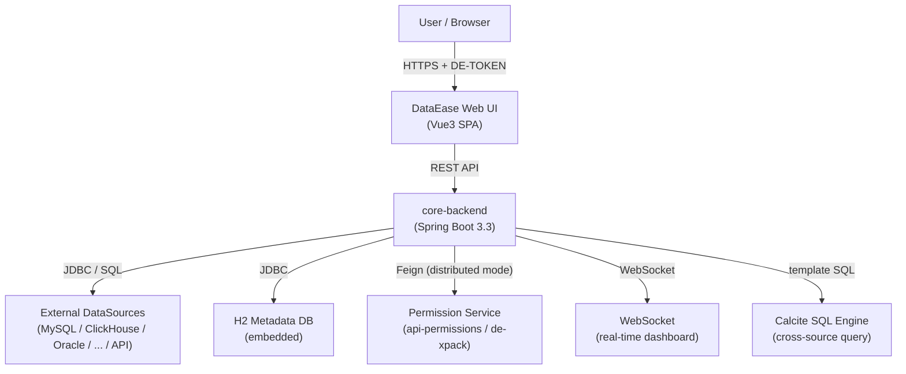
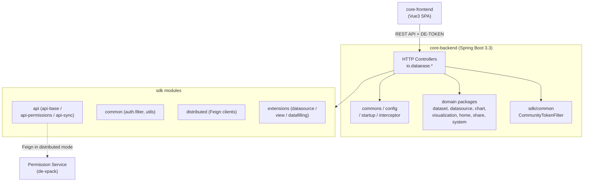
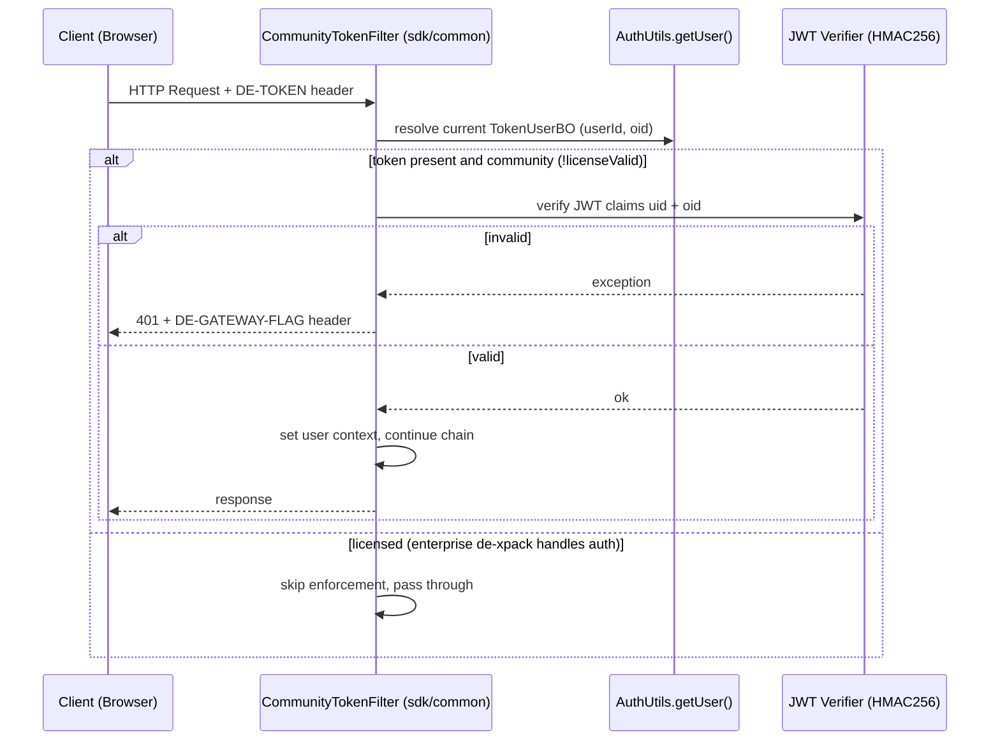
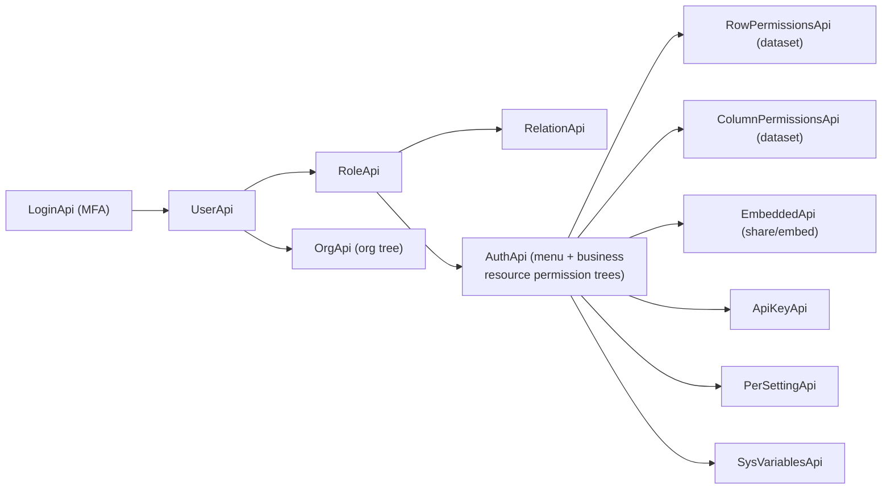

# DataEase v2.10.7 架构图集（Architecture Diagrams）

> 配套文档：`docs/architecture/overview.md`、`security-model.md`。
> 本文件将 4 张架构图拆分为**独立的 Mermaid 代码块**（每张图单独渲染，避免多图同文件导致的渲染失败），并为每张图增补中文文字说明。
> 图中标签沿用英文（遵循 AGENTS.md「图表用英文防止排版错乱」约束），说明文字使用中文。

---

## 图 1：系统上下文（System Context · C4 L1）

**用途**：站在最外层看 DataEase 与外部角色/系统的边界与交互协议，回答「谁在用、连什么」。

**要点**：
- 用户通过浏览器访问 **DataEase Web UI**（Vue3 SPA），请求头携带 `DE-TOKEN` 做身份传递。
- 后端 `core-backend`（Spring Boot 3.3）是唯一业务中枢，对外暴露 REST API。
- 业务数据始终在**外部数据源**（MySQL / ClickHouse / Oracle / … / API），元数据（表结构、权限、仪表板定义）落在内置 **H2** 库。
- 跨数据源查询经 **Calcite SQL 引擎**做联邦执行。
- **distributed 模式**下，权限领域服务以独立微服务（`de-xpack`）形态通过 Feign 调用；社区版则由 `sdk/common` 的 `CommunityTokenFilter` 兜底。



---

## 图 2：模块分层（Module Layering）

**用途**：展开 `core-backend` 内部的分层与 `sdk` 能力层的关系，回答「代码怎么组织、依赖怎么走」。

**要点**：
- 展现层 `core-frontend` 仅通过 REST + `DE-TOKEN` 与后端交互。
- `core-backend` 内部分为：HTTP 控制器层 → `commons/config/startup/interceptor` 基础设施 → 各业务域包（`dataset`、`datasource`、`chart`、`visualization`、`home`、`share`、`system` 等）→ `sdk/common` 的 `CommunityTokenFilter` 鉴权。
- `sdk` 是能力层：`api`（权限/同步契约）、`common`（公共鉴权与工具）、`distributed`（Feign 客户端）、`extensions`（数据源/视图/数据填报扩展点）。
- 权限 API 在 **distributed 模式**下以虚线 Feign 调用远程权限服务；社区版则本地兜底，实现位于 `de-xpack`（空 submodule）。



---

## 图 3：认证流程（Authentication Flow · 社区版）

**用途**：展示一次 HTTP 请求如何被 `CommunityTokenFilter` 鉴权，回答「请求怎么被放行/拒绝」。

**要点**（证据：`sdk/common/.../CommunityTokenFilter.java`、`AuthUtils.java`、`TokenUserBO.java`）：
- 客户端在请求头带 `DE-TOKEN`；过滤器取令牌并调用 `AuthUtils.getUser()` 解析出 `TokenUserBO`（含 `userId`、`oid`）。
- **社区版**（`!licenseValid()`）：用 HMAC256 校验 JWT 的 `uid` + `oid` 声明；校验失败返回 **401** 并带 `DE-GATEWAY-FLAG` 头；通过则写入用户上下文并放行。
- **企业版**（`licenseValid()`）：由 `de-xpack` 接管鉴权，`CommunityTokenFilter` 跳过强制校验、直接放行。
- 硬编码事实：`AuthUtils.isSysAdmin` 以 `SYS_ADMIN_UID = 1L` 判定超级管理员。



---

## 图 4：权限领域（Permission Domain · api-permissions）

**用途**：展示权限领域 API 的契约为树状结构，回答「权限由哪些子域组成、彼此怎么关联」。

**要点**（证据：`sdk/api/api-permissions` 下各 `*Api` 接口）：
- 以 **LoginApi**（含 MFA）为入口，UserApi 为核心，向外派生出用户/角色/组织/关系。
- **AuthApi** 是权限核心：同时管理「菜单权限树」与「业务资源权限树（ACL 双向）」，并向下挂接：
  - `RowPermissionsApi` / `ColumnPermissionsApi`：数据集行/列级权限（**ABAC 雏形**，基于规则条件 + 系统变量）。
  - `EmbeddedApi`：分享/嵌入配置。
  - `ApiKeyApi` / `PerSettingApi` / `SysVariablesApi`：密钥、权限开关、系统变量（行权限的属性来源）。
- 这些接口在社区版多为契约占位，正式实现位于 `de-xpack`；二次开发（Casbin 等）的切入点即在此层（见 `docs/customization/permission-development-guide.md`）。



---

## 原文件问题说明（为何改写）

原 `architecture.mmd` 存在以下导致渲染异常的问题，本文件已修正：

1. **单文件多图非法**：原文件在一个 `.mmd` 内连续写了 4 个独立的图声明（`graph TD` / `sequenceDiagram` / `graph LR`）。Mermaid 单文件只接受一个图定义，多数渲染器只会渲染第一个或整体报错。本文件将每张图放入独立的 ` ```mermaid ` 代码块，互不干扰。
2. **节点 ID 跨图撞车**：原图 1 与图 2 复用了 `BE`、`PERM` 等节点 ID。多图同文件时这些 ID 会冲突，图形被错误合并。本文件各图独立成块，ID 不再跨图污染。
3. **图 2 结构混乱**：原图 2 把 `BE`（core-backend）既当根节点又当子节点引用，且 `DOMAIN` 节点标签含 `{ }` 与 `...` 易引发解析歧义。本文件用 `subgraph` 明确三层边界，标签改为安全写法。
4. **缺少说明**：原文件只有图、无文字，不利于理解。本文件为每个图增补了中文「用途 / 要点 / 源码证据」。
