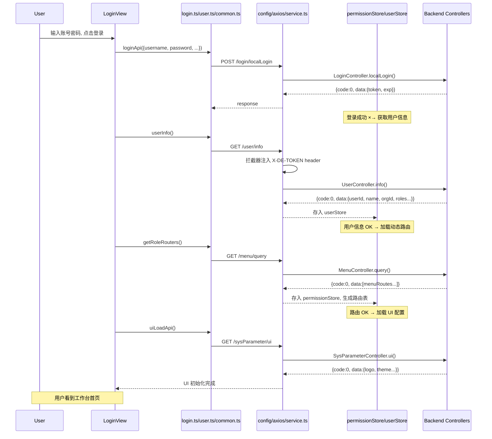
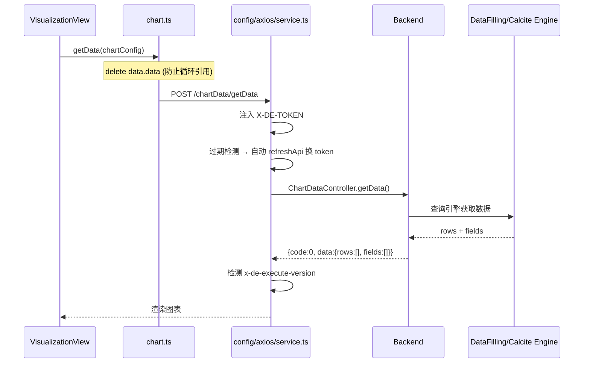

# 前端 API 层分析（v2.10.7）

## 1. 职责与架构位置

前端 `api/` 目录是 DataEase 前端与后端 REST API 的**契约层**——每个 `.ts` 文件导出一组基于 `axios` 封装的请求函数，供业务组件调用。该层位于前端技术栈的 **Service 层**：

```
组件视图 (views/)
    ↕ 调用
Store 层 (store/)
    ↕ 调用
API 层 (api/)  ← 本文档分析范围
    ↕ 封装
Axios 实例 (config/axios/)
    ↕ HTTP
后端 REST Controller
```

**关键设计特征**：

- 所有请求函数统一从 `@/config/axios` 导入 `request` 实例（`config/axios/index.ts:1`）。
- `request` 是一个经过请求/响应拦截器增强的 `axios` 实例，封装了 token 注入、自动刷新、国际化语言头、loading 状态、版本升级检测等功能。
- 请求均不携带 `/api` 前缀，前端请求路径直接映射到后端 Controller 的 `@RequestMapping` 路径（如 `/user/info` → `UserController`）。
- 绝大多数 API 使用 POST 方法（含 GET 查询场景）—— [Inference] DataEase 后端 REST 设计偏好 POST over GET 可能出于安全性考虑（request body 不暴露在 URL 中）。

## 2. API 文件清单

### 2.1 认证与授权层

| 文件 | 关键函数 | 请求路径 | 对应后端 Controller | 备注 |
|------|---------|---------|-------------------|------|
| `api/login.ts` | `loginApi` | `POST /login/localLogin` | `LoginApi` | 本地账号密码登录 |
| | `queryDekey` | `GET /dekey` | `LoginApi` | 获取数据加密公钥 |
| | `querySymmetricKey` | `GET /symmetricKey` | — | 获取对称加密密钥 |
| | `modelApi` | `GET /model` | — | 获取系统运行模式（lite/pro） |
| | `platformLoginApi` | `POST /login/platformLogin/{origin}` | `LoginApi` | 第三方平台登录（OAuth2/OIDC） |
| | `logoutApi` | `GET /logout` | `LoginApi` | 退出登录 |
| | `refreshApi` | `GET /login/refresh` | `LoginApi` | Token 自动刷新 |
| | `uiLoadApi` | `GET /sysParameter/ui` | `SysParameterController` | 获取 UI 配置（logo、主题色等） |
| | `loginCategoryApi` | `GET /sysParameter/defaultLogin` | `SysParameterController` | 获取默认登录方式 |
| `api/auth.ts` | `queryUserApi` | `POST /user/byCurOrg` | `UserController` | 查询当前组织下用户 |
| | `queryUserOptionsApi` | `GET /user/org/option` | `UserController` | 组织用户选项（下拉框用） |
| | `queryRoleApi` | `POST /role/byCurOrg` | `RoleController` | 查询当前组织下角色 |
| | `resourceTreeApi` | `GET /auth/busiResource/{flag}` | `AuthApi` | 业务资源树（如 dataset/datasource） |
| | `menuTreeApi` | `GET /auth/menuResource` | `AuthApi` | 菜单资源树 |
| | `resourcePerApi` | `POST /auth/busiPermission` | `AuthApi` | 查询业务资源权限 |
| | `menuPerApi` | `POST /auth/menuPermission` | `AuthApi` | 查询菜单权限 |
| | `busiPerSaveApi` | `POST /auth/saveBusiPer` | `AuthApi` | 保存业务权限 |
| | `menuPerSaveApi` | `POST /auth/saveMenuPer` | `AuthApi` | 保存菜单权限 |
| | `resourceTargetPerApi` | `POST /auth/busiTargetPermission` | `AuthApi` | 业务资源目标权限 |
| | `menuTargetPerApi` | `POST /auth/menuTargetPermission` | `AuthApi` | 菜单目标权限 |
| | `busiTargetPerSaveApi` | `POST /auth/saveBusiTargetPer` | `AuthApi` | 保存业务目标权限 |
| | `menuTargetPerSaveApi` | `POST /auth/saveMenuTargetPer` | `AuthApi` | 保存菜单目标权限 |
| `api/common.ts` | `getRoleRouters` | `GET /menu/query` | `MenuController` | **核心**：获取动态路由（权限路由） |
| | `getDefaultSettings` | `GET /sysParameter/defaultSettings` | `SysParameterController` | 获取默认用户设置 |

### 2.2 用户与组织管理

| 文件 | 关键函数 | 请求路径 | 对应后端 Controller | 备注 |
|------|---------|---------|-------------------|------|
| `api/user.ts` | `mountedOrg` | `POST /org/mounted` | `OrgController` | 用户已挂载的组织列表 |
| | `switchOrg` | `POST /user/switch/{id}` | `UserController` | 切换当前组织 |
| | `userInfo` | `GET /user/info` | `UserController` | **核心**：获取当前用户信息 |
| | `userPageApi` | `POST /user/pager/{page}/{limit}` | `UserController` | 用户分页列表 |
| | `userCreateApi` | `POST /user/create` | `UserController` | 创建用户 |
| | `userEditApi` | `POST /user/edit` | `UserController` | 编辑用户 |
| | `personEditApi` | `POST /user/personEdit` | `UserController` | 个人资料编辑 |
| | `personInfoApi` | `GET /user/personInfo` | `UserController` | 获取个人信息 |
| | `ipInfoApi` | `GET /user/ipInfo` | `UserController` | 获取登录 IP 信息 |
| | `userDelApi` | `POST /user/delete/{uid}` | `UserController` | 删除用户 |
| | `batchDelApi` (user) | `POST /user/batchDel` | `UserController` | 批量删除用户 |
| | `switchLangApi` | `POST /user/switchLanguage` | `UserController` | 切换语言 |
| | `importUserApi` | `POST /user/batchImport` | `UserController` | 批量导入用户（multipart） |
| | `resetPwdApi` | `POST /user/resetPwd/{uid}` | `UserController` | 重置密码 |
| | `switchEnableApi` | `POST /user/enable` | `UserController` | 启用/禁用用户 |
| | `searchRoleApi` | `POST /role/query` | `RoleController` | 搜索角色 |
| | `roleCreateApi` | `POST /role/create` | `RoleController` | 创建角色 |
| | `roleEditApi` | `POST /role/edit` | `RoleController` | 编辑角色 |
| | `roleDetailApi` | `GET /role/detail/{rid}` | `RoleController` | 角色详情 |
| | `roleDelApi` | `POST /role/delete/{rid}` | `RoleController` | 删除角色 |
| | `mountUserApi` | `POST /role/mountUser` | `RoleController` | 挂载用户到角色 |
| | `unMountUserApi` | `POST /role/unMountUser` | `RoleController` | 从角色卸载用户 |
| | `mountExternalUserApi` | `POST /role/mountExternalUser` | `RoleController` | 挂载外部用户 |
| | `searchExternalUserApi` | `GET /role/searchExternalUser/{keyword}` | `RoleController` | 搜索外部用户 |
| | `downExcelTemplateApi` | `POST /user/excelTemplate` | `UserController` | 下载批量导入模板（blob） |
| `api/org.ts` | `searchApi` | `POST /org/page/tree` | `OrgController` | 组织树查询 |
| | `saveApi` | `POST /org/page/create` | `OrgController` | 创建组织 |
| | `updateApi` | `POST /org/page/edit` | `OrgController` | 编辑组织 |
| | `resourceExistApi` | `GET /org/resourceExist/{oid}` | `OrgController` | 检查组织下是否有资源 |
| | `deleteApi` | `POST /org/page/delete/{oid}` | `OrgController` | 删除组织 |
| `api/variable.ts` | `variableCreateApi` | `POST /sysVariable/create` | `SysVariableController` | 创建系统变量 |
| | `variableEditApi` | `POST /sysVariable/edit` | `SysVariableController` | 编辑系统变量 |
| | `variableDetailApi` | `GET /sysVariable/detail/{id}` | `SysVariableController` | 系统变量详情 |
| | `variableDeletelApi` | `GET /sysVariable/delete/{id}` | `SysVariableController` | 删除系统变量 |
| | `searchVariableApi` | `POST /sysVariable/query` | `SysVariableController` | 查询系统变量 |
| | `valueSelectedForVariableApi` | `POST /sysVariable/value/selected/{page}/{limit}` | `SysVariableController` | 变量值分页查询 |
| | `variableValueCreateApi` | `POST /sysVariable/value/create` | `SysVariableController` | 创建变量值 |
| | `batchDelApi` (variable) | `POST /sysVariable/value/batchDel` | `SysVariableController` | 批量删除变量值 |

### 2.3 核心业务：数据源

| 文件 | 关键函数 | 请求路径 | 对应后端 Controller | 备注 |
|------|---------|---------|-------------------|------|
| `api/datasource.ts` | `listDatasources` | `POST /datasource/tree` | `DatasourceController` | 数据源树（含 busiFlag） |
| | `listDatasourceType` | `POST /datasource/types` | `DatasourceController` | 支持的数据源类型列表 |
| | `getTableField` | `POST /datasource/getTableField` | `DatasourceController` | 获取表字段 |
| | `syncApiTable` | `POST /datasource/syncApiTable` | `DatasourceController` | 同步 API 表的字段 |
| | `syncApiDs` | `POST /datasource/syncApiDs` | `DatasourceController` | 同步 API 数据源 |
| | `listDatasourceTables` | `POST /datasource/getTables` | `DatasourceController` | 获取表列表 |
| | `getSchema` | `POST /datasource/getSchema` | `DatasourceController` | 获取 Schema |
| | `previewData` | `POST /datasource/previewData` | `DatasourceController` | 数据预览 |
| | `validate` | `POST /datasource/validate` | `DatasourceController` | 验证数据源连接 |
| | `validateById` | `GET /datasource/validate/{id}` | `DatasourceController` | 按 ID 验证连接 |
| | `save` | `POST /datasource/save` | `DatasourceController` | 新建数据源 |
| | `update` | `POST /datasource/update` | `DatasourceController` | 更新数据源 |
| | `move` | `POST /datasource/move` | `DatasourceController` | 移动数据源 |
| | `reName` | `POST /datasource/reName` | `DatasourceController` | 重命名数据源 |
| | `createFolder` | `POST /datasource/createFolder` | `DatasourceController` | 创建数据源文件夹 |
| | `deleteById` | `GET /datasource/delete/{id}` | `DatasourceController` | 删除数据源 |
| | `getById` | `GET /datasource/get/{id}` | `DatasourceController` | 获取数据源详情 |
| | `uploadFile` | `POST /datasource/uploadFile` | `DatasourceController` | 上传文件数据源（multipart） |
| | `getDeEngine` | `GET /engine/getEngine` | `EngineController` | 获取数据引擎信息 |
| | `listSyncRecord` | `POST /datasource/listSyncRecord/{dsId}/{page}/{limit}` | `DatasourceController` | 同步记录 |

### 2.4 核心业务：数据集

| 文件 | 关键函数 | 请求路径 | 对应后端 Controller | 备注 |
|------|---------|---------|-------------------|------|
| `api/dataset.ts` | `getDatasetTree` | `POST /datasetTree/tree` | `DatasetTreeController` | 数据集树（含 busiFlag） |
| | `saveDatasetTree` | `POST /datasetTree/save` | `DatasetTreeController` | 保存数据集 |
| | `createDatasetTree` | `POST /datasetTree/create` | `DatasetTreeController` | 创建数据集 |
| | `renameDatasetTree` | `POST /datasetTree/rename` | `DatasetTreeController` | 重命名数据集 |
| | `delDatasetTree` | `POST /datasetTree/delete/{id}` | `DatasetTreeController` | 删除数据集 |
| | `getDatasetPreview` | `POST /datasetTree/get/{id}` | `DatasetTreeController` | 获取数据集预览 |
| | `getDatasetDetails` | `POST /datasetTree/details/{id}` | `DatasetTreeController` | 数据集详情 |
| | `getDsDetails` | `POST /datasetTree/dsDetails` | `DatasetTreeController` | 批量获取数据集详情 |
| | `getDsDetailsWithPerm` | `POST /datasetTree/detailWithPerm` | `DatasetTreeController` | 含权限的数据集详情 |
| | `getSqlParams` | `POST /datasetTree/getSqlParams` | `DatasetTreeController` | 获取 SQL 参数 |
| | `barInfoApi` | `GET /datasetTree/barInfo/{id}` | `DatasetTreeController` | 获取柱状图信息 |
| | `perDelete` | `POST /datasetTree/perDelete/{id}` | `DatasetTreeController` | 彻底删除 |
| | `getPreviewData` | `POST /datasetData/previewData` | `DatasetDataController` | 数据预览 |
| | `getPreviewSql` | `POST /datasetData/previewSql` | `DatasetDataController` | 预览 SQL |
| | `getTableField` | `POST /datasetData/tableField` | `DatasetDataController` | 获取表字段 |
| | `enumValueObj` | `POST /datasetData/enumValueObj` | `DatasetDataController` | 枚举值查询 |
| | `getEnumValue` | `POST /datasetData/enumValue` | `DatasetDataController` | 获取字段枚举值 |
| | `getFieldTree` | `POST /datasetData/getFieldTree` | `DatasetDataController` | 字段树 |
| | `listFieldByDatasetGroup` | `POST /datasetField/listByDatasetGroup/{datasetId}` | `DatasetFieldController` | 按数据集组列出字段 |
| | `saveField` | `POST /datasetField/save` | `DatasetFieldController` | 保存计算字段 |
| | `deleteField` | `POST /datasetField/delete/{id}` | `DatasetFieldController` | 删除字段 |
| | `getFunction` | `POST /datasetField/getFunction` | `DatasetFieldController` | 获取可用函数列表 |
| | `copilotFields` | `POST /datasetField/copilotFields/{datasetId}` | `DatasetFieldController` | Copilot 字段推荐 |
| | `tableUpdate` | `POST /dataset/table/update` | `DatasetController` | 更新数据集表关联 |
| | `rowPermissionList` | `GET /dataset/rowPermissions/pager/{datasetId}/{page}/{limit}` | `DatasetController` | 行权限分页 [See 5.] |
| | `columnPermissionList` | `GET /dataset/columnPermissions/pager/{datasetId}/{page}/{limit}` | `DatasetController` | 列权限分页 [See 5.] |
| | `saveRowPermission` | `POST /dataset/rowPermissions/save` | `DatasetController` | 保存行权限 [See 5.] |
| | `saveColumnPermission` | `POST /dataset/columnPermissions/save` | `DatasetController` | 保存列权限 [See 5.] |
| | `deleteRowPermission` | `POST /dataset/rowPermissions/delete` | `DatasetController` | 删除行权限 |
| | `deleteColumnPermission` | `POST /dataset/columnPermissions/delete` | `DatasetController` | 删除列权限 |
| | `whiteListUsersForPermissions` | `POST /dataset/rowPermissions/whiteListUsers` | `DatasetController` | 权限白名单用户 |
| | `rowPermissionTargetObjList` | `GET /dataset/rowPermissions/authObjs/{datasetId}/{type}` | `DatasetController` | 行权限授权对象 |
| | `exportDatasetData` | `POST /datasetTree/exportDataset` | `DatasetTreeController` | 导出数据集数据 |
| | `exportTasks` | `POST /exportCenter/exportTasks/{type}` | `ExportCenterController` | 导出任务列表 |
| | `exportRetry` | `POST /exportCenter/retry/{id}` | `ExportCenterController` | 重试导出 |
| | `downloadFile` | `GET /exportCenter/download/{id}` | `ExportCenterController` | 下载导出文件（blob） |
| | `exportDelete` | `GET /exportCenter/delete/{id}` | `ExportCenterController` | 删除导出文件 |
| | `copilotChat` | `POST /copilot/chat` | `CopilotController` | AI Copilot 对话 |
| | `getListCopilot` | `POST /copilot/getList` | `CopilotController` | Copilot 历史记录 |

> **注**：`dataset.ts` 是最大文件（406 行），封装了 40+ 个请求函数，涵盖数据集树、数据预览、字段管理、权限管理、导出中心、AI Copilot 六个子领域。

### 2.5 核心业务：图表与视图

| 文件 | 关键函数 | 请求路径 | 对应后端 Controller | 备注 |
|------|---------|---------|-------------------|------|
| `api/chart.ts` | `getData` | `POST /chartData/getData` | `ChartDataController` | **核心**：图表取数 |
| | `getFieldData` | `POST /chartData/getFieldData/{fieldId}/{fieldType}` | `ChartDataController` | 字段枚举值 |
| | `getDrillFieldData` | `POST /chartData/getDrillFieldData/{fieldId}` | `ChartDataController` | 下钻字段枚举 |
| | `innerExportDetails` | `POST /chartData/innerExportDetails` | `ChartDataController` | 导出图表明细（blob） |
| | `getFieldByDQ` | `POST /chart/listByDQ/{id}/{chartId}` | `ChartController` | 按数据集查询关联字段 |
| | `copyChartField` | `POST /chart/copyField/{id}/{chartId}` | `ChartController` | 复制图表字段 |
| | `deleteChartField` | `POST /chart/deleteField/{id}` | `ChartController` | 删除图表字段 |
| | `getChart` | `POST /chart/getChart/{id}` | `ChartController` | 获取图表配置 |
| | `saveChart` | `POST /chart/save` | `ChartController` | 保存图表 |
| | `getChartDetail` | `POST /chart/getDetail/{id}` | `ChartController` | 获取图表详情 |
| | `checkSameDataSet` | `GET /chart/checkSameDataSet/{a}/{b}` | `ChartController` | 检查图表是否使用同一数据集 |

### 2.6 可视化：仪表板

| 文件 | 关键函数 | 请求路径 | 对应后端 Controller | 备注 |
|------|---------|---------|-------------------|------|
| `api/visualization/dataVisualization.ts` | `queryTreeApi` | `POST /dataVisualization/tree` | `DataVisualizationController` | 仪表板资源树 |
| | `queryBusiTreeApi` | `POST /dataVisualization/interactiveTree` | `DataVisualizationController` | 联动选择用资源树 |
| | `findById` | `POST /dataVisualization/findById` | `DataVisualizationController` | 加载仪表板[Inference: 含快照/编辑/发布三版本] |
| | `findCopyResource` | `GET /dataVisualization/findCopyResource/{dvId}/{busiFlag}` | `DataVisualizationController` | 跨仪表板复制资源 |
| | `save` | `POST /dataVisualization/save` | `DataVisualizationController` | 保存仪表板 |
| | `saveCanvas` | `POST /dataVisualization/saveCanvas` | `DataVisualizationController` | 保存画布（带 loading） |
| | `checkCanvasChange` | `POST /dataVisualization/checkCanvasChange` | `DataVisualizationController` | 检查画布是否变更 |
| | `updateCanvas` | `POST /dataVisualization/updateCanvas` | `DataVisualizationController` | 更新画布 |
| | `updatePublishStatus` | `POST /dataVisualization/updatePublishStatus` | `DataVisualizationController` | 更新发布状态 |
| | `recoverToPublished` | `POST /dataVisualization/recoverToPublished` | `DataVisualizationController` | 恢复至已发布版本 |
| | `updateBase` | `POST /dataVisualization/updateBase` | `DataVisualizationController` | 更新基本信息 |
| | `moveResource` | `POST /dataVisualization/move` | `DataVisualizationController` | 移动资源 |
| | `copyResource` | `POST /dataVisualization/copy` | `DataVisualizationController` | 复制资源 |
| | `deleteLogic` | `POST /dataVisualization/deleteLogic/{dvId}/{busiFlag}` | `DataVisualizationController` | 逻辑删除 |
| | `dvNameCheck` | `POST /dataVisualization/nameCheck` | `DataVisualizationController` | 名称重复检查 |
| | `decompression` | `POST /dataVisualization/decompression` | `DataVisualizationController` | 解压模板 |
| | `export2AppCheck` | `POST /dataVisualization/export2AppCheck` | `DataVisualizationController` | 导出应用检查 |
| | `querySubjectWithGroupApi` | `POST /visualizationSubject/querySubjectWithGroup` | `VisualizationSubjectController` | 查询主题（带分组） |
| | `saveOrUpdateSubject` | `POST /visualizationSubject/update` | `VisualizationSubjectController` | 保存/更新主题 |
| | `deleteSubject` | `POST /visualizationSubject/delete/{id}` | `VisualizationSubjectController` | 删除主题 |
| | `storeApi` | `POST /store/execute` | `StoreController` | 收藏操作 |
| | `storeStatusApi` | `GET /store/favorited/{id}` | `StoreController` | 查询收藏状态 |
| | `viewDetailList` | `GET /dataVisualization/viewDetailList/{dvId}` | `DataVisualizationController` | 查看详情列表 |
| | `getComponentInfo` | `GET /panel/view/getComponentInfo/{dvId}` | `PanelViewController` | 获取组件信息 |
| | `queryOuterParamsDsInfo` | `GET /outerParams/queryDsWithVisualizationId/{dvId}` | `OuterParamsController` | 查询外参关联数据集 |
| | `queryShareBaseApi` | `GET /sysParameter/shareBase` | `SysParameterController` | 获取分享基础 URL |
| | `updateCheckVersion` | `GET /dataVisualization/updateCheckVersion/{dvId}` | `DataVisualizationController` | 更新检查版本 |

### 2.7 可视化：联动、跳转、外参

| 文件 | 关键函数 | 请求路径 | 对应后端 Controller | 备注 |
|------|---------|---------|-------------------|------|
| `api/visualization/linkage.ts` | `getViewLinkageGather` | `POST /linkage/getViewLinkageGather` | `LinkageController` | 获取单个视图联动配置 |
| | `getViewLinkageGatherArray` | `POST /linkage/getViewLinkageGatherArray` | `LinkageController` | 批量获取联动配置 |
| | `saveLinkage` | `POST /linkage/saveLinkage` | `LinkageController` | 保存联动 |
| | `getPanelAllLinkageInfo` | `GET /linkage/getVisualizationAllLinkageInfo/{dvId}/{resourceTable}` | `LinkageController` | 获取面板全部联动信息 |
| | `updateLinkageActive` | `POST /linkage/updateLinkageActive` | `LinkageController` | 更新联动开关状态 |
| | `removeLinkage` | `POST /linkage/removeLinkage` | `LinkageController` | 删除联动 |
| `api/visualization/linkJump.ts` | `getTableFieldWithViewId` | `GET /linkJump/getTableFieldWithViewId/{viewId}` | `LinkJumpController` | 获取跳转源视图的字段 |
| | `queryWithViewId` | `GET /linkJump/queryWithViewId/{dvId}/{viewId}` | `LinkJumpController` | 查询视图跳转配置 |
| | `queryVisualizationJumpInfo` | `GET /linkJump/queryVisualizationJumpInfo/{dvId}/{resourceTable}` | `LinkJumpController` | 查询仪表板完整跳转配置 |
| | `queryTargetVisualizationJumpInfo` | `POST /linkJump/queryTargetVisualizationJumpInfo` | `LinkJumpController` | 查询目标跳转信息 |
| | `updateJumpSet` | `POST /linkJump/updateJumpSet` | `LinkJumpController` | 更新跳转配置 |
| | `updateJumpSetActive` | `POST /linkJump/updateJumpSetActive` | `LinkJumpController` | 更新跳转开关 |
| | `removeJumpSet` | `POST /linkJump/removeJumpSet` | `LinkJumpController` | 删除跳转配置 |
| | `viewTableDetailList` | `GET /linkJump/viewTableDetailList/{dvId}` | `LinkJumpController` | 视图表格详情列表 |
| `api/visualization/outerParams.ts` | `queryWithVisualizationId` | `GET /outerParams/queryWithVisualizationId/{dvId}` | `OuterParamsController` | 查询仪表板外部参数 |
| | `updateOuterParamsSet` | `POST /outerParams/updateOuterParamsSet` | `OuterParamsController` | 更新外部参数配置 |
| | `getOuterParamsInfo` | `GET /outerParams/getOuterParamsInfo/{dvId}` | `OuterParamsController` | 获取外部参数信息 |

### 2.8 可视化：辅助

| 文件 | 关键函数 | 请求路径 | 对应后端 Controller | 备注 |
|------|---------|---------|-------------------|------|
| `api/visualization/pdfTemplate.ts` | `queryAll` | `GET /pdf-template/queryAll` | `PdfTemplateController` | PDF 模板列表 |
| `api/visualization/visualizationBackground.ts` | `queryVisualizationBackground` | `GET /visualizationBackground/findAll` | `VisualizationBackgroundController` | 仪表板背景列表 |

### 2.9 数据同步

| 文件 | 关键函数 | 请求路径 | 对应后端 Controller | 备注 |
|------|---------|---------|-------------------|------|
| `api/sync/syncDatasource.ts` | `sourceDsPageApi` | `POST /sync/datasource/source/pager/{page}/{limit}` | `SyncDatasourceController` | 源数据源分页 |
| | `targetDsPageApi` | `POST /sync/datasource/target/pager/{page}/{limit}` | `SyncDatasourceController` | 目标数据源分页 |
| | `validateApi` | `POST /sync/datasource/validate` | `SyncDatasourceController` | 验证连接 |
| | `getFieldListApi` | `POST /sync/datasource/fields` | `SyncDatasourceController` | 获取源/目标字段列表 |
| | `saveApi` | `POST /sync/datasource/save` | `SyncDatasourceController` | 保存同步数据源配置 |
| | `updateApi` | `POST /sync/datasource/update` | `SyncDatasourceController` | 更新配置 |
| | `deleteByIdApi` | `POST /sync/datasource/delete/{id}` | `SyncDatasourceController` | 删除配置 |
| `api/sync/syncTask.ts` | `getTaskInfoListApi` | `POST /sync/task/pager/{current}/{size}` | `SyncTaskController` | 同步任务分页 |
| | `addApi` | `POST /sync/task/add` | `SyncTaskController` | 创建同步任务 |
| | `modifyApi` | `POST /sync/task/update` | `SyncTaskController` | 更新同步任务 |
| | `removeApi` | `POST /sync/task/remove/{taskId}` | `SyncTaskController` | 删除同步任务 |
| | `findTaskInfoByIdApi` | `GET /sync/task/get/{taskId}` | `SyncTaskController` | 查询任务详情 |
| | `executeOneApi` | `GET /sync/task/execute/{id}` | `SyncTaskController` | 手动执行一次 |
| | `startTaskApi` | `GET /sync/task/start/{id}` | `SyncTaskController` | 启动任务调度 |
| | `stopTaskApi` | `GET /sync/task/stop/{id}` | `SyncTaskController` | 停止任务调度 |
| `api/sync/syncTaskLog.ts` | `getTaskLogListApi` | `POST /sync/task/log/pager/{current}/{size}` | `SyncTaskLogController` | 同步日志分页 |
| | `getTaskLogDetailApi` | `GET /sync/task/log/detail/{logId}/{fromLineNum}` | `SyncTaskLogController` | 日志详情（支持从指定行读取） |
| | `removeApi` (log) | `POST /sync/task/log/delete/{logId}` | `SyncTaskLogController` | 删除日志 |
| | `clear` | `POST /sync/task/log/clear` | `SyncTaskLogController` | 清空日志 |
| | `terminationTaskApi` | `POST /sync/task/log/terminationTask/{logId}` | `SyncTaskLogController` | 强制终止同步任务 |
| `api/sync/syncSummary.ts` | `getResourceCount` | `GET /sync/summary/resourceCount` | `SyncSummaryController` | 同步概览（任务数/数据源数/日志数） |
| | `getJobLogLienChartInfo` | `POST /sync/summary/logChartData` | `SyncSummaryController` | 同步日志图表数据 |

### 2.10 系统工具与配置

| 文件 | 关键函数 | 请求路径 | 对应后端 Controller | 备注 |
|------|---------|---------|-------------------|------|
| `api/setting/sysParameter.ts` | `queryMapKeyApi` | `GET /sysParameter/queryOnlineMap` | `SysParameterController` | 查询在线地图 Key |
| | `queryMapKeyApiByType` | `GET /sysParameter/queryOnlineMap/{type}` | `SysParameterController` | 按类型查询地图 Key |
| | `saveMapKeyApi` | `POST /sysParameter/saveOnlineMap` | `SysParameterController` | 保存地图 Key |
| `api/font.ts` | `list` | `POST /typeface/listFont` | `TypefaceController` | 字体列表 |
| | `create` | `POST /typeface/create` | `TypefaceController` | 上传字体 |
| | `edit` | `POST /typeface/edit` | `TypefaceController` | 编辑字体 |
| | `deleteById` | `POST /typeface/delete/{id}` | `TypefaceController` | 删除字体 |
| | `defaultFont` | `GET /typeface/defaultFont` | `TypefaceController` | 获取默认字体 |
| | `uploadFontFile` | `POST /typeface/uploadFile` | `TypefaceController` | 上传字体文件（multipart） |
| `api/watermark.ts` | `watermarkSave` | `POST /watermark/save` | `WatermarkController` | 保存水印配置 |
| | `watermarkFind` | `GET /watermark/find` | `WatermarkController` | 查询水印配置 |
| `api/msg.ts` | `msgCountApi` | `POST /msg-center/count` | `MsgCenterController` | 未读消息数 |
| `api/aiComponent.ts` | `findBaseParams` | `GET /aiBase/findTargetUrl` | `AiBaseController` | AI 组件目标地址 |
| `api/about.ts` | `validateApi` | `POST /license/validate` | `LicenseController` | 许可证验证 |
| | `buildVersionApi` | `GET /license/version` | `LicenseController` | 系统版本信息 |
| | `updateInfoApi` | `POST /license/update` | `LicenseController` | 更新许可证信息 |
| `api/staticResource.ts` | `uploadFile` | `POST /staticResource/upload/{fileId}` | `StaticResourceController` | 上传静态资源（multipart; 含 15MB 限制检查） |
| | `findResourceAsBase64` | `POST /staticResource/findResourceAsBase64` | `StaticResourceController` | 获取资源 Base64 |

### 2.11 模板与插件

| 文件 | 关键函数 | 请求路径 | 对应后端 Controller | 备注 |
|------|---------|---------|-------------------|------|
| `api/template.ts` | `showTemplateList` | `POST /templateManage/templateList` | `TemplateManageController` | 模板列表 |
| | `save` | `POST /templateManage/save` | `TemplateManageController` | 保存为模板 |
| | `findOne` | `GET /templateManage/findOne/{id}` | `TemplateManageController` | 查看模板 |
| | `find` | `POST /templateManage/find` | `TemplateManageController` | 应用模板（带 loading） |
| | `templateDelete` | `POST /templateManage/delete/{id}/{categoryId}` | `TemplateManageController` | 删除模板 |
| | `findCategories` | `POST /templateManage/findCategories` | `TemplateManageController` | 模板分类列表 |
| | `nameCheck` | `POST /templateManage/nameCheck` | `TemplateManageController` | 模板名称检查 |
| | `batchDelete` | `POST /templateManage/batchDelete` | `TemplateManageController` | 批量删除模板 |
| | `batchUpdate` | `POST /templateManage/batchUpdate` | `TemplateManageController` | 批量更新模板 |
| `api/templateMarket.ts` | `searchMarket` | `GET /templateMarket/search` | `TemplateMarketController` | 模板市场搜索 |
| | `searchMarketRecommend` | `GET /templateMarket/searchRecommend` | `TemplateMarketController` | 推荐模板 |
| | `searchMarketPreview` | `GET /templateMarket/searchPreview` | `TemplateMarketController` | 模板预览 |
| | `getCategories` | `GET /templateMarket/categories` | `TemplateMarketController` | 市场分类 |
| | `getCategoriesObject` | `GET /templateMarket/categoriesObject` | `TemplateMarketController` | 分类对象 |
| `api/plugin.ts` | `load` | `GET /xpackComponent/content/{key}` | — | 加载 X-Pack 组件内容 |
| | `loadPluginApi` | `GET /xpackComponent/contentPlugin/{key}` | — | 加载插件 |
| | `loadDistributed` | `GET /DEXPack.umd.js` | — | 加载分布式 X-Pack UMD 包 |
| | `xpackModelApi` | `GET /xpackModel` | — | XPack 模式检查 |
| `api/map.ts` | `getWorldTree` | `GET /map/worldTree` | `MapController` | 全球地图区域树 |
| | `getGeoJson` | `GET /map/{countryCode}/{areaCode}.json` 或 `GET /geo/{countryCode}/{areaCode}.json` | `MapController` / `GeoController` | 获取区域 GeoJSON |
| | `listCustomGeoArea` | `GET /customGeo/geoArea/list` | `CustomGeoController` | 自定义地图区域列表 |
| | `saveCustomGeoArea` | `POST /customGeo/geoArea/save` | `CustomGeoController` | 保存自定义区域 |
| | `deleteCustomGeoArea` | `DELETE /customGeo/geoArea/{id}` | `CustomGeoController` | 删除自定义区域 |
| | `saveCustomGeoSubArea` | `POST /customGeo/geoSubArea/save` | `CustomGeoController` | 保存自定义子区域 |
| | `deleteCustomGeoSubArea` | `DELETE /customGeo/geoSubArea/{id}` | `CustomGeoController` | 删除自定义子区域 |

### 2.12 资源关联

| 文件 | 关键函数 | 请求路径 | 对应后端 Controller | 备注 |
|------|---------|---------|-------------------|------|
| `api/relation/index.ts` | `getDatasourceRelationship` | `POST /relation/datasource/{id}` | `RelationController` | 数据源关联关系 |
| | `getDatasetRelationship` | `POST /relation/dataset/{id}` | `RelationController` | 数据集关联关系 |
| | `getPanelRelationship` | `POST /relation/dv/{id}` | `RelationController` | 仪表板关联关系 |
| | `resourceCheckPermission` | `POST /resource/checkPermission/{id}` | `ResourceController` | 资源权限检查 |

## 3. 核心调用链路

### 3.1 登录 → 获取用户信息 → 加载动态路由 → 初始化完成



### 3.2 图表取数流程



## 4. 请求封装与拦截

### 4.1 axios 实例配置

**文件**：`config/axios/config.ts`

```typescript
// 核心配置 (config/axios/config.ts:1-46)
base_url: { base:'', dev:'', pro:'', test:'' } // 环境前缀
result_code: 0                                   // 成功状态码
request_timeout: 60000                           // 默认 60 秒超时
default_headers: 'application/json'              // 默认 JSON 请求
```

**动态超时**：在 `service.ts:49-74`，实例创建前会通过同步 XHR 请求 `/sysParameter/requestTimeOut` 获取服务器配置的超时时间，覆盖默认的 60 秒。

### 4.2 请求入口封装

**文件**：`config/axios/index.ts`

```typescript
// request 函数 (config/axios/index.ts:7-20)
const request = (option) => {
  const { url, method, params, data, headersType, responseType, loading } = option
  return service({ url, method, loading, params, data, responseType,
    headers: { 'Content-Type': headersType || default_headers }
  })
}
// 暴露 get/post/delete/put 四个便捷方法 (config/axios/index.ts:22-34)
```

### 4.3 请求拦截器 (Request Interceptor)

**文件**：`config/axios/service.ts:95-149`

```
1. configHandler (refresh.ts) → 注入 X-DE-TOKEN / 检测过期 → 自动 refreshApi
2. POST + application/x-www-form-urlencoded → qs.stringify(data)
3. embeddedStore.baseUrl → 动态覆盖 baseURL
4. 移动端检测 → 注入 X-DE-MOBILE: true
5. 链接分享 → 注入 X-DE-LINK-TOKEN
6. 嵌入式 → 注入 X-EMBEDDED-TOKEN
7. 国际化 → 注入 Accept-Language
8. GET 参数拼接 → ?key=encodeURIComponent(value)&...
9. CancelToken → 每个请求加入 cancelMap
10. loading → tryShowLoading (全局 loading 遮罩)
```

**关键 Token 管理**（`config/axios/refresh.ts`）：

- Token 存储在 `wsCache` (`user.token`)。
- 每次请求，拦截器检查是否过期（默认 90 秒 × 10000ms 偏差）。
- 过期时调用 `refreshApi` 换新 token，请求期间其他请求排队等待（`cacheRequest`）。
- Token 通过 `X-DE-TOKEN` header 发送。
- Desktop 模式 / Link 模式下跳过刷新逻辑。

### 4.4 响应拦截器 (Response Interceptor)

**文件**：`config/axios/service.ts:152-262`

```
成功分支 (code === 0 || code === 50002):
  - 检测 x-de-execute-version → 系统升级提示
  - 检测 x-de-link-token → 更新 linkStore
  - 隐藏 loading
  - 返回 response.data (业务数据)

特殊旁路 (不校验 code):
  - responseType === 'blob' → 直接返回 (文件下载)
  - URL 匹配 /map|geo/\d{3}/\d+\.json → 返回 (静态资源)
  - URL 包含 DEXPack.umd.js / i18n/custom_ → 返回

错误分支 (code !== 0):
  - code 80001 → 清除 localStorage, 跳转登录页
  - xpackComponent 请求 → 控制台提示 (不阻塞)
  - 其他错误 → ElMessage 弹出错误消息, Promise.reject

HTTP 层错误:
  - 超时 (timeout of) → 提示"请求超时"
  - 413 状态码 → 提示"文件大小超出限制"
  - DE-FORBIDDEN-FLAG → 提示权限变更, 刷新页面
  - DE-GATEWAY-FLAG → 清除 localStorage, 跳转登录页
```

### 4.5 版本升级检测

**文件**：`config/axios/service.ts:285-298`

每次响应携带 `x-de-execute-version` header，与缓存值对比。不一致时弹窗提示用户"系统有升级，请点击刷新页面"。

## 5. 与后端的接口契约对照

### 5.1 权限相关 API 对应关系

本 API 层的权限接口与后端 `auth-core.md` / `api-permissions.md` 的对应关系：

| 前端 API | 请求路径 | 后端 Controller/Method | 说明 |
|---------|---------|----------------------|------|
| `menuTreeApi` | `GET /auth/menuResource` | `AuthController.menuResource()` [Inference] | 获取菜单权限树（角色权限分配用） |
| `resourceTreeApi` | `GET /auth/busiResource/{flag}` | `AuthController.busiResource()` [Inference] | 获取业务资源权限树 |
| `menuPerApi` | `POST /auth/menuPermission` | `AuthController.menuPermission()` [Inference] | 查询某角色菜单权限 |
| `resourcePerApi` | `POST /auth/busiPermission` | `AuthController.busiPermission()` [Inference] | 查询某角色业务资源权限 |
| `menuPerSaveApi` | `POST /auth/saveMenuPer` | `AuthController.saveMenuPer()` [Inference] | 保存菜单权限分配 |
| `busiPerSaveApi` | `POST /auth/saveBusiPer` | `AuthController.saveBusiPer()` [Inference] | 保存业务资源权限分配 |
| `getRoleRouters` | `GET /menu/query` | `MenuController.query()` | 获取当前用户有权限的动态路由 |
| `rowPermissionList` | `GET /dataset/rowPermissions/pager/...` | `DatasetController.rowPermissionsPager()` [Inference] | 行级数据权限列表 |
| `columnPermissionList` | `GET /dataset/columnPermissions/pager/...` | `DatasetController.columnPermissionsPager()` [Inference] | 列级数据权限列表 |
| `saveRowPermission` | `POST /dataset/rowPermissions/save` | `DatasetController.saveRowPermission()` [Inference] | 保存行权限规则 |
| `saveColumnPermission` | `POST /dataset/columnPermissions/save` | `DatasetController.saveColumnPermission()` [Inference] | 保存列权限规则 |
| `resourceCheckPermission` | `POST /resource/checkPermission/{id}` | `ResourceController.checkPermission()` [Inference] | 检查当前用户对某资源的权限 |

### 5.2 与 auth-core.md 的调用链

参考 `../../backend/auth-core.md`，前端的认证/授权 API 与后端认证链路的对应关系：

```
前端 loginApi (POST /login/localLogin)
  → 后端 LoginController.localLogin()
  → UserDetailsServiceImpl 验证
  → 返回 token + exp (90 秒有效期)

前端 axios 拦截器 X-DE-TOKEN header
  → 后端 TokenFilter / AuthFilter [Inference]
  → 解析 token → 注入 SecurityContext

前端 refreshApi (GET /login/refresh)
  → 后端 LoginController.refresh()
  → 自动续期 token

前端 getRoleRouters (GET /menu/query)
  → 后端 MenuController.query()
  → 基于 SecurityContext 中的角色, 返回动态路由
```

## 6. 风险与待确认

### 6.1 [Need Verification] 事项

| # | 事项 | 描述 |
|---|------|------|
| NV-1 | **POST over GET 惯例** | 大量查询类 API（如 `userInfo`、`getDatasetTree`、`enumValueObj`）使用 POST 方法而非 GET。后端 Controller 是否全部使用 `@PostMapping` 处理这些请求？[Need Verification] |
| NV-2 | **后端 Controller 精确映射** | 本文档中标记 `[Inference]` 的 Controller 名称（如 `AuthController`、`SyncTaskController`）是基于 URL 前缀推断的，需要与后端实际类名交叉验证。 |
| NV-3 | **Token 过期策略** | `refresh.ts` 中 token 过期时间为 90 秒（`expTimeConstants: 90000`），偏差 10 秒（`expConstants: 10000`）。这与后端 JWT 配置是否一致？[Need Verification] |
| NV-4 | **同步 XHR 获取超时** | `service.ts:49-74` 使用同步 XHR（`xhr.open('get', url, false)`）获取 `requestTimeOut`，可能阻塞主线程。该设计是否必要？[Need Verification] |
| NV-5 | **CancelToken 的 scope** | `cancelMap` 按 URL 存储 CancelToken，但同一页面可能有多个相同 URL 的并发请求，后发请求会覆盖先发请求的 CancelToken。[Need Verification] |
| NV-6 | **blob 响应的错误处理缺失** | 响应拦截器中对 `responseType === 'blob'` 直接返回，未处理后端返回错误码（如导出失败时可能返回 JSON 错误，但前端按 blob 处理）。[Need Verification] |
| NV-7 | **chart.ts delete data.data 操作** | `getData`、`saveChart`、`getFieldData` 函数中直接 `delete data.data` 修改了传入对象，这是一种副作用，可能导致调用方产生非预期状态。[Need Verification] |
| NV-8 | **Base64 编解码逻辑** | `dataset.ts` 中的 `originNameHandle`/`originNameHandleBack` 对 `extField === 2` 的字段进行 Base64 URI 编解码，这一逻辑在 `save/create/preview` 前后成对调用。该设计的原因是什么？可能与特殊字符转义有关。[Need Verification] |

### 6.2 已知风险

1. **Token 竞态**：`configHandler` 中的 token 刷新逻辑不是原子的——多个并发请求同时检测到 token 过期时，虽然通过 `de-global-refresh` 标志限制仅一个请求真正执行刷新，但其他请求通过 Promise 排队等待。如果刷新请求本身失败，缓存的请求均收到 `null` token，可能导致大批量 401。
2. **URL 拼接注入风险**：许多 API 函数通过字符串拼接构造 URL（如 `'/user/delete/' + uid`）。虽然 DataEase 的 `uid` 参数通常来自后端生成的 ID 而非用户输入，但无 URL 编码仍有潜在风险。
3. **loading 状态泄漏**：`config.loading && tryShowLoading()` 和 `tryHideLoading()` 成对调用，但在重试逻辑（refresh token 排队）中可能不配对，导致 loading 遮罩未关闭。

## 7. 统计概览

- **API 文件总数**：31 个 `.ts` 文件
- **请求函数总数**：约 200 个
- **涉及后端 Controller**（推断）：约 30 个（Auth/User/Role/Org/Menu/Chart/ChartData/DatasetTree/DatasetData/Dataset/DatasetField/Datasource/ExportCenter/Copilot/DataVisualization/LinkJump/Linkage/OuterParams/SyncTask/SyncDatasource/SyncTaskLog/SyncSummary/TemplateManage/TemplateMarket/Typeface/Map/CustomGeo/SysParameter/SysVariable/Watermark/License/MsgCenter/Store/Relation/Resource/Engine/PdfTemplate/VisualizationSubject/VisualizationBackground/StaticResource/AiBase/PanelView 等）
- **最大文件**：`api/dataset.ts`（406 行，40+ 函数）
- **最简文件**：`api/common.ts`（16 行，2 函数）、`api/msg.ts`（3 行，1 函数）

## 8. 相关文档

- 前端基础设施：[infrastructure.md](./infrastructure.md)
- 后端认证核心：[../../backend/auth-core.md](../backend/auth-core.md)
- 后端权限与接口：[../../backend/api-permissions.md](../backend/api-permissions.md)
- 前端索引：[index.md](./index.md)
- 后端可视化：[../../backend/visualization.md](../backend/visualization.md)
