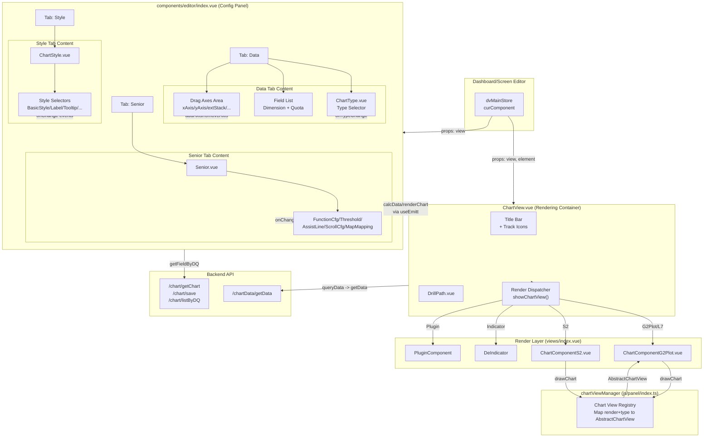
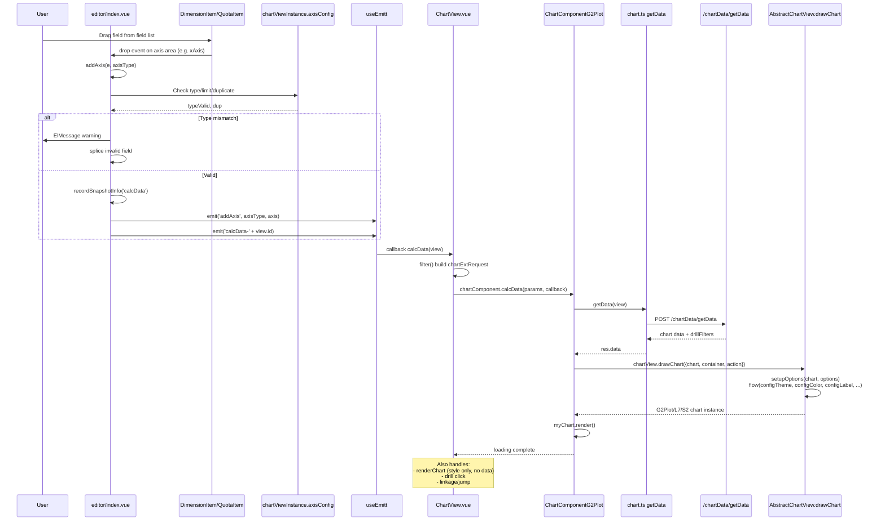

# 图表编辑器视图（views/chart）分析（v2.10.7）

## 1. 职责与架构位置

`views/chart/` 是 DataEase 前端**最大的单一视图目录**，承担图表编辑器的全部职责：

- **图表配置**：图表类型选择、字段拖拽映射（维度/指标到 xAxis/yAxis/extStack 等）、排序、过滤、下钻
- **样式配置**：基础样式（颜色/透明度/线宽）、标签、提示、图例、坐标轴、表格表头/单元格/汇总
- **高级配置**：辅助线、阈值、滚动、地图映射、气泡动画
- **数据渲染**：根据图表类型分发到 AntV G2Plot / AntV L7 / AntV L7Plot / AntV S2 四套渲染引擎
- **交互联动**：下钻、联动、跳转的触发与状态管理
- **与后端交互**：通过 `@/api/chart` 调用 `ChartDataApi`（获取图表数据）和 `ChartViewApi`（保存图表配置、获取字段）

**架构位置**：图表编辑器被仪表板编辑器（`views/dashboard/`）和大屏编辑器（`views/data-visualization/`）作为**子组件**嵌入。`ChartView.vue` 是图表渲染的外层容器，`components/editor/index.vue` 是配置面板，`components/views/index.vue` 是预览/渲染面板。`views/chart/index.vue` 仅是调试页面，生产入口不经过它。

## 2. 目录结构与文件分类（按子目录或功能分类，表格列出关键组件）

### 2.1 顶层文件

| 文件 | 类型 | 职责 |
|------|------|------|
| `index.vue` | 调试页 | 调试测试页面，非生产入口，组合 editor + chart |
| `ChartView.vue` | 渲染容器 | 图表预览区容器，管理标题、loading、下钻路径、联动/跳转、刷新计时器，根据 chartViewManager 分发到具体渲染组件 |

### 2.2 `components/editor/` — 配置面板

| 子目录/文件 | 文件数 | 职责 |
|-------------|--------|------|
| `index.vue` | 1 | **编辑器主面板**，约 1960 行 script + 大量模板。管理 tab 切换（数据/样式/高级）、字段列表、拖拽轴容器、所有配置变更回调 |
| `chart-type/ChartType.vue` | 1 | 图表类型选择器，按类别展示 `CHART_TYPE_CONFIGS` |
| `dataset-select/DatasetSelect.vue` | 1 | 数据集选择器 |
| `drag-item/` | 8 | 拖拽字段项组件：DimensionItem（维度项）、QuotaItem（指标项）、DrillItem（下钻项）、FilterItem（过滤项）、DragPlaceholder（占位符），以及 components/ 下的 CompareEdit（同比环比）、CustomSortEdit（自定义排序）、SortPriorityEdit（排序优先级）、ValueFormatterEdit（数值格式化）、compare.ts/utils.ts |
| `drag-label/` | 2 | DimensionLabel、QuotaLabel，拖拽源标签 |
| `editor-style/` | 36 | 样式配置面板：ChartStyle（总入口）、ChartStyleBatchSet（批量设置）、VQueryChartStyle（查询组件样式），及 components/ 下 33 个选择器：BasicStyleSelector、ColorSelector、LabelSelector、TooltipSelector、LegendSelector、XAxisSelector、YAxisSelector、DualYAxisSelector、TitleSelector、MiscSelector、MiscStyleSelector、QuadrantSelector、FlowMapLineSelector、FlowMapPointSelector、GradientColorSelector、CustomColorStyleSelect、IndicatorValueSelector、IndicatorNameSelector、SymbolicStyleSelector、SummarySelector，以及 table/ 下（TableCellSelector、TableHeaderSelector、TableTotalSelector、TableHeaderGroupConfig、CustomAggrEdit）和 bullet/ 下（BulletMeasureSelector、BulletRangeSelector、BulletTargetSelector） |
| `editor-senior/` | 10 | 高级配置面板：Senior（总入口），及 components/ 下（FunctionCfg、AssistLine、Threshold、ScrollCfg、MapMapping、BubbleAnimateCfg），及 dialog/ 下（AssistLineEdit、LineThresholdEdit、TableThresholdEdit、TextThresholdEdit、TextLabelThresholdEdit、PictureGroupThresholdEdit） |
| `filter/` | 9 | 过滤器：FilterTree（过滤树）、QuotaFilterEditor（指标过滤）、ResultFilterEditor（结果过滤）、TimeDialog（时间对话框），及 auth-tree/ 和 auth-tree-chart/ 下各 AuthTree/FilterFiled/RowAuth |
| `common/` | 3 | ChartTemplateInfo、TableTooltip、TemplateTips |
| `util/` | 3 | chart.ts（核心配置常量与工具函数）、dataVisualization.ts（仪表板样式常量）、StringUtils.ts |

### 2.3 `components/views/` — 渲染面板

| 文件 | 职责 |
|------|------|
| `index.vue` | 渲染面板容器，根据 `chartViewManager.getChartView(render, type).library` 分发到 ChartComponentG2Plot / ChartComponentS2 / DeIndicator / DeRichTextView / DePictureGroup / 插件组件 |
| `components/ChartComponentG2Plot.vue` | **G2Plot/L7 渲染组件**，调用 `getData` API 获取数据，再调用 `chartView.drawChart` 绘制 |
| `components/ChartComponentS2.vue` | **S2 表格渲染组件**，处理分页、表格交互 |
| `components/ChartEmptyInfo.vue` | 空数据占位 |
| `components/ChartError.vue` | 错误提示 |
| `components/DrillPath.vue` | 下钻路径面包屑 |
| `components/ScrollShadow.vue` | 滚动阴影 |
| `util/util.ts` | 渲染工具 |

### 2.4 `components/js/` — 图表类型实现层（核心架构）

| 子目录 | 文件数 | 职责 |
|--------|--------|------|
| `panel/index.ts` | 1 | **ChartViewManager**：使用 `import.meta.glob` 自动扫描注册所有图表类 |
| `panel/types/index.ts` | 1 | 抽象基类：AbstractChartView、AntVAbstractChartView、EchartsChartView，定义 axis/axisConfig/properties/propertyInner 抽象接口 |
| `panel/types/impl/g2plot.ts` | 1 | G2PlotChartView 抽象类，封装 G2Plot Plot 的 drawChart/render/destroy，提供 configTheme/configLabel/configTooltip 等流式配置方法 |
| `panel/types/impl/l7plot.ts` | 1 | L7PlotChartView 抽象类，用于地图类（Choropleth） |
| `panel/types/impl/l7.ts` | 1 | L7ChartView 抽象类，用于 L7 图层类（流向图、热力图等） |
| `panel/types/impl/s2.ts` | 1 | S2ChartView 抽象类，用于 S2 表格 |
| `panel/common/common_antv.ts` | 1 | AntV 公共配置函数：getLabel/getLegend/getTooltip/getXAxis/getYAxis/getAnalyse/getConditions 等 |
| `panel/common/common_table.ts` | 1 | S2 表格公共配置函数：getCustomTheme/getStyle/getConditions/configHeaderInteraction 等 |
| `panel/charts/bar/` | 8 | 柱状图族：bar.ts（Bar/StackBar/GroupBar/GroupStackBar/PercentageStackBar）、bidirectional-bar.ts、bullet-graph.ts、common.ts、horizontal-bar.ts、progress-bar.ts、range-bar.ts、waterfall.ts |
| `panel/charts/line/` | 4 | 折线图族：line.ts、area.ts、stock-line.ts、common.ts |
| `panel/charts/pie/` | 3 | 饼图族：pie.ts、rose.ts、common.ts |
| `panel/charts/map/` | 7 | 地图族：map.ts（Map extends L7PlotChartView）、bubble-map.ts、flow-map.ts、heat-map.ts、symbolic-map.ts、common.ts、tooltip-carousel.ts |
| `panel/charts/table/` | 5 | 表格族：table-info.ts、table-normal.ts、table-pivot.ts、t-heatmap.ts、common.ts |
| `panel/charts/others/` | 14 | 其他图表：chart-mix.ts、chart-mix-common.ts、circle-packing.ts、funnel.ts、gauge.ts、indicator.ts、picture-group.ts、quadrant.ts、radar.ts、rich-text.ts、sankey.ts、sankey-common.ts、scatter.ts、treemap.ts、word-cloud.ts |
| `panel/charts/liquid/` | 1 | 水波球：liquid.ts |
| `util.ts` | 1 | 图表工具函数：flow（管道式配置组合）、parseJson、hexColorToRGBA、getColor/getGroupColor/getStackColor 等 |
| `formatter.ts` | 1 | 数值格式化：formatterItem、valueFormatter |
| `extremumUitl.ts` | 1 | 极值标注工具 |
| `g2plot_tooltip_carousel.ts` | 1 | G2Plot tooltip 轮播 |

## 3. 图表编辑器整体结构（Mermaid：编辑器布局/组件树/数据流，英文标签）



## 4. 核心交互流程（Mermaid：字段拖拽→图表配置→数据查询→渲染，英文标签）



## 5. 图表类型体系（支持的图表类型、类型切换逻辑、与 ECharts/AntV 的映射）

### 5.1 渲染引擎与图库映射

DataEase v2.10.7 已完全弃用 ECharts，所有图表均基于 AntV 系列渲染。`ChartRenderType` 枚举定义于 `panel/types/index.ts:5-9`：

| ChartRenderType | ChartLibraryType | 渲染组件 | 适用图表 |
|----------------|-----------------|----------|----------|
| `antv` | `G2_PLOT` | ChartComponentG2Plot.vue | 柱状图/折线/饼图/雷达/散点/漏斗/桑基/词云/矩形树图/象限图/仪表盘/水波球 |
| `antv` | `L7_PLOT` | ChartComponentG2Plot.vue | 地图（Map extends L7PlotChartView） |
| `antv` | `L7` | ChartComponentG2Plot.vue | 气泡地图/流向图/热力地图/符号地图 |
| `antv` | `S2` | ChartComponentS2.vue | 明细表/汇总表/透视表/热力表 |
| `custom` | `INDICATOR` | DeIndicator.vue | 指标卡 |
| `custom` | `RICH_TEXT` | DeRichTextView.vue | 富文本 |
| `custom` | `PICTURE_GROUP` | DePictureGroup.vue | 图片组 |

### 5.2 支持的图表类型（CHART_TYPE_CONFIGS）

定义于 `editor/util/chart.ts:1246-1639`，按 9 大类别组织：

| 类别 (category) | 图表类型 (value) | 文件 |
|------------------|-----------------|------|
| **quota** (指标) | gauge, liquid, indicator | `others/gauge.ts`, `liquid/liquid.ts`, `others/indicator.ts` |
| **table** (表格) | table-info, table-normal, table-pivot, t-heatmap | `table/*.ts` |
| **trend** (趋势) | line, area, area-stack | `line/*.ts` |
| **compare** (比较) | bar, bar-stack, percentage-bar-stack, bar-group, bar-group-stack, waterfall, bar-horizontal, bar-stack-horizontal, percentage-bar-stack-horizontal, bar-range, bidirectional-bar, progress-bar, stock-line, bullet-graph | `bar/*.ts` |
| **distribute** (分布) | pie, pie-donut, pie-rose, pie-donut-rose, radar, treemap, word-cloud | `pie/*.ts`, `others/radar.ts`, `others/treemap.ts`, `others/word-cloud.ts` |
| **map** (地图) | map, bubble-map, flow-map, heat-map, symbolic-map | `map/*.ts` |
| **relation** (关系) | scatter, quadrant, funnel, sankey, circle-packing | `others/*.ts` |
| **dual_axes** (双轴) | chart-mix, chart-mix-group, chart-mix-stack, chart-mix-dual-line | `others/chart-mix.ts` |
| **other** (其他) | rich-text, picture-group | `others/rich-text.ts`, `others/picture-group.ts` |

共计 **约 40 种图表类型**。

### 5.3 类型切换逻辑

切换入口在 `editor/index.vue:968-1038` 的 `onTypeChange(render, type)` 方法：

1. 调用 `getViewConfig(type)` 获取图表配置
2. 若 `isPlugin`，设置 `view.plugin = { isPlugin: true, staticMap }`
3. 设置 `view.render = render`，`view.type = type`
4. emit `chart-type-change` 和 `chart-type-change-{id}` 事件
5. 通过 `chartViewManager.getChartView(render, type)` 获取新的图表实例
6. 调用 `chartViewInstance.setupDefaultOptions(view)` 处理默认值
7. **轴清理**：遍历 `axisConfig`，检查已有字段是否符合新图表的类型约束（`type: 'd'|'q'`）和数量限制（`limit`），移除不符合的字段
8. 特殊处理：`line` 类型 yAxis 限制为 1 个；`liquid/gauge/indicator` 清除下钻字段
9. 调用 `calcData(view.value, true)` 重新查询并渲染

### 5.4 ChartViewManager 自动注册机制

`panel/index.ts:22-31` 使用 Vite 的 `import.meta.glob` **自动扫描** `charts/**/*.ts`（排除 `common.ts`），检测所有 `AbstractChartView` 子类并实例化注册：

```typescript
const charts = import.meta.glob(['./charts/**/*.ts', '!**/common.ts'], { eager: true })
for (const chart in charts) {
  const chartModule = charts[chart]
  Object.getOwnPropertyNames(chartModule).forEach(prop => {
    if (isParent(chartModule[prop], AbstractChartView)) {
      const chartView = new chartModule[prop]() as AbstractChartView
      chartViewManager.registerChartView(chartView.render, chartView.name, chartView)
    }
  })
}
```

注册键为 `render + name`（如 `antv:bar`），查询时 `chartViewManager.getChartView(render, type)` 返回对应实例。

## 6. 与后端的交互（chart.ts API 调用、ChartDataApi/ChartViewApi 对应）

### 6.1 API 层定义

`@/api/chart.ts` 定义了前端与后端的所有交互接口：

| 前端函数 | 后端路径 | 对应后端 API | 调用场景 |
|---------|----------|-------------|----------|
| `getFieldByDQ(id, chartId, data)` | POST `/chart/listByDQ/{id}/{chartId}` | ChartViewApi | 编辑器加载数据集字段（维度/指标列表） |
| `getData(data)` | POST `/chartData/getData` | ChartDataApi | **核心**：获取图表数据，携带完整 view 配置 + chartExtRequest 过滤参数 |
| `getChart(id)` | POST `/chart/getChart/{id}` | ChartViewApi | 通过 ID 获取单个图表配置 |
| `saveChart(data)` | POST `/chart/save` | ChartViewApi | 保存图表配置 |
| `getChartDetail(id)` | POST `/chart/getDetail/{id}` | ChartViewApi | 获取图表详情 |
| `getFieldData({fieldId, fieldType, data})` | POST `/chartData/getFieldData/{fieldId}/{fieldType}` | ChartDataApi | 获取单个字段枚举值（过滤器使用） |
| `getDrillFieldData({fieldId, data})` | POST `/chartData/getDrillFieldData/{fieldId}` | ChartDataApi | 获取下钻字段枚举值 |
| `copyChartField(id, chartId)` | POST `/chart/copyField/{id}/{chartId}` | ChartViewApi | 复制图表计算字段 |
| `deleteChartField(id)` | POST `/chart/deleteField/{id}` | ChartViewApi | 删除图表计算字段 |
| `deleteChartFieldByChartId(chartId)` | POST `/chart/deleteFieldByChart/{chartId}` | ChartViewApi | 按 chartId 删除字段 |
| `checkSameDataSet(viewIdSource, viewIdTarget)` | GET `/chart/checkSameDataSet/{src}/{tgt}` | ChartViewApi | 检查两个图表是否同数据集 |
| `innerExportDetails(data)` | POST `/chartData/innerExportDetails` | ChartDataApi | 导出明细 |
| `innerExportDataSetDetails(data)` | POST `/chartData/innerExportDataSetDetails` | ChartDataApi | 导出数据集明细 |

### 6.2 数据流路径

**配置加载**：编辑器打开时，`editor/index.vue:280-309` 的 `getFields(tableId, chartId, type)` 调用 `getFieldByDQ` 获取维度和指标字段列表，存入 `state.dimension` / `state.quota`。

**数据查询**：`ChartView.vue:556-566` 的 `queryData()` → `filter()` 构建过滤参数 → `calcData(params)` → `chartComponent.calcData(params, callback)` → `ChartComponentG2Plot.vue:265-316` 的 `calcData` → `getData(view)` API 调用 → 后端返回 `{data, drillFilters, ...}`。

**过滤参数组装**：`ChartView.vue:370-394` 的 `filter()` 方法组装 `chartExtRequest`，包含：
- `user`: 用户 uid
- `filter`: 组件过滤条件（来自 `useFilter` hook）
- `linkageFilters`: 联动过滤条件
- `outerParamsFilters`: 外部参数过滤
- `webParamsFilters`: Web 参数过滤
- `drill`: 下钻维度列表
- `resultCount` / `resultMode`: 仪表板结果集限制

**渲染调用**：`ChartComponentG2Plot.vue:318-347` 的 `renderChart` 方法，先 `defaultsDeep(view, BASE_VIEW_CONFIG)` 合并默认配置，然后 `recursionTransObj` 缩放样式，最后按 `chartView.library` 分发到 `renderG2Plot` / `renderL7Plot` / `renderL7`。

### 6.3 事件总线通信

编辑器与渲染组件之间通过 `useEmitt` 事件总线通信，关键事件：

| 事件名 | 触发方 | 接收方 | 用途 |
|--------|--------|--------|------|
| `calcData-{viewId}` | editor | ChartView | 重新查询数据并渲染 |
| `renderChart-{viewId}` | editor | ChartView | 仅重新渲染（不查数据） |
| `chart-type-change` / `chart-type-change-{viewId}` | editor | ChartView | 图表类型变更 |
| `addAxis` / `removeAxis` / `updateAxis` | editor | 渲染组件 | 轴字段增删改 |
| `resetDrill-{viewId}` | editor | ChartView | 重置下钻 |
| `clearPanelLinkage` | ChartView | 渲染组件 | 清除联动 |
| `snapshotChangeToView` | snapshotStore | ChartView | 快照变更触发重渲染 |
| `dataset-change` | editor | ChartView | 数据集变更检查空数据 |
| `checkShowEmpty` | editor | ChartView | 检查字段是否允许空 |
| `query-data-{viewId}` | 外部 | ChartView | 外部触发查询 |

## 7. 风险与待确认 ([Need Verification])

1. **[Need Verification]** `editor/index.vue` 单文件超过 2000 行（script 约 1960 行 + 模板约 1000+ 行），存在维护风险。是否应拆分为多个子组件？[Inference] 当前设计将所有配置变更回调集中在一个组件中，便于统一管理 `view` 对象，但可读性较差。

2. **[Need Verification]** `ChartView.vue` 的 `filter()` 方法中包含定时报告逻辑（`route.path === '/preview' && route.query.taskId`），将过滤参数写入 `window['de-report-filter-${sceneId}']`。[Inference] 这与后端定时报告功能配合，需确认后端 `report` 模块如何消费此数据。

3. **[Need Verification]** `panel/index.ts` 的 `import.meta.glob` 自动注册机制依赖 Vite 构建时的静态分析。若图表类文件未在 `charts/**/*.ts` 路径下或类名不以 `AbstractChartView` 为父类，将不会被注册。[Inference] 插件图表通过 `XpackComponent` 的 `loadPluginCategory` 事件动态加载，不走此注册机制。

4. **[Need Verification]** `ChartComponentG2Plot.vue` 中 `renderG2Plot` 使用 `setTimeout(300ms)`、`renderL7Plot` 使用 `setTimeout(500ms)` 防抖。[Inference] 这是为了等待 DOM 尺寸稳定后再渲染，但在频繁切换图表时可能导致中间状态闪烁。

5. **[Need Verification]** `CHART_TYPE_CONFIGS` 中 `radar` 图表的 `category` 值为 `'chart.chart_type_distribute'`（chart.ts:1478），与其他条目的 `'distribute'` 不一致，可能是笔误，[Inference] 这可能导致雷达图在 ChartType.vue 的类别高亮逻辑中出现异常。

6. **[Need Verification]** `DEFAULT_TAB_COLOR_CASE_LIGHT` 的颜色值为 `'#OOOOOO'`（chart.ts:230-233），`O` 而非 `0`，疑似笔误。

7. **[Need Verification]** `editor/index.vue` 的 `drop` 方法（第 1922-1938 行）同时支持 HTML5 原生 drag-drop 和 vuedraggable 的 `@add`，两套拖拽机制并存，[Inference] 原生 `drop` 用于从字段列表多选拖入，`@add` 用于 vuedraggable 内部排序。

8. **[Need Verification]** `ChartView.vue` 的 `checkFieldIsAllowEmpty` 方法（第 616-694 行）用于检查图表字段是否存在于数据集中，逻辑较复杂，[Inference] 当切换数据集导致字段丢失时显示空图表占位，需确认与后端 `chartDataApi` 的空数据策略如何配合。

9. **[Need Verification]** `chart.ts` API 中未发现更新图表配置（update）的独立接口，[Inference] `saveChart` 同时承担新建和更新职责，由后端根据 `id` 是否存在区分。

## 8. 相关文档（相对路径）

- `infrastructure.md` — 前端整体架构、Vite 构建、Pinia store（dvMainStore/snapshotStore）
- `api-layer.md` — `@/api/chart.ts` 的完整 API 定义、axios 封装、请求/响应拦截
- `../backend/visualization.md` — 后端 ChartDataApi/ChartViewApi 实现细节
- `../backend/dataset.md` — 数据集字段管理（与 `getFieldByDQ` 对应）
