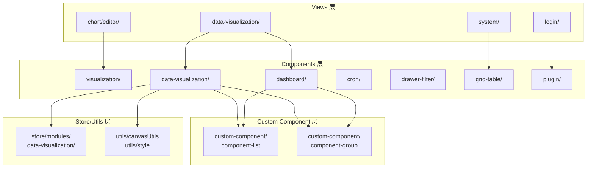
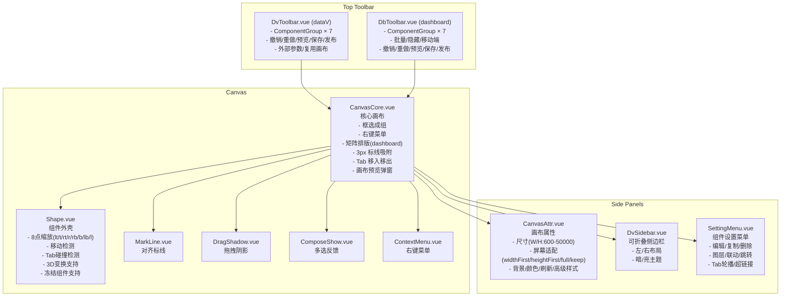
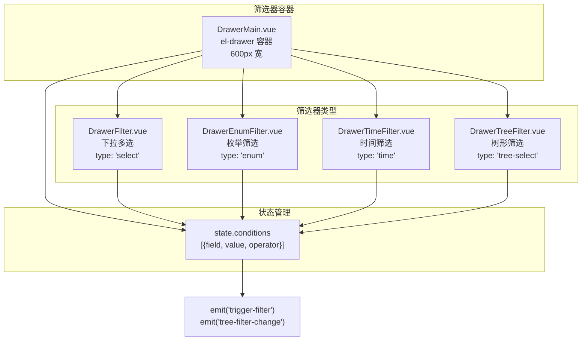
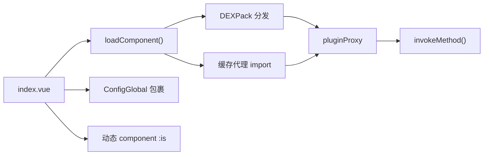

# 共享组件库（components）分析（v2.10.7）

> 源码根：`core/core-frontend/src/components/`，共约 133 个 `.vue/.ts` 文件。

## 1. 职责与架构位置

`components/` 是 DataEase 前端 **全局可复用组件库**，服务于整个应用（包括仪表板编辑、数据大屏编辑、图表视图、登录、系统管理等）。其核心职责：

1. **可视化编辑器基础设施**：提供画布（CanvasCore）、组件外壳（Shape/ComponentWrapper）、工具栏（DvToolbar/DbToolbar）、属性面板（CanvasAttr）等编辑器的核心 UI。
2. **图表交互功能 UI**：联动设置（LinkageSet）、跳转设置（LinkJumpSet）、超链接配置、组件编辑栏（ComponentEditBar）等。
3. **筛选器组件体系**：抽屉筛选器（DrawerFilter/DrawerEnumFilter/DrawerTimeFilter/DrawerTreeFilter）及其容器（DrawerMain）。
4. **通用 UI 组件**：表格（GridTable）、树形选择（TreeSelect）、定时表达式（Cron）、富文本编辑器（TinymceEditor）、图标映射（icon-group）、侧边栏（DvSidebar）等。
5. **插件运行容器**：提供 XPack 插件动态加载和通讯机制。
6. **全局配置注入**：ConfigGlobal 提供 Element Plus 的 ElConfigProvider 包裹。

**架构层**：components/ 处于视图层（views/）和工具/状态层（store/、utils/）之间，被 views 层消费，同时自身依赖 custom-component/ 获取业务组件（图表组件分组列表等）。



**与 custom-component/ 的边界**：components/ 是编辑器"骨架"，custom-component/ 是"血肉"。components/ 通过 `import componentList from '@/custom-component/component-list'` 获取组件注册表，通过 `import ...Group from '@/custom-component/component-group/...Group.vue'` 加载工具栏分组。两者形成**框架—内容分离**的架构。

## 2. 目录结构与组件分类

| 目录/组件 | 文件数 | 核心职责 | 关键 Props/Emits | 备注 |
|-----------|--------|----------|------------------|------|
| **data-visualization/** | 26 | 数据大屏编辑器基础设施 | canvasStyleData, componentData, canvasId | 编辑器核心 |
| **visualization/** | 36 | 可视化通用共享 UI | element, showPosition, themes | 被 chart 编辑器和大屏编辑器共用 |
| **dashboard/** | 14 | 仪表板编辑器专用组件 | dvInfo, editMode | 与 data-visualization 并行功能 |
| **cron/** | 8 | 定时表达式配置 | modelValue, isRate | 秒/分/时/日/月/周/年分标签页 |
| **icon-group/** | 6 | 图标名称映射（.ts） | — | chart-list/field-list/datasource-list 等 |
| **plugin/** | 5 | XPack 插件加载器 | jsname（base64 编码路径） | 动态 import + DEXPack 分发 |
| **drawer-filter/** | 5 | 筛选器抽屉组件 | optionList, property | 支持 select/enum/time/tree-select |
| **grid-table/** | 3 | 通用表格组件 | columns, tableData, pagination | 基于 el-table 封装 |
| **tree-select/** | 2 | 树形选择器 | width | 基于 el-tree-select，lazy load |
| **rich-text/** | 2 | 富文本编辑器 | modelValue, inline | 基于 TinyMCE |
| **config-global/** | 2 | 全局 ElConfigProvider | — | namespace="ed" |
| **drawer-main/** | 2 | 筛选器抽屉容器 | filterOptions | 组合 DrawerFilter 等子组件 |
| **empty-background/** | 2 | 空白占位图 | description, imgType | — |
| **filter-text/** | 2 | 筛选条件文本展示 | filterTexts, total | 可滚动标签列表 |
| **icon-custom/** | 2 | SVG 图标包装器 | name | — |
| **color-scheme/** | 2 | 配色方案 | — | — |
| **column-list/** | 2 | 列列表 | — | — |
| **collapse-switch-item/** | 2 | 可折叠开关项 | — | — |
| **custom-password/** | 2 | 密码输入框 | — | — |
| **handle-more/** | 2 | 更多操作 | — | DvHandleMore/HandleMore |
| **watermark/** | 1 | 水印逻辑 | — | watermark.ts 工具函数 |
| **de-app/** | 1 | 应用导出表单 | — | AppExportForm.vue |
| **de-board/** | 1 | 边框装饰组件 | name | Board.vue，渲染 SVG 边框 |
| **relation-chart/** | 1 | 关系图 | — | — |
| **assist-button/** | 1 | 颜色按钮 | — | ColorButton.vue |
| **common/** | 1 | 通用空状态 | — | DeEmpty.vue |

### 详细文件清单

#### data-visualization/ (26 files)

| 文件名 | 职责 |
|--------|------|
| `canvas/CanvasCore.vue` | **核心画布**：拖拽、缩放、框选成组、右键菜单、标线、Tab 碰撞检测、矩阵排版 |
| `canvas/Shape.vue` | **组件外壳**：8 点缩放、旋转光标、移动、Tab 移入移出检测、3D 变换 |
| `canvas/ComponentWrapper.vue` | **预览态组件包装器**：编辑栏、事件处理（跳转/刷新/全屏/下载）、3D 效果 |
| `canvas/ComposeShow.vue` | 多选成组视觉反馈 |
| `canvas/ContextMenu.vue` | 右键菜单容器 |
| `canvas/ContextMenuDetails.vue` | 右键菜单具体操作 |
| `canvas/ContextMenuAsideDetails.vue` | 侧边右键菜单 |
| `canvas/DePreview.vue` | 预览画布 |
| `canvas/DragShadow.vue` | 拖拽阴影 |
| `canvas/LinkOptBar.vue` | 联动操作条 |
| `canvas/MarkLine.vue` | **对齐标线**：6 条线（xt/xc/xb/yl/yc/yr），3px 吸附 |
| `canvas/PGrid.vue` | 网格辅助 |
| `canvas/PointShadow.vue` | Tab 移出阴影点 |
| `DvToolbar.vue` | **大屏工具栏**：ComponentGroup 分组 + 保存/发布/预览/撤销/重做/外部参数 |
| `DbToolbar.vue` | **仪表板工具栏**：类似的 ComponentGroup 组合 + 批量操作/隐藏/移动端切换 |
| `CanvasAttr.vue` | **画布属性面板**：尺寸/屏幕适配/基础配置/背景/颜色/刷新/高级样式 |
| `ComponentList.vue` | 组件列表（基于 custom-component/component-list） |
| `ComponentToolBar.vue` | 组件工具栏 |
| `DeGrid.vue` | 仪表板网格线（SVG pattern） |
| `DeGridScreen.vue` | 大屏网格线 |
| `EventList.vue` | 事件列表 |
| `Modal.vue` | 弹窗 |
| `RealTimeGroup.vue` | 实时数据分组 |
| `RealTimeGroupInner.vue` | — |
| `RealTimeListTree.vue` | — |
| `RealTimeTab.vue` | — |

#### visualization/ (36 files)

| 文件名 | 职责 |
|--------|------|
| `CanvasBaseSetting.vue` | 画布基础设置 |
| `CanvasCacheDialog.vue` | 画布缓存弹窗 |
| `CanvasExtFullscreenBar.vue` | 扩展全屏工具条 |
| `CanvasOptBar.vue` | 画布操作条 |
| `ComponentButton.vue` | 组件按钮（Tooltip + Icon） |
| `ComponentButtonLabel.vue` | 带文字标签的组件按钮 |
| `ComponentEditBar.vue` | **行内编辑栏**：放大/数据详情/导出/删除/隐藏/复用/批量操作/联动取消 |
| `ComponentGroup.vue` | **工具栏分组弹出框**（el-popover 包装 ComponentButton） |
| `ComponentSelector.vue` | 组件选择器 |
| `DatasetParamsComponent.vue` | 数据集参数组件 |
| `DatasetParamsSettingDialog.vue` | 数据集参数设置弹窗 |
| `DePreviewPopDialog.vue` | 预览弹出弹窗 |
| `DvSidebar.vue` | **可折叠侧边栏**：标题区域 + scollbar 内容区，支持左/右布局 |
| `EditMenu.vue` | 编辑菜单 |
| `FieldsList.vue` | 字段列表 |
| `HyperlinksDialog.vue` | 超链接设置弹窗 |
| `JumpSetOuterContentEditor.vue` | 跳转外部内容编辑器 |
| `LinkJumpSet.vue` | **跳转设置** |
| `LinkageSet.vue` | **联动设置**：相同/不同数据集联动字段映射 |
| `LinkageSetOption.vue` | 联动操作选项 |
| `OuterParamsSet.vue` | 外部参数设置 |
| `SettingMenu.vue` | **组件右键/设置菜单**：编辑/复制/删除/图层/联动/跳转/轮播/超链接 |
| `StreamMediaLinks.vue` | 流媒体链接 |
| `TabCarouselDialog.vue` | Tab 轮播设置 |
| `UserViewEnlarge.vue` | 视图放大详情 |
| `ViewTrackBar.vue` | 视图跟踪条 |
| `common/ComponentPosition.vue` | 组件位置调整 |
| `common/DeFullscreen.vue` | 全屏组件 |
| `common/DeUpload.vue` | 上传组件 |
| `common/DragInfo.vue` | 拖拽提示信息 |
| `component-background/BackgroundItem.vue` | 单个背景设置 |
| `component-background/BackgroundItemOverall.vue` | 整体背景设置项 |
| `component-background/BackgroundOverallCommon.vue` | 通用背景设置 |
| `component-background/BoardItem.vue` | 边框项 |
| `component-background/BorderOptionPrefix.vue` | 边框选项前缀 |
| `component-background/CanvasBackground.vue` | 画布背景设置 |

#### dashboard/ (14 files)

| 文件名 | 职责 |
|--------|------|
| `DashboardHiddenComponent.vue` | 隐藏组件管理 |
| `DbCanvasAttr.vue` | 仪表板画布属性 |
| `DbDragArea.vue` | 仪表板拖拽热区（上/右/下/左四条边） |
| `DbToolbar.vue` | 仪表板工具栏 |
| `subject-setting/dashboard-style/ComponentColorSelector.vue` | 组件颜色选择器 |
| `subject-setting/dashboard-style/FilterStyleSelector.vue` | 筛选器样式选择 |
| `subject-setting/dashboard-style/FilterStyleSimpleSelector.vue` | 简化筛选器样式 |
| `subject-setting/dashboard-style/OverallSetting.vue` | 整体设置（自动刷新） |
| `subject-setting/dashboard-style/SeniorStyleSetting.vue` | 高级样式设置 |
| `subject-setting/dashboard-style/ViewSimpleTitle.vue` | 简化标题 |
| `subject-setting/dashboard-style/ViewTitle.vue` | 视图标题 |
| `subject-setting/pre-subject/Slider.vue` | 滑动条 |
| `subject-setting/pre-subject/SubjectEditDialog.vue` | 主题编辑弹窗 |
| `subject-setting/pre-subject/SubjectTemplateItem.vue` | 主题模板项 |

#### 其他通用组件

| 文件 | 职责 |
|------|------|
| `cron/src/Cron.vue` | Cron 主组件：7 个标签页 + 底部表格汇总 |
| `cron/src/SecondAndMinute.vue` | 秒/分钟配置 |
| `cron/src/Hour.vue` | 小时配置 |
| `cron/src/Day.vue` | 日配置 |
| `cron/src/Month.vue` | 月配置 |
| `cron/src/Week.vue` | 周配置 |
| `cron/src/Year.vue` | 年配置 |
| `cron/index.ts` | 入口导出 |
| `plugin/src/index.vue` | **插件加载器**：支持缓存代理 import、DEXPack 分发、动态组件渲染 |
| `plugin/src/convert.js` | 解密/转换工具 |
| `plugin/src/nolic.vue` | 无授权占位 |
| `plugin/src/PluginComponent.vue` | 单个插件加载 |
| `plugin/index.ts` | 入口导出（XpackComponent/PluginComponent） |
| `drawer-filter/src/DrawerFilter.vue` | 下拉多选筛选器 |
| `drawer-filter/src/DrawerEnumFilter.vue` | 枚举筛选器 |
| `drawer-filter/src/DrawerTimeFilter.vue` | 时间筛选器 |
| `drawer-filter/src/DrawerTreeFilter.vue` | 树形选择筛选器 |
| `drawer-filter/index.ts` | 入口导出 |
| `drawer-main/src/DrawerMain.vue` | 筛选器抽屉容器：组合 4 种筛选器 + 查询/重置 |
| `drawer-main/index.ts` | — |
| `grid-table/src/GridTable.vue` | 通用表格：el-table + pagination + EmptyBackground |
| `grid-table/src/TableBody.vue` | 表体插槽透传 |
| `grid-table/index.ts` | — |
| `tree-select/src/TreeSelect.vue` | 树形选择器：el-tree-select + lazy load |
| `tree-select/index.ts` | — |
| `rich-text/TinymceEditor.vue` | TinyMCE 编辑器包装器 |
| `rich-text/TinymacEditorAlarm.vue` | TinyMCE 告警编辑器 |
| `filter-text/src/FilterText.vue` | 筛选条件文本展示（标签 + 清除） |
| `filter-text/index.ts` | — |
| `config-global/src/ConfigGlobal.vue` | ElConfigProvider 包装器（namespace="ed"） |
| `config-global/index.ts` | — |
| `icon-group/board-list.ts` | 边框 SVG 图标映射 |
| `icon-group/chart-list.ts` | 图表类型图标映射（iconChartMap） |
| `icon-group/chart-dark-list.ts` | 暗色图表图标映射（iconChartDarkMap） |
| `icon-group/datasource-list.ts` | 数据源图标映射 |
| `icon-group/field-list.ts` | 字段类型图标映射（iconFieldMap） |
| `icon-group/field-calculated-list.ts` | 计算字段图标映射 |
| `empty-background/src/EmptyBackground.vue` | 空状态占位组件 |
| `empty-background/index.ts` | — |
| `icon-custom/src/Icon.vue` | SVG 图标组件（支持 name 属性） |
| `icon-custom/index.ts` | — |
| `custom-password/src/CustomPassword.vue` | 密码输入框 |
| `custom-password/index.ts` | — |
| `color-scheme/src/ColorScheme.vue` | 配色方案组件 |
| `color-scheme/index.ts` | — |
| `column-list/src/ColumnList.vue` | 列列表 |
| `column-list/index.ts` | — |
| `collapse-switch-item/src/CollapseSwitchItem.vue` | 可折叠开关 |
| `collapse-switch-item/index.ts` | — |
| `handle-more/src/HandleMore.vue` | 通用"更多"操作组件 |
| `handle-more/src/DvHandleMore.vue` | 可视化"更多"操作 |
| `handle-more/index.ts` | — |
| `common/DeEmpty.vue` | 通用空状态 |
| `de-board/Board.vue` | SVG 边框渲染 |
| `de-app/AppExportForm.vue` | 应用导出表单 |
| `relation-chart/index.vue` | 关系图 |
| `assist-button/ColorButton.vue` | 颜色按钮 |
| `watermark/watermark.ts` | 水印工具函数（activeWatermarkCheckUser） |

## 3. 可视化编辑器组件体系

### 3.1 编辑器整体架构

DataEase 有两种编辑器模式：**数据大屏（dataV）** 和 **仪表板（dashboard）**。两者共享核心编辑器基础设施（CanvasCore + Shape），但在布局模式和工具栏上有差异。



### 3.2 拖拽机制

**两种拖拽模式**：

1. **仪表板矩阵模式**（`dvInfo.type === 'dashboard'`）：
   - CanvasCore 内建 `positionBox` 二维矩阵，组件占 `x, y, sizeX, sizeY`
   - 拖拽时实时计算矩阵碰撞，下方组件自动重排（`movePlayer()` / `resizePlayer()`）
   - 网格大小由 `baseWidth/baseHeight/baseMarginLeft/baseMarginTop` Props 控制
   - 通过 `eventBus` 与 Shape 通信：`handleDragStartMoveIn-c canvasId`、`handleDragEnd-c canvasId` 等

2. **数据大屏自由模式**（`dvInfo.type === 'dataV'`）：
   - 组件使用像素定位 (`style.top/left/width/height`)
   - 支持旋转 (`style.rotate`)
   - MarkLine 对齐吸附（3px 阈值内自动吸附）
   - MarkLine 根据旋转角度计算动态 cursor

**Shape 拖拽流程**（`Shape.vue:handleMouseDownOnShape`）：

```
mousedown → 计算移动起止偏移 → mousemove 实时更新 style →
→ dashboard模式：emit onDragging 触发矩阵重排
→ dataV模式：dvMainStore.setShapeStyle + 标线吸附
→ mouseup → snapshotStore.recordSnapshotCache
```

**Shape 缩放流程**（`Shape.vue:handleMouseDownOnPoint`）：

```
mousedown 在8个控制点之一 → calculateComponentPositionAndSize →
→ 保持宽高比（如果设置）→ setShapeStyle →
→ dashboard模式：emit onResizing 触发矩阵 resizing
→ 处理 Group/Tab 内子组件比例
→ mouseup → recordSnapshotCache
```

### 3.3 Tab 移入/移出机制

Shape.vue 实现了智能 Tab 交互（`CanvasCore.vue:1495-1547`）：

- **移出检测**：组件从当前 Tab 画布拖出超过 30px 边界时触发 `tabMoveOutComponentId`
- **移入检测**：组件拖到另一个 Tab 组件的中心区域（碰撞区域 + 移入有效区域两级检测）
- **碰撞视觉**：`tabCollisionActiveId` 高亮目标 Tab 边框

### 3.4 组件生命周期事件

CanvasCore 通过 eventBus 管理组件生命周期：

| Event | 来源 | 用途 |
|-------|------|------|
| `handleDragStartMoveIn-{canvasId}` | CanvasCore | 组件从工具栏拖入画布 |
| `handleDragEnd-{canvasId}` | CanvasCore | 组件拖拽释放 |
| `removeMatrixItem-{canvasId}` | CanvasCore | 删除组件（矩阵模式） |
| `removeMatrixItemById-{canvasId}` | CanvasCore | 按 ID 删除组件 |
| `addDashboardItem-{canvasId}` | CanvasCore | 仪表板添加组件 |
| `snapshotChange-{canvasId}` | CanvasCore | 快照变更时重新渲染 |
| `doCanvasInit-{canvasId}` | CanvasCore | 强制重新初始化画布 |
| `componentClick` | eventBus | 组件点击通知 |

### 3.5 快照系统

CanvasCore 内建 1 秒定时器将快照缓存到 store（`snapshotStore.snapshotCatchToStore()`），所有通过 CanvasCore 的操作变更都会记录快照以支持撤销/重做。

## 4. 筛选器组件体系

### 4.1 筛选器组件架构



### 4.2 筛选器类型详情

| 组件 | type 值 | 关键 Props | 数据操作符 | 特点 |
|------|---------|-----------|-----------|------|
| DrawerFilter | `select` | optionList, property | `in` | 基于 el-select multiple + filterable |
| DrawerEnumFilter | `enum` | optionList, title | `in` | 枚举值筛选 |
| DrawerTimeFilter | `time` | title, property | 自定义 operator | 时间范围筛选 |
| DrawerTreeFilter | `tree-select` | optionList, title, property | `in` | 树形下拉选择 |

### 4.3 筛选条件管理

DrawerMain 维护 `state.conditions` 数组，每个条件包含：
```ts
{
  field: string,   // 字段名
  value: any[],    // 筛选值
  operator: string // 操作符（默认 'in'）
}
```

**操作流程**：
1. 父组件传入 `filterOptions` 数组，每项定义 `type/field/option/title/property`
2. DrawerMain 按 `type` 渲染对应的筛选器子组件
3. 每个筛选器 `@filter-change` 触发 `filterChange(value, field, operator)`
4. 判断 conditions 中是否已存在相同 field，存在则更新，不存在且 value 非空则追加
5. 点击"搜索"按钮 → `emit('trigger-filter', state.conditions)`
6. 点击"重置" → 清除所有 conditions + 各子组件 `clear()` 方法

### 4.4 FilterText 展示组件

`filter-text/src/FilterText.vue` - 将筛选条件以标签形式水平展示，支持单个/全部清除，当标签超出容器宽度时显示左右滚动箭头。

## 5. 通用 UI 组件

### 5.1 GridTable（通用表格）

`grid-table/src/GridTable.vue` - 基于 Element Plus `el-table` 二次封装：
- **Props**: `columns`（列定义数组）, `tableData`, `pagination`, `isSearch`, `isRememberSelected`, `emptyDesc`
- **特性**: 
  - 内置分页器（el-pagination，layout: total, prev, pager, next, sizes, jumper）
  - 跨页记忆选中（`isRememberSelected`）
  - 空状态自动使用 EmptyBackground 组件
  - 表体通过 TableBody 组件透传 slot
- **消费方**：`views/share/ShareTicket.vue`, `views/share/ShareGrid.vue`, `views/workbranch/ShortcutTable.vue`

### 5.2 TreeSelect（树形选择器）

`tree-select/src/TreeSelect.vue` - 基于 Element Plus `el-tree-select` + lazy load：
- 当前实现含有硬编码的示例数据（组织部门），实际使用时应由父组件覆盖
- 支持 `filter-node-method` 过滤
- Props: `width`（默认 200px）

### 5.3 Cron（定时表达式编辑器）

`cron/src/Cron.vue` - 7 个标签页 + 底部表格汇总：
- **标签页**: 秒（s）→ 分钟（m）→ 小时（h）→ 日（d）→ 月（month）→ 周（week）→ 年（year）
- **验证规则**: 日和星期不能同时为 `?`，也不能同时不为 `?`
- **输出格式**: 标准 7 段 cron 表达式（`s m h d month week year`）
- **Props**: `modelValue`（v-model 双向绑定）, `isRate`（是否监听外部值变化）
- **子组件**: SecondAndMinute、Hour、Day、Month、Week、Year（均接收单独的 cron 子表达式段）

### 5.4 Plugin（插件加载器）

`plugin/src/index.vue` - XPack 插件系统的运行容器：



- **加载方式**：
  1. 优先检查 `window['DEXPack'].mapping[jsname]`（分布式部署模式）
  2. 否则通过 `load()` API 获取加密代码 → `convert.js` 解密 → 动态 `import()` → 缓存到 localStorage
- **注入全局变量**：Vue、Axios、Pinia、vue-router、i18n、echarts、tinymce、Mitt 事件总线
- **组件通信**：通过 `defineExpose({ invokeMethod })` 向父组件暴露方法调用
- **导出**: `XpackComponent`（默认）/ `PluginComponent`（独立插件加载）

### 5.5 TinymceEditor（富文本编辑器）

`rich-text/TinymceEditor.vue` - 基于 @tinymce/tinymce-vue：
- 支持内联编辑（`inline: true`）或标准模式
- 插件: advlist, autolink, link, image, lists, charmap, media, wordcount, table, contextmenu
- 汉化: 自定义 `language_url` 指向 `./tinymce-dataease-private/`

### 5.6 ConfigGlobal（全局配置）

`config-global/src/ConfigGlobal.vue` - ElConfigProvider 包装器：
- 设置 Element Plus 的 `namespace="ed"`（统一 CSS 类名前缀）
- 注入 `currentLocale` 多语言配置

## 6. 与其他模块的关系

### 6.1 被 views 层消费

| Views 模块 | 消费的 Components |
|------------|-------------------|
| `views/data-visualization/` | DePreview, CanvasOptBar, XpackComponent, EmptyBackground, Icon, AppExportForm |
| `views/chart/editor/` | CollapseSwitchItem, ComponentPosition, BackgroundOverallCommon, PluginComponent, XpackComponent, Icon, iconChartMap, iconFieldMap, iconFieldCalculatedMap |
| `views/login/` | Icon, CustomPassword, XpackComponent |
| `views/system/` | CustomPassword |
| `views/share/` | GridTable, CustomPassword, EmptyBackground |
| `views/workbranch/` | GridTable, XpackComponent |
| `views/copilot/` | iconFieldMap |
| `views/404/` `views/401/` | Icon |

### 6.2 与 custom-component 的关系

```
components/data-visualization/DvToolbar.vue
  → imports from custom-component/component-group/
    - UserViewGroup.vue    (视图组件分组)
    - MediaGroup.vue       (媒体组件分组)
    - TextGroup.vue        (文本组件分组)
    - CommonGroup.vue      (通用素材分组)
    - MoreComGroup.vue     (更多组件分组)
    - QueryGroup.vue       (查询组件分组)
    - TabsGroup.vue        (Tab组件分组)

components/dashboard/DbToolbar.vue
  → imports:
    - UserViewGroup, QueryGroup, MediaGroup, TextGroup
    - TabsGroup, DbMoreComGroup

components/data-visualization/ComponentList.vue
  → import componentList from '@/custom-component/component-list'

components/data-visualization/canvas/DePreview.vue
  → import PopArea, CanvasFilterBtn from custom-component/

components/visualization/ComponentEditBar.vue
  → import FieldsList, CustomTabsSort from custom-component/

components/visualization/component-background/*.vue
  → import ImgViewDialog from custom-component/
```

**边界总结**：
- **components** = 编辑器框架（画布/工具栏/属性面板/缩放拖拽/联动设置/筛选器）
- **custom-component** = 编辑器内容（具体的图表组件、组件分组列表、业务组件）
- **单向依赖**：components → custom-component（框架依赖内容），不可逆

### 6.3 与 store 的关系

`components/` 中几乎所有可视化相关组件都依赖以下 Pinia stores：
- `store/modules/data-visualization/dvMain` - 编辑器主状态（`componentData`, `curComponent`, `canvasStyleData`, `editMode` 等）
- `store/modules/data-visualization/snapshot` - 快照/撤销重做
- `store/modules/data-visualization/compose` - 多选成组状态
- `store/modules/data-visualization/contextmenu` - 右键菜单状态
- `store/modules/data-visualization/copy` - 复制粘贴
- `store/modules/data-visualization/layer` - 图层排序（置顶/置底/上移/下移）

## 7. 风险与待确认 `[Need Verification]`

1. **`tree-select/src/TreeSelect.vue`** 包含硬编码的组织部门测试数据（`loadNode` 方法），生产环境可能被覆盖，无法从当前代码确认实际数据源。[Need Verification]

2. **`cron/src/Cron.vue`** 中 `isRate` prop 名称含义不明确（推测与"频率刷新"相关），其具体使用场景需确认。[Need Verification]

3. **`plugin/src/index.vue`** 中 `loadDistributed()` 和 `window['DEXPack']` 的初始化时机：首次加载时设置 `window._de_xpack_not_loaded = true`，依赖 `'load-xpack'` 事件回调，存在竞态条件风险。[Need Verification]

4. **`data-visualization/canvas/Shape.vue`** 中 `boardMoveActive` 计算属性硬编码了特定图表类型列表（flow-map, map, bubble-map 等），这些类型需要持续维护与 `custom-component` 同步。[Inference]

5. **仪表板矩阵模式**中 `positionBox` 的二维数组大小随组件动态扩展，当组件极多时可能有性能问题（O(n²) 碰撞检测）。[Inference]

6. **MarkLine 吸附**在旋转组件上的偏移计算（`translateCurComponentShift`），当前实现仅处理宽高差的一半，对非正方形旋转组件的吸附精度可能不足。[Inference]

7. **`drawer-filter/src/DrawerFilter.vue`** 与 **`drawer-filter/src/DrawerEnumFilter.vue`** 功能相似度较高（均为下拉多选），具体差异需进一步确认。[Need Verification]

8. **icon-group/** 中的图标映射文件（`chart-list.ts` 等）仅导出 `Map` 对象，其被引用时作为全局图标注册表，是否包含完整的图表类型列表需与实际业务对比确认。[Need Verification]

## 8. 相关文档

- 基础设施规范：`infrastructure.md`
- 可视化视图分析：`visualization-views.md`
- 自定义组件分析：`custom-component.md`
- 后端可视化分析：`../backend/visualization.md`
