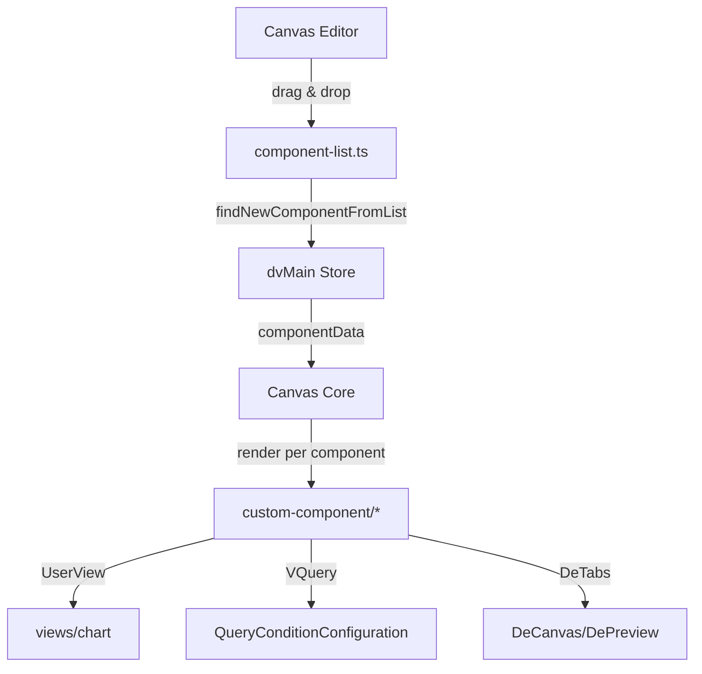
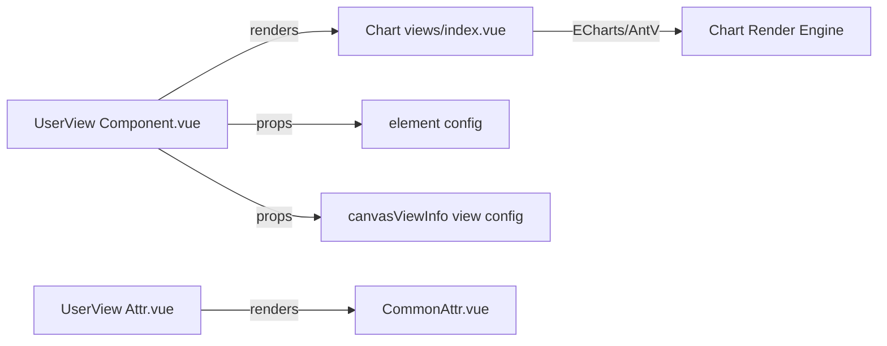
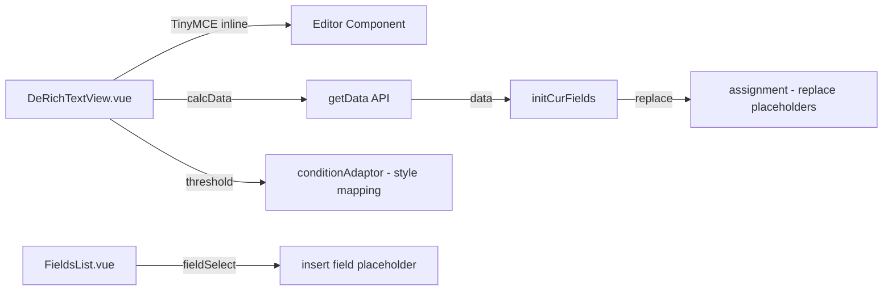
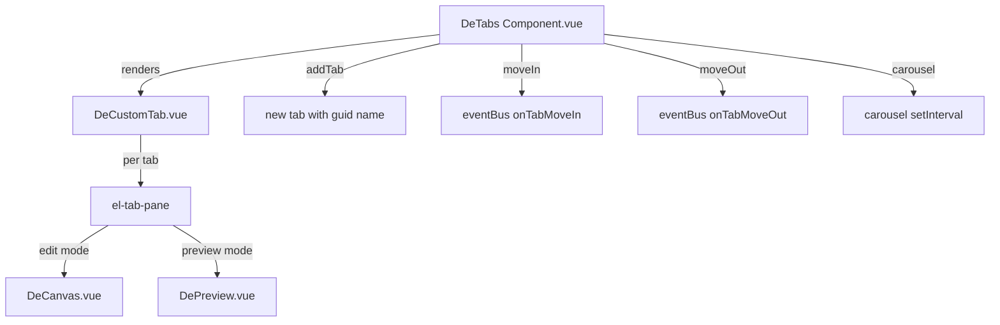
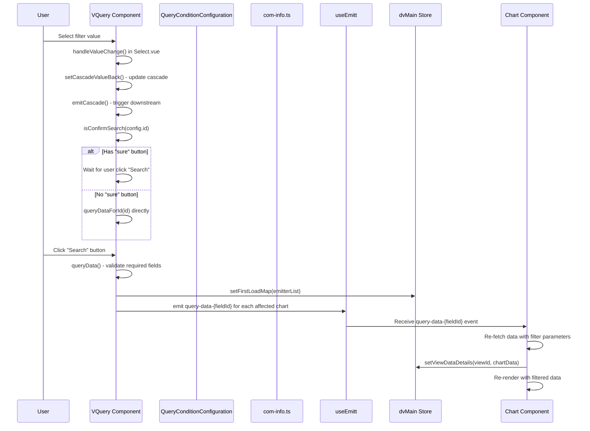
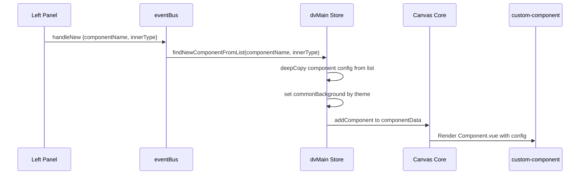

# 自定义画布组件（custom-component）分析（v2.10.7）

## 1. 职责与架构位置

`custom-component/` 是 DataEase **画布上可拖拽的自定义组件库**，为仪表板/大屏编辑器提供所有可拖入画布的组件类型。用户在编辑器左侧面板选择组件，拖入画布区域，系统根据 `component-list.ts` 中的注册表创建组件实例并插入 `dvMain.componentData` 数组。

**架构位置**（Mermaid）：



核心职责：

- 定义所有可拖入画布的组件类型及其默认配置
- 提供每类组件的渲染组件（`Component.vue`）和属性编辑面板（`Attr.vue`）
- 筛选器组件（VQuery）与图表数据联动
- 图表容器组件（UserView）嵌入 ECharts/AntV 图表渲染

**与 store/modules/data-visualization/dvMain 的交互**：

| Store 字段/方法 | 组件交互方式 |
|---|---|
| `componentData` | 画布所有组件数据数组，每个元素对应一个 custom-component 实例 |
| `curComponent` | 当前选中组件，各 Component.vue 通过 `storeToRefs` 监听 |
| `canvasViewInfo` | 图表视图配置信息映射（viewId → ChartObj），UserView/rich-text/picture-group 均读取 |
| `setCurComponent()` | 设置选中组件，触发 `curComponentChange` 事件 |
| `addComponent()` | 添加新组件到画布/Tab 内 |
| `setViewDataDetails()` | 图表数据返回后写入 `canvasViewDataInfo` |
| `firstLoadMap` / `setFirstLoadMap()` | VQuery 筛选后记录首次加载的图表 ID 列表 |
| `canvasState.curPointArea` | 标识当前焦点区域（base / hidden / pop） |

---

## 2. 组件注册机制（component-list.ts / index.ts）

### 2.1 component-list.ts —— 组件注册表

**文件路径**：`core/core-frontend/src/custom-component/component-list.ts`

注册表 `list` 定义了 16 种组件的默认配置。每个条目结构：

```typescript
{
  component: string,        // 组件名（对应 Component.vue 注册名）
  name: string,             // 显示名（i18n）
  label: string,            // 标签（i18n）
  icon: string,             // 左侧面板图标标识
  innerType: string,        // 内部类型（UserView 为图表类型如 'bar'；VQuery 为 'VQuery'）
  propValue: any,           // 组件内容值（文本/URL/Tab 数组/空）
  style: object,            // 尺寸和样式（合并 commonStyle）
  commonBackground: object, // 背景配置（合并 COMMON_COMPONENT_BACKGROUND_BASE）
  state: 'prepare',         // 初始状态
  ...commonAttr             // 合入公共属性（animations/events/carousel/linkage 等）
}
```

**注册表完整组件列表**（16 项）：

| # | component | innerType | 默认尺寸 | 特殊配置 |
|---|---|---|---|---|
| 1 | Group | Group | 200×200 | propValue: '&nbsp;' |
| 2 | GroupArea | GroupArea | 200×200 | id: 100000001 |
| 3 | VQuery | VQuery | 400×100 | isHang/freeze/x/y/sizeX/sizeY/request/matrixStyle |
| 4 | UserView | bar | 600×300 | editing/canvasActive/actionSelection/propValue:{textValue,urlList} |
| 5 | DeVideo | DeVideo | 600×300 | videoLinks: VIDEO_LINKS_DE2 |
| 6 | DeStreamMedia | DeStreamMedia | 600×300 | streamMediaLinks: STREAMMEDIALINKS |
| 7 | DeFrame | DeFrame | 600×300 | hyperlinks/frameLinks |
| 8 | DeTimeClock | DeTimeClock | 300×100 | formatInfo:{openMode,showWeek,showDate,dateFormat,timeFormat} |
| 9 | Picture | Picture | 300×200 | propValue:{url,flip} / adaptation |
| 10 | CanvasIcon | — | 40×40 | propValue:'' |
| 11 | CanvasBoard | — | 600×300 | propValue:'' |
| 12 | RectShape | — | 200×200 | backgroundColor/borderActive |
| 13 | CircleShape | — | 200×200 | borderWidth/borderStyle/borderColor/borderActive |
| 14 | SvgTriangle | — | 200×200 | borderWidth/borderColor/borderActive |
| 15 | DeTabs | — | 600×300 | propValue:[{name,title,componentData,closable}] |
| 16 | ScrollText | ScrollText | 400×80 | scrollSpeed/padding/verticalAlign |

**后处理流程**（第 603-609 行）：

```typescript
for (let i = 0; i < list.length; i++) {
  item.style = { ...commonStyle, ...item.style }        // 合入公共边框/透明度
  item['commonBackground'] = deepCopy(COMMON_COMPONENT_BACKGROUND_BASE) // 背景模板
  item['state'] = 'prepare'                              // 初始状态
  list[i] = { ...commonAttr, ...item }                   // 合入公共属性
}
```

### 2.2 关键导出函数

- **`findNewComponentFromList(componentName, innerType, curOriginThemes, staticMap?)`**：根据组件名深拷贝注册表项，设置 innerType、背景主题、DeTabs 的 titleBackground 等；对 UserView 会额外调用 `getViewConfig(innerType)` 获取图表类型配置。
- **`findBaseDeFaultAttr(componentName)`**：提取组件的样式属性列表（`properties`/`propertyInner`），用于属性面板渲染。

### 2.3 ComponentConfig.ts —— 素材目录

**文件路径**：`core/core-frontend/src/custom-component/common/ComponentConfig.ts`

定义 `CANVAS_MATERIAL` 数组，包含三大素材类：

- **CanvasBoard**：9 种边框板 SVG（board_1 ~ board_9）
- **DeGraphical**：矩形(RectShape)、三角形(SvgTriangle)、圆形(CircleShape)
- **CanvasIcon**：约 90 种内置 SVG 图标（Plus, Minus, Search, User 等）

### 2.4 index.ts —— 全局注册

**文件路径**：`core/core-frontend/src/custom-component/index.ts`

当前仅注册 `circle-shape` 为全局组件（`app.component`），其余组件按需加载。大部分组件通过 `findComponent` 工具函数（`@/utils/components`）动态映射。

### 2.5 commonStyle / commonAttr 结构

| 配置项 | 说明 |
|---|---|
| `commonStyle` | rotate=0, opacity=1, borderActive=false, borderWidth=1, borderRadius=5, borderStyle='solid', borderColor='#ccc' |
| `BASE_CAROUSEL` | enable=false, time=10（轮播） |
| `BASE_EVENTS` | 事件配置：jump/download/share/fullScreen/showHidden/refreshDataV/refreshView |
| `HYPERLINKS` | openMode='_blank', enable=false, content='http://' |
| `FRAMELINKS` | src:''（iframe URL） |
| `VIDEO_LINKS_DE2` | 视频播放器完整配置（web/rtmp 两种模式） |
| `STREAMMEDIALINKS` | 流媒体配置（flv 类型，isLive/cors/loop/autoplay/url） |
| `COMMON_COMPONENT_BACKGROUND_BASE` | 通用背景模板（backgroundColorSelect/backdropFilter/backgroundType/innerImage 等） |
| `COMMON_TAB_TITLE_BACKGROUND` | Tab 标题背景（active/inActive 复用配置） |
| `commonAttr` | canvasId/animations/events/carousel/multiDimensional/groupStyle/isLock/maintainRadio/isShow/dashboardHidden/category/dragging/resizing/collapseName/linkage |

---

## 3. 组件分类与清单

### 3.1 完整文件清单（112 个 .vue/.ts 文件）

| 目录 | 文件数 | 文件列表 |
|---|---|---|
| **根级** | 3 | `component-list.ts`, `index.ts`, `ImgViewDialog.vue` |
| **v-query/** | 25 | `Attr.vue`, `Component.vue`, `ConditionDefaultConfiguration.vue`, `CustomSortFilter.vue`, `DynamicTime.vue`, `DynamicTimeFiltering.vue`, `DynamicTimeForViewFilter.vue`, `DynamicTimeRange.vue`, `DynamicTimeRangeFiltering.vue`, `FilterTime.vue`, `NumberInput.vue`, `QueryCascade.vue`, `QueryConditionConfiguration.vue`, `RangeFilterTime.vue`, `Select.vue`, `StyleInject.vue`, `TextSearch.vue`, `Time.vue`, `Tree.vue`, `TreeFieldDialog.vue`, `com-info.ts`, `options.ts`, `shortcuts.ts`, `time-format-dayjs.ts`, `time-format.ts` |
| **common/** | 11 | `AsideCloseButton.vue`, `CanvasGroup.vue`, `CarouselSetting.vue`, `CommonAttr.vue`, `CommonBorderSetting.vue`, `CommonEvent.vue`, `CommonStyleSet.vue`, `ComponentConfig.ts`, `DeInputNum.vue`, `DeRuler.vue`, `DeRulerVertical.vue` |
| **component-group/** | 9 | `CommonGroup.vue`, `DbMoreComGroup.vue`, `DragComponent.vue`, `MediaGroup.vue`, `MoreComGroup.vue`, `QueryGroup.vue`, `TabsGroup.vue`, `TextGroup.vue`, `UserViewGroup.vue` |
| **picture-group/** | 7 | `Attr.vue`, `Component.vue`, `PictureGroupDatasetSelect.vue`, `PictureGroupThreshold.vue`, `PictureGroupUploadAttr.vue`, `PictureItem.vue`, `PictureOptionPrefix.vue` |
| **de-tabs/** | 7 | `Attr.vue`, `Component.vue`, `CustomTabsSort.vue`, `DeCustomTab.vue`, `DeFullTabs.vue`, `TabBackgroundOverall.vue`, `types.ts` |
| **rich-text/** | 5 | `DeRichEditor.vue`, `DeRichTextView.vue`, `FieldsList.vue`, `plugins/index.ts`, `plugins/vertical-content.ts` |
| **de-time-clock/** | 5 | `Attr.vue`, `Component.vue`, `CustomAttr.vue`, `TimeClockFormat.vue`, `TimeDefault.vue` |
| **svgs/** | 4 | `svg-star/Attr.vue`, `svg-star/Component.vue`, `svg-triangle/Attr.vue`, `svg-triangle/Component.vue` |
| **group/** | 3 | `Attr.vue`, `Component.vue`, `GroupPreview.vue` |
| **group-area/** | 3 | `Attr.vue`, `Component.vue`, `ComponentShadow.vue` |
| **de-video/** | 3 | `Attr.vue`, `Component.vue`, `VideoLinks.vue` |
| **de-stream-media/** | 3 | `Attr.vue`, `Component.vue`, `StreamMediaLinks.vue` |
| **de-frame/** | 3 | `Attr.vue`, `ComponentFrame.vue`, `FrameLinks.vue` |
| **v-text/** | 2 | `Attr.vue`, `Component.vue` |
| **user-view/** | 2 | `Attr.vue`, `Component.vue` |
| **scroll-text/** | 2 | `Attr.vue`, `Component.vue` |
| **rect-shape/** | 2 | `Attr.vue`, `Component.vue` |
| **pop-area/** | 2 | `Attr.vue`, `Component.vue` |
| **picture/** | 2 | `Attr.vue`, `Component.vue` |
| **independent-hang/** | 2 | `ComponentHang.vue`, `ComponentHangPopver.vue` |
| **de-graphical/** | 2 | `Attr.vue`, `Component.vue` |
| **circle-shape/** | 2 | `Attr.vue`, `Component.vue` |
| **canvas-icon/** | 2 | `Attr.vue`, `Component.vue` |
| **canvas-board/** | 2 | `Attr.vue`, `Component.vue` |
| **canvas-filter-btn/** | 1 | `Component.vue` |
| **indicator/** | 1 | `DeIndicator.vue` |

### 3.2 组件分类总表

| 组件类型 | 目录 | 职责 | 关键配置项 | 备注 |
|---|---|---|---|---|
| **VQuery** | v-query/ | 查询/筛选器容器，内含多个筛选条件 | propValue(筛选条件数组)、cascade(级联)、isHang/freeze、customStyle | 最复杂组件，25 文件 |
| **UserView** | user-view/ | 图表容器，嵌入 Chart 组件渲染 | innerType(图表类型)、render、actionSelection、editing、canvasActive | 薄代理层，核心逻辑在 views/chart |
| **RichText** | rich-text/ | TinyMCE 富文本编辑/显示 | textValue、verticalAlign、field 动态占位符 | 内联 inline 模式 |
| **DeTabs** | de-tabs/ | 多标签页容器，每个 Tab 含独立画布 | propValue(Tab 数组)、titleBackground、carousel(轮播)、showTabTitle | 嵌套画布机制 |
| **Group** | group/ | 组件分组，子组件共享画布 | propValue(子组件数组)、canvasActive | 双击进入编辑 |
| **GroupArea** | group-area/ | 选中区域框（框选多组件时创建） | 纯样式组件，border:#70c0ff | 临时组件 |
| **Picture** | picture/ | 单张图片展示 | url、flip(horizontal/vertical)、adaptation | 简单上传 |
| **PictureGroup** | picture-group/ | 数据驱动的图片组（条件阈值联动） | urlList、threshold、carousel | 类图表组件，可 getData |
| **DeVideo** | de-video/ | 视频播放器 | videoLinks(web/rtmp) | Video.js 播放器 |
| **DeStreamMedia** | de-stream-media/ | 流媒体播放器 | streamMediaLinks(flv) | flv.js 播放器 |
| **DeFrame** | de-frame/ | iframe 嵌入网页 | frameLinks.src、hyperlinks | 编辑态遮罩 |
| **DeTimeClock** | de-time-clock/ | 实时时钟显示 | formatInfo(openMode,showWeek,dateFormat,timeFormat) | dayjs 格式化 |
| **ScrollText** | scroll-text/ | 滚动字幕 | scrollSpeed、verticalAlign | CSS 动画滚动 |
| **VText** | v-text/ | 可编辑纯文本 | propValue(HTML)、contenteditable | 双击进入编辑 |
| **RectShape** | rect-shape/ | 矩形装饰图形 | backgroundColor、borderActive | 简单 CSS |
| **CircleShape** | circle-shape/ | 圆形装饰图形 | borderWidth/borderColor/borderActive | 全局注册 |
| **SvgTriangle** | svgs/svg-triangle/ | 三角形 SVG | borderWidth/borderColor | SVG 渲染 |
| **SvgStar** | svgs/svg-star/ | 星形 SVG（注册表未列出但文件存在） | — | [Need Verification] 是否已废弃或仅在 CANVAS_MATERIAL 中 |
| **DeGraphical** | de-graphical/ | 图形组件选择器 | ComponentConfig.ts 中的素材 | [Inference] 可能是旧版遗留 |
| **CanvasBoard** | canvas-board/ | 边框板装饰 | color、backdropFilter | 9 种 SVG 边框 |
| **CanvasIcon** | canvas-icon/ | 图标装饰 | color、backdropFilter | 约 90 种内置图标 |
| **PopArea** | pop-area/ | 弹窗区域（隐藏筛选器容器） | popComponentData、canvasState.curPointArea | 仅接受 VQuery |
| **IndependentHang** | independent-hang/ | 独立悬挂展示 | hangComponentData | 查询结果悬浮 |
| **Indicator** | indicator/ | 指标卡 | BASE_INDICATOR_STYLE/DEFAULT_INDICATOR_NAME_STYLE | 类图表组件 |
| **CanvasFilterBtn** | canvas-filter-btn/ | 筛选按钮（触发 PopArea） | filterActive/isFixed | 滑动交互 |
| **ImgViewDialog** | 根级 | 图片预览弹窗 | — | 全局弹窗组件 |

---

## 4. 核心组件详解

### 4.1 UserView —— 图表容器

**文件**：`user-view/Component.vue`（125 行）、`user-view/Attr.vue`（23 行）

Component.vue 是一个薄代理层，接收 `element`、`view`、`active`、`searchCount`、`scale` 等 props，内部渲染 `<chart>` 组件（来自 `views/chart/components/views/index.vue`）。



**关键逻辑**：

- `autoStyle` computed：对 rich-text 类型使用 zoom/scale 缩放适配移动端
- `onPointClick` emit：点击图表元素时触发联动/跳转事件
- 属性面板仅用 `CommonAttr`，图表配置在 `views/chart/editor/` 中处理

Attr.vue 仅引用 `CommonAttr`（从 dvMain.curComponent 读取当前选中组件），不包含图表配置面板——图表编辑面板由 `views/chart/` 独立处理。

### 4.2 VQuery —— 筛选器/查询组件

**文件**：`v-query/Component.vue`（1181 行）、`v-query/com-info.ts`、`v-query/options.ts` 等 25 文件

这是 custom-component 中最复杂的组件。核心职责：管理画布上所有筛选条件，将筛选值映射到图表字段，触发图表数据刷新。

```mermaid
graph TD
    VQComponent[VQuery Component.vue] -->|propValue list| StyleInject[StyleInject.vue]
    StyleInject -->|displayType| Select[Select.vue]
    StyleInject -->|displayType| Time[Time.vue]
    StyleInject -->|displayType| TextSearch[TextSearch.vue]
    StyleInject -->|displayType| NumberInput[NumberInput.vue]
    StyleInject -->|displayType| Tree[Tree.vue]
    VQComponent -->|Teleport| QCC[QueryConditionConfiguration.vue]
    VQComponent -->|provide| QueryDataForId[query-data-for-id]
    VQComponent -->|provide| IsConfirmSearch[is-confirm-search]
    VQComponent -->|emitter.emit| QueryDataEvent[query-data-{fieldId}]
    VQComponent -->|dvMainStore.setFirstLoadMap| FirstLoadMap[firstLoadMap]
```

**核心数据结构**（`options.ts` `infoFormat`）——每个筛选条件项：

```typescript
{
  id: guid(),
  name: string,               // 条件名
  displayType: '0'|'2'|'5'|'7'|'8'|'9'|'22', // 显示类型
  field: { id, type, name, deType },  // 关联字段
  dataset: { id, name, fields },      // 关联数据集
  checkedFields: string[],            // 关联图表字段 ID 列表
  checkedFieldsMap: object,           // 图表字段 → 筛选字段映射
  optionValueSource: 0|1|2,          // 选项来源(0=关联字段,1=数据集字段,2=手动)
  selectValue: any,                   // 当前选中值
  defaultValue: any,                  // 默认值
  required: boolean,                  // 是否必填
  multiple: boolean,                  // 是否多选
  visible: boolean,                   // 是否可见
  cascade: ...                        // 级联配置
}
```

**displayType 映射**：

| displayType | 组件 | 说明 |
|---|---|---|
| 0 | Select.vue | 下拉选择（文本） |
| 2 | Select.vue | 下拉选择（数值） |
| 5 | Select.vue | 下拉选择（日期选择） |
| 7 | Time.vue | 时间筛选 |
| 8 | TextSearch.vue | 文本搜索（单/双条件） |
| 9 | Tree.vue | 树形选择 |
| 22 | NumberInput.vue | 数值范围输入 |

**StyleInject.vue**：根据 `config.displayType` 动态渲染对应的筛选控件，同时注入 `customStyle`（宽度/字号/颜色等）。

**com-info.ts**：递归遍历 `componentData` 获取所有图表组件（排除 VQuery/DeTabs/Group），提取 `datasetFieldList`（id/title/tableId/type）供筛选条件映射。

**筛选流程**：

1. 用户设置筛选条件 → `QueryConditionConfiguration.vue`（Teleport 到 body 的弹窗）
2. 条件绑定到图表字段 → `checkedFields` + `checkedFieldsMap`
3. 点击"查询"按钮 → `queryData()` 校验必填项
4. 构建 `emitterList`（受影响的图表字段 ID 集合）
5. `dvMainStore.setFirstLoadMap(emitterList)` → `emitter.emit('query-data-{fieldId}')`
6. 图表监听事件 → 重新请求带筛选参数的数据

**级联机制**（`QueryCascade.vue`）：

- 筛选条件间可配置级联关系（`element.cascade` 数组）
- 前一个筛选值变化 → `emitCascade()` → 触发后级筛选条件重新加载选项
- 级联数据以 `datasetId--{queryId}--{fieldId}` 格式标识

**时间处理**：

- `time-format.ts`：静态时间计算（getThisYear/getLastMonth/getCustomTime/getDynamicRange）
- `time-format-dayjs.ts`：动态时间范围计算（getThisStart/getThisEnd/getAround/getCustomRange）
- `shortcuts.ts`：日期快捷选项（本周/本月/本季/本年/上周/上月/上季/去年）

### 4.3 RichText —— 富文本

**文件**：`rich-text/DeRichTextView.vue`（854 行）、`DeRichEditor.vue`、`FieldsList.vue`

基于 TinyMCE 的内联编辑器（`inline: true`），关键特性：

- **双击编辑**：`setEdit()` → `canEdit=true`，`element.editing=true`
- **字段占位符**：`[字段名]` 格式，通过 `assignment()` 将数据行值替换占位符
- **条件样式**（threshold）：`conditionAdaptor()` 根据阈值映射文字颜色/背景色
- **数据获取**：`calcData()` → `getData(view)` → `initCurFields(res)` 替换占位符值
- **缩放处理**：自定义 TinyMCE 表格拖拽手柄的缩放适配



### 4.4 DeTabs —— 标签页

**文件**：`de-tabs/Component.vue`（760 行）、`DeCustomTab.vue`、`DeFullTabs.vue` 等

标签页是画布上的嵌套画布容器，每个 Tab 拥有独立的 `componentData`。



**关键机制**：

- **画布 ID 嵌套**：`element.id + '--' + tabItem.name` 作为子画布 canvasId
- **组件移入/移出**：通过 `eventBus` 事件 `onTabMoveIn-{id}` / `onTabMoveOut-{id}` 实现
- **Tab 轮播**：`initCarousel()` 在非编辑模式下按 `element.carousel.time` 切换 Tab
- **标题背景**：`titleBackground` 支持 active/inActive 独立配置，可复用（multiply）
- **联动刷新**：Tab 内组件变化时 `reloadLinkage()` 重载联动信息

---

## 5. 筛选器与数据联动

### 5.1 联动流程（Mermaid）



### 5.2 字段映射机制

VQuery 的每个筛选条件通过 `checkedFields` 和 `checkedFieldsMap` 与图表字段建立映射：

- `checkedFields`：筛选条件影响的图表字段 ID 列表
- `checkedFieldsMap`：`{ 图表字段ID: 筛选字段ID }` 映射表
- 当筛选值变化时，`getKeyList()` 提取所有非空映射的目标字段 ID
- 这些 ID 成为 `emitterList`，每个 ID 触发 `query-data-{id}` 事件

### 5.3 PopArea —— 隐藏筛选器区域

`pop-area/Component.vue` 实现大屏（DataV）模式下筛选器的弹出区域：

- 仅接受 VQuery 类型组件拖入（`component.component === 'VQuery'`）
- 拖入后设置 `component.category = 'hidden'`
- 通过 `canvasState.curPointArea === 'hidden'` 控制显示高度
- `canvas-filter-btn/Component.vue` 是触发按钮，滑动交互弹出 PopArea

### 5.4 IndependentHang —— 悬挂展示

`independent-hang/ComponentHang.vue`：将筛选结果以悬挂方式展示，使用 `findComponent` 动态渲染组件列表。

---

## 6. 与画布编辑器的交互

### 6.1 拖拽流程



左侧面板组件（component-group/）触发拖拽：

- `UserViewGroup.vue`：`newComponent(innerType, staticMap)` → `eventBus.emit('handleNew', { componentName: 'UserView', innerType })`
- `QueryGroup.vue`：`newComponent('VQuery')` → `eventBus.emit('handleNew', { componentName: 'VQuery' })`
- `DragComponent.vue`：通用拖拽包装器，设置 `data-id` 为 `ComponentName&innerType`

### 6.2 选中与属性配置

- 点击组件 → `dvMainStore.setCurComponent({ component, index })`
- 属性面板渲染 `Attr.vue` → 从 `dvMainStore.curComponent` 读取配置
- `CommonAttr.vue`：统一属性面板框架（折叠面板：位置/背景/样式/事件/边框/轮播）
- 各组件的 `Attr.vue` 在 `CommonAttr` 基础上添加特有配置项

### 6.3 渲染生命周期

| 阶段 | 说明 |
|---|---|
| **创建** | `findNewComponentFromList` → 深拷贝 → `addComponent` → `state='prepare'` |
| **渲染** | Component.vue mounted → 初始化数据请求（图表类调用 `calcData`） |
| **编辑** | 双击 → `canEdit=true` → `element.editing=true`（v-text/rich-text） |
| **失活** | `active=false` → 保存编辑内容 → `element.editing=false` |
| **销毁** | `onBeforeUnmount` → 清理定时器/eventBus 监听 |

### 6.4 Tab/Group 嵌套画布

- **Group**：双击进入 → `canvasActive=true` → `CanvasGroup.vue` 渲染子画布
- **DeTabs**：每个 Tab 内渲染 `DeCanvas.vue`（编辑态）或 `DePreview.vue`（预览态）
- 组件移入/移出 Tab/Group 通过 `eventBus` 事件 (`onTabMoveIn/onTabMoveOut`)
- canvasId 格式：主画布 `canvas-main`，Tab `element.id--tabName`，Group `Group-element.id`

---

## 7. 风险与待确认

1. **[Need Verification]** `svgs/svg-star/` 目录存在但 `component-list.ts` 注册表中没有 `SvgStar` 条目。是否已废弃或仅通过 `CANVAS_MATERIAL` 的 `DeGraphical` 分类间接使用？
2. **[Need Verification]** `de-graphical/` 目录仅有 Attr.vue 和 Component.vue，但注册表中图形组件分别是 `RectShape`、`CircleShape`、`SvgTriangle`（在不同目录）。`de-graphical` 是否为旧版遗留？
3. **[Need Verification]** `canvas-filter-btn/` 没有对应的注册表条目，它是画布核心的辅助组件而非可拖入组件——此推断需确认。
4. **[Need Verification]** `ImgViewDialog.vue` 在根级但未在注册表中，推测为全局弹窗而非画布组件。
5. **[Need Verification]** `independent-hang/` 的 `ComponentHangPopver.vue` 未读取，悬挂展示的完整交互逻辑需进一步确认。
6. **[Need Verification]** VQuery 的 `displayType='7'`（时间筛选）与 `displayType='5'`（日期下拉）的区别需对照 Time.vue 和 Select.vue 的具体渲染逻辑确认。
7. **[Inference]** `pop-area/` 仅接受 VQuery 拖入（源码第 144 行 `component.component === 'VQuery'` 判断），但注释写"及支持添加查询组件"（可能是"只支持"的笔误）。
8. **[Inference]** `group-area/ComponentShadow.vue` 应为框选时显示的影子组件，但未读取具体内容，需确认。
9. **[Need Verification]** `COMMON_COMPONENT_BACKGROUND_MAP` 的 `light/dark` 主题切换机制——`findNewComponentFromList` 中 `curOriginThemes.value` 决定背景模板，但该值来源需追踪。
10. **[Need Verification]** `picture-group/` 组件在注册表中没有独立条目（图表类型 `picture-group` 通过 UserView 容器渲染），其 `innerType` 赋值路径需确认。

---

## 8. 相关文档

| 主题 | 相对路径 |
|---|---|
| 基础设施（构建/依赖/架构） | `infrastructure.md` |
| 通用组件库 | `components.md` |
| 可视化视图（图表渲染） | `visualization-views.md` |
| 后端可视化 API | `../backend/visualization.md` |
