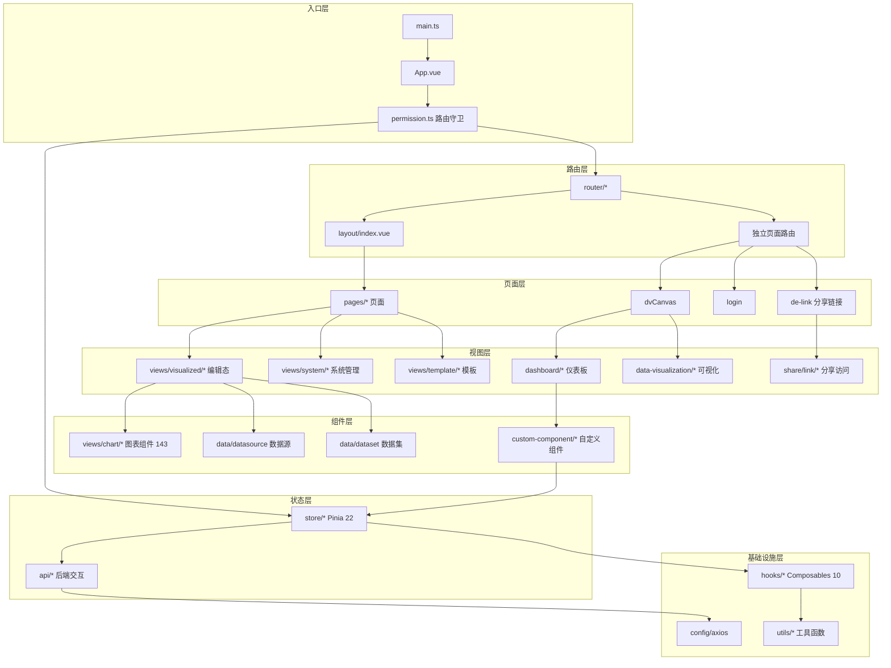

# DataEase 前端分析索引（v2.10.7）

> 源码位置：`core/core-frontend/src/`
> 技术栈：Vue 3 + TypeScript + Vite + Pinia + Element Plus Secondary

## 文档索引

| 文档 | 覆盖范围 | 文件数 |
|------|---------|--------|
| [infrastructure.md](infrastructure.md) | 路由守卫、Pinia Store、Hooks/Composables | ~37 |
| [views-system.md](views-system.md) | 系统管理（参数/字体/密码/地图/引擎） | 21 |
| [views-share.md](views-share.md) | 公共链接分享（创建/验证/访问） | 14 |
| [views-visualized.md](views-visualized.md) | 可视化视图（仪表板/大屏/数据源/数据集） | 60 |

## 未完成目录

以下目录已完成初步分析（任务 #28-#40）但尚未输出独立文档：

| 目录 | 文件数 | 状态 |
|------|--------|------|
| `layout/` | — | 分析完成，待文档化 |
| `views/chart/` | 143 | 分析完成，待文档化 |
| `views/login/` | — | 分析完成，待文档化 |
| `views/workbranch/` | — | 分析完成，待文档化 |
| `views/copilot/` | — | 分析完成，待文档化 |
| `views/template/` | — | 分析完成，待文档化 |
| `views/template-market/` | — | 分析完成，待文档化 |
| `views/about/` | — | 分析完成，待文档化 |
| `views/watermark/` | — | 分析完成，待文档化 |
| `views/common/` | — | 分析完成，待文档化 |
| `pages/` | 12 | 分析完成，待文档化 |

仍需完整分析的目录：

| 目录 | 文件数 | 优先级 |
|------|--------|--------|
| `components/` | — | P0（编辑器核心组件体系） |
| `api/` | — | P0（后端 API 调用层） |
| `utils/` | — | P1（工具函数） |
| `config/` | — | P1（axios/配置文件） |
| `custom-component/` | — | P1（自定义组件） |
| `views/mobile/` | 13 | P2（移动端视图） |
| `directive/` | — | P2（自定义指令） |
| `plugins/` | — | P2（插件） |
| `models/` | — | P2（数据模型） |
| `locales/` | — | P3（国际化文件） |
| `websocket/` | — | P3（WebSocket） |
| `style/` | — | P3（样式文件） |
| `assets/` | — | P3（静态资源） |

## 覆盖统计

| 指标 | 当前值 | 目标值 |
|------|--------|--------|
| 已文档化文件 | ~132 | 735 |
| 已分析未文档化 | ~200+ | — |
| 覆盖率 | ~18% | 100% |

## 核心架构总结

## 关键架构决策

1. **Hash History**: 使用 `createWebHashHistory`，适合嵌入式部署
2. **动态路由**: 基于 RBAC 从后端加载菜单树，前端动态注册路由
3. **双层入口**: `index.html`（PC）和 `mobile.html`（移动端），通过 `isMobile()` 检测分流
4. **嵌入式支持**: `embedded.ts` Store 管理 iframe 嵌入场景的独立认证
5. **xpack-component**: 企业版功能通过 Base64 编码路径动态加载，社区版渲染为空
6. **分享代理模式**: `ShareProxy` 类封装分享链接的解析与验证
