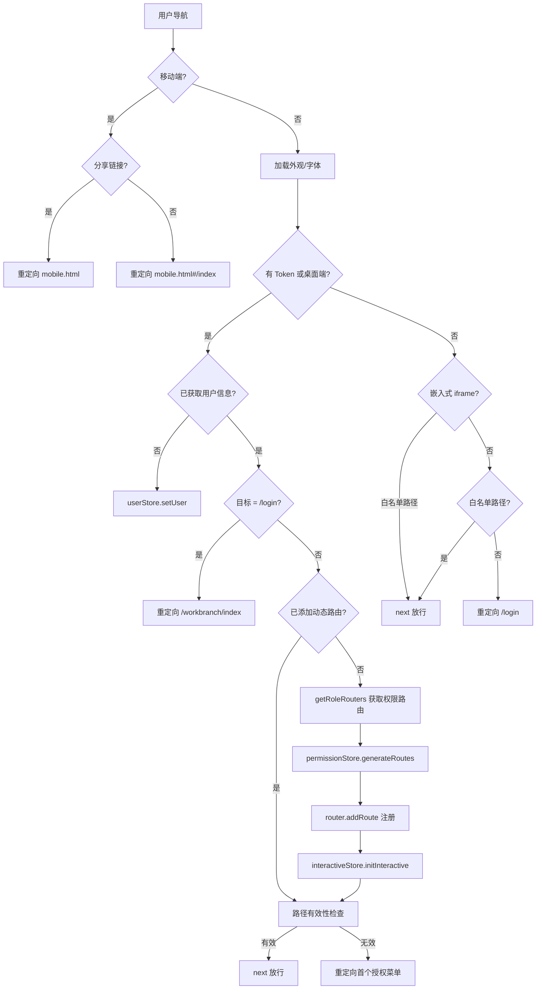
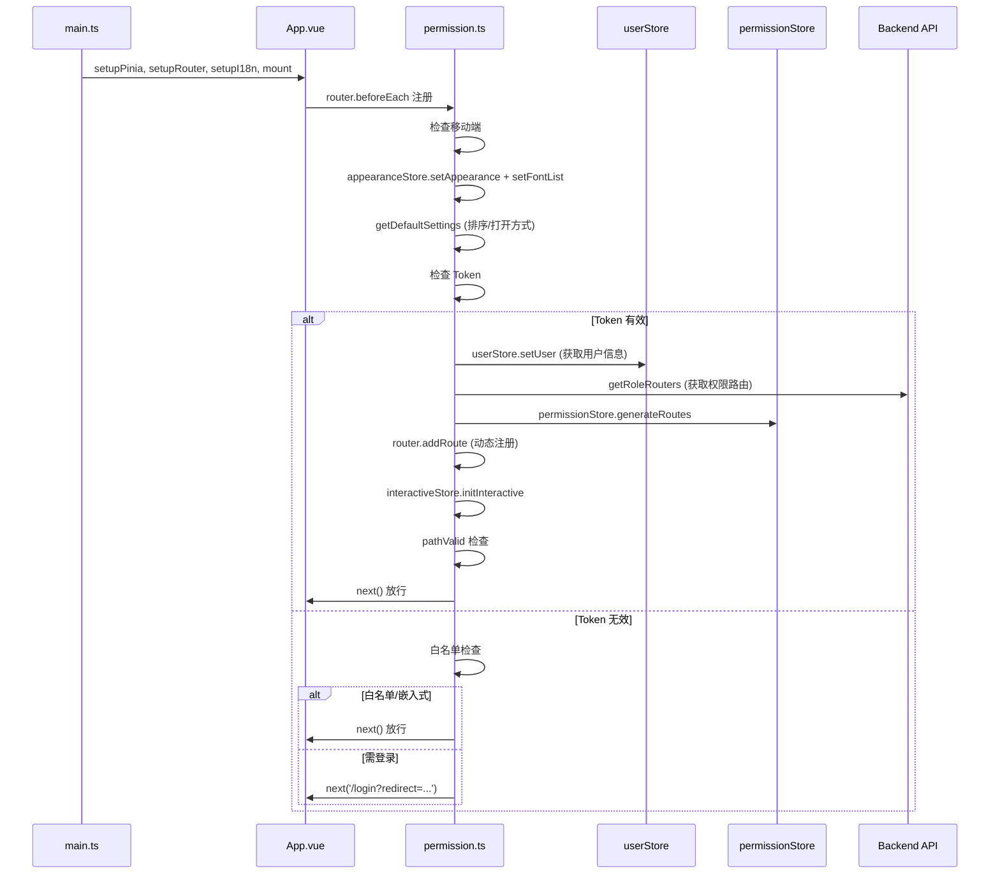

# 前端基础设施（Infrastructure）分析（v2.10.7）

> 分析范围：`core/core-frontend/src/router/**`、`permission.ts`、`store/**`、`hooks/**`
> 源码版本：DataEase v2.10.7
> 覆盖文件：router (4 文件)、permission.ts (166 行)、store (22 文件)、hooks (10 文件)

## 1. 路由架构（Router）

### 1.1 路由配置（`router/index.ts`）

**文件**: `src/router/index.ts`

**路由模式**: Hash History（`createWebHashHistory()`），URL 格式 `/#/path`。

**静态路由表** (`src/router/index.ts:5-167`):

| 路径 | 组件 | 说明 |
|------|------|------|
| `/` | `layout/index.vue` | 根路由，重定向至 `/workbranch/index` |
| `/copilot` | `layout/index.vue` | AI Copilot 页面 |
| `/login` | `views/login/index.vue` | 登录页 |
| `/admin-login` | `views/login/index.vue` | 管理员登录 |
| `/401` | `views/401/index.vue` | 未授权页 |
| `/dvCanvas` | `views/data-visualization/index.vue` | 数据可视化画布（完整编辑器） |
| `/dashboard` | `views/dashboard/index.vue` | 仪表板首页 |
| `/dashboardPreview` | `views/dashboard/DashboardPreviewShow.vue` | 仪表板预览（内嵌模式） |
| `/chart` | `views/chart/index.vue` | 图表编辑器 |
| `/previewShow` | `views/data-visualization/PreviewShow.vue` | 预览展示（调试用） |
| `/preview` | `views/data-visualization/PreviewCanvas.vue` | 预览画布（单独渲染） |
| `/de-link/:uuid` | `views/data-visualization/LinkContainer.vue` | 公共分享链接入口 |
| `/DeResourceTree` | `views/common/DeResourceTree.vue` | 资源树组件 |
| `/dataset-embedded` | `views/visualized/data/dataset/index.vue` | 数据集（嵌入式） |
| `/dataset-embedded-form` | `views/visualized/data/dataset/form/index.vue` | 数据集表单（嵌入式） |
| `/rich-text` | `custom-component/rich-text/DeRichTextView.vue` | 富文本编辑器 |
| `/modify-pwd` | `layout/index.vue` + `views/system/modify-pwd/` | 修改密码页 |
| `/chart-view` | `views/chart/ChartView.vue` | 独立图表视图 |
| `/template-manage` | `views/template/indexInject.vue` | 模板管理 |

**动态路由**: 通过 `getRoleRouters()` 从后端获取用户权限路由，在 `permission.ts` 守卫中动态 `router.addRoute()` 注册。

**路由重置** (`src/router/index.ts:174-182`):
```typescript
export const resetRouter = (): void => {
  const resetWhiteNameList = ['Login']
  router.getRoutes().forEach(route => {
    const { name } = route
    if (name && !resetWhiteNameList.includes(name as string)) {
      router.hasRoute(name) && router.removeRoute(name)
    }
  })
}
```

> [Inference] `resetRouter` 用于退出登录时清除动态注册的路由。

### 1.2 辅助路由文件

| 文件 | 职责 |
|------|------|
| `router/embedded.ts` | 嵌入式部署路由（iframe 场景） |
| `router/establish.ts` | 初始化/安装引导路由 |
| `router/mobile.ts` | 移动端专用路由 |

## 2. 权限守卫（Permission Guard）

**文件**: `src/permission.ts` (166 行)

### 2.1 核心守卫逻辑

路由守卫 `router.beforeEach` 的完整执行流程（`src/permission.ts:29-160`）:



### 2.2 白名单定义

```typescript
// 文件: permission.ts:26-28
const whiteList = ['/login', '/de-link', '/chart-view', '/admin-login', '/401']
const embeddedWindowWhiteList = ['/dvCanvas', '/dashboard', '/preview', '/dataset-embedded-form']
const embeddedRouteWhiteList = ['/dataset-embedded', '/dataset-form', '/dataset-embedded-form']
```

- **`whiteList`**: 无需登录即可访问的路径
- **`embeddedWindowWhiteList`**: 允许在 iframe 中独立渲染的路径
- **`embeddedRouteWhiteList`**: 嵌入式部署允许的路径（使用 embedded token）

### 2.3 动态路由加载

```typescript
// 文件: permission.ts:109-119
let roleRouters = (await getRoleRouters()) || []
if (isDesktop) {
  roleRouters = roleRouters.filter(item => item.name !== 'system') // 桌面端隐藏系统管理
}
const routers: any[] = roleRouters as AppCustomRouteRecordRaw[]
routers.forEach(item => (item['top'] = true))
await permissionStore.generateRoutes(routers as AppCustomRouteRecordRaw[])

permissionStore.getAddRouters.forEach(route => {
  router.addRoute(route as unknown as RouteRecordRaw) // 动态添加可访问路由表
})
```

**关键点**:
- 桌面端（Desktop）隐藏 `system` 名称的路由
- `generateRoutes()` 将后端返回的菜单树转为 Vue Router 路由配置
- `getRoleRouters()` 调用 Backend API 返回用户菜单树，基于 RBAC 权限

### 2.4 路径有效性检查

```typescript
// 文件: permission.ts:100-104
if (!pathValid(to.path) && to.path !== '/404' && !to.path.startsWith('/de-link')) {
  const firstPath = getFirstAuthMenu()
  next({ path: firstPath || '/404' })
  return
}
```

- `pathValid()`: 检查目标路径是否在授权路由列表中
- `getFirstAuthMenu()`: 获取用户有权访问的第一个菜单路径（兜底导航）

### 2.5 移动端检测

设备检测使用 `isMobile()` 函数（`src/utils/utils.ts`），移动端访问自动重定向到 `mobile.html` 入口。

### 2.6 外观初始化

```typescript
// 文件: permission.ts:71-74
await appearanceStore.setAppearance()  // 加载主题/Logo/登录背景
await appearanceStore.setFontList()    // 加载字体列表
const defaultSort = await getDefaultSettings()  // 加载默认排序/打开方式
wsCache.set('TreeSort-backend', defaultSort['basic.defaultSort'] ?? '1')
wsCache.set('open-backend', defaultSort['basic.defaultOpen'] ?? '0')
```

## 3. 状态管理（Store/Pinia）

### 3.1 Store 模块清单

| Store 模块 | 文件 | 职责 |
|-----------|------|------|
| `app` | `store/modules/app.ts` | 应用全局状态（桌面/Web 模式、iframe 模式） |
| `appearance` | `store/modules/appearance.ts` | 外观设置（主题、Logo、背景、字体列表） |
| `embedded` | `store/modules/embedded.ts` | 嵌入式部署状态（token、baseUrl） |
| `interactive` | `store/modules/interactive.ts` | 交互与联动状态 |
| `link` | `store/modules/link.ts` | 分享链接状态 |
| `locale` | `store/modules/locale.ts` | 语言/区域设置 |
| `map` | `store/modules/map.ts` | 地图配置状态 |
| `permission` | `store/modules/permission.ts` | 权限状态（路由表、菜单、路径校验） |
| `request` | `store/modules/request.ts` | 全局请求加载状态（loadingMap） |
| `share` | `store/modules/share.ts` | 分享功能全局状态 |
| `user` | `store/modules/user.ts` | 用户信息状态（token、uid、角色） |

### 3.2 数据可视化 Store 子模块

| Store 模块 | 文件 | 职责 |
|-----------|------|------|
| `animation` | `store/modules/data-visualization/animation.ts` | 动画效果状态 |
| `common` | `store/modules/data-visualization/common.ts` | 可视化通用状态（画布、缩放、标尺） |
| `compose` | `store/modules/data-visualization/compose.ts` | 组价多选/编组状态 |
| `contextmenu` | `store/modules/data-visualization/contextmenu.ts` | 右键菜单状态 |
| `copy` | `store/modules/data-visualization/copy.ts` | 复制/粘贴状态 |
| `dvMain` | `store/modules/data-visualization/dvMain.ts` | 数据可视化主模块状态 |
| `event` | `store/modules/data-visualization/event.ts` | 事件总线状态 |
| `layer` | `store/modules/data-visualization/layer.ts` | 图层管理状态 |
| `lock` | `store/modules/data-visualization/lock.ts` | 锁定状态 |
| `snapshot` | `store/modules/data-visualization/snapshot.ts` | 快照/撤销重做状态 |
| `viewSelector` | `store/modules/data-visualization/viewSelector.ts` | 视图选择器状态 |

> [Inference] 数据可视化的 11 个 Store 子模块构成了编辑器核心状态管理。`dvMain`、`layer`、`snapshot` 等支持画布级 CRUD 与历史管理，`animation`、`lock`、`contextmenu` 提供辅助交互状态。

### 3.3 关键 Store 细节

**Permission Store** (`store/modules/permission.ts`):
- `getIsAddRouters`: 是否已添加动态路由（防重复加载）
- `generateRoutes(roleRouters)`: 将菜单树转为 Vue Router 配置
- `pathValid(path)`: 验证路径是否在授权路由中
- `getFirstAuthMenu()`: 获取首个有效菜单
- `setCurrentPath(path)`: 记录当前路径

**User Store** (`store/modules/user.ts`):
- `getUid`: 用户 ID
- `setUser()`: 从后端加载用户信息
- Token 管理（存储在 `wsCache` 中）

**App Store** (`store/modules/app.ts`):
- `getDesktop`: 是否桌面模式
- `getIsIframe`: 是否 iframe 嵌入
- `setAppModel()`: 检测应用运行环境

**Embedded Store** (`store/modules/embedded.ts`):
- `baseUrl`: 嵌入式部署的基础 URL
- `getToken`: 嵌入式认证 Token

## 4. Hooks（Composables）

### 4.1 Hooks 清单

| Hook | 文件 | 职责 |
|------|------|------|
| `useCache` | `hooks/web/useCache.ts` | Web Storage 缓存（localStorage/sessionStorage） |
| `useEmitt` | `hooks/web/useEmitt.ts` | 事件总线（mitt 库封装） |
| `useFilter` | `hooks/web/useFilter.ts` | 过滤器函数 |
| `useI18n` | `hooks/web/useI18n.ts` | 国际化（vue-i18n 封装） |
| `useLocale` | `hooks/web/useLocale.ts` | 区域设置管理 |
| `useMoveLine` | `hooks/web/useMoveLine.ts` | 拖拽移动辅助线 |
| `useNProgress` | `hooks/web/useNProgress.ts` | 顶部进度条 |
| `usePageLoading` | `hooks/web/usePageLoading.ts` | 页面加载动画 |
| `useWatermark` | `hooks/web/useWatermark.ts` | 水印生成 |
| `useScrollTo` | `hooks/event/useScrollTo.ts` | 滚动到指定位置 |

### 4.2 关键 Hook 详解

**`useCache`** (`hooks/web/useCache.ts`):
```typescript
const { wsCache } = useCache()  // Web Storage 缓存实例
```
`wsCache` 是全局数据持久化的核心工具，在 permission guard、store 中广泛使用。

**`useI18n`** (`hooks/web/useI18n.ts`):
```typescript
const { t } = useI18n()
```
`t('key.path')` 是全局国际化函数，所有视图中一致使用。

**`useEmitt`** (`hooks/web/useEmitt.ts`):
基于 `mitt` 库的轻量事件总线，用于跨组件通信。

**`useWatermark`** (`hooks/web/useWatermark.ts`):
生成页面水印，使用 Canvas 绘制并通过 CSS 定位覆盖。

## 5. 应用启动流程



## 6. 目录索引

### 6.1 Router 文件

| 文件 | 行数 | 分析状态 |
|------|------|---------|
| `router/index.ts` | 189 | ✓ |
| `router/embedded.ts` | — | [Need Verification] |
| `router/establish.ts` | — | [Need Verification] |
| `router/mobile.ts` | — | [Need Verification] |

### 6.2 Store 文件

| 文件 | 分析状态 |
|------|---------|
| `store/modules/app.ts` | ✓ (概述) |
| `store/modules/appearance.ts` | ✓ (概述) |
| `store/modules/embedded.ts` | ✓ (概述) |
| `store/modules/interactive.ts` | ✓ (概述) |
| `store/modules/link.ts` | ✓ (概述) |
| `store/modules/locale.ts` | ✓ (概述) |
| `store/modules/map.ts` | ✓ (概述) |
| `store/modules/permission.ts` | ✓ (概述) |
| `store/modules/request.ts` | ✓ (概述) |
| `store/modules/share.ts` | ✓ (概述) |
| `store/modules/user.ts` | ✓ (概述) |
| `store/modules/data-visualization/*` (11 文件) | ✓ (概述) |

### 6.3 Hooks 文件

| 文件 | 分析状态 |
|------|---------|
| `hooks/web/useCache.ts` | ✓ (概述) |
| `hooks/web/useEmitt.ts` | ✓ (概述) |
| `hooks/web/useFilter.ts` | ✓ (概述) |
| `hooks/web/useI18n.ts` | ✓ (概述) |
| `hooks/web/useLocale.ts` | ✓ (概述) |
| `hooks/web/useMoveLine.ts` | ✓ (概述) |
| `hooks/web/useNProgress.ts` | ✓ (概述) |
| `hooks/web/usePageLoading.ts` | ✓ (概述) |
| `hooks/web/useWatermark.ts` | ✓ (概述) |
| `hooks/event/useScrollTo.ts` | ✓ (概述) |

## 7. 安全要点

1. **路由守卫双重检查**: `permission.ts` 同时检查 Token 存在性和路径有效性
2. **动态路由隔离**: 用户只能访问 `getRoleRouters` 返回的菜单路径
3. **桌面端敏感路由隐藏**: system 管理路由在桌面端被过滤
4. **移动端分享链接**: 分享链接路径 `/de-link/:uuid` 在移动端重定向到 `mobile.html`
5. **iframe 白名单**: 仅特定路径允许 iframe 嵌入，防止 clickjacking

## 8. 关键路径速查

| 功能 | 触发文件 | 关键方法 |
|------|---------|---------|
| 路由守卫 | `permission.ts` | `router.beforeEach` |
| 动态路由加载 | `permission.ts` | `getRoleRouters()` → `generateRoutes()` |
| 权限校验 | `store/modules/permission.ts` | `pathValid()` |
| 用户信息加载 | `store/modules/user.ts` | `setUser()` |
| 外观初始化 | `store/modules/appearance.ts` | `setAppearance()`, `setFontList()` |
| 缓存操作 | `hooks/web/useCache.ts` | `wsCache.get/set` |
| 国际化 | `hooks/web/useI18n.ts` | `t()` |
| 事件通信 | `hooks/web/useEmitt.ts` | `mitt` instance |
