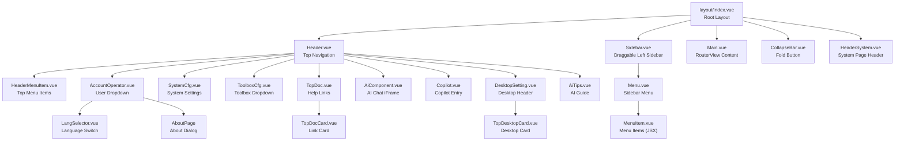
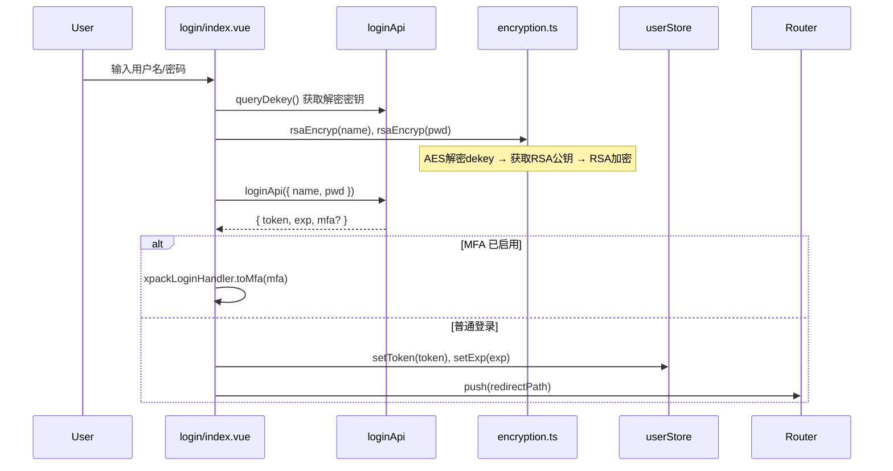
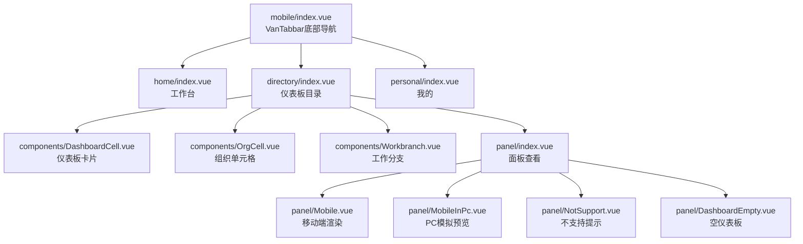

# 应用框架与辅助视图（layout/pages/misc）分析（v2.10.7）

## 1. 职责与架构位置

本章节覆盖 **88 个文件**，包括应用主框架（layout）、特殊页面（pages）、移动端（mobile）、公共组件（common）、模板市场（template-market）、模板管理（template）、工作台首页（workbranch）、AI 问数（copilot）、登录页、水印配置、系统工具等辅助视图。这些文件共同构成 DataEase v2.10.7 的**应用外壳**，是所有业务页面的承载框架。

- **layout/** 是应用主框架（21 files）—— 侧边栏、顶部导航、面包屑、主题切换、用户菜单、AI 助手入口
- **views/login/** 是登录页（1 file）—— 用户认证入口，对应后端 LoginApi/AuthApi
- **views/mobile/** 是移动端（13 files）—— 仪表板移动端查看，通过 permission.ts 重定向到 `mobile.html`
- **views/copilot/** 是 AI 问数界面（2 files）—— 对应后端 CopilotAPI
- **views/template-market/** 是模板市场（8 files）—— 模板浏览/预览/应用
- **views/template/** 是模板管理（6 files）—— 系统模板导入/分类/管理
- **views/workbranch/** 是工作台首页（4 files）—— 用户中心、快捷入口、推荐模板
- **views/common/** 是公共资源树（10 files）—— 资源选择器、创建操作、导出预览等
- **views/watermark/**（2 files）、**views/toolbox/**（1 file）、**views/wizard/**（1 file）、**views/about/**（2 files）等辅助页面
- **pages/** 是各入口点的 App.vue + main.ts（12 files）
- **locales/**（4 files）、**style/**（4 files）

## 2. 目录结构与关键组件清单

### 2.1 layout/ — 应用主框架（21 files）

| 文件 | 职责 | 关键点 |
|------|------|--------|
| `layout/index.vue` | 框架根组件 | 根据路由判断显示 Header 还是 HeaderSystem，控制侧边栏折叠 |
| `components/Header.vue` | 顶部导航栏 | 一级菜单渲染、AI/Copilot 按钮、下载中心、消息通知、系统设置入口 |
| `components/HeaderSystem.vue` | 系统设置页头部 | 显示 Logo + 分隔线 + 系统标题 + "返回工作台"链接 |
| `components/Menu.vue` | 侧边栏菜单 | 渲染二级/三级菜单，使用 `route.matched[0]?.children` 获取菜单列表 |
| `components/MenuItem.vue` | 侧边栏菜单项（JSX） | `iconMap` 映射菜单 meta.icon 到 SVG 组件，递归渲染 ElSubMenu/ElMenuItem |
| `components/HeaderMenuItem.vue` | 顶部菜单项（JSX） | 与 Router 配合渲染一级导航，支持多级子菜单 |
| `components/Sidebar.vue` | 可拖拽调整宽度的侧边栏 | 使用 `useMoveLine('DATASET')` hook，支持鼠标拖拽调整宽度 |
| `components/Main.vue` | 主内容区 | `<RouterView :key="route.path" />` |
| `components/CollapseBar.vue` | 侧边栏折叠按钮 | 显示在左侧底部，通过 event bus 同步宽度 |
| `components/AccountOperator.vue` | 用户头像+下拉菜单 | 用户信息、密码修改、语言切换、关于、退出登录 |
| `components/LangSelector.vue` | 语言切换器 | 调用 `switchLangApi` 切换后 reload 页面 |
| `components/Copilot.vue` | Copilot 引导气泡 | 首次使用的 Popover 提示 |
| `components/AiComponent.vue` | AI 助手 iframe 弹窗 | 嵌入 MaxKB 聊天窗口，支持最小化/最大化 |
| `components/AiTips.vue` | AI 助手引导提示 | 类似 Copilot 的首次使用 Popover 提示 |
| `components/SystemCfg.vue` | 系统设置入口按钮 | 点击跳转到 `/system` 路由 |
| `components/ToolboxCfg.vue` | 工具箱入口下拉 | 显示 `/toolbox` 下子路由卡片 |
| `components/DesktopSetting.vue` | 桌面端精简头部 | 桌面版专用：仅系统设置+AI/Copilot+语言切换 |
| `components/TopDoc.vue` | 帮助文档入口 | 包含帮助文档、产品论坛、技术博客、企业版试用链接 |
| `components/TopDocCard.vue` | 帮助文档卡片 | 通用卡片组件，点击 `window.open` 打开链接 |
| `components/TopDesktopCard.vue` | 桌面端卡片 | 事件向父组件发射 `openBlank` |
| `components/LayoutTransition.vue` | 路由过渡 | 简单的 `<router-view :key="route.path" />` 包裹 |

### 2.2 pages/ — 入口点（12 files）

| 文件 | 职责 |
|------|------|
| `pages/index/App.vue` | 主应用根组件：注册 `configGlobal` + `ExportExcel` 全局组件，监听 `data-export-center` 事件 |
| `pages/index/main.ts` | 应用初始化：`createApp` → `installDirective` → `setupStore` → `setupI18n` → `setupRouter` → `setupElementPlus` → `setupCustomComponent` → `app.mount('#app')` |
| `pages/mobile/App.vue` | 移动端入口组件 |
| `pages/mobile/main.ts` | 移动端初始化 |
| `pages/panel/App.vue` | 面板（仪表板/大屏）独立入口 |
| `pages/panel/main.ts` | 面板入口初始化 |
| `pages/panel/DashboardPreview.vue` | 仪表板预览 |
| `pages/panel/Iframe.vue` | iframe 模式嵌入 |
| `pages/panel/ViewWrapper.vue` | 视图包装器 |
| `pages/lib/dashboard/index.ts` | 仪表板库导出 |
| `pages/lib/main.ts` | 库入口 |
| `pages/lib/install.ts` | 库安装初始化 |

### 2.3 views/mobile/ — 移动端（13 files）

| 文件 | 职责 |
|------|------|
| `views/mobile/index.vue` | 移动端主页，使用 `vant` 的 Tabbar（工作台/仪表板/我的） |
| `views/mobile/home/index.vue` | 移动端工作台首页 |
| `views/mobile/directory/index.vue` | 移动端目录浏览 |
| `views/mobile/personal/index.vue` | 移动端个人中心 |
| `views/mobile/login/index.vue` | 移动端登录页 |
| `views/mobile/panel/index.vue` | 移动端面板入口 |
| `views/mobile/panel/Mobile.vue` | 移动端面板渲染 |
| `views/mobile/panel/MobileInPc.vue` | PC 端模拟移动预览 |
| `views/mobile/panel/NotSupport.vue` | 不支持提示 |
| `views/mobile/panel/DashboardEmpty.vue` | 空仪表板提示 |
| `views/mobile/components/DashboardCell.vue` | 仪表板卡片单元格 |
| `views/mobile/components/OrgCell.vue` | 组织单元格 |
| `views/mobile/components/Workbranch.vue` | 移动端工作分支 |

### 2.4 辅助视图

| 目录 | 文件数 | 关键职责 |
|------|--------|----------|
| `views/login/` | 1 | 登录页：账号密码/SSO/LDAP 认证，RSA 加密传输，MFA 支持 |
| `views/copilot/` | 2 | AI 问数：数据集选择 + 对话历史 + 图表渲染 |
| `views/template-market/` | 8 | 模板市场：分类浏览、搜索筛选、预览/应用模板 |
| `views/template/` | 6 | 模板管理：分类管理、模板导入/删除/批量操作 |
| `views/workbranch/` | 4 | 工作台首页：用户信息 + 快捷创建 + 推荐模板 |
| `views/common/` | 10 | 公共组件：资源树、创建操作、样式编辑等 |
| `views/watermark/` | 2 | 水印配置：启用/禁用、内容类型、颜色/尺寸/间距 |
| `views/toolbox/` | 1 | 工具箱入口（模板设置） |
| `views/wizard/` | 1 | 向导页面 |
| `views/panel/` | 1 | 面板入口 |
| `views/home/` | 1 | 首页 |
| `views/dynimic/` | 1 | 动态认证（OIDC/CAS） |
| `views/canvas/` | 1 | 大屏画布入口 |
| `views/application/` | 1 | 应用入口 |
| `views/404/` | 1 | 404 页面 |
| `views/401/` | 1 | 401 未授权页面 |
| `views/about/` | 2 | 关于页面 |

### 2.5 locales/ 与 style/

| 文件 | 职责 |
|------|------|
| `locales/zh-CN.ts` | 简体中文语言包 |
| `locales/en.ts` | 英文语言包 |
| `locales/tw.ts` | 繁体中文语言包 |
| `locales/en-US.ts` | 美式英文语言包 |
| `style/index.less` | 全局样式入口 |
| `style/variable.less` | CSS 变量定义 |
| `style/mixin.less` | Less 混入 |
| `style/custom-theme.css` | 自定义主题样式 |

## 3. 应用布局架构

**Layout 渲染逻辑** (`layout/index.vue`):

1. **路由判断**：`systemMenu`（路径含 `system`）、`settingMenu`（含 `sys-setting`）、`marketMenu`（含 `template-market`）、`toolboxMenu`（含 `toolbox`）、`msgFillMenu`（含 `msg-fill`）
2. **侧边栏显示规则**：以上路径均显示 Sidebar + Menu，其余路由（如 workbranch）仅显示顶部导航
3. **头部切换**：系统/设置/工具箱/消息页面使用 `HeaderSystem`（带返回工作台按钮），其余使用 `Header`
4. **侧边栏折叠**：`isCollapse` 控制折叠状态，`CollapseBar` 在底部显示折叠按钮

## 4. 登录流程

**关键实现细节** (`views/login/index.vue`):

- **加密流程** (`login/index.vue:86-88`): 前端先用 `queryDekey()` 获取服务器公钥（经过 AES 加密存储），再用 `rsaEncryp()` 解密得到公钥后 RSA 加密用户名和密码传输
- **认证类型** (`login/index.vue:87-88`): 支持 `simple`（账号密码）和 `ldap`（LDAP 认证）两种标签页
- **SSO 登录** (`login/index.vue:217-244`): `loginCategoryApi()` 返回认证类型；若为 SSO（值 0），通过 `xpackLoginHandler` 触发 OIDC/CAS 登录
- **MFA 支持** (`login/index.vue:104-107`): 若响应含 `mfa.enabled = true`，转向 MFA 验证流程
- **Token 错误处理** (`login/index.vue:144-169`): 对 `token is empty/Expired/destroyed`、`user_disable`、`permission has been changed` 等错误给出明确提示
- **网关标记** (`login/index.vue:248-254`): 检查 `DE-GATEWAY-FLAG` localStorage 标记，如存在则提示错误并清理登录状态

## 5. 移动端适配

### 5.1 重定向机制

[Inference] 移动端访问时，`permission.ts` 将路由重定向到 `mobile.html`（独立入口页），使用 `pages/mobile/` 作为入口点而非 `pages/index/`。

### 5.2 移动端架构

### 5.3 移动端特点

- **UI 库**: 使用 `vant` 组件库（Tabbar、Overlay、Loading、NavBar）而非 element-plus
- **Tabbar 状态**: 通过 `sessionStorage` 缓存 `activeTabbar` 状态
- **移动端检测** (`utils/utils.ts:134-140`): `isMobile()` 通过 `navigator.userAgent` 检测
- **请求头** (`config/axios/service.ts:112-114`): 移动端请求自动添加 `X-DE-MOBILE: true`

## 6. 辅助页面详情

### 6.1 Copilot（AI 问数）(`views/copilot/index.vue`)

- **数据集选择**: 通过 `getDatasetTree` 获取数据集树，使用 `el-tree-select` 选择
- **对话交互**: 用户输入问题，调用 `copilotChat({ datasetGroupId, question, history })`
- **字段预览**: 选中数据集后展示维度（dimensionList）和指标（quotaList）字段
- **组件**: `DialogueChart.vue` 负责渲染对话气泡和图表
- **后端 API**: `@/api/dataset` 中的 `copilotChat`、`copilotFields`、`getListCopilot`、`clearAllCopilot`

### 6.2 模板市场 (`views/template-market/index.vue`)

- **来源筛选**: 全部/模板市场/模板管理
- **类型筛选**: 全部/仪表板/数据大屏
- **分类筛选**: 全部/应用模板/样式模板
- **预览模式**: `full`（列表浏览）/ `marketPreview`（市场预览）/ `createPreview`（创建预览）
- **应用模板**: 构造 `templateParams`（Base64 编码），`window.open` 新窗口到 `#/dashboard?opt=create&createType=template`
- **API**: `searchMarket()`、`searchMarketRecommend()`
- **子组件**: `CategoryTemplateV2.vue`、`MarketPreviewV2.vue`、`TemplateMarketV2Item.vue`、`TemplateSkeleton.vue`

### 6.3 模板管理 (`views/template/index.vue`)

- **分类管理**: 左侧分类树（`DeTemplateList`），支持新增/编辑/删除分类
- **模板操作**: 导入模板、编辑模板、删除模板、批量删除/移动分类
- **搜索**: 支持按名称搜索模板
- **API**: `find`、`findCategories`、`save`、`templateDelete`、`deleteCategory`、`batchDelete`（来自 `@/api/template`）
- **子组件**: `DeTemplateList.vue`、`DeTemplateItem.vue`、`DeTemplateImport.vue`、`DeCategoryChange.vue`

### 6.4 工作台首页 (`views/workbranch/index.vue`)

- **用户信息区**: 头像 + 姓名 + ID + 各业务资源的叶子节点计数
- **快捷创建**: 仪表板/数据大屏/数据集/数据源四个入口，需 `menuAuth && anyManage` 权限
- **模板推荐**: 调用 `searchMarketRecommend()` 获取推荐模板，分类展示
- **快捷操作表**: `ShortcutTable.vue` 展示最近访问的仪表板/大屏
- **API**: `searchMarketRecommend`、`queryShareBaseApi`

### 6.5 水印配置 (`views/watermark/index.vue`)

- **启用控制**: `el-switch` 控制水印开关
- **水印内容**: 自定义内容（支持变量 `${time}`/`${ip}`/`${nickName}`/`${username}`）、账户、昵称、IP、时间
- **样式配置**: 颜色（ColorPicker）、字号（12-32px）、水平间距（10-400px）、垂直间距（10-400px）
- **预览**: 右侧实时预览明暗两种背景下的水印效果
- **API**: `watermarkFind`、`watermarkSave`（来自 `@/api/watermark`）

### 6.6 其他辅助视图

| 视图 | 说明 |
|------|------|
| `views/about/index.vue` | 关于页面，通过事件 `open-about-dialog` 弹出 Dialog |
| `views/toolbox/template-setting/index.vue` | 工具箱-模板设置 |
| `views/wizard/index.vue` | 向导页面（新建面板引导） |
| `views/panel/index.vue` | 面板总入口 |
| `views/home/index.vue` | 首页视图 |
| `views/dynimic/Auth.vue` | OIDC/CAS 动态认证回调处理 |
| `views/canvas/DeCanvas.vue` | 数据大屏画布入口 |
| `views/application/index.vue` | 应用管理入口 |
| `views/404/index.vue` | 404 页面 |
| `views/401/index.vue` | 401 未授权页面 |

### 6.7 公共组件 (`views/common/`)

| 组件 | 职责 |
|------|------|
| `DeResourceTree.vue` | 资源树选择器（仪表板/数据集/数据源目录） |
| `DeResourceCreateOpt.vue` | 资源创建操作入口 |
| `DeResourceCreateOptV2.vue` | 资源创建操作 V2（被 workbranch/index.vue 引用） |
| `DeResourceGroupOpt.vue` | 资源分组操作 |
| `DeResourceArrow.vue` | 资源面包屑箭头 |
| `DeAppApply.vue` | 应用申请 |
| `DeTemplatePreviewList.vue` | 模板预览列表 |
| `ComponentStyleEditor.vue` | 组件样式编辑器 |
| `DvDetailInfo.vue` | 详情信息 |
| `MultiplexingCanvas.vue` | 复用画布 |

## 7. 与后端的交互

| 模块 | 关键 API | 后端控制器 |
|------|----------|----------|
| 登录认证 | `loginApi`、`queryDekey`、`loginCategoryApi`、`logoutApi`、`refreshApi` | LoginApi / AuthApi |
| 用户信息 | `personInfoApi`、`switchLangApi` | UserApi |
| AI 问数 | `copilotChat`、`copilotFields`、`getListCopilot`、`clearAllCopilot` | CopilotAPI |
| 模板市场 | `searchMarket`、`searchMarketRecommend` | TemplateMarketApi |
| 模板管理 | `find`、`findCategories`、`save`、`templateDelete`、`batchDelete` | TemplateApi |
| 水印 | `watermarkFind`、`watermarkSave` | WatermarkApi |
| 系统参数 | `findBaseParams`（AI 基础 URL）、`/sysParameter/requestTimeOut` | SysParameterApi |
| 消息通知 | `msgCountApi` | MsgApi |
| 分享 | `queryShareBaseApi` | ShareApi |

## 8. 风险与待确认

| 编号 | 问题 | 状态 |
|------|------|------|
| NE-1 | `log/dataset/sys-tools` 路由是否存在？MenuItem.vue 中定义了 `log` 图标但未确认是否有对应路由 | [Need Verification] |
| NE-2 | `layout/index.vue:70` 中 `XpackComponent` 的 `L2NvbXBvbmVudC9sb2dpbi9Qd2RJbnZhbGlkVGlwcw==`（PwdInvalidTips）是 xpack 插件，具体逻辑在闭源包中 | [Need Verification] |
| NE-3 | `Header.vue:36` 点击 Logo 跳转到 `/workbranch/index`，但不包含 `/workbranch/index` 本身时 — 如果已在 workbranch 点击 logo 无反应，这是 expected behavior 还是 bug？ | [Need Verification] |
| NE-4 | `utils/check.ts` 中的 `shutdown` 功能未确认具体使用场景 | [Need Verification] |
| NE-5 | `pages/panel/Iframe.vue` 和 `pages/panel/ViewWrapper.vue` 的嵌入模式细节需要进一步了解 xpack 插件逻辑 | [Need Verification] |
| NE-6 | 移动端登录页 (`views/mobile/login/index.vue`) 是否支持与 PC 端相同的 SSO/IDAP/MFA 功能？ | [Need Verification] |
| NE-7 | `layout/components/TopDoc.vue` 中帮助文档链接 URL 可通过 `appearanceStore.getHelp` 自定义，默认值 `https://dataease.io/docs/v2/` | [Need Verification] |

## 9. 相关文档

- [认证与路由分析 (auth-router.md)](auth-router.md) — 路由守卫 `permission.ts` 逻辑
- [API 调用分析 (api-request.md)](api-request.md) — axios 拦截器、token 刷新、错误处理
- [状态管理分析 (store.md)](store.md) — userStore、permissionStore、appearanceStore
- [基础设施分析 (infrastructure.md)](../docs/frontend/infrastructure.md) — 应用初始化流程
- [工具函数与配置补充 (utils-supplement.md)](utils-supplement.md) — encryption、CrossPermission、check 等工具详解
