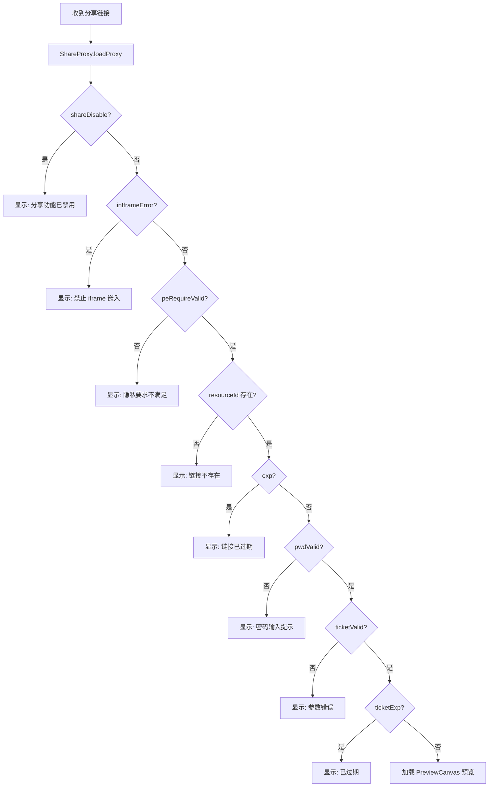
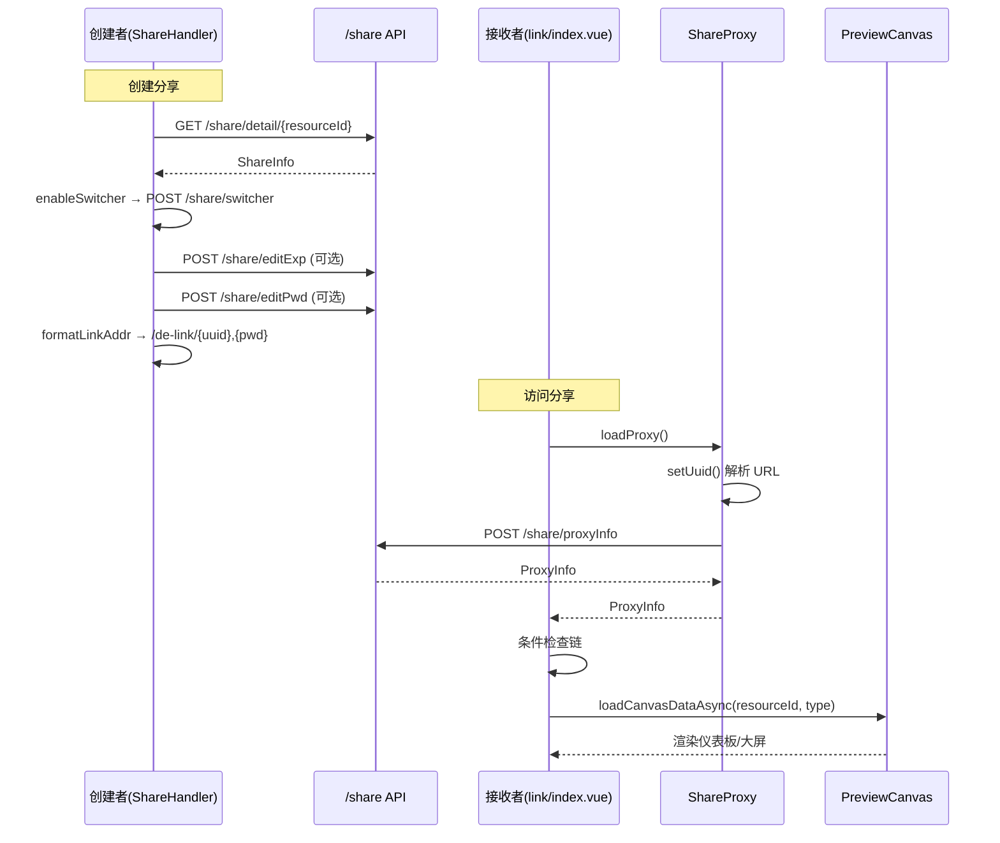

# 分享视图（Share Views）前端分析（v2.10.7）

> 分析范围：`core/core-frontend/src/views/share/**`
> 源码版本：DataEase v2.10.7
> 覆盖文件：14 个（`.vue`、`.ts`）

## 1. 职责与架构位置

`views/share/` 是仪表板/大屏的**公共链接分享**模块，负责：

1. **公共链接生成**：创建带 UUID 的唯一分享链接（`/de-link/{uuid}`）
2. **访问控制**：密码保护、有效期限制、Ticket 验证
3. **分享面板**：在仪表板/大屏编辑器内提供分享设置对话框
4. **分享接收**：接收者通过链接查看时的解密与路由跳转

```
views/share/
├── link/                        # 公共链接访问端（接收者视图）
│   ├── index.vue                # 链接入口页面
│   ├── mobile.vue               # 移动端入口
│   ├── ShareProxy.ts            # 分享代理（UUID 解析 + 后端验证）
│   ├── pwd.vue                  # 密码输入提示
│   └── ErrorTemplate.vue        # 错误提示模板
└── share/                       # 分享配置端（创建者视图）
    ├── ShareHandler.vue          # 分享按钮 + 配置对话框（主组件）
    ├── SharePanel.vue            # 分享面板（标题栏入口）[Need Verification]
    ├── ShareGrid.vue             # 分享网格列表
    ├── ShareTicket.vue           # Ticket 有效期设置
    ├── ShareVisualHead.vue       # 可视化头部信息
    ├── CustomLinkPwd.vue         # 自定义密码对话框
    ├── TicketDialog.vue          # Ticket 设置弹窗容器
    ├── TicketEdit.vue            # Ticket 编辑
    └── option.ts                 # ShareInfo 接口 + 快捷时间
```

## 2. 核心数据模型

### 2.1 `ShareInfo` — 分享信息

```typescript
// 文件: views/share/share/option.ts:3-11
export interface ShareInfo {
  id: string           // 分享记录 ID
  exp?: number         // 过期时间（Unix ms timestamp，0=永不过期）
  uuid: string         // 链接唯一标识（8-16位字母数字）
  pwd?: string         // 访问密码
  autoPwd: boolean     // 是否自动生成密码
  ticketRequire?: boolean // 是否要求 Ticket 验证
}
```

### 2.2 `ProxyInfo` — 分享代理信息（后端验证结果）

```typescript
// 文件: views/share/link/ShareProxy.ts:11-23
export interface ProxyInfo {
  resourceId: string     // 资源 ID（仪表板/大屏）
  uid: string            // 创建者用户 ID
  exp?: boolean          // 是否已过期
  pwdValid?: boolean     // 密码是否已验证
  type: string           // 资源类型
  inIframeError: boolean // 是否在 iframe 中嵌入（拒绝嵌入）
  shareDisable: boolean  // 分享功能是否被禁用
  peRequireValid: boolean // 隐私增强要求是否满足
  ticketValidVO: TicketValidVO // Ticket 验证结果
  pwd?: string           // URL 中携带的密码
  uuid: string           // 链接 UUID
}

export interface TicketValidVO {
  ticketValid: boolean   // Ticket 是否有效
  ticketExp: boolean     // Ticket 是否过期
  args: string           // Ticket 参数
}
```

### 2.3 `SHARE_BASE` 常量

```typescript
// 文件: views/share/share/option.ts:12
export const SHARE_BASE = '/de-link/'
```

所有分享链接的路径前缀为 `/de-link/`，完整 URL 格式：
```
{origin}/#/de-link/{uuid},{pwd}?ticket={ticket}
```

## 3. 关键组件分析

### 3.1 `ShareProxy` — 分享代理类

**文件**: `views/share/link/ShareProxy.ts`

**职责**: 从 URL 中解析 UUID、密码、Ticket，向后端验证分享链接有效性。

**核心方法**:

| 方法 | 职责 |
|------|------|
| `setUuid()` | 从 URL 路径 `de-link/{uuid}` 中提取 UUID，支持 `{uuid},{pwd}` 逗号分隔格式 |
| `getTicket()` | 从 URL query string 中提取 `ticket` 参数 |
| `loadProxy()` | 携带 UUID、密码密文、iframe 检测、ticket → `POST /share/proxyInfo` |

**密码持久化**（`ShareProxy.ts:75-78`）:
```typescript
const ciphertext = wsCache.get(`link-${uuid}`)
if (ciphertext) {
  param['ciphertext'] = ciphertext
}
```

密码验证通过后，后端返回 `ciphertext`，前端缓存到 `wsCache`（Web Storage Cache），后续访问无需重复输入密码。

> [Inference] `ciphertext` 可能是密码的加密凭证（Token），而非原密码，避免前端存储明文密码。

### 3.2 `link/index.vue` — 公共链接入口

**文件**: `views/share/link/index.vue`

**职责**: 分享链接的目标页面，负责接收者访问流程控制。依次检查多个条件，任一不满足则渲染错误模板。

**访问流程**（`views/share/link/index.vue:61-104`）:



**条件渲染**（`views/share/link/index.vue:6-29`）: 使用 `v-if`/`v-else-if`/`v-else` 链，`loading` flag 确保数据加载完成前不显示任何状态。

### 3.3 `share/ShareHandler.vue` — 分享配置对话框

**文件**: `views/share/share/ShareHandler.vue`

**职责**: 仪表板/大屏编辑器中的分享按钮 + 配置对话框。根据权限 weight 动态显示。

**显示条件**:
- `props.weight >= 7`（管理员/编辑者权限级别）
- `props.inGrid` 时为图标按钮，`props.isButton` 时为文字按钮

**核心功能**:

| 功能 | 实现 |
|------|------|
| 开启/关闭分享 | `enableSwitcher()` → `POST /share/switcher/{resourceId}` |
| 自定义 UUID | `editUuid()` → `validateUuid()` → `POST /share/editUuid` |
| 设置过期时间 | `expEnableSwitcher(val)` → `expChangeHandler(exp)` → `POST /share/editExp` |
| 密码保护 | `pwdEnableSwitcher(val)` → `POST /share/editPwd` |
| 复制链接 | `copyInfo()` 生成 `/de-link/{uuid},{pwd}` 格式 |
| Ticket 设置 | `openTicket()` → `TicketDialog` + `ShareTicket` |
| 自定义密码 | `openPwdDialog()` → `CustomLinkPwd` |

**UUID 校验规则**（`views/share/share/ShareHandler.vue:289-306`）:
```typescript
const validateUuid = async () => {
  if (!val) return false  // 不能为空
  const regex = /^[a-zA-Z0-9]{8,16}$/  // 8-16 位字母数字
  const msg = await uuidValidateApi(val)  // 后端去重校验
  return !msg
}
```

**密码生成算法**（`views/share/share/ShareHandler.vue:605-629`）:
- 长度 10 位
- 字符集: `[A-Za-z0-9!@#$%^&*()_+]`
- 确保至少包含一个特殊字符
- 随机排序

**链接地址格式化**（`views/share/share/ShareHandler.vue:424-438`）:
```typescript
// 完整格式: {origin}{path}#/de-link/{uuid},{pwd}
const formatLinkBase = () => {
  let prefix = embeddedStore.baseUrl 
    ? embeddedStore.baseUrl + '#'
    : window.location.origin + window.location.pathname + '#'
  // 处理 oidcbi/casbi 路径修正
  if (prefix.includes('oidcbi/') || prefix.includes('casbi/')) {
    prefix = prefix.replace('oidcbi/', '').replace('casbi/', '')
  }
  return prefix + SHARE_BASE  // → {prefix}/de-link/
}
```

**隐私增强要求（PE Require）**（`views/share/share/ShareHandler.vue:485-492`）:
当 `sharePeRequire` 为 true 时，过期时间和密码必须设置其一：
```typescript
const validatePeRequire = () => {
  const expRequireValid = overTimeEnable || !sharePeRequire
  const pwdRequireValid = passwdEnable || !sharePeRequire
  return expRequireValid && pwdRequireValid
}
```

### 3.4 `ShareVisualHead.vue` — 可视化头部分享按钮

**文件**: `views/share/share/ShareVisualHead.vue`

**职责**: 在仪表板/大屏可视化界面的头部工具栏中放置分享按钮入口（与 `ShareHandler` 协作）。

> [Inference] `ShareVisualHead` 在头部命令栏注册分享命令，通过 `defineExpose({ execute })` 被外部调用触发 `share()`。

### 3.5 `ShareTicket.vue` — Ticket 有效期设置

**文件**: `views/share/share/ShareTicket.vue`

**职责**: 管理分享链接的 Ticket 验证功能：
- 开启/关闭 Ticket 验证
- 设置 Ticket 有效期
- 展示当前 Ticket 链接

> [Need Verification] 需要进一步阅读 `ShareTicket.vue` 和 `TicketEdit.vue` 以确认 Ticket 的生成机制和后端 API。

### 3.6 `ShareGrid.vue` — 分享链接网格

**文件**: `views/share/share/ShareGrid.vue`

**职责**: 以卡片/网格形式展示分享链接列表，供用户管理多个分享。

## 4. 完整 API 调用清单

| 组件 | API 端点 | 方法 | 参数 | 说明 |
|------|---------|------|------|------|
| `ShareProxy` | `/share/proxyInfo` | POST | `{uuid, ciphertext, inIframe, ticket}` | 验证分享链接 |
| `ShareHandler` | `/share/detail/{resourceId}` | GET | — | 获取分享详情 |
| `ShareHandler` | `/share/switcher/{resourceId}` | POST | — | 开启/关闭分享 |
| `ShareHandler` | `/share/editUuid` | POST | `{resourceId, uuid}` | 自定义 UUID（含校验）|
| `ShareHandler` | `/share/editExp` | POST | `{resourceId, exp}` | 设置过期时间 |
| `ShareHandler` | `/share/editPwd` | POST | `{resourceId, pwd, autoPwd}` | 设置/重置密码 |

## 5. 安全机制

### 5.1 多层验证

分享链接访问时的验证顺序（`link/index.vue`）：
1. `shareDisable` — 全局分享开关
2. `inIframeError` — 防 iframe 嵌入（防 clickjacking）
3. `peRequireValid` — 隐私增强强制要求
4. `pwdValid` — 密码验证
5. `ticketValidVO.ticketValid` — Ticket 有效性
6. `ticketValidVO.ticketExp` — Ticket 过期

### 5.2 密码管理

- 密码通过 `ciphertext` 机制缓存，避免每次刷新重新输入
- 默认自动生成 10 位强密码（含特殊字符）
- 密码在对话框中以只读方式展示，支持手动自定义
- 密码以 `{uuid},{pwd}` 格式嵌入 URL 路径（而非 query string，相对更安全）

### 5.3 防嵌入

```typescript
// 文件: views/share/link/ShareProxy.ts:3
import { isInIframe } from '@/utils/utils'
```
后端检查 `inIframe` 标记，决定是否拒绝 iframe 嵌入展示。

## 6. 数据流



## 7. Store 依赖

| Store | 用途 |
|-------|------|
| `useLinkStoreWithOut()` | 分享链接状态管理 |
| `useShareStoreWithOut()` | 分享功能全局状态 |
| `useEmbedded()` | 嵌入式部署基础 URL |
| `useCache()` | Web Storage 缓存（密码 ciphertext） |
| `usePermissionStoreWithOut()` | 权限路径 |
| `useRequestStoreWithOut()` | 请求加载状态 |

## 8. 关键路径速查

| 功能 | 入口 | 关键方法 | API |
|------|------|---------|-----|
| 创建分享链接 | `ShareHandler.share()` | `loadShareInfo()` | `GET /share/detail/{id}` |
| 开启分享 | `ShareHandler.enableSwitcher()` | — | `POST /share/switcher/{id}` |
| 设置过期时间 | `ShareHandler.expEnableSwitcher()` | `expChangeHandler()` | `POST /share/editExp` |
| 设置密码 | `ShareHandler.pwdEnableSwitcher()` | `resetPwdHandler()` | `POST /share/editPwd` |
| 自定义 UUID | `ShareHandler.editUuid()` | `validateUuid()` + `finishEditUuid()` | `POST /share/editUuid` |
| 复制分享链接 | `ShareHandler.copyInfo()` | `formatLinkAddr()` | — |
| 访问分享链接 | `link/index.vue` | `onMounted` → `shareProxy.loadProxy()` | `POST /share/proxyInfo` |
| 密码验证 | `link/pwd.vue` | 输入密码 → emit | — |
| Ticket 管理 | `ShareHandler.openTicket()` | → `ShareTicket` | — |

## 9. 设计模式

### 9.1 代理模式（Proxy Pattern）

`ShareProxy` 类封装了分享链接的解析与验证逻辑：
- 从 URL 路径/参数中提取关键信息
- 统一与后端 `/share/proxyInfo` 交互
- 返回标准化的 `ProxyInfo` 结构
- 复用 `wsCache` 缓存密码凭证

### 9.2 门面模式（Facade Pattern）

`ShareHandler` 组件封装了完整的分享配置流程：
- 单个组件管理所有 API 调用（`switcher`、`editUuid`、`editExp`、`editPwd`）
- 复杂的校验逻辑内聚在组件内
- 对外通过 `defineExpose({ execute })` 暴露简洁接口

### 9.3 条件链错误处理

`link/index.vue` 使用 `v-if`/`v-else-if` 链式模板，依次检查各类错误条件，每个状态对应一个错误模板，避免深层嵌套。

## 10. 文件完整清单

| 文件 | 角色 | 分析状态 |
|------|------|---------|
| `link/index.vue` | 公共链接入口 | ✓ |
| `link/mobile.vue` | 移动端入口 | [Need Verification] |
| `link/ShareProxy.ts` | 分享代理 | ✓ |
| `link/pwd.vue` | 密码提示 | ✓ (概述) |
| `link/ErrorTemplate.vue` | 错误模板 | ✓ (概述) |
| `share/ShareHandler.vue` | 分享配置主组件 | ✓ |
| `share/SharePanel.vue` | 分享面板 | [Need Verification] |
| `share/ShareGrid.vue` | 分享网格列表 | ✓ (概述) |
| `share/ShareTicket.vue` | Ticket 设置 | ✓ (概述) |
| `share/ShareVisualHead.vue` | 可视化头部按钮 | ✓ (概述) |
| `share/TicketDialog.vue` | Ticket 弹窗容器 | [Need Verification] |
| `share/TicketEdit.vue` | Ticket 编辑 | [Need Verification] |
| `share/CustomLinkPwd.vue` | 自定义密码对话框 | [Need Verification] |
| `share/option.ts` | 数据模型 + 常量 | ✓ |
