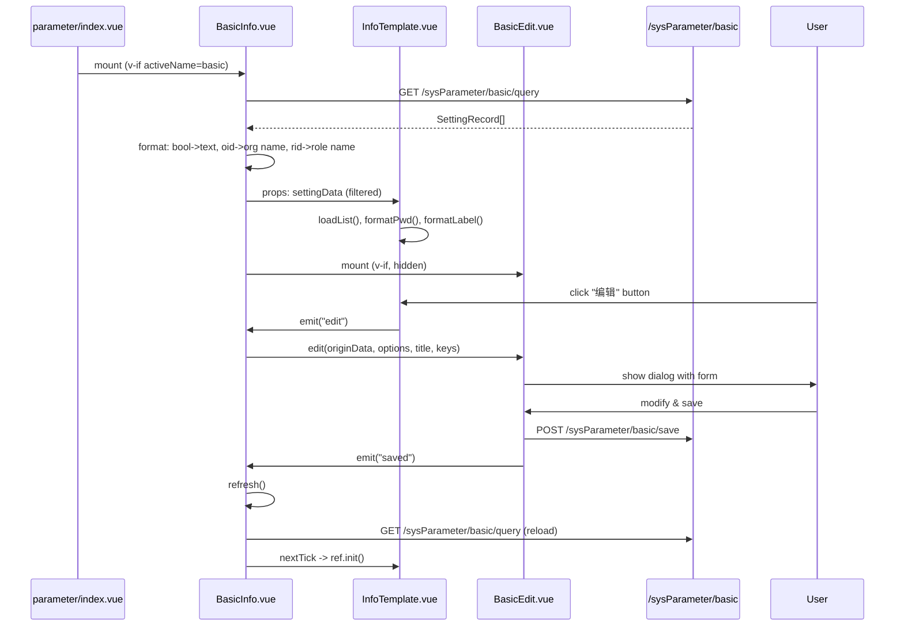
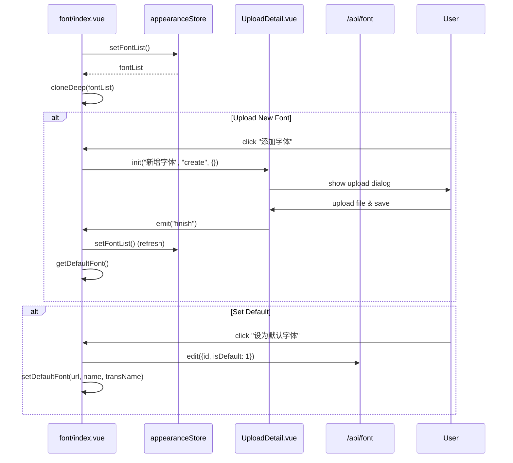
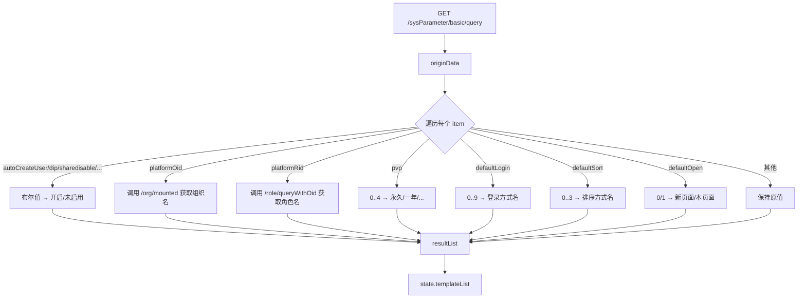

# 系统管理视图（System Views）前端分析（v2.10.7）

> 分析范围：`core/core-frontend/src/views/system/**`
> 源码版本：DataEase v2.10.7
> 覆盖文件：21 个（`.vue`、`.ts`、`.js`）

## 1. 职责与架构位置

`views/system/` 是系统管理/设置模块的视图层，负责参数配置、字体管理、密码修改等管理功能的 UI 展示与交互。路由入口通过 `router/` 配置映射到各子目录。

主要职责：

1. **系统参数配置**：基本设置、地图设置、引擎设置，通过 `InfoTemplate` 通用模板渲染 K/V 配置项
2. **字体管理**：字体上传、设为默认、删除字体，通过 CSS 变量注入全局字体
3. **密码修改**：用户中心-修改密码界面
4. **企业版扩展**: 邮件设置通过 `xpack-component` 动态加载

```
views/system/
├── common/
│   ├── SettingTemplate.ts   # SettingRecord/ToolTipRecord 接口定义
│   └── InfoTemplate.vue     # 通用系统参数信息展示组件
├── parameter/
│   ├── index.vue            # 参数 Tab 页入口
│   ├── basic/
│   │   ├── BasicInfo.vue    # 基本设置信息展示
│   │   └── BasicEdit.vue    # 基本设置编辑对话框
│   ├── engine/
│   │   ├── EngineInfo.vue   # 引擎设置入口
│   │   ├── EngineInfoTemplate.vue # 引擎信息模板
│   │   └── EngineEdit.vue   # 引擎设置编辑
│   └── map/
│       ├── MapSetting.vue   # 地图设置 Tab
│       ├── Geometry.vue     # 几何图形设置
│       ├── GeometryEdit.vue # 几何图形编辑
│       ├── OnlineMap.vue    # 在线地图设置
│       ├── OnlineMapGaode.vue # 高德地图配置
│       ├── OnlineMapQQ.vue  # 腾讯地图配置
│       ├── OnlineMapTdt.vue # 天地图配置
│       └── interface.ts     # 地图接口定义
├── font/
│   ├── index.vue            # 字体管理主页面
│   ├── FontInfo.vue         # 字体信息展示
│   └── UploadDetail.vue     # 字体上传对话框
└── modify-pwd/
    ├── index.vue            # 用户中心-修改密码
    └── UpdatePwd.vue        # 密码修改表单
```

## 2. 关键组件分析

### 2.1 `common/SettingTemplate.ts` — 系统参数数据模型

```typescript
// 文件: views/system/common/SettingTemplate.ts
export interface SettingRecord {
  pkey: string   // 参数键
  pval: string   // 参数值
  type: string   // 参数类型（"pwd" 表示密码类型）
  sort: number   // 排序权重
}

export interface ToolTipRecord {
  key: string    // tooltip 对应的 key
  val: string    // tooltip 内容
}
```

**设计意图**：定义系统参数的通用数据结构，所有参数配置页面共享此模型。`pkey` 遵循 `{category}.{key}` 格式（如 `basic.frontTimeOut`、`engine.dataEaseEngineMode`）。

### 2.2 `common/InfoTemplate.vue` — 通用参数信息展示组件

**文件**: `views/system/common/InfoTemplate.vue`

**职责**: 以 K/V 两列布局展示系统参数，支持密码切换（show/hide）、复制、tooltip 提示。

**Props**:

| Prop | 类型 | 说明 |
|------|------|------|
| `settingKey` | String | 参数分类标识（如 `"basic"`、`"engine"`）|
| `labelTooltips` | `ToolTipRecord[]` | 参数 tooltip 文案 |
| `settingData` | `SettingRecord[]` | 参数数据列表 |
| `settingTitle` | String | 区域标题 |
| `hideHead` | Boolean | 是否隐藏头部（标题+按钮）|
| `showValidate` | Boolean | 是否显示"验证"按钮 |
| `testConnectText` | String | "测试连接"按钮文案 |
| `copyList` | `string[]` | 允许复制的 pkey 列表 |

**关键逻辑**:

- **密码隐藏/显示**: 通过 `pwdItem` ref 维护每个密码字段的隐藏状态，`switchPwd()` 切换（`views/system/common/InfoTemplate.vue:195-197`）
- **特殊字段处理**: `basic.dsIntervalTime` 和 `basic.dsExecuteTime` 拼接特殊文案（执行间隔+执行时机）
- **暴露 `init()`**: 父组件可通过 `ref.init()` 重新初始化参数列表
- **复制功能**: 使用 `vue-clipboard3` 的 `useClipboard()`，配置了 `copyList` 的字段显示复制按钮

**事件**:

- `@edit`: 点击"编辑"按钮时触发
- `@check`: 点击"验证/测试连接"按钮时触发

**样式**: 参数项采用 `50%` 宽双列浮动布局，自动换行（`views/system/common/InfoTemplate.vue:245-246`）。

### 2.3 `parameter/index.vue` — 系统参数 Tab 页入口

**文件**: `views/system/parameter/index.vue`

**职责**: 使用 `el-tabs` 组织"基本设置"、"地图设置"、"引擎设置"三个 Tab，通过 `v-if` 条件渲染懒加载对应组件。

**Tab 配置**:

```typescript
// 文件: views/system/parameter/index.vue:33-37
const tabArray = ref([
  { label: t('system.basic_settings'), name: 'basic' },
  { label: t('system.map_settings'), name: 'map' },
  { label: t('system.engine_settings'), name: 'engine' }
])
```

**企业版扩展**: 邮件设置 Tab 通过 `xpack-component`（`L21lbnUvc2V0dGluZy9lbWFpbC9pbmRleA==`）动态加载，加载后通过 `addTable()` 插入到 `tabArray` 中（`views/system/parameter/index.vue:41-45`）。

> [Inference] `xpack-component` 的 `jsname` 是 Base64 编码的路径，表示企业版功能模块。社区版中该组件返回空，邮件 Tab 不显示。

### 2.4 `parameter/basic/BasicInfo.vue` — 基本设置信息展示

**文件**: `views/system/parameter/basic/BasicInfo.vue`

**职责**: 将系统参数分为三个区域展示：

1. **基本设置** (`baseInfoSettings`): 排除登录设置和第三方平台设置后的配置，如 `defaultSort`、`defaultOpen`、`frontTimeOut`、`dsIntervalTime` 等
2. **登录设置** (`loginInoSettings`): 包括 `dip`、`pvp`、`defaultLogin`、`loginLimit`、`loginLimitRate`、`loginLimitTime`
3. **第三方平台设置** (`thirdInfoSettings`): 包括 `autoCreateUser`、`platformOid`、`platformRid`

**数据来源**: 通过 `GET /sysParameter/basic/query` 获取原始参数列表，前端进行以下格式化（`views/system/parameter/basic/BasicInfo.vue:167-255`）：

| 原始 pkey | 格式化逻辑 |
|-----------|-----------|
| `basic.autoCreateUser` | `true` → `chart.open`, `false` → `system.not_enabled` |
| `basic.dip` | 同上布尔→文本转换 |
| `basic.pwdStrategy` | 同上 |
| `basic.shareDisable` | 同上 |
| `basic.sharePeRequire` | 同上 |
| `basic.platformOid` | 调用 `GET /org/mounted` 获取组织树，转名称 |
| `basic.platformRid` | 调用 `GET /role/queryWithOid/{oid}` 获取角色，转名称 |
| `basic.pvp` | `0/1/2/3/4` → 永久/一年/六个月/三个月/一个月 |
| `basic.defaultLogin` | `0..9` → 普通登录/LDAP/OIDC/CAS/OAuth2 |
| `basic.defaultSort` | `0..3` → 时间升序/时间降序/名称升序/名称降序 |
| `basic.defaultOpen` | `0/1` → 新页面/本页面 |

**平台认证状态**: `queryCategoryStatus()` 调用 `GET /setting/authentication/status` 获取启用的认证方式，动态过滤 `loginOptions` 列表（`views/system/parameter/basic/BasicInfo.vue:326-340`）。

> [Need Verification] `basic.defaultLogin` 的值 `9` 对应 OAuth2，但启动时只支持 `0/1/2/3/9`（共 5 项），`4-8` 预留？

### 2.5 `parameter/engine/EngineInfo.vue` — 引擎设置

**文件**: `views/system/parameter/engine/EngineInfo.vue`

**职责**: 引擎配置的信息展示与编辑。核心组件为 `EngineInfoTemplate`（展示）和 `EngineEdit`（编辑对话框）。

**数据流**: `EngineInfoTemplate` 通过 `getEngine()` 方法从后端获取引擎配置，编辑后通过 `@saved` 事件触发 `refresh()` 重新加载。

### 2.6 `parameter/map/*` — 地图设置

**文件范围**: `views/system/parameter/map/` (7 文件)

| 文件 | 职责 |
|------|------|
| `MapSetting.vue` | 地图设置总入口，内含几何图形和在线地图子 Tab |
| `Geometry.vue` | 地理几何图形文件列表管理 |
| `GeometryEdit.vue` | 几何图形文件上传/编辑 |
| `OnlineMap.vue` | 在线地图服务提供商选择入口 |
| `OnlineMapGaode.vue` | 高德地图 Key 配置 |
| `OnlineMapQQ.vue` | 腾讯地图 Key 配置 |
| `OnlineMapTdt.vue` | 天地图 Key 配置 |
| `interface.ts` | 地图参数接口定义 |

### 2.7 `font/index.vue` — 字体管理

**文件**: `views/system/font/index.vue`

**职责**: 字体上传、管理、设置默认字体、全局字体注入。

**数据来源**: 通过 `appearanceStore.setFontList()` 从 Store 获取字体列表（`views/system/font/index.vue:24-29`）。

**核心功能**:

| 功能 | 实现方法 | API 调用 |
|------|---------|---------|
| 字体列表 | `listFont()` | `appearanceStore.setFontList()` |
| 上传字体 | `uploadFont(title, type, item)` | `UploadDetail` 子组件 |
| 删除字体 | `deleteFont(item)` | `deleteById(id)` from `@/api/font` |
| 设为默认 | `setToDefault(item)` | `edit(item)` from `@/api/font` |
| 全局注入 | `setDefaultFont(url, name, fileTransName)` | 动态创建 `<style>` 标签 + CSS 变量 |

**字体注入机制**（`views/system/font/index.vue:74-92`）:

```typescript
const setDefaultFont = (url, name, fileTransName) => {
  // 动态创建 <style id="de-custom_font"> 注入 @font-face
  let fontStyleElement = document.querySelector('#de-custom_font')
  if (!fontStyleElement && name) {
    fontStyleElement = document.createElement('style')
    fontStyleElement.setAttribute('id', 'de-custom_font')
    document.querySelector('head').appendChild(fontStyleElement)
  }
  fontStyleElement.innerHTML = name && fileTransName
    ? `@font-face { font-family: '${name}'; src: url(${url}); ... }`
    : ''
  // 设置 CSS 全局变量
  document.documentElement.style.setProperty('--de-custom_font', `${name || ''}`)
  document.documentElement.style.setProperty('--van-base-font', `${name || ''}`)
}
```

**字体文件路径**: `{basePath}/typeface/download/{fileTransName}`，其中 `basePath = import.meta.env.VITE_API_BASEPATH`。

### 2.8 `modify-pwd/index.vue` — 修改密码

**文件**: `views/system/modify-pwd/index.vue`

**职责**: "用户中心"页面，左侧固定菜单栏（200px 宽），右侧显示密码修改表单 `UpdatePwd.vue`。

**布局**: 使用 `flex` 布局，左侧 `.user-tabs` 宽 200px，右侧 `.user-info` 宽 864px，左侧预留了扩展更多菜单项的空间（当前仅"修改密码"一项，设置 `active` 类名高亮）。

> [Inference] 左侧菜单栏虽然当前只有"修改密码"一项，但结构预留了扩展；`active` 类名表明设计意图是支持多菜单项的用户中心。

### 2.9 `parameter/map/OnlineMapGaode.vue` — 高德地图配置

**文件**: `views/system/parameter/map/OnlineMapGaode.vue`

**职责**: 高德地图 JS API Key 的配置。使用 `InfoTemplate` 展示当前配置，支持编辑 Key 值。

**架构模式**: 三个在线地图组件（高德/腾讯/天地图）采用相同模式：
- 使用 `InfoTemplate` 展示当前 Key
- 使用对应的 Edit 对话框组件编辑 Key
- 编辑完成后刷新信息展示

### 2.10 `parameter/map/Geometry.vue` — 地理几何设置

**文件**: `views/system/parameter/map/Geometry.vue`

**职责**: 地理行政区域边界数据（GeoJSON）的管理。支持上传、列表展示、设为默认几何文件。

## 3. 核心流程

### 3.1 系统参数编辑流程



### 3.2 字体管理流程



### 3.3 基本设置参数格式化



## 4. 依赖关系

### 4.1 组件依赖图

```
parameter/index.vue
├── basic/BasicInfo.vue
│   ├── common/InfoTemplate.vue  (×3: 基本/登录/第三方)
│   └── basic/BasicEdit.vue
├── map/MapSetting.vue
│   ├── map/Geometry.vue         → map/GeometryEdit.vue
│   └── map/OnlineMap.vue
│       ├── OnlineMapGaode.vue    → InfoTemplate + Edit
│       ├── OnlineMapQQ.vue
│       └── OnlineMapTdt.vue
├── engine/EngineInfo.vue
│   ├── engine/EngineInfoTemplate.vue → middleware API
│   └── engine/EngineEdit.vue
└── xpack-component (email)

font/index.vue
├── font/UploadDetail.vue
└── appearanceStore (Pinia)

modify-pwd/index.vue
└── modify-pwd/UpdatePwd.vue
```

### 4.2 后端 API 依赖

| 前端文件 | API 端点 | 方法 | 说明 |
|---------|---------|------|------|
| `BasicInfo.vue` | `/sysParameter/basic/query` | GET | 获取基本参数 |
| `BasicEdit.vue` | `/sysParameter/basic/save` | POST | 保存基本参数 |
| `BasicInfo.vue` | `/org/mounted` | POST | 获取组织列表 |
| `BasicInfo.vue` | `/role/queryWithOid/{oid}` | GET | 获取角色列表 |
| `BasicInfo.vue` | `/setting/authentication/status` | GET | 认证方式状态 |
| `EngineInfo.vue` | `middleware` 相关 API | — | 引擎配置 CRUD |
| `font/index.vue` | `appearanceStore.setFontList()` | — | 字体列表 (via Store) |
| `font/index.vue` | `defaultFont()` (from `@/api/font`) | GET | 获取默认字体 |
| `font/index.vue` | `edit()` (from `@/api/font`) | POST | 编辑字体 |
| `font/index.vue` | `deleteById()` (from `@/api/font`) | DELETE | 删除字体 |
| `font/index.vue` | `/typeface/download/{transName}` | GET | 字体文件下载 |
| `parameter/index.vue` | `xpack-component` (email) | — | 企业版邮件设置 |

### 4.3 Store 依赖

| 组件 | Store | 用法 |
|------|-------|------|
| `font/index.vue` | `useAppearanceStoreWithOut()` | 字体列表管理 |
| `InfoTemplate.vue` | `useI18n()` | 国际化 |

## 5. 设计模式

### 5.1 InfoTemplate 复用模式

`InfoTemplate.vue` 作为通用组件，被基本设置、引擎设置、地图设置多处复用。采用"数据驱动"模式：
- 父组件传入 `settingData: SettingRecord[]`
- 子组件根据 `type === 'pwd'` 区分密码/普通字段
- 通过 `emit('edit')` 将编辑事件委托给父组件
- 暴露 `init()` 方法供父组件在数据刷新后重新渲染

### 5.2 xpack-component 插件系统

```vue
<!-- 文件: views/system/parameter/index.vue:14-17 -->
<xpack-component
  jsname="L21lbnUvc2V0dGluZy9lbWFpbC9pbmRleA=="
  v-if="activeName === 'email'"
/>
```

`xpack-component` 是动态插件加载组件：
- `jsname` 是 Base64 编码的组件路径（解码后为 `/menu/setting/email/index`）
- 社区版无对应组件，渲染为空
- 企业版加载对应 `.vue` 文件并渲染
- `@loaded` 事件触发后，通过 `addTable()` 将 Tab 插入列表

### 5.3 参数值格式化模式

`BasicInfo.vue` 在获取后端原始参数后，通过一系列 if-else 分支将后端存储的枚举值/ID 转换为用户可读的文本标签。这是典型的"后端存码，前端译名"模式，依赖 `useI18n()` 实现国际化。

## 6. 关键路径速查

| 功能 | 入口组件 | 关键方法 | API |
|------|---------|---------|-----|
| 查看基本设置 | `BasicInfo.vue` | `search(cb)` | `GET /sysParameter/basic/query` |
| 编辑基本设置 | `BasicEdit.vue` | `edit()` | `POST /sysParameter/basic/save` |
| 查看引擎设置 | `EngineInfoTemplate.vue` | `getEngine()` | middleware API |
| 编辑引擎设置 | `EngineEdit.vue` | `edit()` | middleware API |
| 地图 Key 配置 | `OnlineMapGaode/QQ/Tdt` | `edit()` | — |
| 上传几何文件 | `GeometryEdit.vue` | `uploadFile()` | — |
| 字体管理 | `font/index.vue` | `listFont()` | Store |
| 设为默认字体 | `font/index.vue` | `setToDefault()` | `edit()` from `@/api/font` |
| 修改密码 | `UpdatePwd.vue` | `edit()` [Inference] | `POST /user/updatePawd` [Need Verification] |

## 7. 安全考虑

1. **密码参数处理**: `type === 'pwd'` 的参数默认显示为 `********`，通过 `switchPwd()` 切换明文/隐藏（`views/system/common/InfoTemplate.vue:31-66`）
2. **密码复制**: 密码字段配置了 `copyList` 时允许复制明文，需具有足够权限（`weight >= 7`）[Inference]
3. **字体文件注入**: `setDefaultFont()` 动态创建 `<style>` 标签注入 `@font-face`，字体文件 URL 来自后端接口，无直接用户输入，防止 XSS

## 8. 文件完整清单

| 文件 | 行数 | 类型 | 分析状态 |
|------|------|------|---------|
| `common/SettingTemplate.ts` | 11 | TS 接口 | ✓ |
| `common/InfoTemplate.vue` | 297 | Vue SFC | ✓ |
| `parameter/index.vue` | 78 | Vue SFC | ✓ |
| `parameter/basic/BasicInfo.vue` | 366 | Vue SFC | ✓ |
| `parameter/basic/BasicEdit.vue` | — | Vue SFC | [Need Verification] |
| `parameter/engine/EngineInfo.vue` | 22 | Vue SFC | ✓ |
| `parameter/engine/EngineInfoTemplate.vue` | — | Vue SFC | [Need Verification] |
| `parameter/engine/EngineEdit.vue` | — | Vue SFC | [Need Verification] |
| `parameter/map/MapSetting.vue` | — | Vue SFC | [Need Verification] |
| `parameter/map/Geometry.vue` | — | Vue SFC | ✓ (概述) |
| `parameter/map/GeometryEdit.vue` | — | Vue SFC | [Need Verification] |
| `parameter/map/OnlineMap.vue` | — | Vue SFC | [Need Verification] |
| `parameter/map/OnlineMapGaode.vue` | — | Vue SFC | ✓ (概述) |
| `parameter/map/OnlineMapQQ.vue` | — | Vue SFC | [Need Verification] |
| `parameter/map/OnlineMapTdt.vue` | — | Vue SFC | [Need Verification] |
| `parameter/map/interface.ts` | — | TS 接口 | [Need Verification] |
| `font/index.vue` | 312 | Vue SFC | ✓ |
| `font/FontInfo.vue` | — | Vue SFC | [Need Verification] |
| `font/UploadDetail.vue` | — | Vue SFC | [Need Verification] |
| `modify-pwd/index.vue` | 195 | Vue SFC | ✓ |
| `modify-pwd/UpdatePwd.vue` | — | Vue SFC | [Need Verification] |
