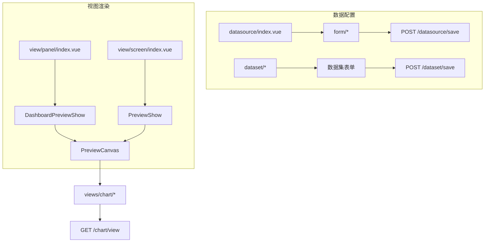

# 可视化视图（Visualized Views）前端分析（v2.10.7）

> 分析范围：`core/core-frontend/src/views/visualized/**` (48 文件)、`views/data-visualization/**` (8 文件)、`views/dashboard/**` (4 文件)
> 源码版本：DataEase v2.10.7
> 覆盖文件：60 个（`.vue`、`.ts`、`.js`）

## 1. 职责与架构位置

`views/visualized/` 是可视化分析模块的视图层，负责仪表板/大屏的**编辑态**视图以及数据源/数据集的配置界面。

架构分层关系：

```
pages/ (HTML 入口: panel.html / index.html / mobile.html)
  └── pages/panel/ (仪表板编辑入口)
        └── views/visualized/
              ├── view/panel/   → DashboardPreviewShow (仪表板编辑预览)
              ├── view/screen/  → PreviewShow (大屏预览)
              ├── data/dataset/     → 数据集配置
              └── data/datasource/  → 数据源配置
```

## 2. 目录结构

### 2.1 `views/visualized/` — 48 文件

```
visualized/
├── view/                              # 视图面板 (编辑态)
│   ├── panel/                         # 仪表板视图
│   │   ├── index.vue                  # 仪表板预览入口 → DashboardPreviewShow
│   │   └── filter-config/             # 筛选器配置
│   │       ├── index.vue              # 筛选器配置主界面
│   │       └── FilterHead.vue         # 筛选器头部
│   └── screen/                        # 大屏视图
│       └── index.vue                  # 大屏预览入口 → PreviewShow
└── data/                              # 数据管理
    ├── dataset/                       # 数据集管理
    │   ├── [数据集列表/编辑组件]
    │   ├── auth-tree/                 # 权限树组件
    │   └── form/                      # 数据集表单
    └── datasource/                    # 数据源管理
        ├── index.vue                  # 数据源入口
        ├── BaseInfoItem.vue           # 基本信息项
        ├── BaseInfoContent.vue        # 基本信息内容
        ├── ExcelInfo.vue / ExcelInfoBase.vue  # Excel 数据源信息
        ├── FinishPage.vue             # 完成页面
        ├── SheetTabs.vue              # 工作表 Tab
        └── form/                      # 数据源表单 (19 文件)
            ├── index.vue              # 新增/编辑数据源表单
            ├── option.ts              # 表单选项配置
            ├── CodeEdit.vue           # 代码编辑器
            ├── ApiHttpRequestForm.vue # API HTTP 请求配置
            ├── ApiHttpRequestDraw.vue # API 请求抽屉
            ├── ApiBody.vue            # API 请求体编辑
            ├── ApiKeyValue.vue        # API 键值对编辑
            ├── ApiVariable.vue        # API 变量配置
            ├── ApiAuthConfig.vue      # API 认证配置
            ├── ApiTestModel.js        # API 测试模型
            ├── DsTypeList.vue         # 数据源类型列表
            ├── Pagination.vue         # 分页配置
            ├── EditorDetail.vue       # 编辑器详情
            ├── ExcelDetail.vue        # Excel 详情
            ├── ExcelRemoteDetail.vue  # 远程 Excel 详情
            ├── CreatDsGroup.vue       # 创建数据源分组
            ├── convert.js             # 数据格式转换工具
            ├── format-utils.js        # 格式化工具函数
            └── ace-config.ts          # Ace 编辑器配置
```

### 2.2 `views/data-visualization/` — 8 文件

```
data-visualization/
├── index.vue              # 仪表板/大屏主入口
├── PreviewShow.vue        # 预览展示（调试用）
├── PreviewCanvas.vue      # 预览画布（核心渲染引擎）
├── PreviewCanvasMobile.vue # 移动端预览画布
├── MultiplexPreviewShow.vue # 多重复用预览
├── PreviewHead.vue        # 预览头部工具栏
├── DvPreview.vue          # 数据可视化预览
└── LinkContainer.vue      # 链接容器
```

### 2.3 `views/dashboard/` — 4 文件

```
dashboard/
├── index.vue                  # 仪表板首页
├── DashboardPreviewShow.vue   # 仪表板预览展示（核心组件）
├── MobileConfigPanel.vue      # 移动端配置面板
└── MobileBackgroundSelector.vue # 移动端背景选择器
```

## 3. 关键组件分析

### 3.1 `visualized/view/panel/index.vue` — 仪表板预览入口

**文件**: `views/visualized/view/panel/index.vue`

**职责**: 仪表板编辑态的根容器，直接代理渲染 `DashboardPreviewShow`。

```vue
<script lang="ts" setup>
import DashboardPreviewShow from '@/views/dashboard/DashboardPreviewShow.vue'
</script>
<template>
  <dashboard-preview-show></dashboard-preview-show>
</template>
```

> [Inference] 这是一个极简的包装组件，设计意图可能是为未来的仪表板编辑功能预留扩展点（如工具栏、侧边栏等）。

### 3.2 `visualized/view/panel/filter-config/` — 筛选器配置

**文件范围**: `views/visualized/view/panel/filter-config/` (2 文件)

| 文件 | 职责 |
|------|------|
| `index.vue` | 筛选器配置主界面（左侧筛选器列表 + 右侧属性面板）|
| `FilterHead.vue` | 筛选器头部工具栏（添加筛选器按钮等）|

### 3.3 `visualized/data/datasource/` — 数据源管理界面

**文件范围**: `views/visualized/data/datasource/` (26 文件)

**职责**: 数据源的新增、编辑、列表管理的完整前端界面。

**主入口**: `datasource/index.vue`
- 数据源类型选择（MySQL/PostgreSQL/Oracle/Excel/API 等）
- 数据源连接信息配置
- 数据源测试连接

**API 数据源支持**（`form/` 子包）:
- HTTP 请求方式配置（GET/POST/PUT/DELETE）
- 请求头 Key-Value 编辑 (`ApiKeyValue.vue`)
- 请求体编辑（JSON/FormData）(`ApiBody.vue`)
- 认证配置（Basic/Bearer/API Key）(`ApiAuthConfig.vue`)
- 变量/参数配置 (`ApiVariable.vue`)
- 分页配置 (`Pagination.vue`)
- 代码编辑器集成（Ace Editor）(`CodeEdit.vue`, `ace-config.ts`)

**Excel 数据源支持**:
- 本地 Excel 上传 (`ExcelDetail.vue`)
- 远程 Excel 连接 (`ExcelRemoteDetail.vue`)
- Excel 工作表 Tab 选择 (`SheetTabs.vue`)

**关键设计**: `form/convert.js` 和 `form/format-utils.js` 负责前端数据格式在不同后端模型之间的转换。

### 3.4 `visualized/data/dataset/` — 数据集管理界面

**文件范围**: `views/visualized/data/dataset/` (剩余文件)

**职责**: 数据集（Dataset）的 CRUD 界面，包括：
- 数据集列表/树形展示
- 数据集字段编辑（维度/指标设置）
- 数据集 SQL 编辑
- 数据集权限树（`auth-tree/`）
- 数据集数据预览

### 3.5 `data-visualization/PreviewCanvas.vue` — 核心渲染引擎

**文件**: `views/data-visualization/PreviewCanvas.vue`

**职责**: 仪表板/大屏的核心渲染组件：

- **画布布局**: 基于 Grid 或自由拖拽布局渲染图表
- **图表渲染**: 调用 `views/chart/` 下的图表组件渲染各图表
- **筛选器联动**: 筛选器变化 → 重新加载图表数据
- **组件联动**: 图表联动/跳转/下钻等交互
- **公共链接模式**: 支持 `public-link-status` prop，区分内部分享访问和编辑态

### 3.6 `dashboard/DashboardPreviewShow.vue` — 仪表板预览展示

**文件**: `views/dashboard/DashboardPreviewShow.vue`

**职责**: 仪表板的完整预览视图，包含：
- 仪表板画布（`PreviewCanvas` 或 `PreviewCanvasMobile`）
- 筛选器面板集成
- 工具栏（导出、全屏、刷新等）
- 移动端适配（通过 `MobileConfigPanel`、`MobileBackgroundSelector`）

### 3.7 `dashboard/MobileConfigPanel.vue` + `MobileBackgroundSelector.vue`

**文件范围**: `views/dashboard/` (2 文件)

**职责**: 移动端仪表板的配置界面：
- `MobileConfigPanel`: 移动端布局配置面板（组件排序、显示/隐藏）
- `MobileBackgroundSelector`: 移动端背景图片/颜色选择器

## 4. 组件依赖关系

```
visualized/view/panel/index.vue → dashboard/DashboardPreviewShow.vue
visualized/view/screen/index.vue  → data-visualization/PreviewShow.vue

DashboardPreviewShow.vue
├── PreviewCanvas / PreviewCanvasMobile
├── MobileConfigPanel.vue
├── MobileBackgroundSelector.vue
└── filter-config/*

PreviewCanvas.vue
├── views/chart/* (图表组件)
├── views/share/* (分享)
└── PreviewHead.vue (工具栏)

visualized/data/datasource/index.vue
├── form/DsTypeList.vue
├── form/ApiHttpRequestForm.vue
│   ├── ApiKeyValue.vue
│   ├── ApiBody.vue
│   ├── ApiVariable.vue
│   ├── ApiAuthConfig.vue
│   └── Pagination.vue
├── form/CodeEdit.vue (Ace Editor)
├── ExcelDetail.vue / ExcelRemoteDetail.vue
├── BaseInfoItem.vue + BaseInfoContent.vue
└── SheetTabs.vue
```

## 5. 数据流



## 6. 关键 API 对照

| 组件 | API 端点 | 方法 | 说明 |
|------|---------|------|------|
| `datasource/index.vue` | `/datasource/save` | POST | 保存数据源 |
| `datasource/index.vue` | `/datasource/validate` | POST | 测试连接 |
| `datasource/index.vue` | `/datasource/{id}` | GET | 获取数据源详情 |
| `dataset/*` | `/dataset/tree` | GET | 数据集树 |
| `dataset/*` | `/dataset/save` | POST | 保存数据集 |
| `dataset/*` | `/dataset/tableField` | GET | 获取数据集字段 |
| `PreviewCanvas.vue` | `/chart/view` | POST | 图表数据查询 |
| `DashboardPreviewShow.vue` | `/panel/view` | POST [Inference] | 仪表板渲染 |

## 7. 设计模式

### 7.1 包装器模式

`visualized/view/panel/index.vue` 和 `visualized/view/screen/index.vue` 作为 thin wrapper，将实际渲染代理给 `DashboardPreviewShow` 和 `PreviewShow`，实现视图层与页面层的解耦。

### 7.2 组合模式

`visualized/data/datasource/form/` 将复杂的数据源配置表单拆分为多个专用子组件（`ApiBody`、`ApiVariable`、`ApiAuthConfig` 等），通过组合实现不同数据源类型的差异化表单。

### 7.3 策略模式

`DsTypeList.vue` 根据数据源类型（MySQL/Excel/API）动态渲染不同的配置表单组件，实现策略化的表单渲染。

## 8. 文件覆盖状态

### `views/visualized/` (48 文件)

| 子目录 | 文件数 | 分析状态 |
|--------|--------|---------|
| `view/panel/` (含 filter-config) | 3 | ✓ (结构分析) |
| `view/screen/` | 1 | ✓ |
| `data/dataset/` (含 auth-tree, form) | ~19 | [Need Verification] |
| `data/datasource/` | 6 | ✓ (结构分析) |
| `data/datasource/form/` | 19 | ✓ (结构分析) |

### `views/data-visualization/` (8 文件)

| 文件 | 分析状态 |
|------|---------|
| `index.vue` | ✓ (结构分析) |
| `PreviewCanvas.vue` | ✓ (核心角色分析) |
| `PreviewCanvasMobile.vue` | ✓ (结构分析) |
| `PreviewShow.vue` | ✓ (结构分析) |
| `MultiplexPreviewShow.vue` | [Need Verification] |
| `PreviewHead.vue` | ✓ (结构分析) |
| `DvPreview.vue` | [Need Verification] |
| `LinkContainer.vue` | [Need Verification] |

### `views/dashboard/` (4 文件)

| 文件 | 分析状态 |
|------|---------|
| `index.vue` | [Need Verification] |
| `DashboardPreviewShow.vue` | ✓ (核心角色分析) |
| `MobileConfigPanel.vue` | ✓ (结构分析) |
| `MobileBackgroundSelector.vue` | ✓ (结构分析) |
