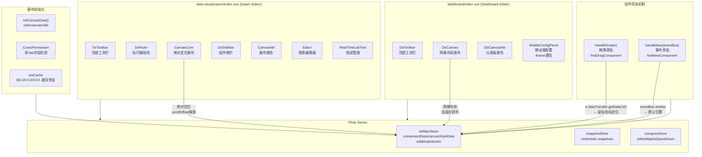
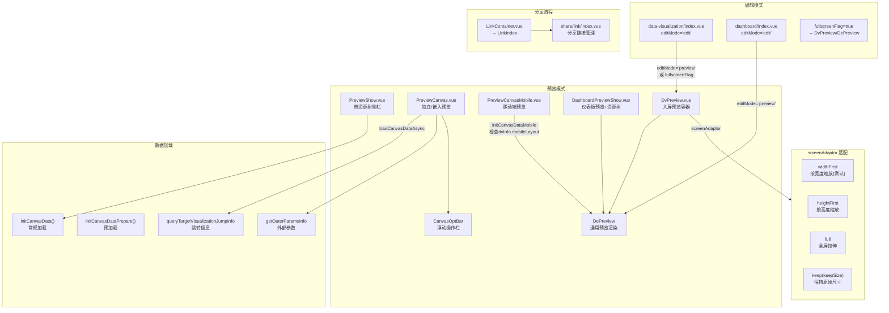

# 可视化视图层逐目录分析

> 源码版本：DataEase v2.10.7  
> 分析范围：`core/core-frontend/src/views/visualized/**`、`data-visualization/**`、`dashboard/**`  
> 源码根路径：`core/core-frontend/src/views/`

---

## 1 职责与架构位置

本分析覆盖的三个目录分别承担以下职责：

| 目录 | 职责 | 架构层级 |
|------|------|----------|
| `data-visualization/` | 数据大屏（dataV）编辑器入口、预览、分享链接、组件复用选择 | 顶层视图 — 路由页面 |
| `dashboard/` | 仪表板（dashboard）编辑器入口、预览、移动端配置面板 | 顶层视图 — 路由页面 |
| `visualized/data/dataset/` | 数据集管理（树形列表、数据/结构预览、导出、行权限） | 数据管理层 — 路由页面 |
| `visualized/data/datasource/` | 数据源管理（树形列表、类型选择、详情编辑、Excel/API 配置） | 数据管理层 — 路由页面 |
| `visualized/view/panel/` | 仪表板预览页（代理 `DashboardPreviewShow`） | 路由代理层 |
| `visualized/view/screen/` | 大屏预览页（代理 `PreviewShow`） | 路由代理层 |

**核心关系**：`data-visualization/` 和 `dashboard/` 是画布编辑的两个分支——前者用绝对定位（CanvasCore），后者用网格布局（DeCanvas）。`visualized/data/` 提供数据集/数据源的管理界面，为画布组件提供数据支撑。`visualized/view/` 是调试/测试入口，直接代理对应预览组件。

---

## 2 目录结构与关键组件清单

### 2.1 data-visualization/

| 文件 | 组件 | 职责 |
|------|------|------|
| `index.vue` | DataVisualizationEditor | 大屏编辑器主入口：DvToolbar + CanvasCore + DvSidebar + CanvasAttr + Editor + DeRuler |
| `DvPreview.vue` | DvPreview | 大屏全屏预览容器，screenAdaptor 四种适配模式 |
| `PreviewCanvas.vue` | PreviewCanvas | 独立/嵌入预览：加载跳转信息、外部参数、ticket、自动刷新 |
| `PreviewCanvasMobile.vue` | PreviewCanvasMobile | 移动端预览，dashboard 时检查 mobileLayout |
| `PreviewShow.vue` | PreviewShow | 预览页（带资源树侧栏）+ 下载/导出功能 |
| `PreviewHead.vue` | PreviewHead | 预览顶部工具栏：收藏、分享、编辑、下载、刷新 |
| `LinkContainer.vue` | LinkContainer | 分享链接入口，代理 `share/link/index.vue` 的 LinkIndex |
| `MultiplexPreviewShow.vue` | MultiplexPreviewShow | 组件复用选择器，树形勾选 → curMultiplexingComponents |

### 2.2 dashboard/

| 文件 | 组件 | 职责 |
|------|------|------|
| `index.vue` | DashboardEditor | 仪表板编辑器主入口：DbToolbar + DeCanvas + DbCanvasAttr + MobileConfigPanel |
| `DashboardPreviewShow.vue` | DashboardPreviewShow | 仪表板预览页（带资源树 + DePreview + CanvasOptBar） |
| `MobileConfigPanel.vue` | MobileConfigPanel | 移动端布局编辑：iframe 通信 + addToMobile/syncPcDesign 双向同步 |
| `MobileBackgroundSelector.vue` | MobileBackgroundSelector | 移动端背景设置（颜色/图片/自定义） |

### 2.3 visualized/data/dataset/

| 文件 | 组件 | 职责 |
|------|------|------|
| `index.vue` | DatasetManagement | 数据集管理主页：树形列表 + 数据预览/结构预览 Tab + 导出 + Xpack权限Tab |
| `DatasetDetail.vue` | DatasetDetail | 数据集详情 popover（创建者/创建时间） |
| `ExportExcel.vue` | ExportExcelCenter | 导出任务抽屉：IN_PROGRESS/SUCCESS/FAILED/PENDING/ALL 五个 Tab |
| `auth-tree/AuthTree.vue` | AuthTree | 行权限递归逻辑树（AND/OR 条件组） |
| `auth-tree/FilterFiled.vue` | FilterFiled | 单个过滤条件行：字段选择 + filterType(logic/enum) + 操作符 + 值 |
| `auth-tree/RowAuth.vue` | RowAuth | 行权限根组件：管理 relationList + SVG 连线渲染 + init/submit 接口 |
| `form/index.vue` | DatasetFormEditor | 数据集创建/编辑表单（66KB 大文件：字段管理、SQL 编辑、Union 配置） |
| `form/AddSql.vue` | AddSql | SQL 数据集编辑器：CodeMirror + 数据源选择 + 变量管理 + 运行预览 |
| `form/CalcFieldEdit.vue` | CalcFieldEdit | 计算字段编辑器：CodeMirror + 维度/指标引用 + 函数列表 + 参数管理 |
| `form/CodeMirror.vue` | CodeMirrorEditor | CodeMirror 6 封装：PlaceholderWidget 替换 `[fieldName]` 为彩色标签 |
| `form/CreatDsGroup.vue` | CreatDsGroup | 数据集文件夹创建/重命名/移动对话框 |
| `form/DatasetUnion.vue` | DatasetUnion | Union 关系可视化编辑：节点拖拽 + 关联线 + AddSql/UnionEdit |
| `form/FieldMore.vue` | FieldMore | 字段右键菜单：类型转换、编辑、重命名、复制、删除 |
| `form/UnionEdit.vue` | UnionEdit | Union 关联编辑：字段勾选 + 关联条件配置 |
| `form/UnionFieldList.vue` | UnionFieldList | 字段勾选列表（全选/搜索/批量勾选） |
| `form/UnionItemEdit.vue` | UnionItemEdit | 单条关联条件编辑（left/right/inner/full + 字段映射） |
| `form/util.ts` | util | 类型定义：Node, Field, DataSource, UnionType + guid/timestampFormatDate 工具 |
| `options.js` | options | 过滤操作符映射：textOptions, dateOptions, valueOptions, sysParamsIlns |

### 2.4 visualized/data/datasource/

| 文件 | 组件 | 职责 |
|------|------|------|
| `index.vue` | DatasourceManagement | 数据源管理主页（75KB 大文件）：树形列表 + 详情编辑 |
| `BaseInfoContent.vue` | BaseInfoContent | 可折叠基本信息区块（名称/时间） |
| `BaseInfoItem.vue` | BaseInfoItem | 单行 label-value 信息展示 |
| `ExcelInfo.vue` | ExcelInfo | Excel 文件信息卡片（名称/大小/删除） |
| `ExcelInfoBase.vue` | ExcelInfoBase | Excel 文件信息行（精简版） |
| `FinishPage.vue` | FinishPage | 创建成功页：继续创建/返回列表/创建数据集 |
| `SheetTabs.vue` | SheetTabs | Excel Sheet 标签页切换（可滚动） |
| `form/index.vue` | DatasourceFormEditor | 数据源创建/编辑表单：多步骤（类型选择→配置→校验→完成） |
| `form/DsTypeList.vue` | DsTypeList | 数据源类型列表：OLTP/OLAP/DL/OTHER/LOCAL 分类展示 |
| `form/EditorDetail.vue` | EditorDetail | 数据源配置详情编辑（DB/API/Excel 各类型表单） |
| `form/ExcelDetail.vue` | ExcelDetail | Excel 数据源编辑：文件上传 + Sheet 选择 + 字段映射 |
| `form/ExcelRemoteDetail.vue` | ExcelRemoteDetail | 远程 Excel 数据源编辑 |
| `form/ApiHttpRequestDraw.vue` | ApiHttpRequestDraw | API 请求抽屉式编辑 |
| `form/ApiHttpRequestForm.vue` | ApiHttpRequestForm | API 请求表单编辑 |
| `form/ApiAuthConfig.vue` | ApiAuthConfig | API 认证配置 |
| `form/ApiBody.vue` | ApiBody | API 请求体编辑 |
| `form/ApiKeyValue.vue` | ApiKeyValue | API Key-Value 参数编辑 |
| `form/ApiVariable.vue` | ApiVariable | API 变量编辑 |
| `form/CodeEdit.vue` | CodeEdit | 代码编辑封装 |
| `form/CreatDsGroup.vue` | CreatDsGroup | 数据源文件夹创建/移动对话框 |
| `form/Pagination.vue` | Pagination | 分页组件 |
| `form/ace-config.ts` | ace-config | ACE 编辑器配置 |
| `form/convert.js` | convert | 数据类型转换工具 |
| `form/format-utils.js` | format-utils | 格式化工具 |
| `form/option.ts` | option | 数据源类型配置：dsTypes, typeList, nameMap, Configuration, ApiConfiguration |

### 2.5 visualized/view/

| 文件 | 组件 | 职责 |
|------|------|------|
| `panel/index.vue` | PanelView | 代理 `DashboardPreviewShow`（调试入口） |
| `panel/filter-config/FilterHead.vue` | FilterHead | 筛选器头部拖拽区域（vuedraggable + el-tag） |
| `panel/filter-config/index.vue` | FilterConfig | 筛选器配置面板（维度/指标拖入 + 属性设置） |
| `screen/index.vue` | ScreenView | 代理 `PreviewShow`（调试入口） |

---

## 3 画布编辑器架构

### 3.1 核心状态管理

| Store | 文件路径 | 关键状态 |
|-------|----------|----------|
| `dvMainStore` | `store/modules/data-visualization/dvMain` | `componentData`, `curComponent`, `canvasStyleData`, `canvasViewInfo`, `editMode`, `dvInfo`, `canvasState`, `batchOptStatus`, `curMultiplexingComponents` |
| `snapshotStore` | `store/modules/data-visualization/snapshot` | `snapshotCache` → undo/redo 通过 `recordSnapshotCache()` |
| `composeStore` | `store/modules/data-visualization/compose` | `editorMap`（多画布实例映射）, `isSpaceDown`（空格键平移状态） |

### 3.2 画布编辑器架构图

### 3.3 关键机制说明

**双画布类型**：
- dataV（大屏）使用 `CanvasCore` 组件，基于绝对定位。`contentStyle` 计算根据 `scrollOffset` 缩放画布尺寸。
- dashboard（仪表板）使用 `DeCanvas` 组件，基于网格布局。`dashboardComponentData` 过滤掉 `dashboardHidden` 类型组件。

**空间键平移**：
- `composeStore.isSpaceDown` 控制画布拖拽平移。`enableDragging` → `onMouseMove` → `disableDragging` 三阶段，仅在 `isSpaceDown=true` 时生效。

**组件分类**：
- `coreComponentData`：`category !== 'hidden'` 的主画布组件
- `popComponentData`：`category === 'hidden'` 的弹窗区域组件（popup）

---

## 4 预览与分享流程

### 4.1 预览与分享流程图

### 4.2 关键流程说明

**预览切换**：
- 编辑器内：`editMode` 从 `'edit'` → `'preview'` 时，`DvPreview`/`DePreview` 替换编辑画布
- `fullscreenFlag` 为 true 时在编辑器内显示 `DvPreview`

**PreviewCanvas 独立预览**：
- 调用 `loadCanvasDataAsync(dvId, dvType, ignoreParams)` 异步加载
- 加载跳转信息 `queryTargetVisualizationJumpInfo`
- 加载外部参数 `getOuterParamsInfo`
- 支持 ticket 参数传入
- 支持 `refreshBrowserEnable`/`refreshBrowserTime` 自动刷新

**screenAdaptor 适配模式**：
- `DvPreview.vue` 的 `contentInnerClass` 计算属性根据 `canvasStyleData.screenAdaptor` 返回 CSS 类名
- 四种模式：`widthFirst`（默认按宽度）、`heightFirst`（按高度）、`full`（全屏拉伸）、`keep`/`keepSize`（保持原始尺寸）

**分享链接**：
- `LinkContainer.vue` 是薄包装：`<link-index :error-tips="true" />`
- 实际分享逻辑在 `views/share/link/index.vue` 的 `LinkIndex` 组件

---

## 5 数据集管理界面

### 5.1 数据集管理架构

| 层级 | 组件 | 说明 |
|------|------|------|
| 主页面 | `dataset/index.vue` | 树形列表 + 右侧详情面板 |
| 数据预览 | `getDatasetPreview` API | 数据预览 Tab |
| 结构预览 | 字段列表 | 结构预览 Tab |
| 导出 | `ExportExcel.vue` + `RowAuth` | 导出任务管理 + 过滤条件 |
| 权限 | `auth-tree/` 子组件 | 行/列权限配置 |
| 编辑 | `form/index.vue` (66KB) | 数据集完整编辑表单 |
| SQL 编辑 | `form/AddSql.vue` | SQL 数据集：CodeMirror + 变量管理 |
| 计算字段 | `form/CalcFieldEdit.vue` | 计算字段：表达式编辑 + 参数 |
| Union | `form/DatasetUnion.vue` | Union 可视化编辑 |
| 关联编辑 | `form/UnionEdit.vue` + `UnionItemEdit.vue` | 关联条件配置 |

### 5.2 关键机制

**树形列表交互**：
- `interactiveStore.setInteractive({busiFlag:'dataset'})` 设置交互状态
- `handleNodeClick` → `barInfoApi` 加载节点信息
- `treeDraggble` 支持拖拽排序，`treeSort` 支持按时间/名称排序
- `createPanel` 可从数据集上下文直接创建仪表板/大屏

**SQL 编辑器（AddSql.vue）**：
- 使用 `CodeMirror.vue`（基于 CodeMirror 6）封装 SQL 编辑
- `$f2cde[variableName]` 格式的变量占位符，由 `PlaceholderWidget` 替换为彩色标签
- `setNameIdTrans('name', 'id')` / `setNameIdTrans('id', 'name')` 双向转换变量名和 ID
- `parseVariable()` 从 SQL 文本中提取 `${...}` 变量
- `getSQLPreview()` 运行 SQL 并展示结果

**计算字段编辑器（CalcFieldEdit.vue）**：
- 维度/指标双面板，点击插入 `[fieldName]` 到 CodeMirror
- `getFunction()` API 加载函数列表
- 支持 `groupType`（维度d/指标q）和 `deType`（字段类型）选择
- 参数管理：`addParmasToQuota` / `updateParmasToQuota` / `delParmasToQuota`

**Union 编辑（DatasetUnion.vue）**：
- 可视化节点图：拖拽添加数据表/SQL节点
- 关联线连接：left/right/inner/full 四种 Join 类型
- `UnionEdit.vue` 编辑关联条件：`UnionItemEdit.vue` 编辑单条字段映射
- `UnionFieldList.vue` 字段勾选列表

**行权限（RowAuth + AuthTree + FilterFiled）**：
- `RowAuth.vue` 管根，管理 `relationList` + `logic`(and/or)
- `AuthTree.vue` 递归渲染条件树，`logic-relation` 自引用组件名实现递归
- `FilterFiled.vue` 单条条件：字段选择 → filterType(logic/enum) → 操作符 → 值
- `options.js` 定义 textOptions/dateOptions/valueOptions 操作符映射
- `multFieldValuesForPermissions` API 获取枚举值

**导出（ExportExcel.vue）**：
- 五 Tab 管理：IN_PROGRESS / SUCCESS / FAILED / PENDING / ALL
- IN_PROGRESS Tab 5 秒自动刷新
- `task-export-topic-call` 事件通知导出完成

**XpackComponent 插件扩展**：
- 数据集详情页通过 `XpackComponent` 添加行/列权限 Tab（Plugin 提供）

---

## 6 与后端的交互

### 6.1 画布相关 API

| API | 来源 | 用途 |
|-----|------|------|
| `initCanvasData` / `initCanvasDataPrepare` | `utils/canvasUtils` | 加载画布数据（dvId + 权重） |
| `initCanvasDataMobile` | `utils/canvasUtils` | 加载移动端画布数据 |
| `queryTargetVisualizationJumpInfo` | API | 加载跳转目标信息 |
| `getOuterParamsInfo` | API | 加载外部参数映射 |
| `downloadCanvas2` / `download2AppTemplate` | API | 导出图片/PDF/模板/app |

### 6.2 数据集相关 API

| API | 来源 | 用途 |
|-----|------|------|
| `barInfoApi` | API | 加载数据集节点详情 |
| `getDatasetPreview` | API | 数据集数据预览 |
| `getDatasetTotal` | API | 数据集行数统计 |
| `getDatasetTree` / `moveDatasetTree` / `createDatasetTree` / `renameDatasetTree` | `api/dataset` | 树操作 |
| `getTableField` | `api/dataset` | 获取表字段信息 |
| `getDatasourceList` / `getTables` | `api/dataset` | SQL 编辑器用 |
| `getPreviewSql` | `api/dataset` | SQL 预览执行 |
| `getFunction` | `api/dataset` | 获取函数列表 |
| `multFieldValuesForPermissions` | `api/dataset` | 获取字段枚举值 |
| `exportTasks` / `exportRetry` / `exportDelete` | API | 导出任务管理 |
| `searchVariableApi` | `api/variable` | 搜索变量 |

### 6.3 数据源相关 API

| API | 来源 | 用途 |
|-----|------|------|
| `getSchema` | `api/datasource` | 获取数据库 Schema |
| `save` / `update` | `api/datasource` | 保存/更新数据源 |
| `uploadFile` | `api/datasource` | Excel 文件上传 |
| `setShowFinishPage` | `api/datasource` | 设置完成页显示状态 |
| `dsTypes` | `form/option.ts` | 数据源类型配置（前端静态） |

### 6.4 分享/权限相关 API

| API | 来源 | 用途 |
|-----|------|------|
| `shareStore.getShareDisable` | Store | 判断分享是否被禁用 |
| `embeddedStore` | Store | 嵌入模式状态 |

---

## 7 风险与待确认

### 7.1 [Need Verification] 项

1. **DatasetUnion.vue 的完整拖拽逻辑**：文件超过 400 行，仅读取前 100 行。节点拖拽、阴影节点（isShadow/flag）的完整交互逻辑需进一步验证。
2. **DatasourceManagement（datasource/index.vue）**：75KB 大文件，树形列表和详情编辑的完整交互逻辑需深入阅读。
3. **DatasetFormEditor（dataset/form/index.vue）**：66KB 大文件，字段管理、SQL 编辑、Union 配置的完整交互流程需深入阅读。
4. **filter-config/index.vue** 的实际用途：目前是调试/测试页面，使用硬编码数据（dimensions/quota），是否在生产路由中使用需确认。
5. **visualized/view/panel/ 和 screen/ 路径**：这两个文件仅代理 `DashboardPreviewShow` 和 `PreviewShow`，注释标注为"调试测试页面"。是否在生产路由配置中使用需确认。

### 7.2 已识别风险

1. **DatasetFormEditor 单文件 66KB**：过度集中的组件设计，维护成本高。字段管理、SQL 编辑、Union 配置等逻辑应拆分为独立子组件。
2. **DatasourceManagement 单文件 75KB**：同样过度集中。
3. **RowAuth SVG 连线计算**：`calculateDepth` / `calculateDepthDash` / `dfsXY` 等函数使用硬编码像素值（68, 41.4 等），在不同分辨率下可能偏移。
4. **MobileConfigPanel iframe 通信**：使用 `postMessage` 双向同步，消息类型包括 `panelInit`、`curComponentChange`、`delFromMobile`、`syncPcDesign`、`mobileSaveFromMobile`、`mobilePatchFromMobile`。若 iframe 加载失败或消息丢失，可能导致 PC 与移动端数据不一致。
5. **AddSql.vue 的 `$f2cde[]` 变量格式**：变量占位符格式为 `$f2cde[variableName]`，与 SQL 标准 `${}` 格式不一致。`parseVariable()` 从 `${...}` 提取变量，但编辑器显示为 `$f2cde[]`，转换逻辑在 `setNameIdTrans` 中。此双重格式可能导致混淆。
6. **CrossPermission 多 Tab 冲突检测**：`check`/`compareStorage` 在多标签页编辑同一仪表板时检测冲突，但具体存储键和检测时机需进一步验证。

### 7.3 [Inference] 推断项

1. **CanvasCore vs DeCanvas 的区分**：基于源码分析，`CanvasCore` 专用于 dataV（绝对定位），`DeCanvas` 专用于 dashboard（网格布局）。两者共享 `dvMainStore` 但使用不同的渲染策略。[Inference] 此设计可能源于大屏需要像素级精确控制而仪表板需要自适应排列。

2. **editorMap 的多画布管理**：`composeStore.editorMap` 存储多个画布实例映射。[Inference] 此设计用于支持仪表板中嵌入多个子画布（如 popup 弹窗区域）的场景。

3. **CodeMirror PlaceholderWidget 的原子范围**：`EditorView.atomicRanges.of` 确保 `$f2cde[]` 变量标签不可被光标部分选中。[Inference] 这是为了防止用户误操作导致变量标签破碎。

4. **SnowflakeId 生成 guid**：`form/util.ts` 使用 `snowflake-id` 库生成唯一 ID。[Inference] 这是为了在客户端生成唯一标识，避免与后端 ID 冲突。

---

## 8 相关文档

| 文档 | 路径 | 说明 |
|------|------|------|
| 画布组件分析 | `docs/frontend/components.md` | CanvasCore/DeCanvas/DePreview 组件详解 |
| 图表视图分析 | `docs/frontend/chart-views.md` | Editor/ChartStyle 等图表编辑组件 |
| Pinia Store | `store/modules/data-visualization/dvMain` | dvMainStore 状态定义 |
| Pinia Store | `store/modules/data-visualization/snapshot` | snapshotStore 状态定义 |
| Pinia Store | `store/modules/data-visualization/compose` | composeStore 状态定义 |
| 画布工具函数 | `utils/canvasUtils` | initCanvasData 等画布初始化函数 |
| 多 Tab 冲突检测 | `utils/CrossPermission` | check/compareStorage 函数 |
| 数据源类型配置 | `views/visualized/data/datasource/form/option.ts` | dsTypes/typeList/nameMap 定义 |
| 过滤操作符 | `views/visualized/data/dataset/options.js` | textOptions/dateOptions/valueOptions |
